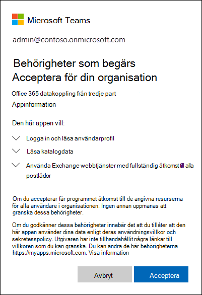

# <a name="work-with-a-partner-to-archive-third-party-data"></a><span data-ttu-id="61349-103">Arbeta med en partner för att arkivera data från tredje part</span><span class="sxs-lookup"><span data-stu-id="61349-103">Work with a partner to archive third-party data</span></span>

<span data-ttu-id="61349-104">Du kan arbeta med en Microsoft-partner för att importera och arkivera data från en tredjepartsdatakälla till Microsoft 365.</span><span class="sxs-lookup"><span data-stu-id="61349-104">You can work with a Microsoft Partner to import and archive data from a third-party data source to Microsoft 365.</span></span> <span data-ttu-id="61349-105">En partner kan tillhandahålla en anpassad koppling som är konfigurerad för att extrahera objekt från tredjepartsdatakällan (regelbundet) och sedan importera dessa objekt.</span><span class="sxs-lookup"><span data-stu-id="61349-105">A partner can provide you with a custom connector that is configured to extract items from the third-party data source (on a regular basis) and then import those items.</span></span> <span data-ttu-id="61349-106">Partnerkopplingen konverterar innehållet i ett objekt från datakällan till ett e-postmeddelandeformat och lagrar sedan objekten i postlådor.</span><span class="sxs-lookup"><span data-stu-id="61349-106">The partner connector converts the content of an item from the data source to an email message format and then stores the items in mailboxes.</span></span> <span data-ttu-id="61349-107">När data från tredje part har importerats kan du tillämpa Microsoft 365-efterlevnadsfunktioner som Bevarande av juridiska skäl, eDiscovery, In-Place arkivering, granskning och Microsoft 365 för bevarandeprinciper för dessa data.</span><span class="sxs-lookup"><span data-stu-id="61349-107">After third-party data is imported, you can apply Microsoft 365 compliance features such as Litigation Hold, eDiscovery, In-Place Archiving, Auditing, and Microsoft 365 retention policies to this data.</span></span>

>[!IMPORTANT]
><span data-ttu-id="61349-108">Lösningen [för kommunikationsefterlevnad](communication-compliance.md) i Microsoft 365 kan inte tillämpas på data från tredje part som importerats av partnerkopplingar som nämns i den här artikeln.</span><span class="sxs-lookup"><span data-stu-id="61349-108">The [Communication compliance](communication-compliance.md) solution in Microsoft 365 can't be applied to the third-party data imported by partner connectors mentioned in this article.</span></span> 

<span data-ttu-id="61349-109">Här är en översikt över processen och de steg som krävs för att arbeta med en Microsoft-partner för att importera data från tredje part.</span><span class="sxs-lookup"><span data-stu-id="61349-109">Here's an overview of the process and the steps necessary to work with a Microsoft Partner to import third-party data.</span></span>

[<span data-ttu-id="61349-110">Steg 1: Hitta en datapartner från tredje part</span><span class="sxs-lookup"><span data-stu-id="61349-110">Step 1: Find a third-party data partner</span></span>](#step-1-find-a-third-party-data-partner)

[<span data-ttu-id="61349-111">Steg 2: Skapa och konfigurera en datapostlåda från tredje part</span><span class="sxs-lookup"><span data-stu-id="61349-111">Step 2: Create and configure a third-party data mailbox</span></span>](#step-2-create-and-configure-a-third-party-data-mailbox-in-microsoft-365)

[<span data-ttu-id="61349-112">Steg 3: Konfigurera användarpostlådor för data från tredje part</span><span class="sxs-lookup"><span data-stu-id="61349-112">Step 3: Configure user mailboxes for third-party data</span></span>](#step-3-configure-user-mailboxes-for-third-party-data)

[<span data-ttu-id="61349-113">Steg 4: Ge din partner information</span><span class="sxs-lookup"><span data-stu-id="61349-113">Step 4: Provide your partner with information</span></span>](#step-4-provide-your-partner-with-information)

[<span data-ttu-id="61349-114">Steg 5: Registrera tredjepartsdatakopplingen i Azure Active Directory</span><span class="sxs-lookup"><span data-stu-id="61349-114">Step 5: Register the third-party data connector in Azure Active Directory</span></span>](#step-5-register-the-third-party-data-connector-in-azure-active-directory)

## <a name="how-the-third-party-data-import-process-works"></a><span data-ttu-id="61349-115">Så här fungerar dataimportprocessen från tredje part</span><span class="sxs-lookup"><span data-stu-id="61349-115">How the third-party data import process works</span></span>

<span data-ttu-id="61349-116">I följande illustration och beskrivning förklaras hur dataimportprocessen från tredje part fungerar när du arbetar med en partner.</span><span class="sxs-lookup"><span data-stu-id="61349-116">The following illustration and description explain how the third-party data import process works when working with a partner.</span></span>
  

  
1. <span data-ttu-id="61349-118">Kunden arbetar med sin partner för att konfigurera en koppling som extraherar objekt från tredje parts datakälla och sedan importera dessa objekt till Microsoft 365.</span><span class="sxs-lookup"><span data-stu-id="61349-118">Customer works with their partner of choice to configure a connector that will extract items from the third-party data source and then import those items to Microsoft 365.</span></span>
    
2. <span data-ttu-id="61349-119">Partnerkopplingen ansluter till datakällor från tredje part via ett API från tredje part (schemalagt eller konfigurerat) och extraherar objekt från datakällan.</span><span class="sxs-lookup"><span data-stu-id="61349-119">The partner connector connects to third-party data sources via a third-party API (on a scheduled or as-configured basis) and extracts items from the data source.</span></span> <span data-ttu-id="61349-120">Partnerkopplingen omvandlar innehållet i ett objekt till ett e-postmeddelandeformat.</span><span class="sxs-lookup"><span data-stu-id="61349-120">The partner connector converts the content of an item to an email message format.</span></span> <span data-ttu-id="61349-121">I avsnittet [Mer information](#more-information) finns en beskrivning av schemat för meddelandeformat.</span><span class="sxs-lookup"><span data-stu-id="61349-121">See the [More information](#more-information) section for a description of the message-format schema.</span></span> 
    
3. <span data-ttu-id="61349-122">Partnerkopplingen ansluter till Azure-tjänsten i Microsoft 365 med hjälp Exchange webbtjänst (EWS) via en känd ändpunkt.</span><span class="sxs-lookup"><span data-stu-id="61349-122">Partner connector connects to the Azure service in Microsoft 365 by using Exchange Web Service (EWS) via a well-known end point.</span></span>
    
4. <span data-ttu-id="61349-123">Objekt importeras till en viss användares postlåda eller till en datapostlåda från en "catch all" från tredje part.</span><span class="sxs-lookup"><span data-stu-id="61349-123">Items are imported into the mailbox of a specific user or into a "catch-all" third-party data mailbox.</span></span> <span data-ttu-id="61349-124">Huruvida ett objekt importeras till en viss användarpostlåda eller till tredjepartsdatapostlådan baseras på följande villkor:</span><span class="sxs-lookup"><span data-stu-id="61349-124">Whether an item is imported into a specific user mailbox or to the third-party data mailbox is based on the following criteria:</span></span>
    
   1. <span data-ttu-id="61349-125">**Objekt som har ett användar-ID som motsvarar ett användarkonto:** Om partnerkopplingen kan mappa användar-ID:t för objektet i datakällan från tredje part till ett visst  användar-ID i Microsoft 365 kopieras objektet till mappen Rensningar i användarens Återställningsbara objekt-mapp.</span><span class="sxs-lookup"><span data-stu-id="61349-125">**Items that have a user ID that corresponds to a user account:** If the partner connector can map the user ID of the item in the third-party data source to a specific user ID in Microsoft 365, the item is copied to the **Purges** folder in the user's Recoverable Items folder.</span></span> <span data-ttu-id="61349-126">Användare kan inte komma åt objekt i mappen Rensningar.</span><span class="sxs-lookup"><span data-stu-id="61349-126">Users can't access items in the Purges folder.</span></span> <span data-ttu-id="61349-127">Du kan emellertid använda eDiscovery-verktyg för att söka efter objekt i mappen Rensningar.</span><span class="sxs-lookup"><span data-stu-id="61349-127">However, you can use eDiscovery tools to search for items in the Purges folder.</span></span>
    
   1. <span data-ttu-id="61349-128">**Objekt som inte har ett användar-ID som motsvarar ett användarkonto:** Om partnerkopplingen inte kan mappa användar-ID:t för ett objekt till  ett visst användar-ID kopieras objektet till mappen Inkorg i datapostlådan från tredje part.</span><span class="sxs-lookup"><span data-stu-id="61349-128">**Items that don't have a user ID that corresponds to a user account:** If the partner connector can't map the user ID of an item to a specific user ID, the item is copied to the **Inbox** folder of the third-party data mailbox.</span></span> <span data-ttu-id="61349-129">Genom att importera objekt till Inkorgen kan du eller någon annan i organisationen logga in på postlådan från tredje part för att visa och hantera de här objekten och se om några justeringar behöver göras i konfigurationen av partnerkopplingen.</span><span class="sxs-lookup"><span data-stu-id="61349-129">Importing items to the inbox allows you or someone in your organization to sign in to the third-party mailbox to view and manage these items, and see if any adjustments need to be made in the partner connector configuration.</span></span>
 
## <a name="step-1-find-a-third-party-data-partner"></a><span data-ttu-id="61349-130">Steg 1: Hitta en datapartner från tredje part</span><span class="sxs-lookup"><span data-stu-id="61349-130">Step 1: Find a third-party data partner</span></span>

<span data-ttu-id="61349-131">En viktig komponent i arkivering av data från tredje part i Microsoft 365 är att hitta och arbeta med en Microsoft-partner som samlar in data från en datakälla från tredje part och importerar dem till Microsoft 365.</span><span class="sxs-lookup"><span data-stu-id="61349-131">A key component for archiving third-party data in Microsoft 365 is finding and working with a Microsoft partner that specializes in capturing data from a third-party data source and importing it to Microsoft 365.</span></span> <span data-ttu-id="61349-132">När data har importerats kan de arkiveras och bevaras tillsammans med organisationens andra Microsoft-data, till exempel e-post från Exchange och dokument från SharePoint och OneDrive för företag.</span><span class="sxs-lookup"><span data-stu-id="61349-132">After the data is imported, it can be archived and preserved along with your organization's other Microsoft data, such as email from Exchange and documents from SharePoint and OneDrive for Business.</span></span> <span data-ttu-id="61349-133">En partner skapar en koppling som hämtar data från organisationens datakällor från tredje part (till exempel BlackBerry, Facebook, Google+, Reuters, Twitter och YouTube) och skickar dessa data till ett Microsoft 365 API som importerar objekt till Exchange-postlådor som e-postmeddelanden.</span><span class="sxs-lookup"><span data-stu-id="61349-133">A partner creates a connector that extracts data from your organization's third-party data sources (such as BlackBerry, Facebook, Google+, Thomson Reuters, Twitter, and YouTube) and passes that data to a Microsoft 365 API that imports items to Exchange mailboxes as email messages.</span></span>
  
<span data-ttu-id="61349-134">Följande avsnitt innehåller de Microsoft-partner (och datakällor från tredje part som de stöder) som deltar i programmet för arkivering av data från tredje part i Microsoft 365.</span><span class="sxs-lookup"><span data-stu-id="61349-134">The following sections list the Microsoft partners (and the third-party data sources they support) that are participating in the program for archiving third-party data in Microsoft 365.</span></span>

[<span data-ttu-id="61349-135">17a-4 LLC</span><span class="sxs-lookup"><span data-stu-id="61349-135">17a-4 LLC</span></span>](#17a-4-llc)
  
[<span data-ttu-id="61349-136">ArchiveSocial</span><span class="sxs-lookup"><span data-stu-id="61349-136">ArchiveSocial</span></span>](#archivesocial)
  
[<span data-ttu-id="61349-137">Veritas</span><span class="sxs-lookup"><span data-stu-id="61349-137">Veritas</span></span>](#veritas)
  
[<span data-ttu-id="61349-138">OpenText</span><span class="sxs-lookup"><span data-stu-id="61349-138">OpenText</span></span>](#opentext)
  
[<span data-ttu-id="61349-139">Smarsh</span><span class="sxs-lookup"><span data-stu-id="61349-139">Smarsh</span></span>](#smarsh)

[<span data-ttu-id="61349-140">Verba</span><span class="sxs-lookup"><span data-stu-id="61349-140">Verba</span></span>](#verba)
  
### <a name="17a-4-llc"></a><span data-ttu-id="61349-141">17a-4 LLC</span><span class="sxs-lookup"><span data-stu-id="61349-141">17a-4 LLC</span></span>

<span data-ttu-id="61349-142">[17a-4 LLC](https://www.17a-4.com) har stöd för följande datakällor från tredje part:</span><span class="sxs-lookup"><span data-stu-id="61349-142">[17a-4 LLC](https://www.17a-4.com) supports the following third-party data sources:</span></span>
  
- <span data-ttu-id="61349-143">BlackBerry</span><span class="sxs-lookup"><span data-stu-id="61349-143">BlackBerry</span></span>
    
- <span data-ttu-id="61349-144">Bloomberg Data Flöden</span><span class="sxs-lookup"><span data-stu-id="61349-144">Bloomberg Data Streams</span></span>
    
- <span data-ttu-id="61349-145">Cisco Jabber</span><span class="sxs-lookup"><span data-stu-id="61349-145">Cisco Jabber</span></span>
    
- <span data-ttu-id="61349-146">FactSet</span><span class="sxs-lookup"><span data-stu-id="61349-146">FactSet</span></span>
    
- <span data-ttu-id="61349-147">HipChat</span><span class="sxs-lookup"><span data-stu-id="61349-147">HipChat</span></span>
    
- <span data-ttu-id="61349-148">InvestEdge</span><span class="sxs-lookup"><span data-stu-id="61349-148">InvestEdge</span></span>
    
- <span data-ttu-id="61349-149">LivePerson</span><span class="sxs-lookup"><span data-stu-id="61349-149">LivePerson</span></span>
    
- <span data-ttu-id="61349-150">MessageLabs Data Flöden</span><span class="sxs-lookup"><span data-stu-id="61349-150">MessageLabs Data Streams</span></span>
    
- <span data-ttu-id="61349-151">OpenText</span><span class="sxs-lookup"><span data-stu-id="61349-151">OpenText</span></span>
    
- <span data-ttu-id="61349-152">Oracle/ATG "klicka-och-ring"-hjälp i Live Help</span><span class="sxs-lookup"><span data-stu-id="61349-152">Oracle/ATG 'click-to-call' Live Help</span></span>
    
- <span data-ttu-id="61349-153">Pivot-IMTRADER</span><span class="sxs-lookup"><span data-stu-id="61349-153">Pivot IMTRADER</span></span>
    
- <span data-ttu-id="61349-154">Microsoft SharePoint</span><span class="sxs-lookup"><span data-stu-id="61349-154">Microsoft SharePoint</span></span>
    
- <span data-ttu-id="61349-155">MindAlign</span><span class="sxs-lookup"><span data-stu-id="61349-155">MindAlign</span></span>
    
- <span data-ttu-id="61349-156">Sitrion One (Newsgator)</span><span class="sxs-lookup"><span data-stu-id="61349-156">Sitrion One (Newsgator)</span></span>
    
- <span data-ttu-id="61349-157">Skype för företag (Lync/OCS)</span><span class="sxs-lookup"><span data-stu-id="61349-157">Skype for Business (Lync/OCS)</span></span>
    
- <span data-ttu-id="61349-158">Skype för företag Online (Lync Online)</span><span class="sxs-lookup"><span data-stu-id="61349-158">Skype for Business Online (Lync Online)</span></span>
    
- <span data-ttu-id="61349-159">SQL Databaser</span><span class="sxs-lookup"><span data-stu-id="61349-159">SQL Databases</span></span>
    
- <span data-ttu-id="61349-160">Squawker</span><span class="sxs-lookup"><span data-stu-id="61349-160">Squawker</span></span>
    
- <span data-ttu-id="61349-161">Thomson Reuters Eikon Messenger</span><span class="sxs-lookup"><span data-stu-id="61349-161">Thomson Reuters Eikon Messenger</span></span>
  

  
### <a name="archivesocial"></a><span data-ttu-id="61349-162">ArchiveSocial</span><span class="sxs-lookup"><span data-stu-id="61349-162">ArchiveSocial</span></span>

<span data-ttu-id="61349-163">[ArchiveSocial ](https://www.archivesocial.com) har stöd för följande datakällor från tredje part:</span><span class="sxs-lookup"><span data-stu-id="61349-163">[ArchiveSocial ](https://www.archivesocial.com) supports the following third-party data sources:</span></span> 
  
- <span data-ttu-id="61349-164">Facebook</span><span class="sxs-lookup"><span data-stu-id="61349-164">Facebook</span></span>
    
- <span data-ttu-id="61349-165">Flickr</span><span class="sxs-lookup"><span data-stu-id="61349-165">Flickr</span></span>
    
- <span data-ttu-id="61349-166">Så här ser det ut</span><span class="sxs-lookup"><span data-stu-id="61349-166">Instagram</span></span>
    
- <span data-ttu-id="61349-167">LinkedIn</span><span class="sxs-lookup"><span data-stu-id="61349-167">LinkedIn</span></span>
    
- <span data-ttu-id="61349-168">Pinterest</span><span class="sxs-lookup"><span data-stu-id="61349-168">Pinterest</span></span>
    
- <span data-ttu-id="61349-169">Twitter</span><span class="sxs-lookup"><span data-stu-id="61349-169">Twitter</span></span>
    
- <span data-ttu-id="61349-170">YouTube</span><span class="sxs-lookup"><span data-stu-id="61349-170">YouTube</span></span>
    
- <span data-ttu-id="61349-171">Vimeo</span><span class="sxs-lookup"><span data-stu-id="61349-171">Vimeo</span></span>
  
### <a name="veritas"></a><span data-ttu-id="61349-172">Veritas</span><span class="sxs-lookup"><span data-stu-id="61349-172">Veritas</span></span>

<span data-ttu-id="61349-173">[Veritas](https://www.globanet.com) stöder följande datakällor från tredje part:</span><span class="sxs-lookup"><span data-stu-id="61349-173">[Veritas](https://www.globanet.com) supports the following third-party data sources:</span></span> 
  
- <span data-ttu-id="61349-174">AOL med pivotklient</span><span class="sxs-lookup"><span data-stu-id="61349-174">AOL with Pivot Client</span></span> 
    
- <span data-ttu-id="61349-175">BlackBerry Call Logs (v5, v10, v12)</span><span class="sxs-lookup"><span data-stu-id="61349-175">BlackBerry Call Logs (v5, v10, v12)</span></span>
    
- <span data-ttu-id="61349-176">BlackBerry Messenger (v5, v10, v12)</span><span class="sxs-lookup"><span data-stu-id="61349-176">BlackBerry Messenger (v5, v10, v12)</span></span>
    
- <span data-ttu-id="61349-177">BlackBerry PIN (v5, v10, v12)</span><span class="sxs-lookup"><span data-stu-id="61349-177">BlackBerry PIN (v5, v10, v12)</span></span>
    
- <span data-ttu-id="61349-178">BlackBerry SMS (v5, v10, v12)</span><span class="sxs-lookup"><span data-stu-id="61349-178">BlackBerry SMS (v5, v10, v12)</span></span>
    
- <span data-ttu-id="61349-179">Bloomberg Chat</span><span class="sxs-lookup"><span data-stu-id="61349-179">Bloomberg Chat</span></span>
    
- <span data-ttu-id="61349-180">Bloomberg Mail</span><span class="sxs-lookup"><span data-stu-id="61349-180">Bloomberg Mail</span></span>
    
- <span data-ttu-id="61349-181">Ruta</span><span class="sxs-lookup"><span data-stu-id="61349-181">Box</span></span>
    
- <span data-ttu-id="61349-182">CipherCloud för Salesforce Chatter</span><span class="sxs-lookup"><span data-stu-id="61349-182">CipherCloud for Salesforce Chatter</span></span>
    
- <span data-ttu-id="61349-183">Cisco IM &amp; Presence Server (v10, v10.5.1 SU1, v11.0, v11.5 SU2)</span><span class="sxs-lookup"><span data-stu-id="61349-183">Cisco IM &amp; Presence Server (v10, v10.5.1 SU1, v11.0, v11.5 SU2)</span></span>

- <span data-ttu-id="61349-184">Cisco Webex Teams</span><span class="sxs-lookup"><span data-stu-id="61349-184">Cisco Webex Teams</span></span>

- <span data-ttu-id="61349-185">Citrix Workspace &amp; ShareFile</span><span class="sxs-lookup"><span data-stu-id="61349-185">Citrix Workspace &amp; ShareFile</span></span>

- <span data-ttu-id="61349-186">CrowdCompass</span><span class="sxs-lookup"><span data-stu-id="61349-186">CrowdCompass</span></span>

- <span data-ttu-id="61349-187">Anpassade avgränsade textfiler</span><span class="sxs-lookup"><span data-stu-id="61349-187">Custom-delimited text files</span></span>
    
- <span data-ttu-id="61349-188">Anpassade XML-filer</span><span class="sxs-lookup"><span data-stu-id="61349-188">Custom XML files</span></span>
    
- <span data-ttu-id="61349-189">Facebook (sidor)</span><span class="sxs-lookup"><span data-stu-id="61349-189">Facebook (Pages)</span></span>
    
- <span data-ttu-id="61349-190">Factset</span><span class="sxs-lookup"><span data-stu-id="61349-190">Factset</span></span>
    
- <span data-ttu-id="61349-191">FXConnect</span><span class="sxs-lookup"><span data-stu-id="61349-191">FXConnect</span></span>
    
- <span data-ttu-id="61349-192">ICE-chatt/YellowSessionet</span><span class="sxs-lookup"><span data-stu-id="61349-192">ICE Chat/YellowJacket</span></span>
    
- <span data-ttu-id="61349-193">Jive</span><span class="sxs-lookup"><span data-stu-id="61349-193">Jive</span></span>
    
- <span data-ttu-id="61349-194">Macgregor XIP</span><span class="sxs-lookup"><span data-stu-id="61349-194">Macgregor XIP</span></span>

- <span data-ttu-id="61349-195">Microsoft Exchange Server</span><span class="sxs-lookup"><span data-stu-id="61349-195">Microsoft Exchange Server</span></span>
    
- <span data-ttu-id="61349-196">Microsoft OneDrive för företag</span><span class="sxs-lookup"><span data-stu-id="61349-196">Microsoft OneDrive for Business</span></span>

- <span data-ttu-id="61349-197">Microsoft Teams</span><span class="sxs-lookup"><span data-stu-id="61349-197">Microsoft Teams</span></span>
       
- <span data-ttu-id="61349-198">Microsoft Yammer</span><span class="sxs-lookup"><span data-stu-id="61349-198">Microsoft Yammer</span></span>
    
- <span data-ttu-id="61349-199">Mobile Guard</span><span class="sxs-lookup"><span data-stu-id="61349-199">Mobile Guard</span></span>
    
- <span data-ttu-id="61349-200">Pivot</span><span class="sxs-lookup"><span data-stu-id="61349-200">Pivot</span></span>
    
- <span data-ttu-id="61349-201">Salesforce Chatter</span><span class="sxs-lookup"><span data-stu-id="61349-201">Salesforce Chatter</span></span>

- <span data-ttu-id="61349-202">Skype för företag online</span><span class="sxs-lookup"><span data-stu-id="61349-202">Skype for Business Online</span></span>
    
- <span data-ttu-id="61349-203">Skype för företag, versionerna 2007 R2–2016 (lokalt)</span><span class="sxs-lookup"><span data-stu-id="61349-203">Skype for Business, versions 2007 R2 - 2016 (on-premises)</span></span>
    
- <span data-ttu-id="61349-204">Slack för företagsrutnät</span><span class="sxs-lookup"><span data-stu-id="61349-204">Slack Enterprise Grid</span></span>
    
- <span data-ttu-id="61349-205">Symphony</span><span class="sxs-lookup"><span data-stu-id="61349-205">Symphony</span></span>
    
- <span data-ttu-id="61349-206">Thomson Reuters Eikon</span><span class="sxs-lookup"><span data-stu-id="61349-206">Thomson Reuters Eikon</span></span>
    
- <span data-ttu-id="61349-207">Thomson Reuters Messenger</span><span class="sxs-lookup"><span data-stu-id="61349-207">Thomson Reuters Messenger</span></span>
    
- <span data-ttu-id="61349-208">Reuters Dealings 3000 / FX Handels</span><span class="sxs-lookup"><span data-stu-id="61349-208">Thomson Reuters Dealings 3000 / FX Trading</span></span>
    
- <span data-ttu-id="61349-209">Twitter</span><span class="sxs-lookup"><span data-stu-id="61349-209">Twitter</span></span>
    
- <span data-ttu-id="61349-210">UBS Chat</span><span class="sxs-lookup"><span data-stu-id="61349-210">UBS Chat</span></span>
    
- <span data-ttu-id="61349-211">YouTube</span><span class="sxs-lookup"><span data-stu-id="61349-211">YouTube</span></span>
  
### <a name="opentext"></a><span data-ttu-id="61349-212">OpenText</span><span class="sxs-lookup"><span data-stu-id="61349-212">OpenText</span></span>

<span data-ttu-id="61349-213">[OpenText](https://www.opentext.com/what-we-do/products/opentext-product-offerings-catalog/rebranded-products/daegis) har stöd för följande datakällor från tredje part:</span><span class="sxs-lookup"><span data-stu-id="61349-213">[OpenText](https://www.opentext.com/what-we-do/products/opentext-product-offerings-catalog/rebranded-products/daegis) supports the following third-party data sources:</span></span> 
  
- <span data-ttu-id="61349-214">Axs Encrypted</span><span class="sxs-lookup"><span data-stu-id="61349-214">Axs Encrypted</span></span>
    
- <span data-ttu-id="61349-215">Axs Exchange</span><span class="sxs-lookup"><span data-stu-id="61349-215">Axs Exchange</span></span>
    
- <span data-ttu-id="61349-216">Axs Local Archive</span><span class="sxs-lookup"><span data-stu-id="61349-216">Axs Local Archive</span></span>
    
- <span data-ttu-id="61349-217">Axs PlaceHolder</span><span class="sxs-lookup"><span data-stu-id="61349-217">Axs PlaceHolder</span></span>
    
- <span data-ttu-id="61349-218">Axs signerade</span><span class="sxs-lookup"><span data-stu-id="61349-218">Axs Signed</span></span>
    
- <span data-ttu-id="61349-219">Bloomberg</span><span class="sxs-lookup"><span data-stu-id="61349-219">Bloomberg</span></span>
    
- <span data-ttu-id="61349-220">Thomson Reuters</span><span class="sxs-lookup"><span data-stu-id="61349-220">Thomson Reuters</span></span>
  
### <a name="smarsh"></a><span data-ttu-id="61349-221">Smarsh</span><span class="sxs-lookup"><span data-stu-id="61349-221">Smarsh</span></span>

<span data-ttu-id="61349-222">[Smarsh](https://www.smarsh.com) har stöd för följande datakällor från tredje part:</span><span class="sxs-lookup"><span data-stu-id="61349-222">[Smarsh](https://www.smarsh.com) supports the following third-party data sources:</span></span> 
  
- <span data-ttu-id="61349-223">AIM</span><span class="sxs-lookup"><span data-stu-id="61349-223">AIM</span></span>
    
- <span data-ttu-id="61349-224">American Sådd</span><span class="sxs-lookup"><span data-stu-id="61349-224">American Idol</span></span>
    
- <span data-ttu-id="61349-225">Apple Juice</span><span class="sxs-lookup"><span data-stu-id="61349-225">Apple Juice</span></span>
    
- <span data-ttu-id="61349-226">AOL med pivotklient</span><span class="sxs-lookup"><span data-stu-id="61349-226">AOL with Pivot client</span></span>
    
- <span data-ttu-id="61349-227">Ares</span><span class="sxs-lookup"><span data-stu-id="61349-227">Ares</span></span>
    
- <span data-ttu-id="61349-228">Röst rösten i Rösten</span><span class="sxs-lookup"><span data-stu-id="61349-228">Bazaar Voice</span></span>
    
- <span data-ttu-id="61349-229">Dela med dig</span><span class="sxs-lookup"><span data-stu-id="61349-229">Bear Share</span></span>
    
- <span data-ttu-id="61349-230">Bit Störtflod</span><span class="sxs-lookup"><span data-stu-id="61349-230">Bit Torrent</span></span>
    
- <span data-ttu-id="61349-231">BlackBerry Call Logs (v5, v10, v12)</span><span class="sxs-lookup"><span data-stu-id="61349-231">BlackBerry Call Logs (v5, v10, v12)</span></span>
    
- <span data-ttu-id="61349-232">BlackBerry Messenger (v5, v10, v12)</span><span class="sxs-lookup"><span data-stu-id="61349-232">BlackBerry Messenger (v5, v10, v12)</span></span>
    
- <span data-ttu-id="61349-233">BlackBerry PIN (v5, v10, v12)</span><span class="sxs-lookup"><span data-stu-id="61349-233">BlackBerry PIN (v5, v10, v12)</span></span>
    
- <span data-ttu-id="61349-234">BlackBerry SMS (v5, v10, v12)</span><span class="sxs-lookup"><span data-stu-id="61349-234">BlackBerry SMS (v5, v10, v12)</span></span>
    
- <span data-ttu-id="61349-235">Bloomberg Mail</span><span class="sxs-lookup"><span data-stu-id="61349-235">Bloomberg Mail</span></span>
    
- <span data-ttu-id="61349-236">CellTrust</span><span class="sxs-lookup"><span data-stu-id="61349-236">CellTrust</span></span>
    
- <span data-ttu-id="61349-237">Importera chatt</span><span class="sxs-lookup"><span data-stu-id="61349-237">Chat Import</span></span>
    
- <span data-ttu-id="61349-238">Loggning och policy för chatt i realtid</span><span class="sxs-lookup"><span data-stu-id="61349-238">Chat Real Time Logging and Policy</span></span>
    
- <span data-ttu-id="61349-239">Chattar</span><span class="sxs-lookup"><span data-stu-id="61349-239">Chatter</span></span>
    
- <span data-ttu-id="61349-240">Cisco IM &amp; Presence Server (v9.0.1, v9.1, v9.1.1 SU1, v10, v10.5.1 SU1)</span><span class="sxs-lookup"><span data-stu-id="61349-240">Cisco IM &amp; Presence Server (v9.0.1, v9.1, v9.1.1 SU1, v10, v10.5.1 SU1)</span></span>
    
- <span data-ttu-id="61349-241">Cisco Unified Presence Server (v8.6.3, v8.6.4, v8.6.5)</span><span class="sxs-lookup"><span data-stu-id="61349-241">Cisco Unified Presence Server (v8.6.3, v8.6.4, v8.6.5)</span></span>
    
- <span data-ttu-id="61349-242">Import av samarbete</span><span class="sxs-lookup"><span data-stu-id="61349-242">Collaboration Import</span></span>
    
- <span data-ttu-id="61349-243">Loggning av samarbete i realtid</span><span class="sxs-lookup"><span data-stu-id="61349-243">Collaboration Real Time Logging</span></span>
    
- <span data-ttu-id="61349-244">Direkt Anslut</span><span class="sxs-lookup"><span data-stu-id="61349-244">Direct Connect</span></span>
    
- <span data-ttu-id="61349-245">Facebook</span><span class="sxs-lookup"><span data-stu-id="61349-245">Facebook</span></span>
    
- <span data-ttu-id="61349-246">FactSet</span><span class="sxs-lookup"><span data-stu-id="61349-246">FactSet</span></span>
    
- <span data-ttu-id="61349-247">FastTrack</span><span class="sxs-lookup"><span data-stu-id="61349-247">FastTrack</span></span>
    
- <span data-ttu-id="61349-248">Så här ser det ut</span><span class="sxs-lookup"><span data-stu-id="61349-248">Gnutella</span></span>
    
- <span data-ttu-id="61349-249">Google+</span><span class="sxs-lookup"><span data-stu-id="61349-249">Google+</span></span>
    
- <span data-ttu-id="61349-250">GoToMyPC</span><span class="sxs-lookup"><span data-stu-id="61349-250">GoToMyPC</span></span>
    
- <span data-ttu-id="61349-251">Hoppster</span><span class="sxs-lookup"><span data-stu-id="61349-251">Hopster</span></span>
    
- <span data-ttu-id="61349-252">HubConnex</span><span class="sxs-lookup"><span data-stu-id="61349-252">HubConnex</span></span>
    
- <span data-ttu-id="61349-253">IBM Connections (v3.0.1, v4.0, v4.5, v4.5 CR3, v5)</span><span class="sxs-lookup"><span data-stu-id="61349-253">IBM Connections (v3.0.1, v4.0, v4.5, v4.5 CR3, v5)</span></span>
    
- <span data-ttu-id="61349-254">IBM Connections Chat Cloud</span><span class="sxs-lookup"><span data-stu-id="61349-254">IBM Connections Chat Cloud</span></span>
    
- <span data-ttu-id="61349-255">IBM Connections Social Cloud</span><span class="sxs-lookup"><span data-stu-id="61349-255">IBM Connections Social Cloud</span></span>
    
- <span data-ttu-id="61349-256">IBM SameTime Advanced 8.5.2 IFR1</span><span class="sxs-lookup"><span data-stu-id="61349-256">IBM SameTime Advanced 8.5.2 IFR1</span></span>
    
- <span data-ttu-id="61349-257">IBM SameTime Communicate 9.0</span><span class="sxs-lookup"><span data-stu-id="61349-257">IBM SameTime Communicate 9.0</span></span>
    
- <span data-ttu-id="61349-258">IBM SameTime Community (v8.0.2, v8.5.1 IFR2, v8.5.2 IFR1, v9.1)</span><span class="sxs-lookup"><span data-stu-id="61349-258">IBM SameTime Community (v8.0.2, v8.5.1 IFR2, v8.5.2 IFR1, v9.1)</span></span>
    
- <span data-ttu-id="61349-259">IBM SameTime Complete 9.0</span><span class="sxs-lookup"><span data-stu-id="61349-259">IBM SameTime Complete 9.0</span></span>
    
- <span data-ttu-id="61349-260">IBM SameTime Conference 9.0</span><span class="sxs-lookup"><span data-stu-id="61349-260">IBM SameTime Conference 9.0</span></span>
    
- <span data-ttu-id="61349-261">IBM SameTime Meeting 8.5.2 IFR1</span><span class="sxs-lookup"><span data-stu-id="61349-261">IBM SameTime Meeting 8.5.2 IFR1</span></span>
    
- <span data-ttu-id="61349-262">ICE/Yellow Entitet</span><span class="sxs-lookup"><span data-stu-id="61349-262">ICE/YellowJacket</span></span>
    
- <span data-ttu-id="61349-263">Import av snabbmeddelanden</span><span class="sxs-lookup"><span data-stu-id="61349-263">IM Import</span></span>
    
- <span data-ttu-id="61349-264">Loggning och policy för snabbmeddelanden i realtid</span><span class="sxs-lookup"><span data-stu-id="61349-264">IM Real Time Logging and Policy</span></span>
    
- <span data-ttu-id="61349-265">Indii Messenger</span><span class="sxs-lookup"><span data-stu-id="61349-265">Indii Messenger</span></span>
    
- <span data-ttu-id="61349-266">Instant Bloomberg</span><span class="sxs-lookup"><span data-stu-id="61349-266">Instant Bloomberg</span></span>
    
- <span data-ttu-id="61349-267">IRC</span><span class="sxs-lookup"><span data-stu-id="61349-267">IRC</span></span>
    
- <span data-ttu-id="61349-268">Jive</span><span class="sxs-lookup"><span data-stu-id="61349-268">Jive</span></span>
    
- <span data-ttu-id="61349-269">Jive 6 realtidsloggning (v6, v7)</span><span class="sxs-lookup"><span data-stu-id="61349-269">Jive 6 Real Time Logging (v6, v7)</span></span>
    
- <span data-ttu-id="61349-270">Jive-import</span><span class="sxs-lookup"><span data-stu-id="61349-270">Jive Import</span></span>
    
- <span data-ttu-id="61349-271">JXTA</span><span class="sxs-lookup"><span data-stu-id="61349-271">JXTA</span></span>
    
- <span data-ttu-id="61349-272">LinkedIn</span><span class="sxs-lookup"><span data-stu-id="61349-272">LinkedIn</span></span>
    
- <span data-ttu-id="61349-273">Microsoft Lync (2010, 2013)</span><span class="sxs-lookup"><span data-stu-id="61349-273">Microsoft Lync (2010, 2013)</span></span>
    
- <span data-ttu-id="61349-274">MFTP</span><span class="sxs-lookup"><span data-stu-id="61349-274">MFTP</span></span>
    
- <span data-ttu-id="61349-275">Microsoft Lync 2013 Voice</span><span class="sxs-lookup"><span data-stu-id="61349-275">Microsoft Lync 2013 Voice</span></span>
    
- <span data-ttu-id="61349-276">Microsoft SharePoint (2010, 2013)</span><span class="sxs-lookup"><span data-stu-id="61349-276">Microsoft SharePoint (2010, 2013)</span></span>
    
- <span data-ttu-id="61349-277">Microsoft SharePoint Online</span><span class="sxs-lookup"><span data-stu-id="61349-277">Microsoft SharePoint Online</span></span>
    
- <span data-ttu-id="61349-278">Microsoft UC (Unified Communications)</span><span class="sxs-lookup"><span data-stu-id="61349-278">Microsoft UC (Unified Communications)</span></span>
    
- <span data-ttu-id="61349-279">MindAlign</span><span class="sxs-lookup"><span data-stu-id="61349-279">MindAlign</span></span>
    
- <span data-ttu-id="61349-280">Mobile Guard</span><span class="sxs-lookup"><span data-stu-id="61349-280">Mobile Guard</span></span>
    
- <span data-ttu-id="61349-281">MSN</span><span class="sxs-lookup"><span data-stu-id="61349-281">MSN</span></span>
    
- <span data-ttu-id="61349-282">Mitt utrymme</span><span class="sxs-lookup"><span data-stu-id="61349-282">My Space</span></span>
    
- <span data-ttu-id="61349-283">NEONetwork</span><span class="sxs-lookup"><span data-stu-id="61349-283">NEONetwork</span></span>
    
- <span data-ttu-id="61349-284">Microsoft 365 Lync Dedicated</span><span class="sxs-lookup"><span data-stu-id="61349-284">Microsoft 365 Lync Dedicated</span></span>
    
- <span data-ttu-id="61349-285">Microsoft 365 Delade snabbmeddelanden</span><span class="sxs-lookup"><span data-stu-id="61349-285">Microsoft 365 Shared IM</span></span>
    
- <span data-ttu-id="61349-286">Pinterest</span><span class="sxs-lookup"><span data-stu-id="61349-286">Pinterest</span></span>
    
- <span data-ttu-id="61349-287">Pivot</span><span class="sxs-lookup"><span data-stu-id="61349-287">Pivot</span></span>
    
- <span data-ttu-id="61349-288">QQ</span><span class="sxs-lookup"><span data-stu-id="61349-288">QQ</span></span>
    
- <span data-ttu-id="61349-289">Skype för företag 2015</span><span class="sxs-lookup"><span data-stu-id="61349-289">Skype for Business 2015</span></span>
    
- <span data-ttu-id="61349-290">SoftEther</span><span class="sxs-lookup"><span data-stu-id="61349-290">SoftEther</span></span>
    
- <span data-ttu-id="61349-291">Symphony</span><span class="sxs-lookup"><span data-stu-id="61349-291">Symphony</span></span>
    
- <span data-ttu-id="61349-292">Thomson Reuters Eikon</span><span class="sxs-lookup"><span data-stu-id="61349-292">Thomson Reuters Eikon</span></span>
    
- <span data-ttu-id="61349-293">Thomson Reuters Messenger</span><span class="sxs-lookup"><span data-stu-id="61349-293">Thomson Reuters Messenger</span></span>
    
- <span data-ttu-id="61349-294">Tor</span><span class="sxs-lookup"><span data-stu-id="61349-294">Tor</span></span>
    
- <span data-ttu-id="61349-295">TTT</span><span class="sxs-lookup"><span data-stu-id="61349-295">TTT</span></span>
    
- <span data-ttu-id="61349-296">Twitter</span><span class="sxs-lookup"><span data-stu-id="61349-296">Twitter</span></span>
    
- <span data-ttu-id="61349-297">WinMX</span><span class="sxs-lookup"><span data-stu-id="61349-297">WinMX</span></span>
    
- <span data-ttu-id="61349-298">Winny</span><span class="sxs-lookup"><span data-stu-id="61349-298">Winny</span></span>
    
- <span data-ttu-id="61349-299">Yahoo</span><span class="sxs-lookup"><span data-stu-id="61349-299">Yahoo</span></span>
    
- <span data-ttu-id="61349-300">Yammer</span><span class="sxs-lookup"><span data-stu-id="61349-300">Yammer</span></span>
    
- <span data-ttu-id="61349-301">YouTube</span><span class="sxs-lookup"><span data-stu-id="61349-301">YouTube</span></span>
    

### <a name="verba"></a><span data-ttu-id="61349-302">Verba</span><span class="sxs-lookup"><span data-stu-id="61349-302">Verba</span></span>

<span data-ttu-id="61349-303">[Verba](https://www.verba.com) stöder följande datakällor från tredje part:</span><span class="sxs-lookup"><span data-stu-id="61349-303">[Verba](https://www.verba.com) supports the following third-party data sources:</span></span> 
  
- <span data-ttu-id="61349-304">Avaya Aura Video</span><span class="sxs-lookup"><span data-stu-id="61349-304">Avaya Aura Video</span></span>
    
- <span data-ttu-id="61349-305">Avaya Aura Voice</span><span class="sxs-lookup"><span data-stu-id="61349-305">Avaya Aura Voice</span></span>
    
- <span data-ttu-id="61349-306">Avtec Radio</span><span class="sxs-lookup"><span data-stu-id="61349-306">Avtec Radio</span></span>
    
- <span data-ttu-id="61349-307">Varg/Telex Radio</span><span class="sxs-lookup"><span data-stu-id="61349-307">Bosch/Telex Radio</span></span>
    
- <span data-ttu-id="61349-308">BroadSoft Video</span><span class="sxs-lookup"><span data-stu-id="61349-308">BroadSoft Video</span></span>
    
- <span data-ttu-id="61349-309">BroadSoft Voice</span><span class="sxs-lookup"><span data-stu-id="61349-309">BroadSoft Voice</span></span>
    
- <span data-ttu-id="61349-310">Centile Voice</span><span class="sxs-lookup"><span data-stu-id="61349-310">Centile Voice</span></span>
    
- <span data-ttu-id="61349-311">Cisco Jabber-snabbmeddelande</span><span class="sxs-lookup"><span data-stu-id="61349-311">Cisco Jabber IM</span></span>
    
- <span data-ttu-id="61349-312">Cisco UC Video</span><span class="sxs-lookup"><span data-stu-id="61349-312">Cisco UC Video</span></span>
    
- <span data-ttu-id="61349-313">Cisco UC Voice</span><span class="sxs-lookup"><span data-stu-id="61349-313">Cisco UC Voice</span></span>
    
- <span data-ttu-id="61349-314">Cisco UCCX/UCCE Video</span><span class="sxs-lookup"><span data-stu-id="61349-314">Cisco UCCX/UCCE Video</span></span>
    
- <span data-ttu-id="61349-315">Cisco UCCX/UCCE Voice</span><span class="sxs-lookup"><span data-stu-id="61349-315">Cisco UCCX/UCCE Voice</span></span>
    
- <span data-ttu-id="61349-316">ESChat Radio</span><span class="sxs-lookup"><span data-stu-id="61349-316">ESChat Radio</span></span>
    
- <span data-ttu-id="61349-317">Geoman Contact Expert</span><span class="sxs-lookup"><span data-stu-id="61349-317">Geoman Contact Expert</span></span>
    
- <span data-ttu-id="61349-318">IP Trade Voice</span><span class="sxs-lookup"><span data-stu-id="61349-318">IP Trade Voice</span></span>
    
- <span data-ttu-id="61349-319">Luware LUCS Kontaktcenter</span><span class="sxs-lookup"><span data-stu-id="61349-319">Luware LUCS Contact Center</span></span>
    
- <span data-ttu-id="61349-320">Microsoft UC (Unified Communications)</span><span class="sxs-lookup"><span data-stu-id="61349-320">Microsoft UC (Unified Communications)</span></span>
    
- <span data-ttu-id="61349-321">Mitel MiContact Center för Lync (prairieFyre)</span><span class="sxs-lookup"><span data-stu-id="61349-321">Mitel MiContact Center for Lync (prairieFyre)</span></span>
    
- <span data-ttu-id="61349-322">Oracle / Acme Packet Session Border Controller Video</span><span class="sxs-lookup"><span data-stu-id="61349-322">Oracle / Acme Packet Session Border Controller Video</span></span>
    
- <span data-ttu-id="61349-323">Oracle /Acme Packet Border Controller Voice</span><span class="sxs-lookup"><span data-stu-id="61349-323">Oracle / Acme Packet Session Border Controller Voice</span></span>
    
- <span data-ttu-id="61349-324">Singtel Mobile Voice</span><span class="sxs-lookup"><span data-stu-id="61349-324">Singtel Mobile Voice</span></span>
    
- <span data-ttu-id="61349-325">SIPREC-video</span><span class="sxs-lookup"><span data-stu-id="61349-325">SIPREC Video</span></span>
    
-  <span data-ttu-id="61349-326">SIPREC-röst</span><span class="sxs-lookup"><span data-stu-id="61349-326">SIPREC Voice</span></span> 
    
- <span data-ttu-id="61349-327">Skype för företag/Lync-snabbmeddelanden</span><span class="sxs-lookup"><span data-stu-id="61349-327">Skype for Business / Lync IM</span></span>
    
- <span data-ttu-id="61349-328">Skype för företag/Lync Video</span><span class="sxs-lookup"><span data-stu-id="61349-328">Skype for Business / Lync Video</span></span>
    
- <span data-ttu-id="61349-329">Skype för företag/Lync Voice</span><span class="sxs-lookup"><span data-stu-id="61349-329">Skype for Business / Lync Voice</span></span>
    
- <span data-ttu-id="61349-330">Speakerbus Voice</span><span class="sxs-lookup"><span data-stu-id="61349-330">Speakerbus Voice</span></span>
    
- <span data-ttu-id="61349-331">Standard-SIP/H.323-video</span><span class="sxs-lookup"><span data-stu-id="61349-331">Standard SIP/H.323 Video</span></span>
    
- <span data-ttu-id="61349-332">Standard-SIP/H.323-röst</span><span class="sxs-lookup"><span data-stu-id="61349-332">Standard SIP/H.323 Voice</span></span>
    
- <span data-ttu-id="61349-333">Truphone Voice</span><span class="sxs-lookup"><span data-stu-id="61349-333">Truphone Voice</span></span>
    
- <span data-ttu-id="61349-334">Pair Radio</span><span class="sxs-lookup"><span data-stu-id="61349-334">TwistedPair Radio</span></span>
    
- <span data-ttu-id="61349-335">Windows Skärm på stationär dator</span><span class="sxs-lookup"><span data-stu-id="61349-335">Windows Desktop Computer Screen</span></span>
  
## <a name="step-2-create-and-configure-a-third-party-data-mailbox-in-microsoft-365"></a><span data-ttu-id="61349-336">Steg 2: Skapa och konfigurera en datapostlåda från tredje part i Microsoft 365</span><span class="sxs-lookup"><span data-stu-id="61349-336">Step 2: Create and configure a third-party data mailbox in Microsoft 365</span></span>

<span data-ttu-id="61349-337">Här är stegen för att skapa och konfigurera en datapostlåda från tredje part för att importera data till Microsoft 365.</span><span class="sxs-lookup"><span data-stu-id="61349-337">Here are the steps for creating and configuring a third-party data mailbox for importing data to Microsoft 365.</span></span> <span data-ttu-id="61349-338">Som tidigare förklarats importeras objekt till den här postlådan om partnerkopplingen inte kan mappa användar-ID:t för objektet till ett användarkonto.</span><span class="sxs-lookup"><span data-stu-id="61349-338">As previous explained, items are imported to this mailbox if the partner connector can't map the user ID of the item to a user account.</span></span>
  
 <span data-ttu-id="61349-339">**Utför de här uppgifterna Microsoft 365 administrationscentret**</span><span class="sxs-lookup"><span data-stu-id="61349-339">**Complete these tasks in the Microsoft 365 admin center**</span></span>
  
1. <span data-ttu-id="61349-340">Skapa ett användarkonto och tilldela det en licens Exchange Online Abonnemang 2. se [Lägga till användare i Microsoft 365](../admin/add-users/add-users.md).</span><span class="sxs-lookup"><span data-stu-id="61349-340">Create a user account and assign it an Exchange Online Plan 2 license; see [Add users to Microsoft 365](../admin/add-users/add-users.md).</span></span> <span data-ttu-id="61349-341">En abonnemang 2-licens krävs för att placera postlådan i bevarande av juridiska skäl eller aktivera en arkivpostlåda som har en obegränsad lagringskvot.</span><span class="sxs-lookup"><span data-stu-id="61349-341">A Plan 2 license is required to place the mailbox on Litigation Hold or enable an archive mailbox that has an unlimited storage quota.</span></span>
    
2. <span data-ttu-id="61349-342">Lägg till användarkontot för tredje parts datapostlåda i **administratörsrollen Exchange** i Microsoft 365. se [Tilldela administratörsroller i Microsoft 365](../admin/add-users/assign-admin-roles.md).</span><span class="sxs-lookup"><span data-stu-id="61349-342">Add the user account for the third-party data mailbox to the **Exchange administrator** admin role in Microsoft 365; see [Assign admin roles in Microsoft 365](../admin/add-users/assign-admin-roles.md).</span></span>
    
    > [!TIP]
    > <span data-ttu-id="61349-343">Skriv ned autentiseringsuppgifterna för det här användarkontot.</span><span class="sxs-lookup"><span data-stu-id="61349-343">Write down the credentials for this user account.</span></span> <span data-ttu-id="61349-344">Du måste ge dem till din partner, enligt beskrivningen i steg 4.</span><span class="sxs-lookup"><span data-stu-id="61349-344">You need to provide them to your partner, as described in Step 4.</span></span> 
  
 <span data-ttu-id="61349-345">**Utför de här uppgifterna Exchange administrationscentret**</span><span class="sxs-lookup"><span data-stu-id="61349-345">**Complete these tasks in the Exchange admin center**</span></span>
  
1. <span data-ttu-id="61349-346">Dölja tredje parts datapostlåda från adressboken och andra adresslistor i organisationen. se [Hantera användarpostlådor.](/exchange/recipients-in-exchange-online/manage-user-mailboxes/manage-user-mailboxes)</span><span class="sxs-lookup"><span data-stu-id="61349-346">Hide the third-party data mailbox from the address book and other address lists in your organization; see [Manage user mailboxes](/exchange/recipients-in-exchange-online/manage-user-mailboxes/manage-user-mailboxes).</span></span> <span data-ttu-id="61349-347">Alternativt kan du köra följande PowerShell-kommando:</span><span class="sxs-lookup"><span data-stu-id="61349-347">Alternatively, you can run the following PowerShell command:</span></span>
    
    ```powershell
    Set-Mailbox -Identity <identity of third-party data mailbox> -HiddenFromAddressListsEnabled $true
    ```

2. <span data-ttu-id="61349-348">Tilldela **behörigheten FullAccess** till tredje parts datapostlåda så att administratörer eller efterlevnadsansvariga kan öppna tredjepartsdatapostlådan i Outlook klienten. se [Hantera behörigheter för mottagare.](https://go.microsoft.com/fwlink/p/?LinkId=692104)</span><span class="sxs-lookup"><span data-stu-id="61349-348">Assign the **FullAccess** permission to the third-party data mailbox so that administrators or compliance officers can open the third-party data mailbox in the Outlook desktop client; see [Manage permissions for recipients](https://go.microsoft.com/fwlink/p/?LinkId=692104).</span></span>
    
3. <span data-ttu-id="61349-349">Aktivera följande efterlevnadsrelaterade funktioner för tredjepartsdatapostlådan:</span><span class="sxs-lookup"><span data-stu-id="61349-349">Enable the following compliance-related features for the third-party data mailbox:</span></span>
    
    - <span data-ttu-id="61349-350">Aktivera arkivpostlådan. se [Aktivera arkivpostlådor](enable-archive-mailboxes.md) [och Aktivera obegränsad arkivering.](enable-unlimited-archiving.md)</span><span class="sxs-lookup"><span data-stu-id="61349-350">Enable the archive mailbox; see [Enable archive mailboxes](enable-archive-mailboxes.md) and [Enable unlimited archiving](enable-unlimited-archiving.md).</span></span> <span data-ttu-id="61349-351">På så sätt kan du frigöra utrymme i den primära postlådan genom att konfigurera en arkivprincip som flyttar dataobjekt från tredje part till arkivpostlådan.</span><span class="sxs-lookup"><span data-stu-id="61349-351">This lets you free-up storage space in the primary mailbox by setting up an archive policy that moves third-party data items to the archive mailbox.</span></span> <span data-ttu-id="61349-352">Det ger dig obegränsad lagring för data från tredje part.</span><span class="sxs-lookup"><span data-stu-id="61349-352">This provides you with unlimited storage for third-party data.</span></span>
    
    - <span data-ttu-id="61349-353">Placera tredjepartspostlådan i Bevarande av juridiska skäl.</span><span class="sxs-lookup"><span data-stu-id="61349-353">Place the third-party data mailbox on Litigation Hold.</span></span> <span data-ttu-id="61349-354">Du kan också Microsoft 365 bevarandeprincip i säkerhets- och efterlevnadscentret.</span><span class="sxs-lookup"><span data-stu-id="61349-354">You can also apply a Microsoft 365 retention policy in the security and compliance center.</span></span> <span data-ttu-id="61349-355">Om postlådan är på plats behåller du dataobjekt från tredje part (ett obegränsat antal objekt eller under en angiven tidsperiod) och hindrar dem från att rensas från postlådan.</span><span class="sxs-lookup"><span data-stu-id="61349-355">Placing this mailbox on hold retains third-party data items (indefinitely or for a specified duration) and prevent them from being purged from the mailbox.</span></span> <span data-ttu-id="61349-356">Se något av följande avsnitt:</span><span class="sxs-lookup"><span data-stu-id="61349-356">See one of the following topics:</span></span>
    
      - [<span data-ttu-id="61349-357">Placera en postlåda i Bevarande av juridiska skäl</span><span class="sxs-lookup"><span data-stu-id="61349-357">Place a mailbox on Litigation Hold</span></span>](./create-a-litigation-hold.md)
    
      - [<span data-ttu-id="61349-358">Läs mer om bevarandeprinciper och bevarandeetiketter</span><span class="sxs-lookup"><span data-stu-id="61349-358">Learn about retention policies and retention labels</span></span>](retention.md)
    
    - <span data-ttu-id="61349-359">Aktivera granskningsloggning för postlådor för ägare, ombud och administratörsåtkomst till tredjepartsdatapostlådan. se [Aktivera granskning av postlåda.](enable-mailbox-auditing.md)</span><span class="sxs-lookup"><span data-stu-id="61349-359">Enable mailbox audit logging for owner, delegate, and admin access to the third-party data mailbox; see [Enable mailbox auditing](enable-mailbox-auditing.md).</span></span> <span data-ttu-id="61349-360">Det här gör att du kan granska all aktivitet som utförts av en användare som har åtkomst till tredje parts datapostlåda.</span><span class="sxs-lookup"><span data-stu-id="61349-360">This allows you to audit all activity performed by any user who has access to the third-party data mailbox.</span></span>

## <a name="step-3-configure-user-mailboxes-for-third-party-data"></a><span data-ttu-id="61349-361">Steg 3: Konfigurera användarpostlådor för data från tredje part</span><span class="sxs-lookup"><span data-stu-id="61349-361">Step 3: Configure user mailboxes for third-party data</span></span>

<span data-ttu-id="61349-362">Nästa steg är att konfigurera användarnas postlådor så att data från tredje part får stöd.</span><span class="sxs-lookup"><span data-stu-id="61349-362">The next step is to configure user mailboxes to support third-party data.</span></span> <span data-ttu-id="61349-363">Utför de här uppgifterna med Exchange administrationscenter eller med hjälp av Windows PowerShell cmdlets.</span><span class="sxs-lookup"><span data-stu-id="61349-363">Complete these tasks by using the Exchange admin center or by using the corresponding Windows PowerShell cmdlets.</span></span>
  
1. <span data-ttu-id="61349-364">Aktivera arkivpostlådan för varje användare. se [Aktivera arkivpostlådor](enable-archive-mailboxes.md) [och Aktivera obegränsad arkivering.](enable-unlimited-archiving.md)</span><span class="sxs-lookup"><span data-stu-id="61349-364">Enable the archive mailbox for each user; see [Enable archive mailboxes](enable-archive-mailboxes.md) and [Enable unlimited archiving](enable-unlimited-archiving.md).</span></span>
    
2. <span data-ttu-id="61349-365">Placera användarpostlådor i bevarande av juridiska skäl eller Microsoft 365 bevarandeprincip. se något av följande avsnitt:</span><span class="sxs-lookup"><span data-stu-id="61349-365">Place user mailboxes on Litigation Hold or apply a Microsoft 365 retention policy; see one of the following topics:</span></span> 
    
    - [<span data-ttu-id="61349-366">Placera en postlåda i Bevarande av juridiska skäl</span><span class="sxs-lookup"><span data-stu-id="61349-366">Place a mailbox on Litigation Hold</span></span>](./create-a-litigation-hold.md)
    
    - [<span data-ttu-id="61349-367">Läs mer om bevarandeprinciper och bevarandeetiketter</span><span class="sxs-lookup"><span data-stu-id="61349-367">Learn about retention policies and retention labels</span></span>](retention.md)
    
    <span data-ttu-id="61349-368">Som tidigare nämnts kan du ange en varaktighet för hur länge objekt från den tredje partens datakälla ska behållas när du placerar postlådor på en plats, eller så kan du välja att behålla objekt på obestämd tid.</span><span class="sxs-lookup"><span data-stu-id="61349-368">As previously stated, when you place mailboxes on hold, you can set a duration for how long to hold items from the third-party data source or you can choose to hold items indefinitely.</span></span>

## <a name="step-4-provide-your-partner-with-information"></a><span data-ttu-id="61349-369">Steg 4: Ge din partner information</span><span class="sxs-lookup"><span data-stu-id="61349-369">Step 4: Provide your partner with information</span></span>

<span data-ttu-id="61349-370">Det sista steget är att ge din partner följande information så att de kan konfigurera anslutningen för att ansluta till din organisation för att importera data till användarnas postlådor och till tredjepartsdatapostlådan.</span><span class="sxs-lookup"><span data-stu-id="61349-370">The final step is to provide your partner with the following information so they can configure the connector to connect to your organization to import data to user mailboxes and to the third-party data mailbox.</span></span> 
  
- <span data-ttu-id="61349-371">Slutpunkten som används för att ansluta till Azure-tjänsten i Microsoft 365:</span><span class="sxs-lookup"><span data-stu-id="61349-371">The endpoint used to connect to the Azure service in Microsoft 365:</span></span>

    ```http
    https://office365ingestionsvc.gble1.protection.outlook.com/service/ThirdPartyIngestionService.svc
    ```

- <span data-ttu-id="61349-372">Inloggningsuppgifterna (Microsoft 365 användar-ID och lösenord) för den datapostlåda från tredje part som du skapade i steg 2.</span><span class="sxs-lookup"><span data-stu-id="61349-372">The sign-in credentials (Microsoft 365 user ID and password) of the third-party data mailbox that you created in Step 2.</span></span> <span data-ttu-id="61349-373">Dessa autentiseringsuppgifter krävs för att partnerkopplingen ska kunna komma åt och importera objekt till användarpostlådor och till tredjepartsdatapostlådan.</span><span class="sxs-lookup"><span data-stu-id="61349-373">These credentials are required so that the partner connector can access and import items to user mailboxes and to the third-party data mailbox.</span></span>
 
## <a name="step-5-register-the-third-party-data-connector-in-azure-active-directory"></a><span data-ttu-id="61349-374">Steg 5: Registrera tredjepartsdatakopplingen i Azure Active Directory</span><span class="sxs-lookup"><span data-stu-id="61349-374">Step 5: Register the third-party data connector in Azure Active Directory</span></span>

<span data-ttu-id="61349-375">Från och med den 30 september 2018 börjar Azure-tjänsten i Microsoft 365 använda modern autentisering i Exchange Online för att autentisera dataanslutningar från tredje part som försöker ansluta till organisationen för att importera data.</span><span class="sxs-lookup"><span data-stu-id="61349-375">Starting September 30, 2018, the Azure service in Microsoft 365 will begin using modern authentication in Exchange Online to authenticate third-party data connectors that attempt to connect to your organization to import data.</span></span> <span data-ttu-id="61349-376">Orsaken till den här ändringen är att modern autentisering ger högre säkerhet än den aktuella metoden, som baseras på en lista över tillåtna för kopplingar från tredje part som använder den tidigare beskrivna slutpunkten för att ansluta till Azure-tjänsten.</span><span class="sxs-lookup"><span data-stu-id="61349-376">The reason for this change is that modern authentication provides more security than the current method, which was based on an allow list for third-party connectors that use the previously described endpoint to connect to the Azure service.</span></span>

<span data-ttu-id="61349-377">Om du vill aktivera en datakoppling från tredje part för att ansluta till Microsoft 365 med den nya moderna autentiseringsmetoden måste en administratör i organisationen godkänna att anslutaren registreras som ett betrott tjänstprogram i Azure Active Directory.</span><span class="sxs-lookup"><span data-stu-id="61349-377">To enable a third-party data connector to connect to Microsoft 365 using the new modern authentication method, an administrator in your organization must consent to register the connector as a trusted service application in Azure Active Directory.</span></span> <span data-ttu-id="61349-378">Detta görs genom att godkänna en begäran om tillstånd för att tillåta anslutningen att komma åt din organisations data i Azure Active Directory.</span><span class="sxs-lookup"><span data-stu-id="61349-378">This is done by accepting a permission request to allow the connector to access your organization's data in Azure Active Directory.</span></span> <span data-ttu-id="61349-379">När du har accepterat begäran läggs datakopplingen från tredje part till som ett företagsprogram i Azure Active Directory tjänst och representeras som en tjänsts huvudnamn.</span><span class="sxs-lookup"><span data-stu-id="61349-379">After you accept this request, the third-party data connector is added as an enterprise application to Azure Active Directory and represented as a service principal.</span></span> <span data-ttu-id="61349-380">Mer information om medgivandeprocessen finns i [Innehavaradministratörens medgivande.](/skype-sdk/trusted-application-api/docs/tenantadminconsent)</span><span class="sxs-lookup"><span data-stu-id="61349-380">For more information the consent process, see  [Tenant Admin Consent](/skype-sdk/trusted-application-api/docs/tenantadminconsent).</span></span>

<span data-ttu-id="61349-381">Här är stegen för att komma åt och acceptera begäran om att registrera anslutningen:</span><span class="sxs-lookup"><span data-stu-id="61349-381">Here are the steps to access and accept the request to register the connector:</span></span>

1. <span data-ttu-id="61349-382">Gå till [den här sidan](https://login.microsoftonline.com/common/oauth2/authorize?client_id=8dfbc50b-2111-4d03-9b4d-dd0d00aae7a2&response_type=code&redirect_uri=https://portal.azure.com/&nonce=1234&prompt=admin_consent) och logga in med en global administratörs autentiseringsuppgifter.</span><span class="sxs-lookup"><span data-stu-id="61349-382">Go to [this page](https://login.microsoftonline.com/common/oauth2/authorize?client_id=8dfbc50b-2111-4d03-9b4d-dd0d00aae7a2&response_type=code&redirect_uri=https://portal.azure.com/&nonce=1234&prompt=admin_consent) and sign in using the credentials of a global administrator.</span></span>

   <span data-ttu-id="61349-383">Följande dialogruta visas.</span><span class="sxs-lookup"><span data-stu-id="61349-383">The following dialog box is displayed.</span></span> <span data-ttu-id="61349-384">Du kan expandera carets för att granska de behörigheter som ska tilldelas till kopplingen.</span><span class="sxs-lookup"><span data-stu-id="61349-384">You can expand the carets to review the permissions that will be assigned to the connector.</span></span>

   

2. <span data-ttu-id="61349-386">Klicka **på Acceptera.**</span><span class="sxs-lookup"><span data-stu-id="61349-386">Click **Accept**.</span></span>

<span data-ttu-id="61349-387">När du har accepterat begäran visas [Azure Portal.](https://portal.azure.com)</span><span class="sxs-lookup"><span data-stu-id="61349-387">After you accept the request, the [Azure portal](https://portal.azure.com) is displayed.</span></span> <span data-ttu-id="61349-388">Om du vill visa en lista över program för organisationen klickar du på **Azure Active Directory**  >  **Enterprise-program**.</span><span class="sxs-lookup"><span data-stu-id="61349-388">To view the list of applications for your organization, click **Azure Active Directory** > **Enterprise applications**.</span></span> <span data-ttu-id="61349-389">Kopplingen Microsoft 365 från tredje part visas i bladet **Företagsprogram.**</span><span class="sxs-lookup"><span data-stu-id="61349-389">The Microsoft 365 third-party data connector is listed on the **Enterprise applications** blade.</span></span>

> [!IMPORTANT]
> <span data-ttu-id="61349-390">Efter den 30 september 2018 importeras data från tredje part inte längre till postlådor i din organisation om du inte registrerar en datakoppling från tredje part i Azure Active Directory.</span><span class="sxs-lookup"><span data-stu-id="61349-390">After September 30, 2018, third-party data will no longer be imported into mailboxes in your organization if you don't register a third-party data connector in Azure Active Directory.</span></span> <span data-ttu-id="61349-391">Observera att befintliga datakopplingar från tredje part (de som skapades före den 30 september 2018) också måste registreras i Azure Active Directory enligt proceduren i steg 5.</span><span class="sxs-lookup"><span data-stu-id="61349-391">Note existing third-party data connectors (those created before September 30, 2018) must also be registered in Azure Active Directory by following the procedure in Step 5.</span></span>

### <a name="revoking-consent-for-a-third-party-data-connector"></a><span data-ttu-id="61349-392">Återkalla medgivande för en datakoppling från tredje part</span><span class="sxs-lookup"><span data-stu-id="61349-392">Revoking consent for a third-party data connector</span></span>

<span data-ttu-id="61349-393">När din organisation har samtyckt till behörighetsbegäran att registrera en dataanslutning från tredje Azure Active Directory kan organisationen återkalla medgivandet när som helst.</span><span class="sxs-lookup"><span data-stu-id="61349-393">After your organization consents to the permissions request to register a third-party data connector in Azure Active Directory, your organization can revoke that consent at any time.</span></span> <span data-ttu-id="61349-394">Om du återkallar medgivandet för en koppling kommer data från tredjepartsdatakällan dock inte längre att importeras till Microsoft 365.</span><span class="sxs-lookup"><span data-stu-id="61349-394">However, revoking the consent for a connector means that data from the third-party data source will no longer be imported into Microsoft 365.</span></span>

<span data-ttu-id="61349-395">Om du vill återkalla medgivandet för en datakoppling från tredje part kan du ta bort programmet (genom att ta bort motsvarande tjänsts huvudnamn) från Azure Active Directory med hjälp av bladet **för Enterprise-program** i Azure-portalen eller med hjälp av [Remove-MsolServicePrincipal](/powershell/module/msonline/remove-msolserviceprincipal) i Microsoft 365 PowerShell.</span><span class="sxs-lookup"><span data-stu-id="61349-395">To revoke consent for a third-party data connector, you can delete the application (by deleting the corresponding service principal) from Azure Active Directory using the **Enterprise applications** blade in the Azure portal, or by using the [Remove-MsolServicePrincipal](/powershell/module/msonline/remove-msolserviceprincipal) in Microsoft 365 PowerShell.</span></span> <span data-ttu-id="61349-396">Du kan också använda [cmdleten Remove-AzureADServicePrincipal](/powershell/module/azuread/remove-azureadserviceprincipal) i Azure Active Directory PowerShell.</span><span class="sxs-lookup"><span data-stu-id="61349-396">You can also use the [Remove-AzureADServicePrincipal](/powershell/module/azuread/remove-azureadserviceprincipal) cmdlet in Azure Active Directory PowerShell.</span></span>
  
## <a name="more-information"></a><span data-ttu-id="61349-397">Mer information</span><span class="sxs-lookup"><span data-stu-id="61349-397">More information</span></span>

- <span data-ttu-id="61349-398">Som tidigare förklarats importeras objekt från datakällor från tredje part till Exchange som e-postmeddelanden.</span><span class="sxs-lookup"><span data-stu-id="61349-398">As previous explained, items from third-party data sources are imported to Exchange mailboxes as email messages.</span></span> <span data-ttu-id="61349-399">Partnerkopplingen importerar objektet med ett schema som krävs av Microsoft 365 API.</span><span class="sxs-lookup"><span data-stu-id="61349-399">The partner connector imports the item using a schema required by the Microsoft 365 API.</span></span> <span data-ttu-id="61349-400">I följande tabell beskrivs meddelandeegenskaperna för ett objekt från en datakälla från tredje part när det importerats till en e-Exchange postlåda som ett e-postmeddelande.</span><span class="sxs-lookup"><span data-stu-id="61349-400">The following table describes the message properties of an item from a third-party data source after it's imported to an Exchange mailbox as an email message.</span></span> <span data-ttu-id="61349-401">Tabellen anger också om meddelandeegenskapen är obligatorisk.</span><span class="sxs-lookup"><span data-stu-id="61349-401">The table also indicates if the message property is mandatory.</span></span> <span data-ttu-id="61349-402">Obligatoriska egenskaper måste fyllas i.</span><span class="sxs-lookup"><span data-stu-id="61349-402">Mandatory properties must be populated.</span></span> <span data-ttu-id="61349-403">Om ett objekt saknar en obligatorisk egenskap importeras den inte till den Microsoft 365.</span><span class="sxs-lookup"><span data-stu-id="61349-403">If an item is missing a mandatory property, it won't be imported to Microsoft 365.</span></span> <span data-ttu-id="61349-404">Importen returnerar ett felmeddelande som förklarar varför ett objekt inte importerades och vilken egenskap som saknas.</span><span class="sxs-lookup"><span data-stu-id="61349-404">The import process returns an error message explaining why an item wasn't imported and which property is missing.</span></span><br/><br/>
    
    |<span data-ttu-id="61349-405">**Meddelandeegenskap**</span><span class="sxs-lookup"><span data-stu-id="61349-405">**Message property**</span></span>|<span data-ttu-id="61349-406">**Obligatoriskt?**</span><span class="sxs-lookup"><span data-stu-id="61349-406">**Mandatory?**</span></span>|<span data-ttu-id="61349-407">**Beskrivning**</span><span class="sxs-lookup"><span data-stu-id="61349-407">**Description**</span></span>|<span data-ttu-id="61349-408">**Exempelvärde**</span><span class="sxs-lookup"><span data-stu-id="61349-408">**Example value**</span></span>|
    |:-----|:-----|:-----|:-----|
    |<span data-ttu-id="61349-409">**FROM**</span><span class="sxs-lookup"><span data-stu-id="61349-409">**FROM**</span></span> <br/> |<span data-ttu-id="61349-410">Ja</span><span class="sxs-lookup"><span data-stu-id="61349-410">Yes</span></span>  <br/> |<span data-ttu-id="61349-411">Användaren som ursprungligen skapade eller skickade objektet i datakällan från tredje part.</span><span class="sxs-lookup"><span data-stu-id="61349-411">The user who originally created or sent the item in the third-party data source.</span></span> <span data-ttu-id="61349-412">Partnerkopplingen försöker mappa användar-ID:t från källobjektet (till exempel ett Twitter-handtag) till ett användarkonto för alla deltagare (användare i fälten FRÅN och TILL).</span><span class="sxs-lookup"><span data-stu-id="61349-412">The partner connector attempts to map the user ID from the source item (for example a Twitter handle) to a user account for all participants (users in the FROM and TO fields).</span></span> <span data-ttu-id="61349-413">En kopia av meddelandet importeras till varje deltagares postlåda.</span><span class="sxs-lookup"><span data-stu-id="61349-413">A copy of the message will be imported to the mailbox of every participant.</span></span> <span data-ttu-id="61349-414">Om ingen av deltagarna i objektet kan mappas till ett användarkonto importeras objektet till tredje parts arkiveringspostlåda i Microsoft 365.</span><span class="sxs-lookup"><span data-stu-id="61349-414">If none of the participants from the item can be mapped to a user account, the item will be imported to the third-party archiving mailbox in Microsoft 365.</span></span>  <br/> <br/> <span data-ttu-id="61349-415">Deltagaren som identifieras som avsändare av objektet måste ha en aktiv postlåda i organisationen som objektet importeras till.</span><span class="sxs-lookup"><span data-stu-id="61349-415">The participant who's identified as the sender of the item must have an active mailbox in the organization that the item is being imported to.</span></span> <span data-ttu-id="61349-416">Om avsändaren inte har en aktiv postlåda returneras följande fel:</span><span class="sxs-lookup"><span data-stu-id="61349-416">If the sender doesn't have an active mailbox, the following error is returned:</span></span><br/><br/>  `One or more messages in the Request failed to be delivered to either From or Sender email address. You will need to resend your entire Request. Error: The request failed. The remote server returned an error: (401) Unauthorized.`  | `bob@contoso.com` <br/> |
    |<span data-ttu-id="61349-417">**TO**</span><span class="sxs-lookup"><span data-stu-id="61349-417">**TO**</span></span> <br/> |<span data-ttu-id="61349-418">Ja</span><span class="sxs-lookup"><span data-stu-id="61349-418">Yes</span></span>  <br/> |<span data-ttu-id="61349-419">Användaren som har fått ett objekt, om tillämpligt för ett objekt i datakällan.</span><span class="sxs-lookup"><span data-stu-id="61349-419">The user who received an item, if applicable for an item in the data source.</span></span>  <br/> | `bob@contoso.com` <br/> |
    |<span data-ttu-id="61349-420">**SUBJECT**</span><span class="sxs-lookup"><span data-stu-id="61349-420">**SUBJECT**</span></span> <br/> |<span data-ttu-id="61349-421">Nej</span><span class="sxs-lookup"><span data-stu-id="61349-421">No</span></span>  <br/> |<span data-ttu-id="61349-422">Ämnet från källobjektet.</span><span class="sxs-lookup"><span data-stu-id="61349-422">The subject from the source item.</span></span>  <br/> | `"Mega deals with Contoso coming your way! #ContosoHolidayDeals"` <br/> |
    |<span data-ttu-id="61349-423">**DATE**</span><span class="sxs-lookup"><span data-stu-id="61349-423">**DATE**</span></span> <br/> |<span data-ttu-id="61349-424">Ja</span><span class="sxs-lookup"><span data-stu-id="61349-424">Yes</span></span>  <br/> |<span data-ttu-id="61349-425">Det datum då objektet ursprungligen skapades eller publicerades i kundens datakälla.</span><span class="sxs-lookup"><span data-stu-id="61349-425">The date the item was originally created or posted in the customer data source.</span></span> <span data-ttu-id="61349-426">Till exempel datumet då ett Twitter-meddelande twittades.</span><span class="sxs-lookup"><span data-stu-id="61349-426">For example, that date when a Twitter message was tweeted.</span></span>  <br/> | `01 NOV 2015` <br/> |
    |<span data-ttu-id="61349-427">**BODY**</span><span class="sxs-lookup"><span data-stu-id="61349-427">**BODY**</span></span> <br/> |<span data-ttu-id="61349-428">Nej</span><span class="sxs-lookup"><span data-stu-id="61349-428">No</span></span>  <br/> |<span data-ttu-id="61349-429">Innehållet i meddelandet eller inlägget.</span><span class="sxs-lookup"><span data-stu-id="61349-429">The contents of the message or post.</span></span> <span data-ttu-id="61349-430">För vissa datakällor kan innehållet i den här egenskapen vara detsamma som innehållet för egenskapen **SUBJECT.**</span><span class="sxs-lookup"><span data-stu-id="61349-430">For some data sources, the contents of this property could be the same as the content for the **SUBJECT** property.</span></span> <span data-ttu-id="61349-431">Under importen försöker partnerkopplingen bevara fullständig återgivning från innehållskällan som möjligt.</span><span class="sxs-lookup"><span data-stu-id="61349-431">During the import process, the partner connector attempts to maintain full fidelity from the content source as possible.</span></span> <span data-ttu-id="61349-432">Om möjliga filer, bilder eller annat innehåll från källobjektets brödtext ingår i den här egenskapen.</span><span class="sxs-lookup"><span data-stu-id="61349-432">If possible files, graphics, or other content from the body of the source item is included in this property.</span></span> <span data-ttu-id="61349-433">Annars inkluderas innehåll från källobjektet i egenskapen **ATTACHMENT.**</span><span class="sxs-lookup"><span data-stu-id="61349-433">Otherwise, content from the source item is included in the **ATTACHMENT** property.</span></span> <span data-ttu-id="61349-434">Innehållet i den här egenskapen beror på partneranslutningen och på källplattformens funktion.</span><span class="sxs-lookup"><span data-stu-id="61349-434">The contents of this property depends on the partner connector and on the capability of the source platform.</span></span>  <br/> | `Author: bob@contoso.com` <br/>  `Date: 10 DEC 2014` <br/>  `Tweet: "Mega deals with Contoso coming your way! #ContosoHolidayDeals"` <br/>  `Date: 01 NOV 2015` <br/> |
    |<span data-ttu-id="61349-435">**BIFOGAD FIL**</span><span class="sxs-lookup"><span data-stu-id="61349-435">**ATTACHMENT**</span></span> <br/> |<span data-ttu-id="61349-436">Nej</span><span class="sxs-lookup"><span data-stu-id="61349-436">No</span></span>  <br/> |<span data-ttu-id="61349-437">Om ett objekt i datakällan (t.ex. en tweet på Twitter eller en snabbmeddelandekonversation) har en bifogad fil eller bilder, försöker partnern ansluta först att inkludera bifogade filer i **egenskapen** BODY.</span><span class="sxs-lookup"><span data-stu-id="61349-437">If an item in the data source (such as a tweet in Twitter or an instant messaging conversation) has an attached file or include images, the partner connect will first attempt to include attachments in the **BODY** property.</span></span> <span data-ttu-id="61349-438">Om det inte är möjligt läggs det till i egenskapen \*\* ATTACHMENT \*\* .</span><span class="sxs-lookup"><span data-stu-id="61349-438">If that isn't possible, then it's added to the \*\* ATTACHMENT \*\* property.</span></span> <span data-ttu-id="61349-439">Andra exempel på bifogade filer är Gilla-meddelanden på Facebook, metadata från innehållskällan och svar på ett meddelande eller inlägg.</span><span class="sxs-lookup"><span data-stu-id="61349-439">Other examples of attachments include Likes in Facebook, metadata from the content source, and responses to a message or post.</span></span>  <br/> | `image.gif` <br/> |
    |<span data-ttu-id="61349-440">**MESSAGECLASS**</span><span class="sxs-lookup"><span data-stu-id="61349-440">**MESSAGECLASS**</span></span> <br/> |<span data-ttu-id="61349-441">Ja</span><span class="sxs-lookup"><span data-stu-id="61349-441">Yes</span></span>  <br/> | <span data-ttu-id="61349-442">Den här egenskapen har flera värden, som skapas och fylls i av partnerkopplingen.</span><span class="sxs-lookup"><span data-stu-id="61349-442">This is a multi-value property, which is created and populated by partner connector.</span></span> <span data-ttu-id="61349-443">Den här egenskapens format är  `IPM.NOTE.Source.Event` .</span><span class="sxs-lookup"><span data-stu-id="61349-443">The format of this property is  `IPM.NOTE.Source.Event`.</span></span> <span data-ttu-id="61349-444">(Den här egenskapen måste börja med  `IPM.NOTE` .</span><span class="sxs-lookup"><span data-stu-id="61349-444">(This property must begin with  `IPM.NOTE`.</span></span> <span data-ttu-id="61349-445">Det här formatet liknar det som gäller för  `IPM.NOTE.X` meddelandeklassen.) Den här egenskapen innehåller följande information:</span><span class="sxs-lookup"><span data-stu-id="61349-445">This format is similar to the one for the  `IPM.NOTE.X` message class.) This property includes the following information:</span></span>  <br/><br/><span data-ttu-id="61349-446">`Source`: Anger tredje parts datakälla. till exempel Twitter, Facebook eller BlackBerry.</span><span class="sxs-lookup"><span data-stu-id="61349-446">`Source`: Indicates the third-party data source; for example, Twitter, Facebook, or BlackBerry.</span></span>  <br/> <br/>  <span data-ttu-id="61349-447">`Event`: Anger vilken typ av aktivitet som utfördes i datakällan från tredje part som producera objekten. Till exempel en tweet på Twitter eller ett inlägg på Facebook.</span><span class="sxs-lookup"><span data-stu-id="61349-447">`Event`: Indicates the type of activity that was performed in the third-party data source that produced the items; for example, a tweet in Twitter or a post in Facebook.</span></span> <span data-ttu-id="61349-448">Händelser är specifika för datakällan.</span><span class="sxs-lookup"><span data-stu-id="61349-448">Events are specific to the data source.</span></span>  <br/> <br/>  <span data-ttu-id="61349-449">Ett syfte med den här egenskapen är att filtrera specifika objekt baserat på den datakälla där ett objekt har sitt ursprung eller baserat på typen av händelse.</span><span class="sxs-lookup"><span data-stu-id="61349-449">One purpose of this property is to filter specific items based on the data source where an item originated or based on the type of event.</span></span> <span data-ttu-id="61349-450">I en eDiscovery-sökning kan du till exempel skapa en sökfråga för att hitta alla tweets som publicerats av en viss användare.</span><span class="sxs-lookup"><span data-stu-id="61349-450">For example, in an eDiscovery search you could create a search query to find all the tweets that were posted by a specific user.</span></span>  <br/> | `IPM.NOTE.Twitter.Tweet` <br/> |
   
- <span data-ttu-id="61349-451">När objekt har importerats till postlådor i Microsoft 365 returneras en unik identifierare till uppringaren som en del av HTTP-svaret.</span><span class="sxs-lookup"><span data-stu-id="61349-451">When items are successfully imported to mailboxes in Microsoft 365, a unique identifier is returned back to the caller as part of the HTTP response.</span></span> <span data-ttu-id="61349-452">Den här identifieraren, som kallas, kan användas för efterföljande felsökningssyften av partners för att spåra objekt  `x-IngestionCorrelationID` från slutet till slut.</span><span class="sxs-lookup"><span data-stu-id="61349-452">This identifier, called  `x-IngestionCorrelationID`, can be used for subsequent troubleshooting purposes by partners for end-to-end tracking of items.</span></span> <span data-ttu-id="61349-453">Vi rekommenderar att partner samlar in den här informationen och loggar in den i enlighet med detta.</span><span class="sxs-lookup"><span data-stu-id="61349-453">It's recommended that partners capture this information and log it accordingly at their end.</span></span> <span data-ttu-id="61349-454">Här är ett exempel på ett HTTP-svar som visar den här identifieraren:</span><span class="sxs-lookup"><span data-stu-id="61349-454">Here's an example of an HTTP response showing this identifier:</span></span>

    ```http
    HTTP/1.1 200 OK
    Content-Type: text/xml; charset=utf-8
    Server: Microsoft-IIS/8.5
    x-IngestionCorrelationID: 1ec7667d-f097-47fe-a9a2-bc7ab0a7552b
    X-AspNet-Version: 4.0.30319
    X-Powered-By: ASP.NET
    Date: Tue, 02 Feb 2016 22:55:33 GMT 
    ```

- <span data-ttu-id="61349-455">Du kan använda verktyget Innehållssökning i säkerhets- och efterlevnadscentret för att söka efter objekt som har importerats till postlådor från en datakälla från tredje part.</span><span class="sxs-lookup"><span data-stu-id="61349-455">You can use the Content Search tool in the security and compliance center to search for items that were imported to mailboxes from a third-party data source.</span></span> <span data-ttu-id="61349-456">Om du vill söka specifikt efter dessa importerade objekt kan du använda följande par med meddelandeegenskap i nyckelordsrutan för en innehållssökning.</span><span class="sxs-lookup"><span data-stu-id="61349-456">To search specifically for these imported items, you can use the following message property-value pairs in the keyword box for a Content Search.</span></span>
    
  - <span data-ttu-id="61349-457">**`kind:externaldata`**: Använd det här egenskapsvärdet för att söka igenom alla datatyper från tredje part.</span><span class="sxs-lookup"><span data-stu-id="61349-457">**`kind:externaldata`**: Use this property-value pair to search all third-party data types.</span></span> <span data-ttu-id="61349-458">Om du till exempel vill söka efter objekt som importerats från en datakälla från tredje part och som innehåller ordet "contoso" i egenskapen Ämne för det importerade objektet använder du nyckelordsfrågan  `kind:externaldata AND subject:contoso` .</span><span class="sxs-lookup"><span data-stu-id="61349-458">For example, to search for items that were imported from a third-party data source and contained the word "contoso" in the Subject property of the imported item, you would use the keyword query  `kind:externaldata AND subject:contoso`.</span></span>
    
  - <span data-ttu-id="61349-459">**`itemclass:ipm.externaldata.<third-party data type>`**: Använd det här egenskapsvärdet för att bara söka efter data från tredje part.</span><span class="sxs-lookup"><span data-stu-id="61349-459">**`itemclass:ipm.externaldata.<third-party data type>`**: Use this property-value pair to only search a specify type of third-party data.</span></span> <span data-ttu-id="61349-460">Om du till exempel bara vill söka efter Facebook-data som innehåller ordet "contoso" i egenskapen Ämne använder du nyckelordsfrågan  `itemclass:ipm.externaldata.Facebook* AND subject:contoso` .</span><span class="sxs-lookup"><span data-stu-id="61349-460">For example, to only search Facebook data that contains the word "contoso" in the Subject property, you would use the keyword query  `itemclass:ipm.externaldata.Facebook* AND subject:contoso`.</span></span> 

  <span data-ttu-id="61349-461">En fullständig lista med värden som ska användas för datatyper från tredje part för egenskapen finns i Använda innehållssökning för att söka efter data från tredje part som har importerats `itemclass` [till Microsoft 365.](use-content-search-to-search-third-party-data-that-was-imported.md)</span><span class="sxs-lookup"><span data-stu-id="61349-461">For a complete list of values to use for third-party data types for the  `itemclass` property, see [Use Content Search to search third-party data that was imported to Microsoft 365](use-content-search-to-search-third-party-data-that-was-imported.md).</span></span>
    
   <span data-ttu-id="61349-462">Mer information om hur du använder innehållssökning och skapar nyckelordssökningsfrågor finns i:</span><span class="sxs-lookup"><span data-stu-id="61349-462">For more information about using Content Search and creating keyword search queries, see:</span></span>
    
  - [<span data-ttu-id="61349-463">Innehållssökning</span><span class="sxs-lookup"><span data-stu-id="61349-463">Content Search</span></span>](content-search.md)
    
  - [<span data-ttu-id="61349-464">Nyckelordsfrågor och sökvillkor för innehållssökning</span><span class="sxs-lookup"><span data-stu-id="61349-464">Keyword queries and search conditions for Content Search</span></span>](keyword-queries-and-search-conditions.md)