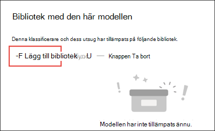
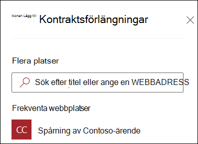
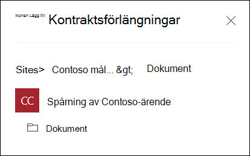
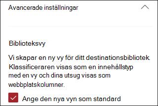
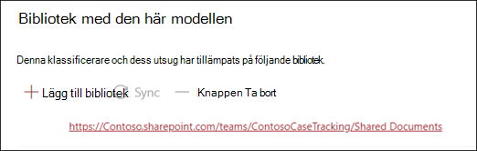
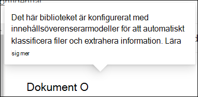
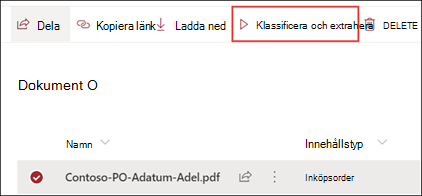

# Använda en modell för dokumenttolkning i Microsoft SharePoint Syntex

 

> [!VIDEO https://www.microsoft.com/videoplayer/embed/RE4CSoL]

 

När du har publicerat modellen för dokumenttolkning kan du använda den på ett eller flera SharePoint-dokumentbibliotek i din Microsoft 365-klientorganisation.

> [!NOTE]
> Du kan bara använda modellen på dokumentbibliotek som du har åtkomst till.

## Använd din modell på ett dokumentbibliotek.

För att använda din modell på ett SharePoint-dokumentbibliotek:

1. På modellens startsida, under fliken **Använda modell på bibliotek**, väljer du **Publicera modell**. Eller så kan du välja  **+Lägg till bibliotek** i avsnittet **Bibliotek med den här modellen**.  

     

2. Sedan kan du välja den SharePoint-webbplats som innehåller det dokumentbibliotek som du vill använda modellen på. Om webbplatsen inte visas i listan kan du använda sökrutan för att hitta den. 

     

    > [!NOTE]
    > Du måste ha behörighet för *Hantera list* eller *Redigera* för det dokumentbibliotek som du använder modellen på. 

3. När du har valt webbplatsen väljer du det dokumentbibliotek som du vill använda modellen på. I exemplet väljer du dokumentbiblioteket *Dokument* från webbplatsen *Contoso Case Tracking*. 

     

4. Eftersom modellen har kopplats till en innehållstyp, kommer den att lägga till innehållstypen och dess vy, med de etiketter du extraherat i form av kolumner, när den används i biblioteket. Den här vyn är bibliotekets standardvy, men du kan även välja att inte använda den som standardvy under **Avancerade inställningar**, avmarkera **Ange den nya vyn som standard**. 

     

5. Välj **Lägg till** för att tillämpa modellen på biblioteket. 
6. På modellens startsida i avsnittet **Bibliotek med den här modellen** ser du webbadressen till den SharePoint-webbplats som visas. 

     

7. Gå till dokumentbiblioteket och se till att du är i modellens dokumentbiblioteksvy. Observera att om du väljer informationsknappen bredvid dokumentbibliotekets namn noterar ett meddelande att modellen har använts i dokumentbiblioteket.

      

När du har använt modellen på dokumentbiblioteket kan du börja ladda upp dokument till webbplatsen och se resultatet.

Modellen identifierar alla filer med modellens kopplade innehållstyp och visar dem i vyn. Om din modell har några extraktorer visas kolumner för de data som du extraherar från varje fil.

### Använd modellen på filer som redan finns i dokumentbiblioteket

Även om en använd modell behandlar alla filer som laddats upp till dokumentbiblioteket efter att den har använts så kan du göra följande för att köra modellen på filer som redan fanns i dokumentbiblioteket innan modellen användes:

1. Markera de filer som du vill ska behandlas av din modell i dokumentbiblioteket.
2. När du har valt dina filer visas **Klassificera och extrahera** i dokumentbibliotekets menyfliksområde. Välj **Klassificera och extrahera**.
3. De filer du valde kommer att läggas till i kön som ska bearbetas.

        

## Se även
[Skapa en klassificerare](create-a-classifier.md)

[Skapa en extraktor](create-an-extractor.md)

[Översikt av dokumenttolkning](document-understanding-overview.md)

