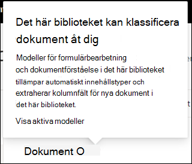

# Använda en modell för dokumenttolkning i Microsoft SharePoint SyntexApply a document understanding model in Microsoft SharePoint Syntex

 

> [!VIDEO https://www.microsoft.com/videoplayer/embed/RE4CSoL]

 

När du har publicerat modellen för dokumenttolkning kan du använda den på ett eller flera SharePoint-dokumentbibliotek i din Microsoft 365-klientorganisation.After publishing your document understanding model, you can apply it to one or more SharePoint document library in your Microsoft 365 tenant.

> [!NOTE]
> Du kan bara använda modellen på dokumentbibliotek som du har åtkomst till.You are only able to apply the model to document libraries that you have access to.

## Använd din modell på ett dokumentbibliotek.Apply your model to a document library.

För att använda din modell på ett SharePoint-dokumentbibliotek:To apply your model to to a SharePoint document library:

1. På modellens startsida, under fliken **Använda modell på bibliotek**, väljer du **Publicera modell**.On model home page, on the **Apply model to libraries** tile, select **Publish model**. Eller så kan du välja  **+Lägg till bibliotek** i avsnittet **Bibliotek med den här modellen**.Or you can select  **+Add Library** in the **Libraries with this model** section.  

     

2. Sedan kan du välja den SharePoint-webbplats som innehåller det dokumentbibliotek som du vill använda modellen på.You can then select the SharePoint site that contains the document library that you want to apply the model to. Om webbplatsen inte visas i listan kan du använda sökrutan för att hitta den.If the site does not show in the list, use the search box to find it. 

     

    > [!NOTE]
    > Du måste ha behörighet för *Hantera list* eller *Redigera* för det dokumentbibliotek som du använder modellen på.You must have *Manage List* permissions or *Edit* rights to the document library you are applying the model to. 

3. När du har valt webbplatsen väljer du det dokumentbibliotek som du vill använda modellen på.After selecting the site, select the document library to which you want to apply the model. I exemplet väljer du dokumentbiblioteket *Dokument* från webbplatsen *Contoso Case Tracking*.In the sample, select the *Documents* document library from the *Contoso Case Tracking* site. 

     

4. Eftersom modellen har kopplats till en innehållstyp, kommer den att lägga till innehållstypen och dess vy, med de etiketter du extraherat i form av kolumner, när den används i biblioteket.Since the model is associated to a content type, when you apply it to the library it will add the content type and its view with the labels you extracted showing as columns. Den här vyn är bibliotekets standardvy, men du kan även välja att inte använda den som standardvy under **Avancerade inställningar**, avmarkera **Ange den nya vyn som standard**.This view is the library's default view by default, but you can optionally choose to not have it be the default view by selecting **Advanced settings** and deselecting **Set this new view as default**. 

     

5. Välj **Lägg till** för att tillämpa modellen på biblioteket.Select **Add** to apply the model to the library. 
6. På modellens startsida i avsnittet **Bibliotek med den här modellen** ser du webbadressen till den SharePoint-webbplats som visas.On the model home page, in the **Libraries with this model** section, you should see the URL to the SharePoint site listed. 

     

7. Gå till dokumentbiblioteket och se till att du är i modellens dokumentbiblioteksvy.Go to your document library and make sure you are in the model's document library view. Observera att om du väljer informationsknappen bredvid dokumentbibliotekets namn noterar ett meddelande att modellen har använts i dokumentbiblioteket.Notice that if you select the information button next to the document library name, a message notes that your model has been applied to the document library.

      

När du har använt modellen på dokumentbiblioteket kan du börja ladda upp dokument till webbplatsen och se resultatet.After applying the model to the document library, you can begin uploading documents to the site and see the results.

Modellen identifierar alla filer med modellens kopplade innehållstyp och visar dem i vyn.The model identifies any files with model’s associated content type and lists them in your view. Om din modell har några extraktorer visas kolumner för de data som du extraherar från varje fil.If your model has any extractors, the view displays columns for the data you are extracting from each file.

### Använd modellen på filer som redan finns i dokumentbiblioteketApply the model to files already in the document library

Även om en använd modell behandlar alla filer som laddats upp till dokumentbiblioteket efter att den har använts så kan du göra följande för att köra modellen på filer som redan fanns i dokumentbiblioteket innan modellen användes:While an applied model processes all files uploaded to the document library after it is applied, you can also do the following to run the model on files that already exists in the document library prior to the model being applied:

1. Markera de filer som du vill ska behandlas av din modell i dokumentbiblioteket.In your document library, select the files that you want to be processed by your model.
2. När du har valt dina filer visas **Klassificera och extrahera** i dokumentbibliotekets menyfliksområde.After selecting your files, **Classify and extract** will appear in the document library ribbon. Välj **Klassificera och extrahera**.Select **Classify and extract**.
3. De filer du valde kommer att läggas till i kön som ska bearbetas.The files you selected will be added to the queue to be processed.

        

## Se ävenSee Also
[Skapa en klassificerareCreate a classifier](create-a-classifier.md)

[Skapa en extraktorCreate an extractor](create-an-extractor.md)

[Översikt av dokumenttolkningDocument Understanding overview](document-understanding-overview.md)

[Skapa en modell för formulärbearbetningCreate a form processing model](create-a-form-processing-model.md)  
