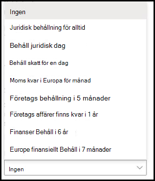
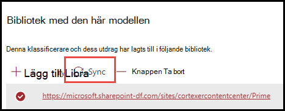

# Du kan enkelt använda en kvarhållningsetikett på en modell för dokumenttolkning i Microsoft SharePoint Syntex.

 

> [!VIDEO https://www.microsoft.com/videoplayer/embed/RE4GydO]  

 

Du kan enkelt använda en [kvarhållningsetikett](../compliance/retention.md) på en modell för dokumenttolkning i Microsoft SharePoint Syntex. Du kan göra detta för både dokumentförståelse och formulärhanteringsmodeller. 

Med hjälp av kvarhållningsetiketter kan du använda kvarhållningsinställningar för dokument som modellen för dokumenttolkning förstår.  Du vill till exempel kanske att din modell inte bara ska identifiera *Försäkringar* som laddats upp till dokumentbiblioteket, utan även använda kvarhållningsetiketten *Företag* på dem så att dokumenten inte kan tas bort från dokumentbiblioteket under den angivna tidsperioden (till exempel de kommande fem månaderna).

Du kan använda en befintlig kvarhållningsetikett på modellen för dokumenttolkning i modellinställningarna på modellens startsida. 

> [!Important]
> För att kvarhållningsetiketterna ska vara tillgängliga att använda på din modell för innehållstolkning måste de [skapas och publiceras i Microsoft 365 Efterlevnadscenter](../compliance/create-apply-retention-labels.md#how-to-create-and-publish-retention-labels).

## Att använda kvarhållningsetiketter på modeller för dokumenttolkning

1. På modellens startsida väljer du **Modellinställningar**. 
2. I **Modelinställningar**, i avsnittet **Säkerhet och efterlevnad**, väljer du menyn **Kvarhållningsetikett** för en lista över de kvarhållningsetiketter som finns tillgängliga att använda på modellen. 
   
3. Välj den kvarhållningsetikett som du vill använda för modellen och sedan **Spara**. 

När du har använt kvarhållningsetiketten på din modell kan du använda den på:
- Ett nytt dokumentbibliotek
- Ett dokumentbibliotek som modellen redan används för
 
## Använd kvarhållningsetiketten på ett dokumentbibliotek som modellen redan används för

Om modellen för dokumenttolkning redan har använts på ett dokumentbibliotek kan du göra följande för att synkronisera din uppdatering av kvarhållningsetiketten så att den används på dokumentbiblioteket: 

1. På modellens startsida, i avsnittet **Bibliotek med den här modellen** väljer du det dokumentbibliotek på vilket du vill använda uppdateringen av kvarhållningsetiketten.   
2. Välj **Synkronisera**.  
   

Efter tillämpning av uppdateringen och synkronisering med modellen kan du kontrollera att den har använts genom att göra följande:

1. I innehållscentret går du till avsnittet **Bibliotek med den här modellen**. Klicka på det bibliotek där din uppdaterade modell används.  
2. I vyn dokumentbibliotek väljer du informationsikonen för att kontrollera modellens egenskaper.   
3. I listan över **Aktiva modeller** väljer du den uppdaterade modellen. 
4. I avsnittet **Kvarhållningsetikett** ser du namnet på den kvarhållningsetikett som används. 

På modellens visningssida i dokumentbiblioteket visas en ny kolumn för **Kvarhållningsetikett**.  Allt eftersom modellen klassificerar filer som tillhör dess innehållstyp och listar dem i biblioteksvyn visas också namnet på den kvarhållningsetikett som har använts på den genom modellen.

Till exempel kommer alla *Försäkringar* som modellen identifierar att ha kvarhållningsetiketten *Företag* så att de inte kan tas bort från dokumentbiblioteket på fem månader. Om du försöker ta bort filen från dokumentbiblioteket visas ett felmeddelande om att det inte är tillåtet eftersom kvarhållningsetiketten används.

## Att använda kvarhållningsetikett på modeller för dokumenttolkning

> [!Important]
> För att kvarhållningsetiketter ska vara tillgängliga för din formulärbehandlingsmodell måste de vara [skapas och publiceras i Microsoft 365 Efterlevnadscenter](../compliance/create-apply-retention-labels.md#how-to-create-and-publish-retention-labels).

Du kan antingen använda en kvarhållningsetikett på en formulärbehandlingsmodell när du skapar en modell eller tillämpa den på en befintlig modell.

### Så här lägger du till en kvarhållningsetikett när du skapar en formbehandlingsmodell

1. När du [skapar en ny formulärbearbetningsmodell](./create-a-form-processing-model.md) väljer du <b>Avancerade inställningar.</b>
2. I <b>Avancerade inställningar</b> väljer du menyn i avsnittet <b>Bevarandeetikett</b> och väljer sedan den bevarandeetikett som du vill använda på modellen.</b>

 
      

3.  När du har slutfört dina återstående modellinställningar väljer du <b>Skapa</b> för att bygga modellen.

### Lägga till en bevarandeetikett i en befintlig formulärbearbetningsmodell

Du kan lägga till en kvarhållningsetikett i en befintlig formulärbearbetningsmodell på olika sätt:
- Genom Automatisera-menyn i dokumentbiblioteket
- Genom de aktiva modellinställningarna i dokumentbiblioteket 

#### Lägga till en bevarandeetikett till en befintlig formulärbearbetningsmodell via Automatisera-menyn

Du kan lägga till en kvarhållningsetikett till en befintlig formulärbearbetningsmodell som du äger via Automatisera-menyn i det dokumentbibliotek där modellen används.

1. I ditt dokumentbibliotek där formulärbehandlingsmodellen används, välj <b>Automatisera</b>-menyn, välj <b>AI Builder</b> och välj sedan <b>Visa information om formulärbehandlingsmodell</b>.

    

2. I modellinformationen väljer du den <b>kvarhållningsetikett</b> som du vill tillämpa i avsnittet Lagringsetikett.  Välj sedan <b>Spara</b>.

       

#### Lägga till en bevarandeetikett till en befintlig formulärbearbetningsmodell i inställningarna för aktiv modell

Du kan lägga till en kvarhållningsetikett till en befintlig formulärbearbetningsmodell som du äger via inställningarna för aktiv modell i det dokumentbibliotek där modellen används.

1. I det SharePoint-dokumentbibliotek där modellen används väljer du <b>Visa aktiva modeller</b> ikonen och väljer sedan <b>Visa aktiva modeller</b>.</b>

     

2. I <b>aktiva modeller</b> välj den formulärbearbetningsmodell där du vill använda kvarhållningsetikett.

       

3. I modellinformationen väljer du den <b>kvarhållningsetikett</b> som du vill tillämpa i avsnittet Lagringsetikett.  Välj sedan <b>Spara</b>.

> [!NOTE]
> Du måste vara modellägare för fönstret för modellinställningar för att kunna redigeras. 

## Se även
[Skapa en klassificerare](create-a-classifier.md)

[Skapa en extraktor](create-an-extractor.md)

[Översikt av dokumenttolkning](document-understanding-overview.md)
