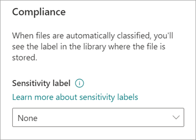
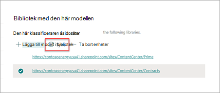

# Använda en kvarhållningsetikett på en modell för dokumenttolkning i Microsoft SharePoint SyntexApply a sensitivity label to a model in Microsoft SharePoint Syntex

Du kan enkelt använda en [känslighetsetikett](../compliance/sensitivity-labels.md) på modeller för dokumenttolkning i Microsoft SharePoint Syntex.You can easily apply a [sensitivity label](../compliance/sensitivity-labels.md) to document understanding models in Microsoft SharePoint Syntex. Den här funktionen är inte tillgänglig ännu för modeller för formulärbearbetning.This feature isn't available yet for form processing models.

Med känslighetsetiketter kan du tillämpa krypterings-, delnings- och villkorsstyrda principer på de dokument som modeller identifierar.Sensitivity labels let you apply encryption, sharing, and conditional access policies to the documents that your models identify. Du vill till exempel att modellen inte bara ska identifiera finansiella dokument som innehåller bankkontonummer eller kreditkortsnummer som laddas upp till ditt dokumentbibliotek, utan även använda en *-krypteringsetikett* för att begränsa vem som kan komma åt innehållet och hur det kan användas.For example, you want your model to not only identify any financial documents that contain bank account numbers or credit card numbers that are uploaded to your document library, but also to apply an *Encryption* sensitivity label to them to restrict who can access that content and how it can be used.

Du kan använda en befintlig känslighetsetikett på modellen för dokumenttolkning i modellinställningarna på modellens startsida.You can apply a pre-existing sensitivity label to your model through your model settings on your model's home page. Etiketten måste redan vara publicerad för att vara tillgänglig för val från modellinställningar.The label must already be published to be available for selection from model settings.

> [!Important]
> För att känslighetsetiketterna ska vara tillgängliga att använda på din modell för innehållstolkning måste de [skapas och publiceras i Microsoft 365 Efterlevnadscenter](../business-video/create-sensitivity-labels.md).For sensitivity labels to be available to apply to your document understanding models, they need to be [created and published in the Microsoft 365 Compliance Center](../business-video/create-sensitivity-labels.md).

## Lägg till en känslighetsetikett på modeller för dokumenttolkningAdd a sensitivity label to a document understanding model

1. På modellens startsida väljer du **Modellinställningar**.From the model home page, select **Model settings**.

   

2. I fönstret **Modellinställningar**, i avsnittet **Efterlevnad**, väljer du menyn **Känslighetsetikett** för en lista över de känslighetsetiketter som finns tillgängliga att använda på modellen.On **Model settings** pane, in the **Compliance** section, select the **Sensitivity label** menu to see a list of sensitivity labels that are available for you to apply to the model.

    

3. Välj den känslighetsetikett som du vill använda för modellen och sedan **Spara**.Select the sensitivity label you want to apply to the model, and then select **Save**.

När du har tillämpat känslighetsetiketten på modellen kan du använda den på en:After you apply the sensitivity label to your model, you can apply it to a:

- Ett nytt dokumentbibliotekNew document library
- Ett dokumentbibliotek som modellen redan används förDocument library to which the model is already applied
 
### Använd känslighetsetiketten på ett dokumentbibliotek som modellen redan används förApply the sensitivity label to a document library to which the model is already applied

Om modellen för dokumenttolkning redan har använts på ett dokumentbibliotek kan du göra följande för att synkronisera din uppdatering av känslighetsetiketten så att den används på dokumentbiblioteket:If your document understanding model has already been applied to a document library, you can do the following to sync your sensitivity label update to apply it to the document library:

1. På modellens startsida, i avsnittet **Bibliotek med den här modellen** väljer du det dokumentbibliotek på vilket du vill använda uppdateringen av känslighetsetiketten.On the model home page, in the **Libraries with this model** section, select the document library to which you want to apply the sensitivity label update.

2. Välj **Synkronisera**.Select **Sync**.

   

Efter tillämpning av uppdateringen och synkronisering med modellen kan du kontrollera att den har använts genom att göra följande:After you apply the update and sync it to your model, you can confirm that it has been applied by doing the following steps:

1. I innehållscentret går du till avsnittet **Bibliotek med den här modellen**. Välj det bibliotek där din uppdaterade modell används.In the content center, in the **Libraries with this model** section, select the library to which your updated model was applied. 

2. I vyn dokumentbibliotek väljer du informationsikonen för att kontrollera modellens egenskaper.In your document library view, select the information icon to check the model properties.

3. I listan över **Aktiva modeller** väljer du den uppdaterade modellen.In the **Active models** list, select your updated model.

4. I avsnittet **Känslighetsetikett** visas namnet på den använda känslighetsetiketten.In the **Sensitivity label** section, you'll see the name of the applied sensitivity label.

På modellens visningssida i dokumentbiblioteket visas en ny kolumn för **Känslighetsetikett**.On your model's view page in your document library, a new **Sensitivity label** column will display. Allt eftersom modellen klassificerar filer som tillhör dess innehållstyp och listar dem i biblioteksvyn, visar kolumnen **Känslighetsetikett** också namnet på den känslighetsetikett som har använts på den genom modellen.As your model classifies files it identifies as belonging to its content type and lists them in the library view, the **Sensitivity label** column will also display the name of the sensitivity label that has been applied to it through the model.

Till exempel kommer alla finansiella dokument som din modell identifierar även att få en etikett för *Kryptering* och hindra dem från att användas av obehöriga personer.For example, all financial documents that your model identifies also will have the *Encryption* sensitivity label applied to them, preventing them from being accessed by unauthorized people. Om någon obehörig försöker komma åt filen från dokumentbiblioteket visas ett felmeddelande om att det inte är tillåtet eftersom känslighetsetiketten används.If an attempt is made to access the file from the document library by an unauthorized person, an error will display saying it isn't allowed because of the applied sensitivity label.

<!---
## Add a sensitivity label to a form processing model

> [!Important]
> For sensitivity labels to be available to apply to your form processing model, they need to be [created and published in the Microsoft 365 Compliance Center](../business-video/create-sensitivity-labels.md).

You can either apply a sensitivity label to a form processing model when you are creating a model, or apply it to an existing model.

### Add a sensitivity label when you create a form processing model

1. When you [create a new form processing model](create-a-form-processing-model.md), select **Advanced settings**.

2. In **Advanced settings**, in the **Sensitivity label** section, select the menu and then select the sensitivity label you want to apply to the model.

3.  After you've completed your remaining model settings, select **Create** to build your model.

### Add a sensitivity label to an existing form processing model

You can add a sensitivity label to an existing form processing model in different ways:

- Through the **Automate** menu in the document library
- Through the **Active model** settings in the document library 

#### Add a sensitivity label to an existing form processing model through the Automate menu

You can add a sensitivity label to an existing form processing model that you own through the **Automate** menu in the document library in which the model is applied.

1. In your document library to which the form processing model is applied, select the **Automate** menu, select **AI Builder**, and then select **View form processing model details**.

2. On the **Model details** pane, in the **Sensitivity label** section, select the sensitivity label you want to apply. Then select **Save**.

#### Add a sensitivity label to an existing form processing model in the active model settings

You can add a sensitivity label to an existing form processing model that you own through the **Active model** settings in the document library in which the model is applied.

1. In the SharePoint document library in which the model is applied, select the **View active models** icon, and then select **View active models**.

2. In **Active models**, select the form processing model to which you want to apply the sensitivity label.

3. On the **Model details** pane, in the **Sensitivity label** section, select the sensitivity label you want to apply. Then select **Save**.

   > [!NOTE]
   > You must be the model owner for the **Model settings** pane to be editable. 
--->

## Se ävenSee also

[Använda en kvarhållningsetikettApply a retention label](apply-a-retention-label-to-a-model.md)

[Skapa en klassificerareCreate a classifier](create-a-classifier.md)

[Skapa en extraktorCreate an extractor](create-an-extractor.md)

[Översikt av dokumenttolkningDocument Understanding overview](document-understanding-overview.md)