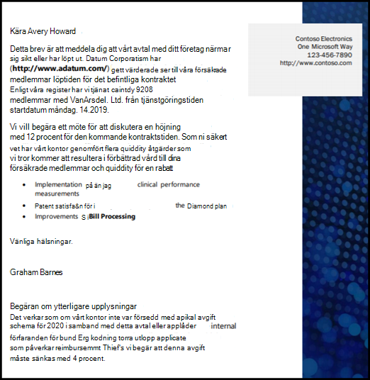
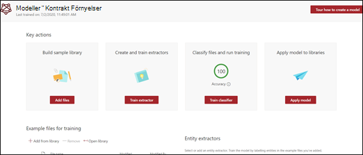
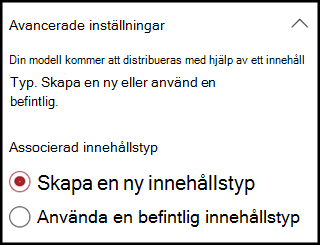
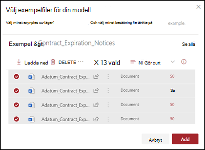
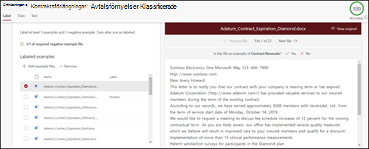
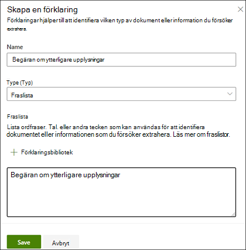

# Skapa en klassificerare i Microsoft SharePoint Syntex

 

> [!VIDEO https://www.microsoft.com/videoplayer/embed/RE4CL0R]  

 

En klassificerare är en modelltyp som du kan använda för att automatisera identifiering och klassificering av en dokumenttyp. Du kanske, till exempel, vill identifiera alla *Kontraktförnyelse* dokument som har lagts till i ditt dokumentbibliotek, som visas i följande bild.

Genom att skapa en klassificerare kan du skapa en ny [SharePoint Innehållstyp](/sharepoint/governance/content-type-and-workflow-planning#content-type-overview) som ska associeras med modellen.

När du skapar en klassificerare behöver du skapa *förklaringar* för att definiera modellen. På så sätt kan du notera vanliga data som du skulle förvänta dig att konsekvent hitta den här dokumenttyp. 

Använd exempel på dokumenttypen ("exempelfiler") för att "träna" din modell för att identifiera filer som har samma innehållstyp.

För att skapa en klassificerare behöver du:
1. Ge din modell ett namn.
2. Lägg till dina exempelfiler.
3. Märka dina exempelfiler.
4. Skapa en förklaring.
5. Testa din modell.

> [!NOTE]
> Medan din modell använder en klassificerare för att identifiera och klassificera dokumenttyper, kan du också välja att hämta specifika delar av information från varje fil som identifieras av modellen. Gör detta genom att skapa en **extraktor** för att lägga till din modell. Se [Skapa en extraherare](create-an-extractor.md).

## Ge din modell ett namn

Första steget för att skapa din modell är att ge den ett namn:

1. I Innehållscentret välj **Ny** och sedan **Skapa en modell**.
2. I **Ny modell för dokumenttolkning** fönstret, i **Namn** fältet, skrev namnet på modellen. Om du, till exempel, vill identifiera kontraktförnyelse dokument, skulle du kunna get modellen namnet *Kontraktförnyelse*.
3. Välj **Skapa**. Då skapas en startsida för modellen. 

    

När du skapar en modell skapar du också en ny typ av webbplatsinnehåll. En innehållstyp representerar en kategori med dokument som har gemensamma egenskaper och delar en samling kolumner eller metadata för det specifika innehåll. SharePoint Innehållstyper hanteras via [Innehållstyper galleri](https://support.microsoft.com/office/create-or-customize-a-site-content-type-27eb6551-9867-4201-a819-620c5658a60f). I det här exemplet när du skapar modellen skapar du en ny *Kontraktförnyelse* innehållstyp.

Välj **Avancerade inställningar** om du vill mappa denna modell till en befintlig företagsinnehållstyp i SharePoint Innehållstyp galleriet för att använda dess schema. Företagsinnehållstyper lagras i Innehållstypsnav i SharePoint administrationscentret och syndikeras till alla webbplatser i klientorganisationen. Notera att när du kan använda en befintlig innehållstyp för att använda sitt schema för att hjälpa till med identifiering och klassificering behöver du ändå träna din modell för att extrahera information från filerna som identifieras. 

## Lägg till dina exempelfiler

På modellens startsida lägger du till de exempelfilerna som du kommer att behöva för att träna modellen att identifiera din dokumenttyp.  
 

> [!VIDEO https://www.microsoft.com/videoplayer/embed/RE4D0iX] 

 

> [!NOTE]
> Du bör använda samma filer för både klassificerare och [extraktorträning](create-an-extractor.md). Du kan alltid välja att lägga till mer senare, men vanligtvis lägger du till en hel uppsättning exempelfiler. Märka några för att träna din modell och testa de återstående omärkta för att utvärdera modellens fitness. 

För din träning vill du använda både positiva och negativa exempel:
- Positivt exempel: Dokument som representerar dokumenttypen. Dessa innehåller strängar och information som alltid ska vara i den här dokumenttyp.
- Negativt exempel: Alla andra dokument som inte representerar dokumentet du vill klassificera. 

Se till att använda minst fem positiva exempel och minst ett negativt exempel för att träna din modell.  Du vill skapa ytterligare för att testa din modell efter utbildningsprocessen.

Lägg till exempelfiler:

1. På modellens startsida, i **Lägg till exempel filer** panelen klicka **Lägg till filer**.
2. På sidan **Välj exempelfiler för din modell** välj dina exempelfiler från biblioteket för utbildningsfiler i innehållscentret. Om du inte redan har laddat upp dem där, välj att ladda upp dem nu genom att klicka på **Ladda upp** för att kopiera dem till biblioteket för utbildningsfiler.
3. När du har valt dina exempel-filer som ska användas för att träna modellen klicka på **Lägg till**.

     

## Märka dina exempelfiler

När du har lagt till dina exempelfiler behöver du ge dem etiketter som positiva eller negativa exempel.

1. Gå till modellens startsida och på den **Klassificera filer och kör utbildningen** panel, klicka på **Träna Klassificerare**.
   Etikett sidan visas med en lista över dina exempelfiler, med den första filen synlig i visningsprogrammet.
2. I visnings programmet längst upp i den första exempelfilen bör du se text som frågar om filen är ett exempel på modellen du just skapade. Om det är ett positivt exempel välj **Ja**. Om det är ett positivt exempel välj **Nej**.
3. I **Märkta exempel** listan till vänster välj ytterligare filer som du vill använda som exempel och märk dem. 

     

> [!NOTE]
> Märk minst fem positiva exempel. Du måste också märka minst ett negativt exempel. 

## Skapa en förklaring

Nästa steget är att skapa en förklaring på Träningssidan. En förklaring hjälper modellen att förstå hur man känner igen dokumentet. Exempelvis innehåller Kontraktförnyelse dokument alltid en *Begäran om ytterligare avslöjande* textsträng.

> [!Note]
> När den används med extraktors, identifierar en förklaring den sträng som du vill extrahera från dokumentet. 

För att skapa en förklaring:

1. På modellens startsida välj fliken **Träna** för att gå till Träningssidan.
2. På Träningssidan, i sektionen **Tränade filer** bör du se en lista över de exempelfiler som du tidigare har märkt. Välj en av de positiva filerna i listan och den visas i visningsprogrammet.
3. I Förklaringssektionen välj **Ny** och sedan **Blank**.
4. På sidan för **Skapa en förklaring**: 
    a. Skriv **Namnet** (till exempel "Avslöjande Block"). 
    b. Välj **Typ**. I exemplet välj **Fraslista** eftersom du lägger till en textsträng. 
    c. I rutan **Skriv här** skriver du strängen. För exemplet, lägg till "Begäran om ytterligare avslöjande". Du kan välja **Skiftlägeskänsliga** om strängen behöver vara skiftlägeskänslig. 
    d. Klicka på **Spara**.

     
    
5. Nu kontrolleras Innehållscentret för att se om förklaringen du skapade var tillräckligt komplett för att identifiera de återstående märkta exempelfilerna korrekt, som positiva och negativa exempel. I sektionen för Tränade filer, märk kolumnen **Utvärdering** när träningen har slutförts för att se resultatet. Filerna visar ett värde för **Matchning**, om förklaringarna du skapade är tillräckliga för att matcha det som du har märkt som positivt eller negativt.

     

Om du får en **Matchningsfel** på de märkta filerna kan du behöva skapa en ytterligare förklaring för att ge modellen mer information för att identifiera dokumenttypen. I så fall klickar du på filen för att få mer information om varför matchningsfelet har uppstått.

## Testa din modell

Om du får en matchning för dina etiketterade exempelfiler kan du nu testa din modell på de återstående omärkta exempelfilerna som modellen inte har sett tidigare.  Det här är valfritt, men ett användbart steg för att utvärdera "lämpligheten" eller beredskapen av modellen innan användning är genom att testa den på filer som modellen inte har sett tidigare.

1. Från modellens startsida välj fliken **Test**.  Då körs modellen på dina omärkta exempelfiler.
2. I listan **Testfiler** visas dina exempelfiler och visar om modellen har uppskattad de som positiva eller negativa. Använd den här informationen för att ta reda på hur effektivt din klassificerare är för att identifiera dina dokument.

     

## Se även
[Skapa en extraherare](create-an-extractor.md)

[Översikt av dokumenttolkning](document-understanding-overview.md)

[Förklaringstyper](explanation-types-overview.md)

[Använda en modell](apply-a-model.md) 

[Tillgänglighetsläge för SharePoint Syntex](accessibility-mode.md)