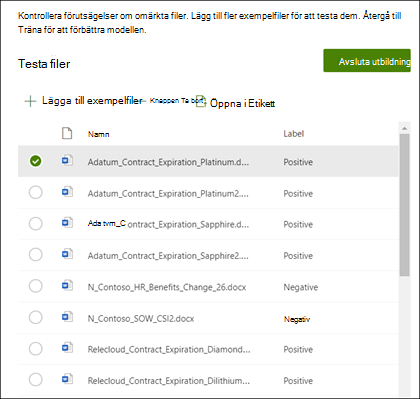

# Skapa en klassificerare i Microsoft SharePoint Syntex

Innehållet i den här artikeln gäller för projekt cortex privat för hands version. [Lär dig mer om Project cortex](https://aka.ms/projectcortex).

 

> [!VIDEO https://www.microsoft.com/videoplayer/embed/RE4CL0R]  

 

En klassificerare är en typ av modell som du kan använda för att automatisera identifiering och klassificering av en dokument typ. Du kanske till exempel vill identifiera alla *förlängnings* dokument som läggs till i ditt dokument bibliotek, till exempel i följande bild.

Om du skapar en klassificerare kan du skapa en ny [SharePoint-innehållstyp](https://docs.microsoft.com/sharepoint/governance/content-type-and-workflow-planning#content-type-overview) som associeras med modellen.

När du skapar en klassificerare måste du skapa *förklaringar* för att definiera modellen. Det gör att du kan notera vanliga data som du förväntar dig att konsekvent hitta den här dokument typen. 

Använd exempel på dokument typen ("exempel filer") för att "träna" din modell för att identifiera filer som har samma innehålls typ.

Om du vill skapa en klassificerare måste du:
1. Namnge modellen.
2. Lägga till exempel filer.
3. Namnge dina exempel filer.
4. Skapa en förklaring.
5. Testa modellen.

> [!NOTE]
> Medan modellen använder en klassificerare för att identifiera och klassificera dokument typer kan du också välja att hämta specifika informations delar från varje fil som identifieras av modellen. Gör det genom att skapa en **Extractor** för att lägga till i din modell. Se [skapa en Extractor](create-an-extractor.md).

## Namnge modellen

Det första steget för att skapa modellen är att ge den ett namn:

1. I innehålls centret väljer du **ny**och **skapar sedan en modell**.
2. Ange namnet på modellen i fältet **namn** i **modell fönstret nytt dokument** Om du till exempel vill identifiera förlängnings dokument för kontrakt kan du ange ett namn på *förnyelsen*av kostnads kontraktet.
3. Välj **Skapa**. Då skapas en start sida för modellen. 

    

När du skapar en modell skapar du också en ny SharePoint-innehållstyp. En SharePoint-innehållstyp representerar en kategori med dokument som har gemensamma egenskaper och delar en uppsättning kolumner eller metadataegenskaper för det specifika innehållet. SharePoint-innehålls typer hanteras via [galleriet innehålls typer](https://support.microsoft.com/office/create-or-customize-a-site-content-type-27eb6551-9867-4201-a819-620c5658a60f). I det här exemplet skapar du en ny innehålls typ för *kontrakt förnyelse* när du skapar modellen.

Välj **Avancerade inställningar** om du vill mappa den här modellen till en befintlig innehålls typ i galleriet SharePoint-innehålls typer för att använda dess schema. Tänk på att när du kan använda en befintlig innehålls typ för att utnyttja dess schema för att hjälpa till med identifiering och klassificering måste du ändå träna modellen för att extrahera information från filer som identifieras. 

## Lägga till exempel filer

På Start sidan för modeller kan du lägga till dina exempel filer som du måste hjälpa till att träna modellen för att identifiera dokument typen.  
 

> [!VIDEO https://www.microsoft.com/videoplayer/embed/RE4D0iX] 

 

> [!NOTE]
> Du bör använda samma filer för både klassificerings-och [Extractor-utbildning](create-an-extractor.md). Du kan välja att lägga till mer senare, men normalt lägger du till en fullständig uppsättning exempel filer. Märk lite för att träna modellen och testa resten av dem för att utvärdera modellens användbarhet. 

För din utbildning ställer du in både för positiva och negativa exempel:
- Positivt exempel: dokument som representerar dokument typen. Dessa innehåller strängar och information som alltid ska finnas med i den här typen av dokument.
- Negativt exempel: dokument som inte representerar dokument typen. Dessa saknar strängar och information som måste finnas med i den här typen av dokument.

Se till att använda minst fem positiva exempel och minst ett negativt exempel för att träna modellen.  Du vill skapa fler för att testa modellen efter övnings processen.

Så här lägger du till exempelfiler:

1. Klicka på **Lägg till filer**i panelen **Skapa exempel bibliotek** från modell start sidan.
2. På sidan **Välj exempel filer för modellen** väljer du dina exempel filer från biblioteket för exempelfilerna i innehålls centret. Om du inte redan har laddat upp dem där väljer du att överföra dem nu genom att klicka på **Ladda upp** för att flytta dem till exempel fil biblioteket.
3. När du har valt exempel-filerna som ska användas för att träna modellen klickar du på **Lägg till**.

     

## Namnge dina exempel filer

När du har lagt till dina exempelfiler måste du förse dem med antingen positiva eller negativa exempel.

1. På modell start sidan klickar du på **träna** **filer och kör utbildning** .
   Då visas etikett sidan som visar en lista över dina exempelfiler, med den första filen synlig i visnings programmet.
2. I visnings programmet högst upp i den första exempel filen bör du se text som frågar om filen är ett exempel på modellen du just skapade. Om det är ett positivt exempel väljer du **Ja**. Om det är ett negativt exempel väljer du **Nej**.
3. I listan med **namngivna exempel** till vänster väljer du ytterligare filer som du vill använda som exempel och etiketterar dem. 

     

> [!NOTE]
> Ge minst fem positiva exempel ett negativt exempel. 

## Skapa en förklaring

Nästa steg är att skapa en förklaring på sidan tåg. En förklaring hjälper modellen att känna igen dokumentet. Till exempel innehåller kontrakts förlängningarna alltid en *begäran om ytterligare text sträng för avslöjande* .

> [!Note]
> När en förklaring används med utdrag, identifieras strängen som du vill extrahera från dokumentet. 

Så här skapar du en förklaring:

1. Från start sidan för modellen väljer du fliken **tåg** för att gå till sidan tåg.
2. I avsnittet **utbildade filer** på sidan tåg visas en lista med exempelfiler som du tidigare har märkt. Välj en av de positiva filerna i listan och visa den i visnings programmet.
3. I avsnittet förklaring väljer du **nytt** och sedan **Tom**.
4. På sidan **skapa en förklaring** : 
    a. Skriv **namnet** (till exempel "textmeddelande"). 
    b. Välj **typ**. I exemplet väljer du **fras lista**sedan du lägger till en text sträng. 
    c. I rutan **Skriv här** skriver du strängen. Lägg till "begäran om ytterligare avslöjande". Du kan välja **SKIFT läges känsligt** om strängen måste vara Skift läges känslig. 
    d. Klicka på **Spara**.

     
    
 
5. Nu kontrollerar modellen att den förklaring du skapade var tillräcklig nog för att identifiera de återstående filmärkta exemplen korrekt, som positiva och negativa exempel. I avsnittet utbildade filer markerar du kolumnen **utvärdering** efter att utbildningen är klar för att visa resultatet. Filerna visar värdet **matchar**om förklaringarna du skapade räcker till för att matcha det du har angett som positivt eller negativt.

     

Om du får ett **fel** meddelande om etiketter kan du behöva skapa ytterligare en förklaring för att ge modellen mer information för att identifiera dokument typen. Om det inträffar klickar du på filen för att få mer information om varför matchnings felet inträffade.

## Testa modellen

Om du har fått en matchning på dina etiketterade exempelfiler kan du testa modellen på dina återstående ljudfiler.

1. På Start sidan för modellen väljer du fliken **test** .  Då körs modellen på dina namnlösa exempelfiler.
2. I listan **testfiler** visas och visar dina exempel filer om modellen förväntar sig vara positiv eller negativ. Använd den här informationen för att fastställa hur din klassificerarens effektivitet är för att identifiera dina dokument.

     

## Se även
[Skapa en Extractor](create-an-extractor.md) 
[Översikt över dokument förståelse](document-understanding-overview.md) 
[Skapa en modell för formulär bearbetning](create-a-form-processing-model.md) 
[Använda en modell](apply-a-model.md) 
