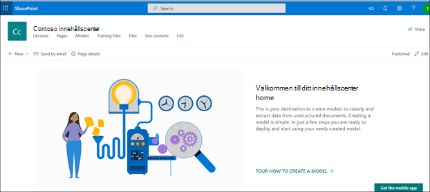

# Skapa ett innehållscenter i Microsoft SharePoint SyntexCreate a content center in Microsoft SharePoint Syntex

 

> [!VIDEO https://www.microsoft.com/videoplayer/embed/RE4CPSF]

 

Om du vill skapa och hantera modeller för dokumenttolkning måste du först ha ett innehållscenter.To create and manage document understanding models, you first need a content center. Innehållscentret är gränssnittet för skapande av modeller och innehåller även information om vilka dokumentbibliotek som publicerade modeller använts på.The content center is the model creation interface and also contains information about which document libraries published models have been applied to. 

    

Du skapar ett standardinnehållscenter under [konfiguration](set-up-content-understanding.md).You create a default content center during [setup](set-up-content-understanding.md). Men en SharePoint-administratör kan också välja att skapa fler center efter behov.But a SharePoint admin can also choose to create additional centers as needed. Även om det kan vara bra att skapa ett enda innehållscenter för miljöer där du vill samla alla modellaktiviteter kanske du vill ha ytterligare center för olika avdelningar i organisationen, som kan ha olika behov och behörighetskrav för sina modeller.While a single content center may be fine for environments for which you want a roll-up of all model activity, you may want to have additional centers for multiple departments within your organization, which may have different needs and permission requirements for their models.

> [!NOTE]
> En SharePoint-administratör kan skapa en webbplats för innehållscentret precis som de [skapar andra SharePoint-webbplatser](https://docs.microsoft.com/sharepoint/create-site-collection) via administrationscentrets panel för webbplatsetablering.A SharePoint admin can create a content center site like they would [create any other SharePoint site](https://docs.microsoft.com/sharepoint/create-site-collection) through the admin center site provisioning panel.

För att skapa ett nytt innehållscenter:To create a new content center:

1. Gå till administrationscenter för SharePoint i administrationscenter för Microsoft 365.On the Microsoft 365 admin center, go to the SharePoint admin center.
2. I administrationscentret för SharePoint, under **Webbplatser**, väljer du **Aktiva webbplatser**.On the SharePoint admin center, under **Sites**, select **Active Sites**.
3. På sidan **Aktiva webbplatser** klickar du på **Skapa** och väljer **Andra alternativ**.On the **Active Sites** page, click **Create**, and then select **Other options**.
4. Välj **Innehållscenter** i menyn **Välj en mall**.On the **Choose a template** menu, select **Content Center**.
5. Ange **Webbplatsnamn**, **primär administratör** och **Språk** för den nya webbplatsen.For the new site, provide a **Site Name**, **Primary administrator**, and a **Language**. 

> [!NOTE] 
> Du kan välja en webbplats för innehållscenter i något av de tillgängliga språken, men observera att modeller för närvarande endast kan skapas för engelska filer.You can select a content center site to render in any of the available languages, but note that currently models can only be created for English files. Observera också att precis som med andra webbplatsmallar kan standardwebbplatsens språk inte redigeras när webbplatsen har skapats.Also note that like other site templates, the default site language isn't editable after the site is created. 

6. Välj **Färdig**.Select **Finished**.
 
När du har skapat en webbplats för innehållscentret visas den på sidan **Aktiva webbplatser** i administrationscenter för SharePoint.After you create a content center site, you will see it listed on the **Active sites** page in the SharePoint admin center. 

### Ge behörighet till ytterligare användareGive access to additional users
 
När du har skapat webbplatsen kan du ge fler användare åtkomst till den via standard[modellen för SharePoint-webbplatsbehörigheter](https://docs.microsoft.com/sharepoint/modern-experience-sharing-permissions).After you create the site, you can give additional users access to the site through the standard [SharePoint site permissions model](https://docs.microsoft.com/sharepoint/modern-experience-sharing-permissions).

## Se ävenSee Also
[Skapa en klassificerareCreate a classifier](create-a-classifier.md)

[Skapa en extraktorCreate an extractor](create-an-extractor.md)

[Skapa ett innehållscenterCreate a content center](create-a-content-center.md)

[Översikt av dokumenttolkningDocument understanding overview](document-understanding-overview.md)

[Skapa en modell för formulärbearbetningCreate a form processing model](create-a-form-processing-model.md)

[Använda en modellApply a model](apply-a-model.md)    
