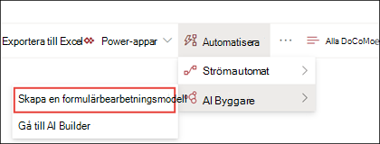
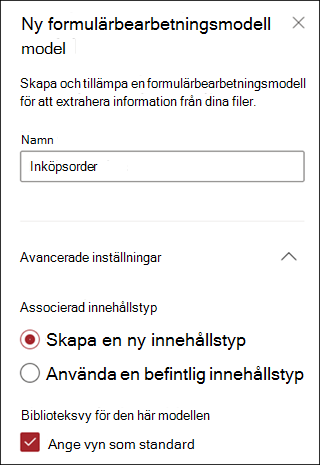
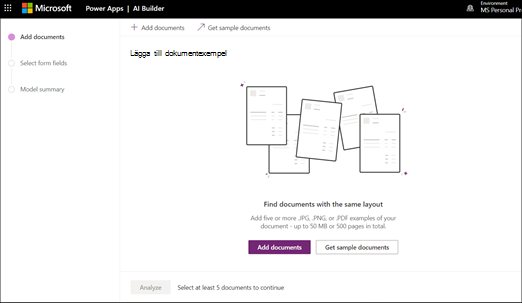
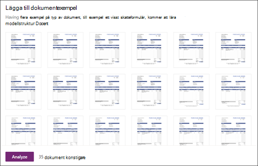
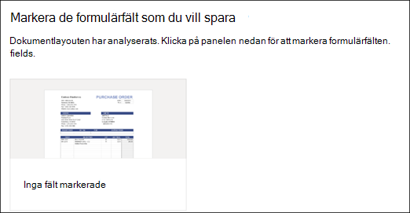
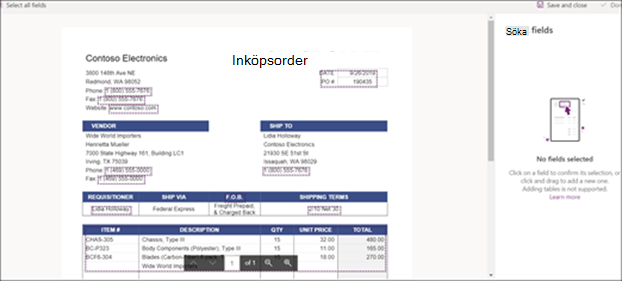
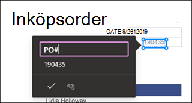
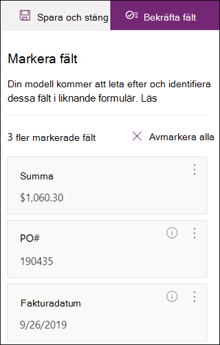
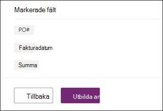
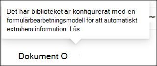

# Skapa en modell för formulärbearbetning i Microsoft SharePoint-Syntex

Använda [AI-verktyg](https://docs.microsoft.com/ai-builder/overview) – en funktion i Microsoft PowerApps – SharePoint Syntex-användare kan skapa en[modell för formulärbearbetning](form-processing-overview.md) direkt från ett SharePoint-dokumentbibliotek. 

Att skapa en modell för formulärbearbetning inbegriper följande:
 - Steg 1: Skapa modellen för formulärbearbetning för att skapa innehållstypen
 - Steg 2: Lägg till och analysera exempelfiler
 - Steg 3: Välj dina formulärfält
 - Steg 4: Träna och testa din modell
 - Steg 5: Publicera din modell
 - Steg 6: Använd din modell

## Krav

Du kan bara skapa en modell för formulärbearbetning i SharePoint-dokumentbibliotek för vilka den är aktiverad. Om formulärbearbetning är aktiverad kan du se **AI Builder** **"Skapa en modell för formulärbearbetning"** under **Automatisera** meny i ditt dokumentbiblioteket.  Om du behöver få bearbetning aktiverad i ditt dokumentbibliotek måste du kontakta din SharePoint-administratör.

  

## Steg 1: Skapa en modell för formulärbearbetning

Första steget för att skapa en modell för formulärbearbetning är att namnge den och skapa, definiera den nya innehållstyp och skapa ett nytt vy för dokumentbiblioteket.

1. Välj **Automatisera** -menyn i dokumentbiblioteket, välj **AI Builder**och välj sedan **Skapa en modell för Formulärbearbetning**.

     

2. I fönstret **Ny modell för formulärbearbetning**, **Namn**-fältet skriver du ett namn på din modell (t. ex *Inköpsorder*).

      

3. När du skapar en modell för formulärbearbetning skapar du en ny SharePoint-innehållstyp. En SharePoint-innehållstyp representerar en kategori med dokument som har gemensamma egenskaper och delar en samling kolumner eller metadata för det specifika innehåll. SharePoint Innehållstyper hanteras via [Innehållstyper galleriet ]().

    Välj **Avancerade inställningar** om du vill mappa denna modell till en befintlig innehållstyp i SharePoint Innehållstyp galleriet för att använda dess schema. 

4. Din modell skapar en ny vy i ditt dokumentbibliotek för dina hämtade data. Om du inte vill använda den som standardvy avmarkerar du **Ställ in vyn som standard**.

5. Välj **Skapa**.

## Steg 2: Lägg till och analysera dokument

När du har skapat din nya modell för formulärbearbetning öppnas en ny PowerApps AI Builder sida för modell för formulärbearbetning. På den här sidan kan du lägga till och analysera dina exempel dokument.  

> [!NOTE]
> När du söker efter exempelfiler att använda, kolla i [modell för formulärbearbetning indata dokument krav och optimeringstips](https://docs.microsoft.com/ai-builder/form-processing-model-requirements). 

     
 
1. Välj **Lägg till dokument** för att börja lägga till exempeldokument som analyseras för att avgöra vilka namn/värde-par som kan extraheras. Sedan kan du välja antingen **Ladda upp från lokal lagring**, **SharePoint**eller **Azure-blobblagring**. Du måste använda minst fem filer för utbildning.

2. När du har lagt till filer välj **Analysera** för att kontrollera om det finns någon gemensam information för alla filer. Det kan ta flera minuter att slutföra.  
 
      

3. När filerna har analyserats gå till **Välj de formulärfält som du vill spara** sidan välj filen för att visa de upptäckta filerna. 

      

## Steg 3: Välj dina formulärfält

När du har analyserat dokumenten för fält kan du nu se de fält som hittades och identifiera de som du vill spara. Sparade fält visas som kolumner i din modells dokumentbibliotek vy och visar de värden som extraheras från varje dokument.

1. På nästa sida visas en av dina exempelfiler och markera alla gemensamma fält som har identifierats automatiskt av systemet.  

      

2. Välj de fält som du vill spara och välj kryssrutan för att bekräfta ditt val. Till exempel, i Modellen för Inköpsorder välj *Datumet*, *IO*och *Summa* fälten.  Notera att du kan också välja att byta namn på ett fält om du vill.  

      

3. Om ett fält inte har identifierats av analysen kan du fortfarande välja att lägga till det. Markera den information du vill extrahera och skriv namnet du vill ha i namnrutan. Markera sedan kryssrutan. Notera att du behöver bekräfta oidentifierade fält i dina återstående exempelfiler.

4. Klicka på **Bekräfta fält** när du har valt de fält som du vill spara.  
 
      
 
5. I **Välj de formulärfält du vill spara** sidan visas det antal fält som du har valt. Välj **Klar**.

## Steg 4: Träna och testa din modell

När du har valt de fält du vill spara kan du använda **Modellsammanfattnings**-sidan för att träna och testa din modell.

1. På **Modellsammanfattnings**-sidan visas de sparade fälten i den **Valda fält** sektionen. Välj **Träna** för att påbörja utbildning på dina exempelfiler. Notera att det här kan ta några minuter att slutföra. 

       

2. När du ser meddelandet om att utbildning har slutförts välj **Gå till informationssidan**. 

3. På sidan **Modellinformation** kan du välja att testa hur din modell fungerar genom att välja **Snabbtest**. På så sätt kan du dra och släppa filer till sidan och se om fälten har identifierats.

      

2. När du ser meddelandet om att utbildning har slutförts välj **Gå till informationssidan**. 

3. På sidan **Modellinformation** kan du välja att testa hur din modell fungerar genom att välja **Snabbtest**. På så sätt kan du dra och släppa filer till sidan och se om fälten har identifierats.

## Steg 5: Publicera din modell

1. Om du är nöjd med din modells resultat, välj **Publicera** för att göra den tillgängligt för användning.

2. När modellen har publicerats välj **Använda modell**. Detta skapar ett PowerAutomate-flöde som kan köras i ditt SharePoint-dokumentbibliotek och hämtar de fält som har identifierats i modellen, välj sedan **Skapa Flöde**.
  
3. När det är klart visas meddelandet **Ditt flöde har skapats framgångsrikt**.
 
## Steg 6: Använd din modell

När du har publicerat din modell och skapat PowerAutomate flöde åt den, kan du använda din modell i ditt SharePoint-dokumentbibliotek.

1. När du har publicerat din modell, välj **Gå till SharePoint** för att gå till ditt dokumentbibliotek.

2. I vyn för modellen för dokumentbibliotek kan du se att de fält som du valde nu visas som kolumner. 

      

3. Notera att informationslänken bredvid **Dokument** påpekar att en modell för formulärbearbetning används i dokumentbiblioteket.

       

4. Ladda upp filer till ditt dokumentbibliotek. Alla filer som modellen identifierar som innehållstyp listar filerna i din vy och visar den extraherade data i kolumnerna. 

       

## Se även
  
[Power Automate dokumentation](https://docs.microsoft.com/power-automate/)

[Utbildning: Förbättra affärsprestanda med AI Builder](https://docs.microsoft.com/learn/paths/improve-business-performance-ai-builder/?source=learn)
