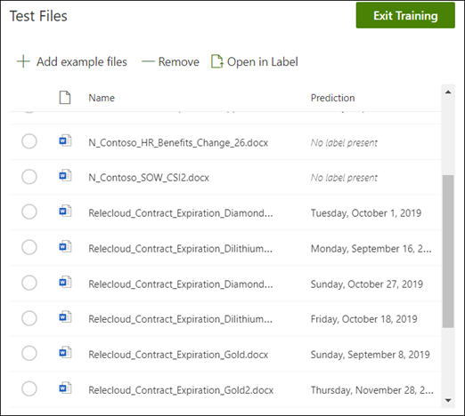

# Skapa en Extractor (för hands version)

Innehållet i den här artikeln gäller för projekt cortex privat för hands version. [Lär dig mer om Project cortex](https://aka.ms/projectcortex).

 

> [!VIDEO https://www.microsoft.com/videoplayer/embed/RE4CL2G]

  

Innan eller efter du skapar en klassificerings modell för att automatisera identifiering och klassificering av specifika dokument typer kan du välja att lägga till utdrag i din modell för att hämta specifik information från dessa dokument. Du kanske till exempel vill använda modellen för att identifiera alla *förnyelse* dokument som lagts till i dokument biblioteket, utan även för att visa *tjänstens start datum* för varje dokument som en kolumn i dokument biblioteket.

Du måste skapa en Extractor för varje enhet i dokumentet som du vill extrahera. I exemplet vill du extrahera *tjänstens start datum* för varje *kontrakt förnyelse* dokument som identifieras av modellen. Det här måste inträffa när du vill visa en vy i dokument biblioteket för alla *kontrakt förnyelse* dokument med en kolumn som visar värdet för tjänste start datum för varje dokument.

> [!NOTE]
> Innan du skapar en Extractor måste du [lägga till dina exempel filer](https://docs.microsoft.com/microsoft-365/contentunderstanding/create-a-classifier#add-your-example-files) för att träna modellen att identifiera informationen som du vill extrahera. Använd samma exempelfiler som du använde när du skapade klassificeraren.

## Ge din Extractor ett namn

1. Klicka på **träna Extractor**på panelen **skapa och träna extrakt** på modell start sidan.
2. På sidan **ny enhets Extractor** skriver du namnet på din Extractor i fältet **ny Extractor-namn** . Om du till exempel vill extrahera tjänstens start datum från varje avtal för förnyelse av kontrakt namnger du Start datumet för **tjänsten** .
3. Klicka på **Skapa**.

## Lägga till en etikett

Nästa steg är att förse den information som du vill ha med i exempel utbildnings filerna.

När du skapar Extractor öppnas sidan Extractor. Här visas en lista över dina exempelfiler med den första filen i listan som visas i visnings programmet.

1. Markera de data som du vill extrahera från filerna i visnings programmet. Om du till exempel vill extrahera *Start tjänst datum*markerar du datumet i den första filen (*måndag 14 oktober 2019*). och klicka sedan på **Spara**.  Du bör se värde visningen från filen i listan med namngivna exempel under kolumnen **etikett** .
2. Välj **nästa fil** om du vill spara automatiskt och öppna nästa fil i listan i visnings programmet. Eller Välj **Spara** och välj sedan en annan fil i listan med **Etiketter** .
3. Upprepa steg 1 och 2 i visnings programmet och upprepa sedan tills du sparade etiketten i alla fem filer.

     

### Lägga till ett negativt exempel

På samma sätt som du lägger till en negativ exempel fil när du skapar en klassificerare måste du lägga till ett negativt prov för Extractor. Det bör vara en fil som inte innehåller ett datum värde för "tjänst start".

1. Välj ett negativt exempel i listan med **Etiketter** .
2. I visnings programmet högst upp i artikeln väljer du **ingen etikett presentation**.
3. Klicka på **Spara**.
 
När du har märkt fem filer visas ett meddelande som informerar dig om att flytta till utbildning. Du kan välja fler dokument eller gå vidare till utbildning. 

## Lägga till en förklaring

Du kan till exempel skapa en förklaring om själva enhets formatet och variationer i exempel dokumenten. Ett datum värde kan till exempel vara i ett antal olika format, som:
- 10/14/2019
- 14 oktober 2019
- Måndagen den 14 oktober 2019
 

För att identifiera *tjänstens start datum* kan du skapa en mönster förklaring.

1. I avsnittet förklaring väljer du **nytt** och skriver ett namn (till exempel *datum*).
2. Välj **mönster lista**för typ.
3. För värde anger du datum variationen så som den visas i exempelfilerna. Om du till exempel har datum format som visas som 0/00/0000, anger du de variationer som visas i dokumenten, som:
    - 0/0/0000
    - 0/00/0000
    - 00/0/0000
    - 00/00/0000
4. Välj **Spara**.

### Använda förklarings biblioteket

När du skapar förklaringar för objekt, till exempel datum, är det enklare att använda förklarings biblioteket än att manuellt ange alla variationer. Förklarings biblioteket är en uppsättning fördefinierade fraser och mönster förklaringar. Biblioteket innehåller alla format för vanliga fras-och mönster listor, till exempel datum, telefonnummer, post nummer osv. 

För test av *tjänstens start datum* är det mer effektivt att använda den färdiga förklaringen för *datum* i förklarings biblioteket:

1. I **avsnittet förklaring**väljer du **nytt**och väljer sedan **från förklarings bibliotek**.
2. Välj **datum**i förklarings biblioteket. Du kan visa alla variationer av datum som känns igen.
3. Välj **Lägg till**. 

     

4. På sidan **skapa en förklaring** fylls fälten automatiskt i med *datum* informationen från förklarings biblioteket. Välj **Spara**. 

     

## Träna modellen 

När du sparar din förklaring är det bara att börja öva. Om din modell har tillräckligt med information för att extrahera data från dina namngivna exempelfiler visas varje fil med etiketten **matcha**.  

 

Om förklaringen inte innehåller tillräckligt med information för att hitta de data som du vill extrahera är varje fil märkt med **fel**. Du kan klicka på de **felmatchade** filerna för att se mer information om varför det fanns ett fel.

## Lägga till en förklaring

Ofta beror det på att den förklaring som vi tillhandahöll inte gav tillräckligt med information för att extrahera tjänstens start datum för att matcha våra etiketterade filer. Du kan behöva redigera den eller lägga till en annan förklaring.

Observera att text strängens *start datum* alltid föregår det faktiska värdet för provet. För att hjälpa till att identifiera tjänstens start datum måste du skapa en menings förklaring.

1. I avsnittet förklaring väljer du **nytt**och anger sedan ett namn (till exempel en *prefixlängd*).
2. Välj **fras lista**för typen.
3. Använd *tjänstens start datum* som värde.
4. Välj **Spara**.

     

## Träna modellen igen

Om du sparar förklaringen startas utbildningen igen, den här gången med hjälp av båda förklaringarna i exemplet. Om din modell har tillräckligt med information för att extrahera data från de namngivna exempelfilerna kan du se varje fil med etiketten **matcha**. 

Om du får ett fel meddelande om att dina etiketter **inte stämmer** överens måste du skapa en ny förklaring för att ge modellen mer information för att identifiera dokument typen eller överväga att ändra exempel modellen.

## Testa modellen

Om du får en träff på dina etiketterade exempelfiler kan du testa modellen på de återstående icke-märkta exempelfilerna.

1. Klicka på fliken **test** på modell start sidan.  Då körs modellen på dina namnlösa exempelfiler.
2. I listan **testfiler** visas dina exempel filer för att visa om modellen kan extrahera den information du behöver. Använd den här informationen för att fastställa hur din klassificerarens effektivitet är för att identifiera dina dokument.

     
