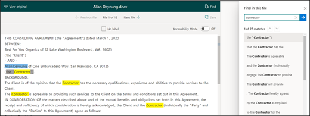

# Skapa en extraktor i Microsoft SharePoint-Syntex.

 

> [!VIDEO https://www.microsoft.com/videoplayer/embed/RE4CL2G]

  

Före eller efter det att du har skapat en klassificeringsmodell för att automatisera identifieringen och klassifikationen av specifika dokumenttyper kan du välja att lägga till extraktorer i din modell för att hämta specifik information från de här dokumenten. Du kanske, till exempel, vill att din modell inte bara ska identifiera alla *Kontraktförnyelse* dokument som lagts till i ditt dokumentbiblioteket, utan också för att visa *Tjänstens Startdatum* för varje dokument som ett kolumnvärde i dokumentbiblioteket.

Du behöver skapa en extraktor för varje enhet i det dokument som du vill extrahera. I vårt exempel vill vi extrahera **Tjänstens Startdatum** för varje **Kontraktförnyelse** dokument som identifieras av modellen. Vi vill kunna se en vy i dokumentbiblioteket för alla  **Kontraktförnyelse** dokument med en kolumn som visar **Tjänstens Start**-datum värde för varje dokument. 

> [!NOTE]
> För att skapa en extraktor använder du samma filer som du tidigare har laddat upp för att träna klassificeraren. 

## Namnge din extraktor

1. Från modellens startsida, i **Skapa och träna extraktorer** panel och klicka på **Träna extraktor**.
2. På skärmen **Ny enhet extraktor** skriv in namnet på din extraktor i fältet **Nytt extraktor-namn**. Om du, till exempel, namnge det **Tjänstens Startdatum** om du vill extrahera tjänstens startdatum från varje Kontraktförnyelse dokument. Du kan också välja att återanvända en tidigare skapad kolumn, (t. ex. en hanterad metadata kolumn).
> [!NOTE]
> Om du skapar en ny extraktor väljer du **Ny kolumntyp** och väljer **enskild textrad**, så är maxgränsen 255 tecken. Alla tecken som du skriver som överskrider gränsen blir trunkerade. 
3. Klicka på **Skapa** när du är klar.

## Lägga till en etikett

Nästa steget är att sätta en etikett på den enhet du vill extrahera i dina utbildnings exempelfiler.

När du skapar extraktor öppnas extraktorsidan. Här visas en lista över dina exempelfiler, och den första filen i listan visas i visningsprogrammet.

1. Välj de data från visningsprogrammet som du vill extrahera från filerna. Om du, till exempel, vill extrahera *Tjänstens Startdatum* markerar du datumet i den första filen (*måndag 14 oktober 2019*). och klicka på **Spara**.  Du bör se värdet som visas från filen i listan med Etiketterade exempel under kolumnen **Etikett**.
2. Välj **Nästa fil** för att spara automatiskt och öppna nästa fil i listan i visningsprogrammet. Eller välj **Spara** och sedan välj en annan fil från den **Etiketterade exempel** -listan.
3. Upprepa steg 1 och 2 i visningsprogrammet och upprepa sedan tills du har sparat etiketten i alla fem filerna.

     

 
När du har etiketterade fem filer visas en meddelandebanderoll som informerar dig om att flytta till utbildning. Du kan välja att etikettera fler dokument eller att gå vidare till utbildning. 

### Använda Sök för att söka i filen
Du kan använda funktionen <b>Sök</b> för att söka efter en enhet i dokumentet som du vill lägga till en etikett för.

    

Funktionen Sök är användbar om du söker i ett stort dokument eller om det finns flera instanser av entitet i dokumentet. Om du hittar flera instanser kan du välja den du behöver i sökresultatet för att gå till den platsen i visningsprogrammet för att märka den.

## Lägg till förklaring

I vårt exempel kommer vi att skapa en förklaring som ger en ledtråd om själva enhetsformatet och varianterna den kan ha i exempeldokumenten. Till exempel, ett datumvärde kan ha flera olika format, såsom:
- 10/14/2019
- 14 oktober 2019
- Måndag, den 14 oktober 2019
 

För att identifiera *Tjänstens Startdatum* kan du skapa en förklaring av mönstret.

1. I avsnittet Förklaringar välj **Ny** och skriv ett namn (t. ex. *Datum*).
2. För Typ välj **Mönsterlista**.
3. För Värde anger du datumvariationen så som de visas i exempelfilerna. Om du, till exempel, har datumformat som visas som 0/00/0000, kan du ange en variation som visas i dina dokument, till exempel:
    - 0/0/0000
    - 0/00/0000
    - 00/0/0000
    - 00/00/0000
4. Välj **Spara**.

> [!NOTE]
> Mer information om olika förklaringstyper finns i [Förklaringstyper](https://docs.microsoft.com/microsoft-365/contentunderstanding/explanation-types-overview).  

### Använda Förklaringsbiblioteket

För att skapa förklaringar för objekt, t. ex. datum, är det enklare att [använda förklaringsbiblioteket](https://docs.microsoft.com/microsoft-365/contentunderstanding/explanation-types-overview#use-the-explanation-library) än att ange alla variationer manuellt. Förklaringsbiblioteket är en uppsättning fördefinierade fraser och mönsterförklaringar. Biblioteket försöker tillhandahålla alla format för vanliga fras- eller mönster listor, till exempel datum, telefonnummer, postnummer och många andra. 

För *Tjänstens Startdatum* exempel är det mer effektivt att använda den fördefinierade förklaringen för *Datum* i förklaringsbiblioteket:

1. I **Förklaringssektionen** välj **Ny** och välj sedan **From förklaringsbibliotek**.
2. Välj **Datum** från förklaringsbiblioteket. Du kan visa alla datum variationer som är igenkända.
3. Välj **Lägg till**. 

     

4. På sidan **Skapa en förklaring** kommer *Datum* informationen från förklaringensbiblioteket automatiskt fylla i fälten. Välj **Spara**. 

     

## Träna modellen 

Om du sparar förklaringen startar du utbildningen. Om din modell har tillräcklig information för att extrahera data från dina etiketterade exempelfiler, kommer du att se varje fil etiketterade med **Match**.  

 

Om förklaringen inte har tillräcklig information för att hitta de data du vill extrahera kommer alla filer etiketteras med **Matchningsfel**. För att se mer information om varför det fanns ett matchningsfel kan du klicka på de **Matchningsfel** filerna.

## Lägga till en till förklaring

Matchningsfelet är ofta en indikation på att förklaringen vi tillhandahöll inte innehöll tillräcklig information för att extrahera tjänstens startdatum för att matcha vår etiketterade filer. Du kan behöva redigera den eller lägga till ytterligare en förklaring.

I vårt exempel kan du se att textsträngen *Starta Tjänstedatumet för* föregår alltid det verkliga värdet. För att identifiera Tjänstens Startdatum behöver du skapa en förklaring av frasen.

1. I Förklaringssektionen välj **Ny** och sedan skriv ett namn (t. ex. *Prefixsträng*).
2. För Typ välj **Fraslista**.
3. Använd *Tjänstens Startdatum* som värde.
4. Välj **Spara**.

     

## Träna modellen igen

Om du sparar förklaringen startar utbildningen igen, den här gången med hjälp av båda förklaringarna i exemplet. Om din modell har tillräcklig information för att extrahera data från dina etiketterade exempelfiler, kommer du att se varje fil etiketterade med **Match**. 

Om du får en **Matchningsfel** igen på dina etiketterade filer behöver du antagligen skapa ytterligare en förklaring för att ge modellen mer information för att identifiera dokumenttypen, eller så kan du göra ändringar i dina befintliga.

## Testa din modell

Om du får en matchning för dina etiketterade exempelfiler kan du nu testa din modell på de återstående omärkta exempelfilerna. Det här är valfri, men ett användbar steg för att utvärdera "lämpligheten", eller beredskapen av modellen innan användning genom att testa den på filer som modellen inte har sett tidigare.

1. Gå till start sidan för modellen och klicka på fliken **Test**.  Då körs modellen på dina omärkta exempelfiler.
2. I **Testfil**-listan visas dina exempelfiler för att visa om modellen kan extrahera informationen som du behöver. Använd den här informationen för att ta reda på hur effektivt din klassificerare är för att identifiera dina dokument.

     

## Se även
[Skapa en klassificerare](create-a-classifier.md)

[Förklaringstyper](explanation-types-overview.md)

[Använd termlagringstaxonomi vid skapande av extraktor](leverage-term-store-taxonomy.md)

[Översikt av dokumenttolkning](document-understanding-overview.md)

[Använda en modell](apply-a-model.md) 

[Tillgänglighetsläge för SharePoint Syntex](accessibility-mode.md)
