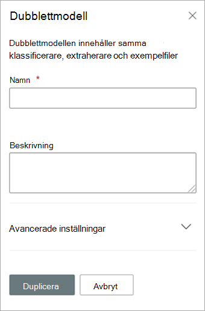

# Duplicera en modell i Microsoft SharePoint SyntexDuplicate a model in Microsoft SharePoint Syntex

Att skapa en dokumenttolkningsmodell kan spara tid och arbete om du behöver skapa en ny modell och vet att en befintlig modell liknar den du behöver.Duplicating a document understanding model can save you time and effort if you need to create a new model, and know that an existing model is very similar to what you need.

Till exempel klassificerar en befintligt modell med namnet ”Kontrakt” samma filer som du behöver arbeta med.For example, an existing model named “Contracts” classifies the same files you need to work with. Den nya modellen extraherar en del av befintliga data men måste uppdateras för att extrahera ytterligare data.Your new model will extract some of the existing data, but will need to be updated to extract some additional data. I stället för att skapa och träna en ny modell från grunden kan du använda funktionen för att duplicera modeller för att göra en kopia av Kontrakt-modellen, vilket också kommer kopiera alla associerade träningsobjekt, som exempelfiler och entitetsextraktorer.Instead of creating and training a new model from scratch, you can use the duplicate model feature to make a copy of the Contracts model, which will also copy all associated training items, such as example files and entity extractors.

När du duplicerar modellen kan du efter att du bytt namn på den (till exempel till ”Kontraktförnyelser”) göra uppdateringar på den.When you duplicate the model, after you rename it (for example, to “Contract Renewals”), you can then make updates to it. Du kan till exempel välja att ta bort vissa av de befintliga extraherade fälten som du inte behöver och sedan träna modellen att extrahera ett nytt (till exempel ”Förnyelsedatum”).For example, you can choose to remove some of the existing extracted fields that you don’t need, and then train the model to extract a new one (for example, “Renewal date”).

## Duplicera en modellDuplicate a model

Följ dessa steg för att duplicera en dokumenttolkningsmodell.Follow these steps to duplicate a document understanding model.

1. I innehållscentret väljer du **Modeller** för att visa listan med modeller.From the content center, select **Models** to see your models list.

2. På sidan **Modeller** väljer du den modell du vill duplicera.On the **Models** page, select the model you want to duplicate.

3. Genom att använda menyfliksområdet eller knappen **Visa åtgärder** (bredvid modellnamnet) väljer du **Duplicera**.By using either the ribbon or the **Show actions** button (next to the model name), select **Duplicate**. 

      

4. På panelen **Duplicera modell**:On the **Duplicate model** panel:

   a.a. Under **Namn** anger du det nya namnet på modellen som du vill duplicera.Under **Name**, enter the new name of the model that you want to duplicate. 

      

   b.b. Under **Beskrivning** lägger du till en beskrivning för den nya modellen.Under **Description**, add a description of your new model.

   c.c. (Valfritt) Under **Avancerade inställningar** väljer du om du vill associera en befintlig [innehållstyp](/sharepoint/governance/content-type-and-workflow-planning#content-type-overview).(Optional) Under **Advanced settings**, select whether you want to associate an existing [content type](/sharepoint/governance/content-type-and-workflow-planning#content-type-overview).

5. Välj **Duplicera**.Select **Duplicate**.

## Se ävenSee Also
[Skapa en klassificerareCreate a classifier](create-a-classifier.md)

[Byt namn på en modellRename a model](rename-a-model.md)

[Skapa en extraktorCreate an extractor](create-an-extractor.md)

[Översikt av dokumenttolkningDocument Understanding overview](document-understanding-overview.md)

[FörklaringstyperExplanation types](explanation-types-overview.md)

[Använda en modellApply a model](apply-a-model.md) 

[Tillgänglighetsläge för SharePoint SyntexSharePoint Syntex Accessibility Mode](accessibility-mode.md)