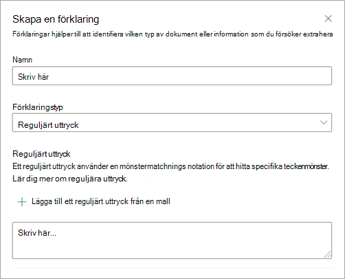
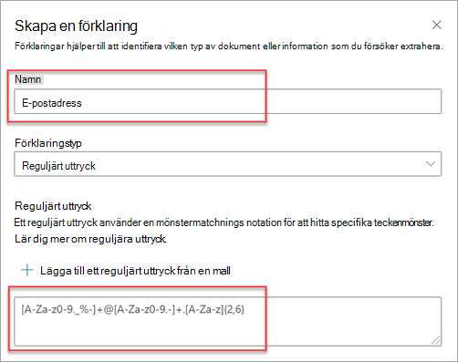

# Olika typer av förklaringar i Microsoft SharePoint SyntexExplanation types in Microsoft SharePoint Syntex

Förklaringar används för att definiera den information som du vill använda för att ge etiketter och utdrag i dina modeller för dokumenttolkning i Microsoft SharePoint Syntex.Explanations are used to help to define the information you want to label and extract in your document understanding models in Microsoft SharePoint Syntex. När du skapar en förklaring måste du välja en förklaringstyp.When you create an explanation, you need to select an explanation type. Den här artikeln hjälper dig förstå olika förklaringstyper och hur de används.This article helps you understand the different explanation types and how they're used.

 
   
Följande förklaringstyper är tillgängliga:These explanation types are available:

- [**Fraslista**](#phrase-list): lista med ord, fraser, siffror eller andra tecken som du kan använda i det dokument eller den information du extraherar. [**Phrase list**](#phrase-list): List of words, phrases, numbers, or other characters you can use in the document or information that you're extracting. Exempel: textsträngen *hänvisande läkare* finns i alla medicinska referensdokument som du identifierar.For example, the text string *referring doctor* is in all Medical Referral documents you're identifying. Eller den hänvisande läkarens *telefonnummer* i alla medicinsk referensdokument som du identifierar.Or the *phone number* of the referring doctor from all Medical Referral documents that you're identifying.

- [**Ett reguljärt uttryck**](#regular-expression): använder en notation för mönstermatchning för att hitta specifika teckenmönster.[**Regular expression**](#regular-expression): Uses a pattern-matching notation to find specific character patterns. Du kan till exempel använda ett reguljärt uttryck för att hitta alla förekomster av ett *postadresmönstret* i en uppsättning dokument.For example, you can use a regular expression to find all instances of an *email address* pattern in a set of documents.

- [**Närhet**](#proximity): beskriver hur nära förklaringar är med varandra.[**Proximity**](#proximity): Describes how close explanations are to each other. Till exempel: en fraslista för *gatunummer* ska ligga precis innan fraslistan för *gatunamn* utan tokens emellan (du får lära dig mer om tokens senare i den här artikeln).For example, a *street number* phrase list goes right before the *street name* phrase list, with no tokens in between (you'll learn about tokens later in this article). Med närhetstypen måste du ha minst två förklaringar i modellen, annars är alternativet inaktiverat.Using the proximity type requires you to have at least two explanations in your model or the option will be disabled. 

## FraslistaPhrase list

Förklaringstypen fraslista används vanligtvis för att identifiera och klassificera ett dokument via modellen.A phrase list explanation type is typically used to identify and classify a document through your model. Så som det beskrivs i exemplet med etikett för *hänvisande läkare* är det en sträng med ord, fraser, siffror eller tecken är konsekventa i de dokument som du identifierar.As described in the *referring doctor* label example, it's a string of words, phrases, numbers, or characters that is consistently in the documents that you're identifying.

Även om det inte är obligatoriskt kan du få mer framgång med din förklaring om frasen du hämtar finns på en konsekvent plats i ditt dokument.While not a requirement, you can achieve better success with your explanation if the phrase you're capturing is located in a consistent location in your document. Till exempel kan etiketten *hänvisande läkare* konsekvent finnas i det första stycket i dokumentet.For example, the *referring doctor* label might be consistently located in the first paragraph of the document. Du kan också använda avancerad inställning för **[Konfigurera var fraser ska visas i dokumentet](https://docs.microsoft.com/microsoft-365/contentunderstanding/explanation-types-overview#configure-where-phrases-occur-in-the-document)** för att markera specifika områden där frasen finns, särskilt om det finns en möjlighet att frasen förekommer på flera platser i ditt dokument.You can also use the **[Configure where phrases occur in the document](https://docs.microsoft.com/microsoft-365/contentunderstanding/explanation-types-overview#configure-where-phrases-occur-in-the-document)** advanced setting to select specific areas where the phrase is located, especially if there's a chance that the phrase might occur in multiple locations in your document.

Om skifteslägeskänslighet är obligatorisk för att identifiera din etikett tillåter användning av fraslista dig att ange det i förklaringen genom att markera kryssrutan **Endast exakta versaler**.If case sensitivity is a requirement in identifying your label, using the phrase list type allows you to specify it in your explanation by selecting the **Only exact capitalization** checkbox.

 

En frastyp är särskilt användbar när du skapar en förklaring som identifierar och extraherar information i olika format, till exempel datum, telefonnummer och kreditkortsnummer.A phrase type is especially useful when you create an explanation that identifies and extracts information in different formats, such as dates, phone numbers, and credit card numbers. Till exempel kan ett datum visas i flera olika format (1/1/2020, 1-1-2020, 01/01/20, 01/01/2020, eller Jan 1, 2020).For example, a date can be displayed in many different formats (1/1/2020, 1-1-2020, 01/01/20, 01/01/2020, or Jan 1,2020). Genom att definiera en fraslista blir förklaringen mer effektiv genom att fånga alla möjliga variationer i de data som du försöker identifiera och extrahera.Defining a phrase list makes your explanation more efficient by capturing any possible variations in the data that you're trying to identify and extract. 

För exemplet *telefonnummer* extraherar du telefonnumret till varje hänvisande läkare från alla medicinska referensdokument som modellen identifierar.For the *phone number* example, you extract the phone number for each referring doctor from all Medical Referral documents that the model identifies. När du skapar förklaringen skriver du de olika formaten som ett telefonnummer kan visa i ditt dokument så att du kan fånga upp möjliga variationer.When you create the explanation, type the different formats a phone number might display in your document so that you're able to capture possible variations. 

I det här exemplet i **Avancerad Inställningar** väljer du **Valfri siffra mellan 0-9** i kryssrutan för att känna igen alla "0"-värden som används i din fraslista som valfri siffra mellan 0 och 9.For this example, in **Advanced Settings** select the **Any digit from 0-9** checkbox to recognize each "0" value used in your phrase list to be any digit from 0 through 9.

Om du på liknande sätt skapar en fraslista som innehåller texttecken markerar du kryssrutan **Valfri bokstav mellan a-ö** för att känna igen alla "a"-tecken som används i fraslistan att vara valfri tecken mellan "a" till "ö".Similarly, if you create a phrase list that includes text characters, select the **Any letter from a-z** checkbox to recognize each "a" character used in the phrase list to be any character from "a" to "z".

Om du, till exempel, skapar en fraslista för **Datum** och vill se till att ett datumformat som *1 januari 2020* känns igen, måste du:For example, if you create a **Date** phrase list and you want to make sure that a date format such as *Jan 1, 2020* is recognized, you need to:

- Lägga till *0 aaaaaaa 0000* och *00 aaaaaaa 0000* i din fraslista.Add *aaa 0, 0000* and *aaa 00, 0000* to your phrase list.
- Kontrollera att **Valfri bokstav från a-ö** också är markerad.Make sure that **Any letter from a-z** is also selected.

Om du har kapitaliseringskrav i din fraslista kan du välja kryssrutan **Endast exakta kapitalisering**.If you have capitalization requirements in your phrase list, you can select the **Only exact capitalization** checkbox. Om du kräver att den första bokstaven i månaden för datumexemplet ska kapitaliseras behöver du:For the date example, if you require the first letter of the month to be capitalized, you need to:

- Lägga till *Aaa 0, 0000* och *Aaa 00 0000* till din fraslista.Add *Aaa 0, 0000* and *Aaa 00, 0000* to your phrase list.
- Kontrollera att **Endast exakta versaler** också är markerad.Make sure that **Only exact capitalization** is also selected.

> [!NOTE]
> I stället för att manuellt skapa en förklaring för en fraslista kan du använda [förklaringsbiblioteket](https://docs.microsoft.com/microsoft-365/contentunderstanding/explanation-types-overview#use-explanation-templates) för att använda mallar för en vanlig fraslista, till exempel *datum*, *telefonnummer* eller *kreditkortsnummer*.Instead of manually creating a phrase list explanation, use the [explanation library](https://docs.microsoft.com/microsoft-365/contentunderstanding/explanation-types-overview#use-explanation-templates) to use phrase list templates for a common phrase list, such as *date*, *phone number*, or *credit card number*.

## Reguljärt uttryckRegular expression

Med en förklaringstyp för reguljära uttryck kan du skapa mönster som hjälper dig att hitta och identifiera vissa textsträngar i dokumenten.A regular expression explanation type allows you to create patterns that help find and identify certain text strings in documents. Du kan använda reguljära uttryck för att snabbt tolka stora mängder text för att:You can use regular expressions to quickly parse large amounts of text to:

- Söka efter specifika teckenmönster.Find specific character patterns.
- Verifiera text för att säkerställa att den matchar ett fördefinierat mönster (till exempel en e-postadress).Validate text to ensure that it matches a predefined pattern (such as an email address).
- Extrahera, redigera, ersätta eller ta bort textundersträngar.Extract, edit, replace, or delete text substrings.

En typ av reguljära uttryck är särskilt användbar när du skapar en förklaring som identifierar och extraherar information i liknande format, till exempel e-postadresser, bankkontonummer eller url-adresser.A regular expression type is especially useful when you create an explanation that identifies and extracts information in similar formats, such as email addresses, bank account numbers, or URLs. En e-postadress, till exempel megan@contoso.com, visas i ett visst mönster ("megan" är den första delen, och "com" är den sista delen).For example, an email address, such as megan@contoso.com, is displayed in a certain pattern ("megan" is the first part, and "com" is the last part). 

Det vanliga uttrycket för en e-postadress är: **[A-Basist-z0-9._%-]+@[A-An-z0-9.-]+. [A-<3>-z]{2,6}**.The regular expression for an email address is: **[A-Za-z0-9._%-]+@[A-Za-z0-9.-]+.[A-Za-z]{2,6}**.

Det här uttrycket består av fem delar, i denna ordning:This expression consists of five parts, in this order:

1. några av följande tecken:Any amount of the following characters:

   a.a. Bokstäver från a till zLetters from a to z

   b.b. Siffror från 0 till 9Numbers from 0-9

   c.c. Punkt, understreck, procent eller tankstreckPeriod, underscore, percent, or dash

2. @-symbolThe @ symbol

3. Några tecken från den första delen av e-postadressenAny amount of the same characters as the first part of the email address

4. En punktA period

5. Två till sex bokstäverTwo to six letters

Så här lägger du till en förklaringstyp för reguljära uttryck:To add a regular expression explanation type:

1. På panelen **Skapa en förklaring** går du till panelen **Förklaringstyp** och väljer **Reguljärt uttryck**.From the **Create an explanation** panel, under **Explanation type**, select **Regular expression**.

   

2. Du kan antingen skriva ett uttryck i textrutan **Reguljära uttryck** eller välja **Lägg till ett reguljärt uttryck från en mall**.You can either type an expression in the **Regular expression** text box or select **Add a regular expression from a template**.

   När du lägger till ett reguljärt uttryck med hjälp av en mall läggs namnet och det reguljära uttrycket automatiskt till i textrutan.When you add a regular expression by using a template, it automatically adds the name and the regular expression to the text box. Om du till exempel väljer mallen **e-postadress** populeras **panelen Lägg till en förklaring**.For example, if you choose the **Email address** template, the **Create an explanation** panel will be populated.

   

## NärhetProximity 

Typen närhetsförklaring hjälper modellen att lättare identifiera data genom att definiera hur nära ett annat data kommer till den.The proximity explanation type helps your model identify data by defining how close another piece of data is to it. I din modell har du till exempel två förklaringar som etiketterar både kundens *gatunummer* och *telefonnummer*.For example, in your model say you have defined two explanations that label both the customer *street address number* and *phone number*. 

Notera att kundens telefonnummer alltid visas före gatunumret.Notice that customer phone numbers always appear before the street address number. 

Alex WilburnAlex Wilburn 
555-555-5555555-555-5555 
One Microsoft WayOne Microsoft Way 
Redmond, WA 98034Redmond, WA 98034 

Använd närhetsförklaringen för att definiera hur långt bort det är för att bättre identifiera gatunumret i dina dokument.Use the proximity explanation to define how far away the phone number explanation is to better identify the street address number in your documents.

#### Vad är tokens?What are tokens?

Om du vill använda typen för närhetsförklaring måste du förstå vad en token är.To use the proximity explanation type, you need to understand what a token is. Antalet tokens är hur närhetsförklaringen mäter avståndet från en förklaring till en annan.The number of tokens is how the proximity explanation measures distance from one explanation to another. En token är ett sammanhängande intervall (exklusive blanksteg eller skiljetecken) för bokstäver och siffror.A token is a continuous span (not including spaces or punctuation) of letters and numbers. 

I tabellen nedan visas exempel på hur du kan ta reda på antalet tokens i en fras.The following table shows examples for how to determine the number of tokens in a phrase.

|FrasPhrase|Antal tokensNumber of tokens|FörklaringExplanation|
|--|--|--|
|`Dog`|11|Ett enstaka ord utan skiljetecken eller blanksteg.A single word with no punctuation or spaces.|
|`RMT33W`|11|Ett lokaliseringsnummer för posten.A record locator number. Det kan innehålla siffror och bokstäver men inga skiljetecken.It might include numbers and letters, but doesn't have punctuation.|
|`425-555-5555`|55|Ett telefonnummer.A phone number. Varje skiljetecken är ett enda token, så `425-555-5555` är 5 tokens:Each punctuation mark is a single token, so `425-555-5555` is 5 tokens: `425` `-` `555` `-` `5555` |
|`https://luis.ai`|77|`https` `:` `/` `/` `luis` `.` `ai` |

#### Konfigurera typen närhetsförklaringConfigure the proximity explanation type

Konfigurera inställningen närhet för detta exempel att definiera intervallet för antalet tokens i förklaringen för *telefonnummer* från förklaringen *gatunummer*.For the example, configure the proximity setting to define the range of the number of tokens in the *phone number* explanation from the *street address number* explanation. Notera att det minsta intervallet är "0" eftersom det inte finns några tokens mellan telefonnumret och gatunumret.Notice that the minimum range is "0", because there are no tokens between the phone number and street address number.

Men vissa telefonnummer i urvalsdokumenten har tillägget *(mobil)*.But some phone numbers in the sample documents are appended with *(mobile)*.

Viktor MagnussonNestor Wilke 
111-111-1111 (mobil)111-111-1111 (mobile) 
One Microsoft WayOne Microsoft Way 
Redmond, WA 98034Redmond, WA 98034 

Det finns tre tokens i *(mobil)*:There are three tokens in *(mobile)*:

|FrasPhrase|Antal tokensToken count|
|--|--|
|((|11|
|mobilmobile|22|
|))|33|

Konfigurera inställningen för närhet så att den har ett område med 0 till 3.Configure the proximity setting to have a range of 0 through 3.

## Konfigurera var fraser förekommer i dokumentetConfigure where phrases occur in the document

När du skapar en förklaring söks som standard hela dokumentet efter frasen du försöker extrahera.When you create an explanation, by default the entire document is searched for the phrase you're trying to extract. Du kan dock använda inställningen **Där fraserna förekommer** avancerade inställning för att hjälpa till att isolera en specifik plats i dokumentet som en fras förekommer på.However, you can use the **Where these phrases occur** advanced setting to help in isolating a specific location in the document that a phrase occurs. Den här inställningen är användbart i situationer där liknande förekomster av en fras kan förekomma någon annanstans i dokumentet, och du vill kontrollera att rätt förekomst är markerad.This setting is useful in situations where similar instances of a phrase might appear somewhere else in the document, and you want to make sure that the correct one is selected.

Med hänvisning till vårt exempel på medicinsk remiss nämns alltid den *hänvisande läkaren* i första stycket i dokumentet.Referring to our Medical Referral document example, the *referring doctor* is always mentioned in the first paragraph of the document. Med inställningen **Var dessa fraser förekommer** kan du i det här exemplet konfigurera förklaringen så att den bara söker efter den här etiketten i början av dokumentet eller någon annan plats där den kan förekomma.With the **Where these phrases occur** setting, in this example you can configure your explanation to search for this label only in the beginning section of the document, or any other location in which it might occur.

Du kan välja följande alternativ för den här inställningen:You can choose the following options for this setting:

- Var som helst i filen: Hela dokumentet söks efter frasen.Anywhere in the file: The entire document is searched for the phrase.

- Början av filen: Dokumentet genomsöks från början till frasen plats.Beginning of the file:  The document is searched from the beginning to the phrase location.

   

    I visningsprogrammet kan du manuellt justera urvalsrutan så att den inkluderar platsen där fasen inträffar.In the viewer, you can manually adjust the select box to include the location where the phase occurs. Den **slutpositionens** värde uppdateras för att visa antalet tokens som ditt valda område innehåller.The **End position** value will update to show the number of tokens your selected area includes. Du kan uppdatera **slutpositionsvärdet** för att justera det valda området.You can update the **End position** value as well to adjust the selected area.

   

- Slutet av filen: dokumentet genomsöks från slutet till frasens plats.End of the file: The document is searched from the end to the phrase location.

   

    I visningsprogrammet kan du manuellt justera urvalsrutan så att den inkluderar platsen där fasen inträffar.In the viewer, you can manually adjust the select box to include the location where the phase occurs. Värdet **startposition** uppdateras för att visa antalet tokens som ditt valda område innehåller.The **Starting position** value will update to show the number of tokens your selected area includes. Observera att du också kan uppdatera startpositionens värde för att justera det markerade området.You can update the Starting position value as well to adjust the selected area.

   

- Anpassat intervall: Dokumentet genomsöks inom ett angivet intervall för frasplatsen.Custom range: The document is searched within a specified range for the phrase location.

   

    I visningsprogrammet kan du manuellt justera urvalsrutan så att den inkluderar platsen där fasen inträffar.In the viewer, you can manually adjust the select box to include the location where the phase occurs. För den här inställningen måste du välja en **start**- och en **slut** position.For this setting, you need to select a **Start** and an **End** position. De här värdena representerar antalet tokens från början av dokumentet.These values represent the number of tokens from the beginning of the document. Även om du kan ange dessa värden manuellt är det enklare att justera urvalsrutan i visningsprogrammet manuellt.While you can manually enter in these values, it's easier to manually adjust the select box in the viewer. 
   
## Använda förklaringsmallarUse explanation templates

Medan du manuellt kan lägga till olika fraslistvärden för din förklaring kan det vara lättare att använda mallarna som du har fått i förklaringsbiblioteket.While you can manually add various phrase list values for your explanation, it can be easier to use the templates provided to you in the explanation library.

Till exempel, istället för att manuellt lägga till alla variationer för *datum*, kan du använda fraslistmallen för *datum* eftersom den redan innehåller många värden för fraslistor:For example, instead of manually adding all the variations for *date*, you can use the phrase list template for *date* because it already includes many phrase lists values:

 
I förklaringsbiblioteket finns flera vanliga förklaringar för *fraslistor*, till exempel:The explanation library includes commonly used *phrase list* explanations, including:

- Datum: kalenderdatum, alla format.Date: Calendar dates, all formats. Innehåller text och tal (till exempel &quot;9 dec 2020").Includes text and numbers (for example, "Dec 9, 2020").
- Datum (numeriskt): kalenderdatum, alla format.Date (numeric): Calendar dates, all formats. Inkluderar tal (till exempel 1-11-2020).Includes numbers (for example, 1-11-2020).
- Tid: 12- och 24-timmarsformat.Time: 12 and 24 hour formats.
- Tal: positiva och negativa tal upp till två decimaler.Number: Positive and negative numbers up to two decimals. 
- Procent: en lista över mönster som representerar en procentsats.Percentage: A list of patterns representing a percentage. Till exempel, 1 %, 11 %, 100 %, eller 11,11 %.For example, 1%, 11%, 100%, or 11.11%.
- Telefonnummer: Vanliga amerikanska och internationella format.Phone number: Common US and International formats. Till exempel, 000 000 0000, 000-000-0000, (000)000-0000, eller (000) 000-0000.For example, 000 000 0000, 000-000-0000, (000)000-0000, or (000) 000-0000.
- Postnummer: amerikanska postnummerformat.Zip code: US Zip code formats. Till exempel: 11111, 11111-1111.For example, 11111, 11111-1111.
- Första ordet i meningen: vanliga mönster för ord upp till nio tecken.First word of sentence: Common patterns for words up to nine characters. 
- Slutet av mening: vanligt skiljetecken för slutet av en mening.End of sentence: Common punctuation for end of a sentence.
- Kreditkort: vanliga talformat för kreditkort.Credit card: Common credit card number formats. Till exempel: 1111-1111-1111-1111.For example, 1111-1111-1111-1111. 
- Personnummer: US personnummer-format, till exempel, 111-11-1111.Social security number: US Social Security Number format. For example, 111-11-1111. 
- Kryssruta: en fraslista som representerar variationer på en ifylld kryssruta.Checkbox: A phrase list representing variations on a filled in checkbox. Till exempel, _X_, _ _X_.For example, _X_, _ _X_.
- Valuta: vanligaste internationella symboler.Currency: Major international symbols. Exempel: $.For example, $. 
- Kopia i e-post: en fraslista med termen "CC:" som ofta finns nära namnen eller e-postadresserna till andra personer eller grupper som meddelandet skickades till.Email CC: A phrase list with the term 'CC:', often found near the names or email addresses of other people or groups the message was sent to.
- E-postdatum: en fraslista med termen "Skickat den:" förekommer ofta nära det datum då meddelandet skickades.Email date: A phrase list with the term 'Sent on:', often found near the date the email was sent.
- E-posthälsning: vanliga inledande rader för e-postmeddelanden.Email greeting: Common opening lines for emails.
- E-postmottagare: en fraslista med termen "Till:" som ofta finns nära namnen eller e-postadresserna till personer eller grupper som meddelandet skickades till.Email recipient: A phrase list with the term 'To:', often found near the names or email addresses of people or groups the message was sent to. 
- E-postavsändare: en fraslista med termen "Från:" förekommer ofta nära avsändarens namn eller e-postadress.Email sender: A phrase list with the term 'From:', often found near the sender's name or email address. 
- Ämne för e-post: en fraslista med termen "Ämne:" som ofta finns nära e-postmeddelandets ämne.Email subject: A phrase list with the term 'Subject:', often found near the email's subject.

I förklaringsbiblioteket finns också flera vanliga förklaringar för *reguljära* uttryck, till exempel:The explanation library also includes commonly used *regular expression* explanations, including:

- 6 till 17 siffror: Matchar ett tal mellan 6 och 17 siffror.6 to 17 digit numbers: Matches any number from 6 to 17 digits long. Bankkontonummer medborgare i USA passar det här mönstret.US bank account numbers fit this pattern.
- E-postadress: matchar en gemensam typ av e-postadress som meganb@contoso.com.Email address: Matches a common type of email address like meganb@contoso.com.
- ID-nummer för skatteskyldig medborgare i USA: matchar ett 9-siffrigt nummer som börjar med 6 följt av ett 7-siffigt nummer som börjar med 8 eller 8US taxpayer ID number: Matches a three-digit number starting with 9 followed by a 6 digit number starting with 7 or 8. 
- Webbadress (URL): Matchar formatet på en webbadress, som börjar med http:// eller https://.Web address (URL): Matches the format of a web address, starting with http:// or https://.

Dessutom finns i förklaringsbiblioteket tre automatiska malltyper som fungerar med de data som du har märkt i exempelfilerna:In addition, the explanation library includes three automatic template types that work with the data you've labeled in your example files:

- Efter etikett: De ord eller tecken som förekommer efter etiketterna i exempelfilerna.After label: The words or characters that occur after the labels in the example files.
- Före etikett: De ord eller tecken som förekommer före etiketterna i exempelfilerna.Before label: The words or characters that occur before the labels in the example files.
- Etiketter: Upp till de första 10 etiketterna från exempelfilerna.Labels: Up to the first 10 labels from the example files.

Om du vill ge dig ett exempel på hur automatiska mallar fungerar, i följande exempelfil, kommer vi att använda förklaringsmallen Före etikett för att ge modellen mer information för att få en mer exakt matchning.To give you an example of how automatic templates work, in the following example file, we'll use the Before label explanation template to help give the model more information to get a more accurate match.

När du väljer mallen förklaringsmallen Före etikett letar den efter den första uppsättningen ord som visas före etiketten i dina exempelfiler.When you select the Before label explanation template, it will look for the first set of words that appear before the label in your example files. I exemplet är orden som identifierats i den första exempelfilen "Från och med".In the example, the words that are identified in the first example file is "As of".

Du kan välja **Lägg** om du vill skapa en förklaring från mallen.You can select **Add** to create an explanation from the template.  När du lägger till fler exempelfiler identifieras och läggs ytterligare ord till i fraslistan.As you add more example files, additional words will be identified and added to the phrase list.

 
#### Använda en mall från förklaringsbiblioteketTo use a template from the explanation library

1. Välj **Ny** i avsnittet **Förklaringar** på modellens sida **Träna** och välj **Från en mall**.From the **Explanations** section of your model's **Train** page, select **New**, then select **From a template**.

   

2.  På sidan **Förklaringsmallar** väljer du den förklaring du vill använda och väljer sedan **Lägga till**.On the **Explanation templates** page, select the explanation you want to use, then select **Add**.

    

3. Informationen för den mall som du valde visas på sidan **Skapa en förklaring**.The information for the template you selected displays on the **Create an explanation** page. Om det behövs kan du redigera namnet på förklaringen och lägga till eller ta bort objekt från fraslistan.If needed, edit the explanation name and add or remove items from the phrase list.  

    

4. Klicka på **Spara** när du är klar.When finished, select **Save**.