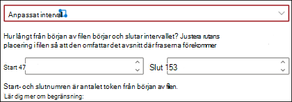

# Introduktion till förklaringstyper

Förklaringar används för att definiera den information som du vill använda för att ge etiketter och utdrag i dina modeller för dokumenttolkning i Microsoft SharePoint Syntex. När du skapar en förklaring måste du välja en förklaringstyp. Den här artikeln hjälper dig förstå olika förklaringstyper och hur de används. 

    
   
Följande förklaringstyper är tillgängliga:

- **Fraslista**: lista med ord, fraser, siffror eller andra tecken som du kan använda i det dokument eller den information du extraherar. Exempel: textsträngen **Hänvisande läkare** finns i alla medicinska referensdokument som du identifierar. 

- **Mönsterlista**: listar mönster med siffror, bokstäver eller andra tecken som du kan använda för att identifiera den information som du extraherar. Till exempel kan du extrahera den hänvisande läkarens **Telefonnumret** i alla medicinsk referensdokument som du identifierar. 

- **Närhet**: beskriver hur nära förklaringar är för varandra. Exempel: en mönsterlista för *gatunummer* ska ligga precis efter fraslistan för *gatunamn* utan tokens i mellan (du får lära dig mer om tokens senare i den här artikeln). Med närhetstypen måste du ha minst två förklaringar i modellen, annars är alternativet inaktiverat. 
 
## Fraslista

Förklaringstypen fraslista används vanligtvis för att identifiera och klassificera ett dokument via modellen. Så som det beskrivs i exemplet med etikett för *Hänvisande läkare* är det en sträng med ord, fraser, siffror eller tecken är konsekventa i de dokument som du identifierar.

Även om det inte är obligatoriskt kan du få mer framgång med din förklaring om frasen du hämtar finns på en konsekvent plats i ditt dokument. Till exempel kan etiketten *Hänvisande läkare* konsekvent finnas i det första stycket i dokumentet.

Om skifteslägeskänslighet är obligatorisk för att identifiera din etikett tillåter användning av fraslista dig att ange det i förklaringen genom att markera kryssrutan **Endast exakta versaler**.

    

## Mönsterlistor

Typen mönsterlista är särskilt användbar när du skapar en förklaring som identifierar och hämtar information från ett dokument. Den visas vanligtvis i olika format, till exempel datum, telefonnummer och kreditkortsnummer. Ett datum kan till exempel visas i flera olika format (1/1 2020, 2020-01-01, 1 januari 2020 osv.). Genom att definiera en mönsterlista blir förklaringen mer effektiv genom att fånga alla möjliga variationer i de data som du försöker identifiera och extrahera. 

För exemplet **Telefonnummer** extraheras telefonnumret till varje hänvisande läkare från alla medicinska referensdokument som modellen identifierar. När du skapar förklaringen väljer du typen mönsterlista för att tillåta de olika format som du kan förvänta dig returneras.

   

I det här exemplet väljer du kryssrutan **Alla siffror mellan 0-9** för att känna igen alla "0"-värden som används i mönsterlistan som alla siffror mellan 0 och 9.

   

Om du på liknande sätt skapar en mönsterlista som innehåller texttecken markerar du kryssrutan **Alla bokstäver mellan a-ö** för att känna igen alla "a"-tecken som används i mönsterlistan som alla tecken mellan "a" till "ö".

Om du till exempel skapar en mönsterlista för **Datum** och vill se till att ett datumformat som *1 januari 2020* känns igen måste du:
- Lägga till *0 aaaaaaa 0000* och *00 aaaaaaa 0000* i din mönsterlista.
- Kontrollera att **Valfri bokstav från a-ö** också är markerad.

   

Om du även har krav på stor begynnelsebokstav i din mönsterlista kan du välja kryssrutan **Endast exakta versaler**. Om du kräver att den första bokstaven i månaden för datumexemplet har stor begynnelsebokstav behöver du:

- Lägga till *0 Aaaaaaa 0000* och *00 Aaaaaaa 0000* i din mönsterlista.
- Kontrollera att **Endast exakta versaler** också är markerad.

   

> [!NOTE]
> I stället för att manuellt skapa en förklaring för en mönsterlista kan du använda [förklaringsbiblioteket](#use-explanation-templates) för att använda färdiga mönsterlistmallar för vanliga mönsterlistor, till exempel *datum*, *telefonnummer*, *kreditkortsnummer* osv.

## Närhet 

Typen närhetsförklaring hjälper modellen att lättare identifiera data genom att definiera hur nära ett annat data kommer till den. I din modell har du till exempel två förklaringar som etiketterar både kundens *gatunummer* och *telefonnummer*. 

Notera att kundens telefonnummer alltid visas före gatunumret. 

Alex Wilburn 
555-555-5555 
One Microsoft Way 
Redmond, WA 98034 

Använd närhetsförklaringen för att definiera hur långt bort det är för att bättre identifiera gatunumret i dina dokument.

    

#### Vad är tokens?

Om du vill använda närhetsförklaringstypen behöver du förstå vad en token är eftersom antalet tokens är hur närhetsförklaringen mäter avståndet från en förklaring till en annan. En token är ett sammanhängande intervall (exklusive blanksteg eller skiljetecken) för bokstäver och siffror. 

I tabellen nedan visas exempel på hur du kan ta reda på antalet tokens i en fras.

|Fras|Antal tokens|Förklaring|
|--|--|--|
|`Dog`|1|Ett enstaka ord utan skiljetecken eller blanksteg.|
|`RMT33W`|1|Ett lokaliseringsnummer för posten. Det kan innehålla siffror och bokstäver men inga skiljetecken.|
|`425-555-5555`|5|Ett telefonnummer. Varje skiljetecken är ett enda token, så `425-555-5555` är 5 tokens: `425` `-` `555` `-` `5555` |
|`https://luis.ai`|7|`https` `:` `/` `/` `luis` `.` `ai` |

#### Konfigurera typen närhetsförklaring

Konfigurera inställningen närhet för detta exempel att definiera intervallet för antalet tokens i förklaringen för *Telefonnummer* från förklaringen *Gatunummer*. Notera att det minsta intervallet är "0" eftersom det inte finns några tokens mellan telefonnumret och gatunumret.

Men vissa telefonnummer i urvalsdokumenten har tillägget *(mobil)*.

Viktor Magnusson 
111-111-1111 (mobil) 
One Microsoft Way 
Redmond, WA 98034 

Det finns tre tokens i *(mobil)*:

|Fras|Antal tokens|
|--|--|
|(|1|
|mobil|2|
|)|3|

Konfigurera inställningen för närhet så att den har ett område med 0 till 3.

    

## Konfigurera var fraser förekommer i dokumentet

När du skapar en förklaring söks som standard hela dokumentet efter frasen du försöker extrahera. Du kan dock använda inställningen <b>Där fraserna förekommer</b> avancerade inställning för att hjälpa till att isolera en specifik plats i dokumentet som en fras förekommer på. Detta är användbart i situationer där liknande förekomster av en fras kan förekomma någon annanstans i dokumentet, och du vill kontrollera att rätt förekomst är markerad. Med hänvisning till vårt exempel på medicinsk remiss nämns alltid den **hänvisande läkaren** i första stycket i dokumentet. Med inställningen <b>Var dessa fraser förekommer</b> kan du i det här exemplet konfigurera förklaringen så att den bara söker efter den här etiketten i början av dokumentet eller någon annan plats där den kan förekomma.

    

Du kan välja följande alternativ för den här inställningen:

- Var som helst i filen: Hela dokumentet söks efter frasen.
- Början av filen: Dokumentet genomsöks från början till frasen plats.  
    
I visningsprogrammet kan du manuellt justera urvalsrutan så att den inkluderar platsen där fasen inträffar. Den <b>slutpositionens</b> värde uppdateras för att visa antalet tokens som ditt valda område innehåller. Observera att du också kan uppdatera slutpositionsvärdet för att justera det valda området. 
    

- Slut av filen: Dokumentet genomsöks från slutet till frasens plats.  
    
I visningsprogrammet kan du manuellt justera urvalsrutan så att den inkluderar platsen där fasen inträffar. Värdet <b>startposition</b> uppdateras för att visa antalet tokens som ditt valda område innehåller. Observera att du också kan uppdatera startpositionens värde för att justera det markerade området.  
    
- Anpassat intervall: Dokumentet genomsöks inom ett angivet intervall inom det för frasplatsen.  
    
I visningsprogrammet kan du manuellt justera urvalsrutan så att den inkluderar platsen där fasen inträffar. För den här inställningen måste du välja en <b>start</b>- och en <b>slut</b>position. De här värdena representerar antalet tokens från början av dokumentet. Även om du kan ange dessa värden manuellt är det enklare att justera urvalsrutan i visningsprogrammet manuellt.  
   
## Använda förklaringsmallar

Medan du manuellt kan lägga till olika fraslistvärden för din förklaring kan det vara lättare att använda mallarna som du har fått i förklaringsbiblioteket.

Till exempel, istället för att manuellt lägga till alla variationer för *Datum*, kan du använda fraslistmallen för *Datum* eftersom den redan innehåller ett antal värden för fraslistor: 

    
 
I förklaringsbiblioteket finns flera vanliga förklaringar för mönsterlistor, till exempel: 

- Datum: kalenderdatum, alla format. Innehåller text och tal (till exempel "9 dec 2020"). 
- Datum (numeriskt): kalenderdatum, alla format. Inkluderar tal (till exempel 1-11-2020). 
- Tid: 12- och 24-timmarsformat. 
- Tal: positiva och negativa tal upp till 2 decimaler.  
- Procent: en lista över mönster som representerar en procentsats. Till exempel: 1%, 11%, 100%, 11.11%, osv. 
- Telefonnummer: Vanliga amerikanska och internationella format. Till exempel: 000 000 0000, 000-000-0000, (000)000-0000, (000) 000-0000, osv. 
- Postnummer: amerikanska postnummerformat. Till exempel: 11111, 11111-1111. 
- Första ordet i meningen: vanliga mönster för ord upp till 9 tecken.  
- Slutet av mening: vanligt skiljetecken för slutet av en mening 
- Kreditkort: vanliga talformat för kreditkort. Till exempel: 1111-1111-1111-1111.  
- Personnummer: US personnummer-format. Till exempel: 111-11-1111.  
- Kryssruta: en fraslista som representerar variationer på en ifylld kryssruta. Till exempel _X_, _ _X_ osv. 
- Valuta: vanligaste internationella symboler. Exempel: $.  
- Kopia i e-post: en fraslista med termen "CC:" som ofta finns nära namnen eller e-postadresserna till ytterligare personer eller grupper som meddelandet skickades till. 
- E-postdatum: en fraslista med termen "Skickat den:" förekommer ofta nära det datum då meddelandet skickades. 
- E-posthälsning: vanliga inledande rader för e-postmeddelanden. 
- E-postmottagare: en fraslista med termen "Till:" som ofta finns nära namnen eller e-postadresserna till personer eller grupper som meddelandet skickades till.  
- E-postavsändare: en fraslista med termen "Från:" förekommer ofta nära avsändarens namn eller e-postadress.  
- Ämne för e-post: en fraslista med termen "Ämne:" som ofta finns nära e-postmeddelandets ämne.  

I förklaringsbiblioteket finns också tre automatiska malltyper som fungerar med de data som du har märkt i exempelfilerna:

- Efter etikett: De ord eller tecken som förekommer efter etiketterna i exempelfilerna. 
- Före etikett: De ord eller tecken som förekommer före etiketterna i exempelfilerna. 
- Etiketter: Upp till de första 10 etiketterna från exempelfilerna. 

Om du vill ge dig ett exempel på hur automatiska mallar fungerar, i följande exempelfil, kommer vi att använda förklaringsmallen före etikett för att ge modellen mer information för att få en mer exakt matchning.

    

När du väljer mallen Före etikettförklaring letar den efter den första uppsättningen ord som visas före etiketten i dina exempelfiler. I exemplet är orden som identifierats i den första exempelfilen "Från och med".

    

Du kan välja <b>Lägg</b> om du vill skapa en förklaring från mallen.  När du lägger till fler exempelfiler identifieras och läggs ytterligare ord till i fraslistan.

    
 
#### Använda en mall från förklaringsbiblioteket

1. Välj **Ny** i avsnittet **Förklaringar** på modellens sida **Träna** och välj **Från en mall**. 

    

2.  På sidan **Förklaringsmallar** väljer du den förklaring du vill använda och väljer sedan **Lägga till**. 

        

3. Informationen för den mall som du valde visas på sidan **Skapa en förklaring**. Om det behövs kan du redigera namnet på förklaringen och lägga till eller ta bort objekt från fraslistan.   

    

4. Klicka på **Spara** när du är klar.