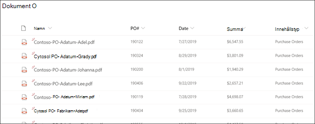

# Översikt av formulär bearbetning

  

I Microsoft SharePoint Syntex används formulärbearbetning i Microsoft PowerApps [AI Builder](https://docs.microsoft.com/ai-builder/overview) för att skapa modeller i SharePoint-dokumentbibliotek.

Du kan använda formulärbearbetning i AI Builder för att skapa AI-modeller där maskininlärning används för att identifiera och extrahera nyckelvärdepar och tabelldata från strukturerade eller delvis strukturerade dokument, som formulär och fakturor.

Organisationer får ofta fakturor i stora kvantiteter från en mängd olika källor, t. ex. post, fax, e-post osv. Det kan ta lång tid att bearbeta dessa dokument och lägga till dem manuellt i en databas. Med formulärbearbetning automatiseras processen genom att AI används för att extrahera text, nyckel/värde-par och tabeller från dina dokument. 

> [!NOTE]
> Mer information om formulärbearbetning och scenarioexempel finns i [Införande av SharePoint Syntex: Kom igång-guide](https://docs.microsoft.com/microsoft-365/contentunderstanding/adoption-getstarted#form-processing-scenario-example).

Du kan till exempel skapa en modell för formulärbearbetning som identifierar alla inköpsorder som laddas upp till dokumentbiblioteket. Från varje inköpsorder kan du extrahera och visa vissa data som är viktiga för dig, t. ex. *PO-nummer*, *datum* eller *summa*.

   

Du använder exempelfiler för att träna modellen och definiera vilken information som ska extraheras från formuläret. Dokumentets layout registreras genom att modellen tränas. Du behöver bara fem formulärdokument för att komma igång. AI Builder analyserar dina exempelfiler för nyckel-värdepar och du kan även manuellt identifiera de som eventuellt inte har upptäckts.  Med AI Builder kan du testa din modells precision mot dina exempelfiler.

När du har tränat och publicerat modellen skapar modellen ett [Power Automate-flöde](https://docs.microsoft.com/power-automate/getting-started). Flödet körs när en fil överförs till dokumentbiblioteket i SharePoint och hämtar data som har identifierats av modellen. Extraherade data visas i kolumner i modellens dokumentbiblioteksvy.

En Office 365-administratör måste [aktivera formulärbearbetning](https://docs.microsoft.com/microsoft-365/contentunderstanding/set-up-content-understanding#to-set-up-content-understanding) för SharePoint-dokumentbiblioteket för att användarna ska kunna [skapa en modell för formulärbearbetning](create-a-form-processing-model.md) i det. Du kan välja webbplatser under eller efter konfigurationen i dina hanteringsinställningar.

## Se även
  
[Power Automate-dokumentation](https://docs.microsoft.com/power-automate/)

[Skapa en modell för formulärbearbetning](create-a-form-processing-model.md)

[Översikt av dokumenttolkning](document-understanding-overview.md)

[Utbildning: Förbättra affärsprestanda med AI Builder](https://docs.microsoft.com/learn/paths/improve-business-performance-ai-builder/?source=learn)
