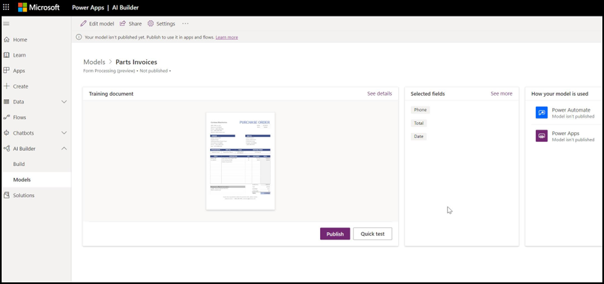

# Översikt av formulär bearbetningForm processing overview

  

I Microsoft SharePoint Syntex används formulärbearbetning i Microsoft PowerApps [AI Builder](https://docs.microsoft.com/ai-builder/overview) för att skapa modeller i SharePoint-dokumentbibliotek.Microsoft SharePoint Syntex uses Microsoft PowerApps [AI Builder](https://docs.microsoft.com/ai-builder/overview) form processing to create models within SharePoint document libraries.

Du kan använda formulärbearbetning i AI Builder för att skapa AI-modeller där maskininlärning används för att identifiera och extrahera nyckelvärdepar och tabelldata från strukturerade eller delvis strukturerade dokument, som formulär och fakturor.You can use AI Builder form processing to create AI models that use machine learning technology to identify and extract key-value pairs and table data from structured or semi-structured  documents, like forms and invoices.

Organisationer får ofta fakturor i stora kvantiteter från en mängd olika källor, t. ex. post, fax, e-post osv. Det kan ta lång tid att bearbeta dessa dokument och lägga till dem manuellt i en databas.Organizations often receive invoices in large quantities from a variety of sources, such as mail, fax, email, etc. Processing these documents and manually entering them into a database can take a considerable amount of time. Med formulärbearbetning automatiseras processen genom att AI används för att extrahera text, nyckel/värde-par och tabeller från dina dokument.By using AI to extract the text, key/value pairs, and tables from your documents, form processing automates this process. 

> [!NOTE]
> Mer information om formulärbearbetning och scenarioexempel finns i [Införande av SharePoint Syntex: Kom igång-guide](https://docs.microsoft.com/microsoft-365/contentunderstanding/adoption-getstarted#form-processing-scenario-example).See the [SharePoint Syntex adoption: Get started guide](https://docs.microsoft.com/microsoft-365/contentunderstanding/adoption-getstarted#form-processing-scenario-example) for more information about form processing scenario examples.

Du kan till exempel skapa en modell för formulärbearbetning som identifierar alla inköpsorder som laddas upp till dokumentbiblioteket.For example, you can create a form processing model that identifies all purchase order documents that are uploaded to the document library. Från varje inköpsorder kan du extrahera och visa vissa data som är viktiga för dig, t. ex. *PO-nummer*, *datum* eller *summa*.From each purchase order you can then extract and display specific data that is important to you, such as *PO Number*, *Date*, or *Total Cost*.

   

Du använder exempelfiler för att träna modellen och definiera vilken information som ska extraheras från formuläret.You use example files to train your model and define the information to be extracted from your form. Dokumentets layout registreras genom att modellen tränas.The layout of your document is learned by training your model. Du behöver bara fem formulärdokument för att komma igång.You only need five form documents to get started. AI Builder analyserar dina exempelfiler för nyckel-värdepar och du kan även manuellt identifiera de som eventuellt inte har upptäckts.AI Builder will analyze your example files for key-value pairs, and you can also manually identify ones that may not have been detected.  Med AI Builder kan du testa din modells precision mot dina exempelfiler.AI builder lets you test the accuracy of your model on your example files.

Du behöver minst fem formulärdokument för att komma igång.You need a minimum of five form documents to get started. AI Builder analyserar dina exempelfiler för nyckel-värdepar och identifierar sedan manuellt de som eventuellt inte har identifierats.AI building analyzes your example files for key-value pairs, and then manually identifies the ones that may not have been detected.  Med AI Builder kan du testa din modells precision mot dina exempelfiler.AI builder lets you test the accuracy of your model on your example files.

När du har tränat och publicerat modellen skapar modellen ett [Power Automate-flöde](https://docs.microsoft.com/power-automate/getting-started).After you train and publish your model, your model creates a [Power Automate Flow](https://docs.microsoft.com/power-automate/getting-started). Flödet körs när en fil överförs till dokumentbiblioteket i SharePoint och hämtar data som har identifierats av modellen.The flow runs when a file is uploaded to the SharePoint document library and will extract data that has been identified in the model. Extraherade data visas i kolumner i modellens dokumentbiblioteksvy.The extracted data will display in columns in your model's document library view.

En Office 365-administratör måste [aktivera formulärbearbetning](https://docs.microsoft.com/microsoft-365/contentunderstanding/set-up-content-understanding#to-set-up-content-understanding) för SharePoint-dokumentbiblioteket för att användarna ska kunna [skapa en modell för formulärbearbetning](create-a-form-processing-model.md) i det.An Office 365 admin needs to [enable Form processing](https://docs.microsoft.com/microsoft-365/contentunderstanding/set-up-content-understanding#to-set-up-content-understanding) for the SharePoint document library for users to be able to [create a form processing model](create-a-form-processing-model.md) in it. Du kan välja webbplatser under eller efter konfigurationen i dina hanteringsinställningar.You can select the sites during setup, or after setup in your management settings.

## Se ävenSee Also
  
[Power Automate-dokumentationPower Automate documentation](https://docs.microsoft.com/power-automate/)

[Skapa en modell för formulärbearbetningCreate a form processing model](create-a-form-processing-model.md)

[Översikt av dokumenttolkningDocument understanding overview](document-understanding-overview.md)

[Utbildning: Förbättra affärsprestanda med AI BuilderTraining: Improve business performance with AI Builder](https://docs.microsoft.com/learn/paths/improve-business-performance-ai-builder/?source=learn)
