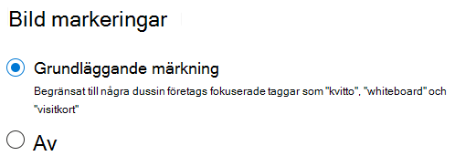

# Bildtaggning i SharePoint SyntexImage tagging in SharePoint Syntex

Med bildtaggning i SharePoint Syntex kan användare hitta bilder genom sökning genom att söka på bildtaggar och skapa arbetsflöden baserat på bildtaggar..With image tagging in SharePoint Syntex, users can find images through search by searching on image tags, and create workflows based on image tags. Som standard är grundläggande bildtaggning aktiverat för SharePoint och OneDrive.By default, basic image tagging is turned on for SharePoint and OneDrive. Bilder som laddas upp till endera platsen skannas automatiskt och lämpliga taggar används, om de är tillgängliga, från en lista på 37 grundläggande taggar.Images uploaded to either location are automatically scanned and applicable tags are applied, if available, from a list of 37 basic tags. Användare kan hitta bilder via sök genom att söka på bildtaggarna.Users can find images through search by searching on the image tags.

När en användare laddar upp en bild körs taggningsprocessen automatiskt.When a user uploads an image, the  tagging process runs automatically. Om en bild redigeras körs taggningsprocessen igen för att uppdatera taggarna.If an image is edited, the tagging process runs again to update the tags.

Användare som har behörigheter till bildfilen kan visa och redigera taggarna i filens informationspanel eller i sidan för sökresultatet.Users with permissions to the image file can see and edit the tags in the file information panel or in the search results page. När en användare har redigerat en bilds taggar, märker inte systemet automatiskt bilden, även om den redigeras.Once a user edits an image's tags, the system no longer auto-tags that image, even if it's edited.

Om du inaktiverar taggningen kommer bilderna inte längre att taggas automatiskt.If you turn tagging off, images will no longer be automatically tagged. Befintliga taggar tas inte bort.Existing tags won't be removed.

> [!NOTE]
> Systemgenererade taggar kan ändras med uppdateringar av bilden eller vår tagg-teknik.System generated tags may change with updates to the image or our tag technology.

## Konfigurera bildtaggningConfigure image tagging

När du [konfigurera SharePoint Syntex](set-up-content-understanding.md) kan du konfigurera bildtaggning i Administrationscenter för Microsoft 365.After you [set up SharePoint Syntex](set-up-content-understanding.md), you can configure image tagging in the Microsoft 365 admin center.  

Aktivera eller inaktivera bildtaggningTo turn image tagging on or off

1. I Administrationscenter för Microsoft 365 klicka på **Inställningar**.In the Microsoft 365 admin center, click **Setup**.

2. Under **Organisationskunskap**klickar du på **Automatisera innehållstolkning**.Under **Organizational knowledge**, click **Automate content understanding**.

3. Klicka på **Hantera**.Click **Manage**.

4. Klicka på **Bildtaggningsfliken**, klicka på **Redigera**.On the **Image tagging** tab, click **Edit**.

5. Välj för att tillåta **Grundläggande taggning** eller avaktivera taggningen **Av**.Choose to allow **Basic tagging** or turn tagging **Off**.

6. Klicka på **Spara**.Click **Save**.

    
