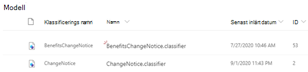
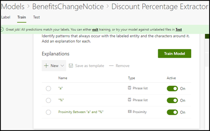

# Lär dig mer om hur du förstår dokument med hjälp av en exempel modellLearn about document understanding models through a sample model

Microsoft SharePoint Syntex innehåller en exempel modell som du kan använda för att undersöka och ge dig en bättre förståelse för hur du skapar egna modeller.Microsoft SharePoint Syntex provides you a with a sample model you can use to examine, giving you a better understanding of how to create your own models. Med exempel modellen kan du också undersöka modell komponenter, till exempel klassificerare, utdrag och förklaringar.The sample model also allows you to examine model components, such as its classifier, extractors, and explanations. Du kan också använda exempelfilerna för att träna modellen.You can also use the sample files to train the model.

## Importera exempel modellenImport the sample model

För att få åtkomst till exempel modellen måste du först importera modellen till ditt innehålls Center.To access the sample model, you need to first import the model to your content center.

1. I innehålls Center väljer du **modeller** för att visa listan med modeller.From the content center, select **Models** to see your models list. 
2. Välj **import Sample Model**på sidan **modeller** .On the **Models** page, select **Import sample model**. 

      

3. Leta efter exempel modellen med rubriken *BenefitsChangeNotice. klassificerare* som visas i din modell lista.Look for the sample model titled *BenefitsChangeNotice.classifier* that appears in your models list. 

      

4. Välj *BenefitsChangeNotice. klassificerare*för att öppna modellens start sida.Select the *BenefitsChangeNotice.classifier*, to open the model's home page. 
  
     

5. Kontrol lera modellen bättre från start sidan för modellen för att se hur den skapades.From the model home page, examine the model more closely to see how it was created.
 
- Visa de exempelfiler som används för att träna modellen.View the sample files used to train the model.
- Undersök modellens enhets utdrag mer noggrant för att se hur exempel modellen konfigurerade förklaringarna.Examine the model's entity extractors more closely to see how the sample model configured the explanations.

     

## Se ävenSee Also
[Skapa en klassificerareCreate a classifier](create-a-classifier.md) 
[Skapa en ExtractorCreate an extractor](create-an-extractor.md) 
[Översikt över dokument förståelseDocument Understanding overview](document-understanding-overview.md) 
[Skapa en modell för formulär bearbetningCreate a form processing model](create-a-form-processing-model.md)  
