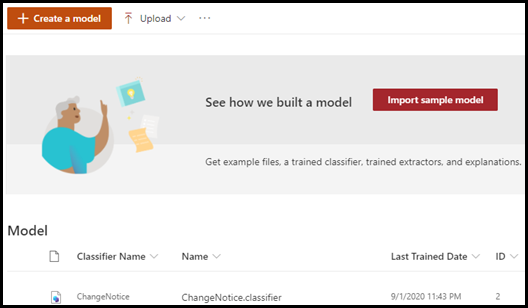
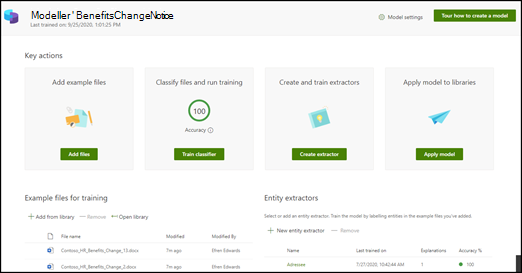

# Mer information om modeller för dokumenttolkning genom en exempelmodell

Med Microsoft SharePoint Syntex får du en exempelmodell som du kan använda att undersöka och ge dig bättre förståelse för hur du skapar egna modeller. Exempelmodellen gör det också möjligt att granska modellkomponenter, t. ex. klassificerare, extraktorer och förklaringar. Du kan också använda exempelfilerna för att träna modellen.

## Importera exempelmodellen

Om du vill använda exempelmodellen måste du först importera den till innehållscenter.

1. I innehållscentret väljer du **Modeller** för att visa listan med modeller. 
2. På sidan **Modeller** väljer du **Importera exempelmodell**. 

      

3. När importen är klar öppnas modellstartsidan **BenefitsChangeNotice**. Om du behöver öppna exempelmodellen framöver kan du göra det från modelllistan i innehållscentret.  

      

Du kan inte bara bläddra igenom analyser av exempelmodellen för en bättre förståelse för hur modellen skapas, eftersom det är en fungerande modell kan du gå längre och göra saker som:

- Lägga till en ny extraktor. Du kan till exempel lägga till en som extraherar *rabattavgiften*.
- Använd modellen på ett dokumentbibliotek och ladda upp en del av träningsfilerna för att se hur modellen klassificerar filer och extraherar data från dem.

## Se även
[Skapa en klassificerare](create-a-classifier.md)

[Skapa en extraktor](create-an-extractor.md)

[Översikt av dokumenttolkning](document-understanding-overview.md)

[Skapa en modell för formulärbearbetning](create-a-form-processing-model.md)  
