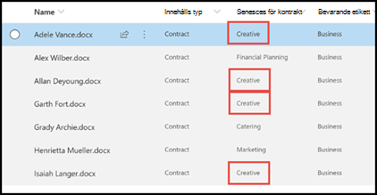

# Använda termlagringstaxonomi vid skapande av extraktorLeverage term store taxonomy when creating an extractor

 

> [!VIDEO https://www.microsoft.com/videoplayer/embed/RE4GpJJ]  

 

När du skapar en extraktor i modellen för dokumenttolkning i SharePoint-Syntex kan du dra nytta av termlagringstaxonomins [Hanterade metadatatjänster](https://docs.microsoft.com/sharepoint/managed-metadata#terms) för att visa rekommenderade termer för data som du extraherar.When you create an extractor in your document understanding model in SharePoint Syntex, you can take advantage of [Managed Metadata services](https://docs.microsoft.com/sharepoint/managed-metadata#terms) term store taxonomy to display preferred terms for data that you extract.  

Som exempel identifierar och klassificerar din modell alla **Kontrakt** som har laddats upp till dokumentbiblioteket.As an example, your model identifies and classifies all **Contract** documents that are uploaded to the document library.  Dessutom extraherar modellen också värdet **Kontraktstjänst** från varje kontrakt. Det visas i en kolumn i din biblioteksvy.Additionally, the model also extracts a **Contract Service** value from each contract, and will display it in a column in your library view. Bland de olika värdena för kontraktstjänster i kontrakten finns det flera äldre värden som företaget inte längre använder och som har bytt namn.Among the various Contract Services values in the contracts, there are several older values that your company no longer uses and have been renamed. Exempel: alla hänvisningar till termernas *Design*, *Grafik* eller *Topografi* i kontraktstjänsterna ska nu kallas *Kreativa*.For example, all references to the terms *Design*, *Graphics*, or *Topography* contract services should now be called *Creative*. När din modell hämtar en inaktuell term från ett kontrakt vill du att det ska visa den aktuella termen – Kreativ – i din biblioteksvy.Whenever your model extracts one of the outdated terms from a contract document, you want it to display the current term - Creative - in your library view. I exemplet nedan ser vi medan vi tränar modellen att ett exempeldokument innehåller inaktuella villkor för *Design*.In the example below, while training the model we see that one sample document contains the outdated term of *Design*.

    

## Använda en kolumn med hanterade metadata i din extraktorUse a Managed metadata column in your extractor

Uppsättningar med termer konfigureras i hanterade metadatatjänstens termarkiv i administrationscenter för SharePoint.Term sets are configured in the Managed Metadata services term store in the SharePoint admin center. I exemplet nedan är *Kontraktstjänsters* [termuppsättning](https://docs.microsoft.com/sharepoint/managed-metadata#term-set) konfigurerad att innehålla flera termer, bland annat *Kreativa*.In the the example below, the *Contract Services* [term set](https://docs.microsoft.com/sharepoint/managed-metadata#term-set) is configured to include a number of terms, including *Creative*.  Informationen för den visar att termen har tre synonymer (*Design*, *Grafik* och *Topografi*) och att synonymerna ska översätta till *Kreativa*.The details for it show that the term has three synonyms (*Design*, *Graphics*, and *Topography*) and the synonyms should be translated to *Creative*. 

    

Det kan finnas flera anledningar till att du vill använda en synonym i termuppsättningen.There could be a number of reasons why you might want to use a synonym in your term set. Det kan till exempel röra sig om föråldrade termer, termer som fått nya namn eller skillnader mellan företagets olika avdelningar.For example, there could be outdated terms, renamed terms, or variations between your organizations departments on naming.

Om du vill att fältet för hanterade metadata ska vara tillgängligt att välja när du skapar din extraktor i modellen måste du [lägga till det som en webbplatskolumn med hanterade metadata](https://support.microsoft.com/office/8fad9e35-a618-4400-b3c7-46f02785d27f).To make the managed metadata field available for you to select when you create your extractor in your model, you need to [add it as a managed-metadata site column](https://support.microsoft.com/office/8fad9e35-a618-4400-b3c7-46f02785d27f). När du har lagt till webbplatskolumnen blir den tillgänglig att välja när du skapar extraktorn för din modell.After you add the site column, it will be available for you to select when you create the extractor for your model.

    

Efter att ha använt modellen på dokumentbiblioteket, när dokumenten är uppladda till biblioteket, kommer kolumnen *Kreativa tjänster* att visa föredragen term (*Kreativ*) när extraktorn hittar något av synonymvärdena (*Design*, *Grafik* och *Topografi*).After applying your model to the document library, when documents are uploaded to library, the *Creative Services* column will display the preferred term (*Creative*) when the extractor finds any of the synonym values (*Design*, *Graphics*, and *Topography*).

    

## Se ävenSee Also
[Introduktion till hanterad metadataIntroduction to Managed Metadata](https://docs.microsoft.com/sharepoint/managed-metadata#terms)

[Skapa en extraktorCreate an extractor](create-an-extractor.md)

[Skapa en kolumn med hanterade metadataCreate a managed metadata column](https://support.microsoft.com/office/create-a-managed-metadata-column-8fad9e35-a618-4400-b3c7-46f02785d27f?redirectSourcePath=%252farticle%252fc2a06717-8105-4aea-890d-3082853ab7b7&ui=en-US&rs=en-US&ad=US)

