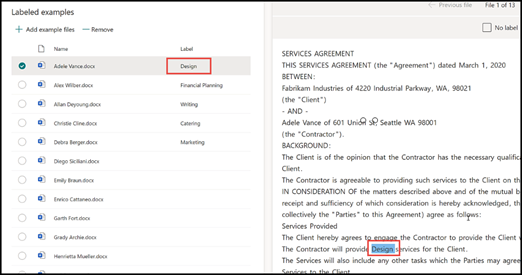
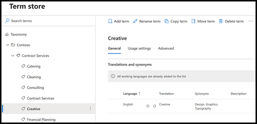

# Använda termlagringstaxonomi vid skapande av extraktor

 

> [!VIDEO https://www.microsoft.com/videoplayer/embed/RE4GpJJ]  

 

När du skapar en extraherare i din dokumentförståelsemodell med SharePoint Syntex kan du dra nytta av globala termuppsättningar i [term lagringsplats](https://docs.microsoft.com/sharepoint/managed-metadata) för att visa föredragna termer för data som du extraherar.  

Som exempel identifierar och klassificerar din modell alla **Kontrakt** som har laddats upp till dokumentbiblioteket.  Dessutom extraherar modellen också värdet **Kontraktstjänst** från varje kontrakt. Det visas i en kolumn i din biblioteksvy. Bland de olika värdena för kontraktstjänster i kontrakten finns det flera äldre värden som företaget inte längre använder och som har bytt namn. Exempel: alla hänvisningar till termernas *Design*, *Grafik* eller *Topografi* i kontraktstjänsterna ska nu kallas *Kreativa*. När din modell hämtar en inaktuell term från ett kontrakt vill du att det ska visa den aktuella termen – Kreativ – i din biblioteksvy. I exemplet nedan ser vi medan vi tränar modellen att ett exempeldokument innehåller inaktuella villkor för *Design*.

    

## Använda en kolumn med hanterade metadata i din extraktor

Uppsättningar med termer konfigureras i hanterade metadatatjänstens (MMS) termarkiv i administrationscenter för SharePoint. I exemplet nedan är *Kontraktstjänsters* [termuppsättning](https://docs.microsoft.com/sharepoint/managed-metadata#term-set) konfigurerad att innehålla flera termer, bland annat *Kreativa*.  Informationen för den visar att termen har tre synonymer (*Design*, *Grafik* och *Topografi*) och att synonymerna ska översätta till *Kreativa*. 

    

Det kan finnas flera anledningar till att du vill använda en synonym i termuppsättningen. Det kan till exempel röra sig om föråldrade termer, termer som fått nya namn eller skillnader mellan företagets olika avdelningar.

Om du vill att fältet för hanterade metadata ska vara tillgängligt att välja när du skapar din extraktor i modellen måste du [lägga till det som en webbplatskolumn med hanterade metadata](https://support.microsoft.com/office/8fad9e35-a618-4400-b3c7-46f02785d27f). När du har lagt till webbplatskolumnen kan du välja när du skapar extraktorn för din modell.

    

Efter att ha använt modellen på dokumentbiblioteket, när dokumenten är uppladda till biblioteket, kommer kolumnen *Kreativa tjänster* att visa föredragen term (*Kreativ*) när extraktorn hittar något av synonymvärdena (*Design*, *Grafik* och *Topografi*).

    

## Se även
[Introduktion till hanterad metadata](https://docs.microsoft.com/sharepoint/managed-metadata#terms)

[Skapa en extraktor](create-an-extractor.md)

[Skapa en kolumn med hanterade metadata](https://support.microsoft.com/office/create-a-managed-metadata-column-8fad9e35-a618-4400-b3c7-46f02785d27f?redirectSourcePath=%252farticle%252fc2a06717-8105-4aea-890d-3082853ab7b7&ui=en-US&rs=en-US&ad=US)

