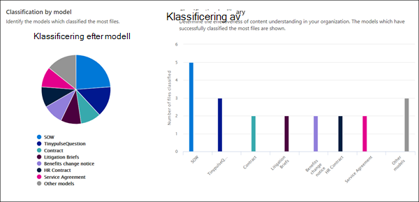
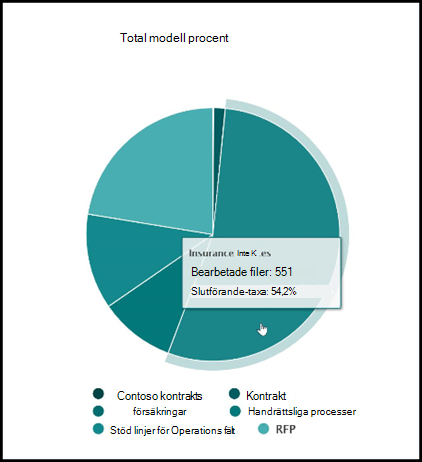
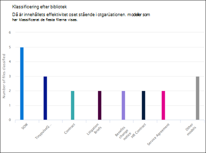
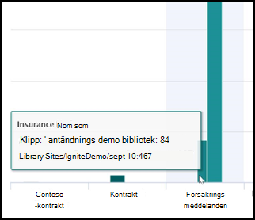

# Användningsstatistik för modeller för dokumenttolkning

 

> [!VIDEO https://www.microsoft.com/videoplayer/embed/RE4GnhX]  

 

I innehållscenter för Microsoft SharePoint Syntex finns användningsanalyser för modeller, för mer information om hur dina modeller som har publicerats från innehållscentret används. Den innehåller en samlad uppsättning av följande information:

- Var modellerna används
- Hur många filer behandlas över tid

   

## Modellens procentandel av summan

     

I cirkeldiagrammet med **Modellens procentandel av summan** visas varje publicerad modell som en procentsats av det totala antalet filer som bearbetas av alla publicerade modeller i innehållscentret.

Alla modeller visar även **Färdigställandegrad**, procentandel uppladdade filer som analyserades av modellen. En låg färdigställandegrad kan betyda att det är problem med antingen modellen eller de filer som analyseras.

## Filer som bearbetas över tid

     

I stapeldiagrammet **Filer som bearbetas över tid** ser du inte bara antalet filer som bearbetas över tid för varje modell, utan även de dokumentbibliotek som modellen användes för visas.

     

## Se även
[Skapa en klassificerare](create-a-classifier.md)

[Skapa en extraktor](create-an-extractor.md)

[Översikt av dokumenttolkning](document-understanding-overview.md)

[Skapa en modell för formulärbearbetning](create-a-form-processing-model.md)  
