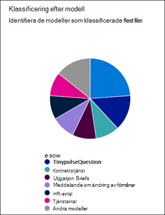

# Användningsstatistik för modeller för dokumenttolkning

 

> [!VIDEO https://www.microsoft.com/videoplayer/embed/RE4GnhX]  

 

I innehållscenter för Microsoft SharePoint Syntex finns användningsanalyser för modeller, för mer information om hur dina modeller som har publicerats från innehållscentret används. <b>Hur dina modeller presterar under de senaste 30 dagarna</b> i innehållscentret innehåller en 30-dagars sammanställning av användningsanalysdata som tillhandahålls i följande diagram och listor:

- Klassificering efter modell
- Klassificering efter bibliotek
- Modell för användningsanalys 

   

### Samla in data om modellanvändning i standardinnehållscentret

I SharePoint Syntex skapas standardinnehållscentret under installationen. Ytterligare innehållscentra kan också skapas efter behov. Exempelvis kan avdelningar skapa egna innehållscentra för att skapa och hantera sina modeller. 

När det gäller analys av modellanvändning bör du observera att:

- Ditt standardinnehållscenter visar modellanalysanalys för alla innehållscentra och modeller i din organisation, inklusive sådana som har skapats i ytterligare innehållscentra. Detta ger innehållshanterare och andra intressenter en central portal för att hantera och övervaka innehållscentra och modeller över hela företaget.  
- Andra innehållscenter visar endast användningsanalyser av modeller för modellerna som skapades i dem. Detta ger innehållshanterare insikt i användningsanalyser endast för de modeller de arbetar med.

## Klassificering efter modell

     

Cirkeldiagrammet **Klassificering efter modell** visar vilka modeller som har klassificerat flest filer. I cirkeldiagrammet med Modellens procentandel av summan visas varje publicerad modell som en procentsats av det totala antalet filer som bearbetas av alla publicerade modeller i innehållscentret.

Alla modeller visar även **Färdigställandegrad**, procentandel uppladdade filer som analyserades av modellen. En låg färdigställandegrad kan betyda att det är problem med antingen modellen eller de filer som analyseras.

## Klassificering efter bibliotek

     

Stapeldiagrammet **Klassificering efter bibliotek** hjälper dig att bestämma effektiviteten i innehållsförståelsen i din organisation.  I stapeldiagrammet Filer som bearbetas över tid ser du inte bara antalet filer som bearbetas över tid för varje modell, utan även de dokumentbibliotek som modellen användes för visas.

## Modell för användningsanalys

Listan över modellanvändning visar användningsanalys för de modeller som skapats genom innehållscentret.  

> [!NOTE]
> Om du är i standardinnehållscentret och har ytterligare innehållscentra i din organisation kommer modellanvändningslistan att grupperas efter innehållscenter.

Varje modell i modellanvändningslistan visar användningsdata:

- Klassificerad artikelantal: Antal filer som bearbetas av modellen.
- Genomsnittligt förtroende poäng: Genomsnittlig noggrannhetspoäng för modellen när den körs mot filer.
- URL för mållista: SharePoint-dokumentbiblioteket som modellen tillämpas på.

## Se även
[Skapa en klassificerare](create-a-classifier.md)

[Skapa en extraktor](create-an-extractor.md)

[Översikt av dokumenttolkning](document-understanding-overview.md)

[Skapa en modell för formulärbearbetning](create-a-form-processing-model.md)  
