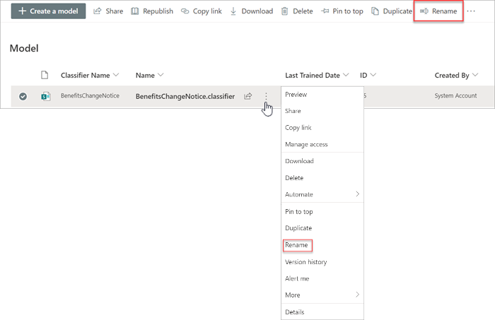
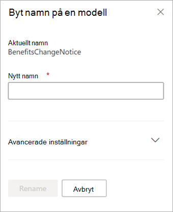

# Byt namn på en modell i Microsoft SharePoint Syntex

Vid något tillfälle kanske du vill byta namn på en modell för dokumenttolkning. Ett vanligt exempel är att när man skapar ett första utkast av en modell så kanske man inte har tänkt efter så noga när man namngav den (till exempel kanske man döpt den till ”AlexWilburModel1”). När modellen börjar bli färdig för användning inser man att ett ordentligt namn borde vara ”Kontraktförnyelser”, och du kanske man vill byta namn på den.  

Ett annat exempel är när din organisation väljer att kalla en process eller dokumenttyp för något annat. Till exempel efter att du skapat din modell och är redo att använda den kanske din organisation bestämmer att alla ”kontrakt” numera formellt ska kallas ”avtal”. Om det behövs kan du välja att byta namn på din modell från ”Kontraktförnyelser” till “Avtalsförnyelser”.

> [!IMPORTANT]
> Du kan bara byta namn på en dokumenttolkningsmodell om den inte har tillämpats på ett dokumentbibliotek. 

Att byta namn på en modell byter också namnet på [innehållstypen](/sharepoint/governance/content-type-and-workflow-planning#content-type-overview) som är associerad med modellen.

## Byt namn på en modell

Följ dessa steg för att byta namn på en dokumenttolkningsmodell.

1. I innehållscentret väljer du **Modeller** för att visa listan med modeller.

2. På sidan **Modeller** väljer du den modell du vill byta namn på.

3. Genom att använda menyfliksområdet eller knappen **Visa åtgärder** (bredvid modellnamnet) väljer du **Byt namn**.  

      

4. På panelen **Byt namn på modell** :

   a. Under **Nytt namn** anger du det nya namnet på modellen som du vill byta namn på. 

      

   b. (Valfritt) Under **Avancerade inställningar** väljer du om du vill associera en befintlig [innehållstyp](/sharepoint/governance/content-type-and-workflow-planning#content-type-overview). Om du väljer **Använd en befintlig innehållstyp** så får modellen ett nytt namn som matchar den valda innehållstypen.

5. Välj **Byt namn**.

## Se även
[Skapa en klassificerare](create-a-classifier.md)

[Skapa en extraktor](create-an-extractor.md)

[Byt namn på en extraktor](rename-an-extractor.md)

[Översikt av dokumenttolkning](document-understanding-overview.md)

[Förklaringstyper](explanation-types-overview.md)

[Använda en modell](apply-a-model.md) 
