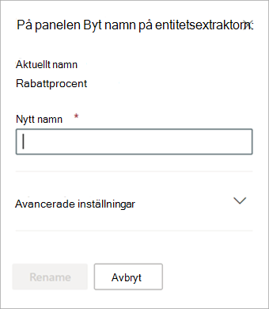

# Byt namn på en extraktor i Microsoft SharePoint Syntex.

Förr eller senare kan du behöva byta namn på en extraktor om du vill referera till ett extraherat datafält med ett annat namn. Din organisation bestämmer sig till exempel för att ändra sina kontraktsdokument och refererar till "kunder" som "klienter" i sina dokument. Om du extraherade ett "Kund"-fält i modellen kan du välja att byta namn på det till "Klient".

När du synkroniserar din uppdaterade modell till ditt SharePoint-dokumentbibliotek ser du en ny Klientkolumn i dokumentbiblioteksvyn. Vyn behåller kolumnen "Kund" för tidigare aktivitet, men uppdaterar den nya kolumnen "Klient" för alla nya dokument som bearbetas av modellen. 

> [!IMPORTANT]
>  Se till att synkronisera den uppdaterade modellen med de dokumentbibliotek där du tidigare använt den för att det nya kolumnnamnet ska visas. 

## Byta namn på en extraktor

Följ dessa steg om du vill byta namn på en entitetsextraktor.

1. I innehållscentret väljer du **Modeller** för att visa listan med modeller.

2. På sidan **Modeller**, i kolumnen **Name**, väljer du den modell för vilken du vill byta namn på en extraktor.

3. Under **Entitetsextraktor** väljer du namnet på den extraktor som du vill byta namn på och väljer sedan **Byt namn**. 

      

4. På panelen **Byt namn på entitetsextraktorn**:

   a. Under **Nytt namn** anger du det nya namnet på extraktorn. 

      

   b. (Valfritt) Under **Avancerade inställningar** välj om du vill associera en befintlig webbplatskolumn.

5. Välj **Byt namn**.

## Se även
[Skapa en extraherare](create-an-extractor.md)

[Skapa en klassificerare](create-a-classifier.md)

[Byt namn på en modell](rename-a-model.md)

[Förklaringstyper](explanation-types-overview.md)

[Använd termlagringstaxonomi vid skapande av extraktor](leverage-term-store-taxonomy.md)

[Översikt av dokumenttolkning](document-understanding-overview.md)

[Använda en modell](apply-a-model.md) 
