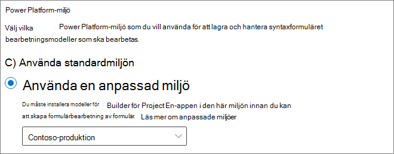

# Konfigurera SharePoint SyntexSet up SharePoint Syntex

Administratörer kan använda Administrationscenter för Microsoft 365 för att konfigurera [Microsoft SharePoint Syntex](index.md).Admins can use the Microsoft 365 admin center to set up [Microsoft SharePoint Syntex](index.md). 

Tänk på följande innan du börjar:Consider the following before you start:

- På vilka SharePoint-webbplatser kommer du aktivera formulärbearbetning?In which SharePoint sites will you enable form processing? Alla, vissa eller utvalda webbplatser?All of them, some, or select sites?
- Vad heter ditt standard innehållscenter?What will you name your default content center?

Du kan ändra inställningarna efter den första konfigurationen i Administrationscenter för Microsoft 365.You can change your settings after initial setup in the Microsoft 365 admin center.

Innan konfigurationen ser du till att planera för det bästa sättet att ställa in och konfigurera innehållstolkning i din miljö. Till exempel behöver du fatta följande beslut:Prior to setup, make sure to plan for the best way to set up and configure content understanding in your environment. For example, you need to make the following decisions:

- De SharePoint-webbplatser där du vill aktivera formulärbearbetning för – alla, vissa eller utvalda webbplatserThe SharePoint sites in which you want to enable form processing - all of them, some, or selected sites
- Namn och administratörer för innehållscentretThe name and admins for your content center

## KravRequirements 

> [!NOTE]
> Du måste ha behörighet som global administratör eller SharePoint-administratör för att kunna komma åt Administrationscenter för Microsoft 365 och konfigurera SharePoint Syntex.You must have Global admin or SharePoint admin permissions to be able to access the Microsoft 365 admin center and set up SharePoint Syntex.

Som administratör kan du också göra ändringar i dina valda inställningar när som helst efter konfigurationen och under inställningarna för hantering av innehållstolkning i Administrationscenter för Microsoft 365.As an admin, you can also make changes to your selected settings anytime after setup, and throughout the content understanding management settings in the Microsoft 365 Admin Center.

Om du planerar att använda en anpassad Power Platform-miljö måste du [installera *AI Builder för Project Cortex* -appen i den här miljön](/power-platform/admin/manage-apps#install-an-app-in-the-environment-view) och [tilldela AI Builder-krediter](/power-platform/admin/capacity-add-on) till den innan du kan skapa formulärbearbetningsmodeller.If you plan to use a custom Power Platform environment, you must [install the *AI Builder for Project Cortex* app in this environment](/power-platform/admin/manage-apps#install-an-app-in-the-environment-view) and [allocate AI Builder credits](/power-platform/admin/capacity-add-on) to it before you can create form processing models.

### LicensieringLicensing

Om du vill använda SharePoint Syntex måste organisationen ha en prenumeration på SharePoint Syntex och varje användare måste ha följande licenser tilldelade:To use SharePoint Syntex, your organization must have a subscription to SharePoint Syntex, and each user must have the following licenses assigned:

- SharePoint-SyntexSharePoint Syntex
- SharePoint Syntex – SPO-typSharePoint Syntex - SPO type
- Vanliga datatjänster för SharePoint SyntexCommon Data Service for SharePoint Syntex

Om du avbryter SharePoint Syntex-prenumerationen vid ett framtida datum (eller om utvärderingsversionen går ut) kan användarna inte längre skapa eller köra dokumenttolkning eller bearbeta formulärmodeller och mallen för innehållscenter är inte längre tillgänglig.If you cancel your SharePoint Syntex subscription at a future date (or your trial expires), users will no longer be able to create or run document understanding or form processing models, and the content center template will no longer be available. Dessutom kommer inte längre rapporter för termlagring, SKOS-taxonomiimport och push-fil av innehållstyp att vara tillgängliga.Additionally, term store reports, SKOS taxonomy import, and Content type push will no longer be available. Inget innehåll tas bort och webbplatsbehörigheterna ändras inte.No content will be deleted and site permissions will not be changed.

### AI Builder-krediterAI Builder credits

Om du har 300 eller fler SharePoint Syntex-licenser för SharePoint Syntex i din organisation allokeras en miljon AI Builder-krediter.If you have 300 or more SharePoint Syntex licenses for SharePoint Syntex in your organization, you will be allocated one million AI Builder credits. Om du har färre än 300 licenser måste du köpa AI Builder-krediter för att kunna använda formulärbearbetning.If you have fewer than 300 licenses, you must purchase AI Builder credits in order to use forms processing.

Du kan beräkna den AI Builder-kapacitet som passar dig bäst med [Kalkylatorn för AI Builder](https://powerapps.microsoft.com/ai-builder-calculator).You can estimate the AI Builder capacity that’s right for you with the [AI Builder calculator](https://powerapps.microsoft.com/ai-builder-calculator).

Om du planerar att använda en anpassad Power Platform-miljö måste du [tilldela krediter till den miljö](/power-platform/admin/capacity-add-on).If you plan to use a custom Power Platform environment, you must [allocate credits to that environment](/power-platform/admin/capacity-add-on).

Gå till [Administrationscenter för Power Platform](https://admin.powerplatform.microsoft.com/resources/capacity) om du vill kontrollera dina krediter och användning.Go to the [Power Platform admin center](https://admin.powerplatform.microsoft.com/resources/capacity) to check your credits and usage.

## Att konfigurera SharePoint SyntexTo set up SharePoint Syntex

1. I Administrationscenter för Microsoft 365 välj **Konfiguration** och se sedan **Filer och innehåll** sektionen.In the Microsoft 365 admin center, select **Setup**, and then view the **Files and content** section.

2. I **Filer och innehåll** sektionen välj **Automatisera innehållstolkning**.In the **Files and content** section, select **Automate content understanding**. Observera att din aktuella AI Builder-kredittillgänglighet visas i avsnittet **I korthet**. Note that your current AI Builder credit availability is shown in the **At a glance** section. 

3. På sidan **Automatisera innehållstolkning** klickar du på **Komma igång** för att gå igenom konfigurationsprocessen.On the **Automate content understanding** page, click **Get started** to walk through the setup process.  

    > [!div class="mx-imgBorder"]
    >  

4. På sidan **Konfigurera formulärbearbetning** kan du välja om du vill tillåta att användare kan skapa modeller för formulärbearbetning i vissa dokumentbibliotek i SharePoint.On the **Configure Form Processing** page, you can choose if you want to let users be able to create form processing models in specific SharePoint document libraries. Ett menyalternativ kommer att vara tillgängligt i menyfliksområdet för dokumentbiblioteket för att **Skapa en modell för formulärbearbetning** i dokumentbibliotek i SharePoint där den är aktiverad.A menu option will be available in the document library ribbon to **Create a form processing model** in SharePoint document libraries in which it is enabled.
 
     För **vilka SharePoint-bibliotek som ska visa alternativ för att skapa modell för formulärbearbetning** kan du välja:For **Which SharePoint libraries should show option to create a form processing model**, you can select: 
      - **Bibliotek på alla SharePoint-webbplatser** för att göra det tillgängligt för alla SharePoint-bibliotek i organisationen.**Libraries in all SharePoint sites** to make it available to all SharePoint libraries in your organization. 
      - **Bibliotek på utvalda SharePoint-webbplatser** och välj sedan de webbplatser där du vill göra det tillgängligt eller ladda upp en lista med upp till 50 webbplatser.**Libraries in selected SharePoint sites**, and then select the sites in which you want to make it available or upload a list of up to 50 sites. 
      - **Inga SharePoint-bibliotek** om du inte vill att det ska vara tillgängligt för några webbplatser (du kan ändra det när konfigurationen är slutförd).**No SharePoint libraries** if you don't want to make it available to any sites (you can change this after setup).

   > [!div class="mx-imgBorder"]
   > 

   > [!Note]
   > Att ta bort en webbplats efter att den har inkluderats påverkar inte befintliga modeller som används i biblioteken på webbplatsen eller möjligheten att använda modeller för dokumenttolkning på ett bibliotek.Removing a site after it has been included does not affect existing models applied to the libraries in that site or the ability to apply document understanding models to a library. 
    
    Om du har konfigurerat flera Power Platform-miljöer kan du välja vilken du vill använda för formulärbearbetning.If you have multiple Power Platform environments configured, you can choose which one you want to use with for form processing. (Det här alternativet visas inte om du bara har en miljö.)(This option will not appear if you only have one environment.)

    

    För **Power Platform-miljö** kan du välja:For **Power Platform environment**, you can select:
    - **Använd standardmiljön** för att använda din standardmiljö för Power Platform.**Use the default environment** to use your default Power Platform environment.
    - **Använd en anpassad miljö** för att använda en anpassad miljö.**Use a custom environment** to use a custom environment. Välj den miljö du vill använda från listan.Choose the environment that you want to use from the list. ([Se kraven för en anpassad miljö](/microsoft-365/contentunderstanding/set-up-content-understanding#requirements)).([See the requirements for a custom environment](/microsoft-365/contentunderstanding/set-up-content-understanding#requirements)).

    Klicka på **Nästa**.Click **Next**.

5. På sidan **Skapa innehållscenter** kan du skapa en SharePoint-webbplats för innehållscenter där dina användare kan skapa och hantera modeller för dokumenttolkning.On the **Create Content Center** page, you can create a SharePoint content center site on which your users can create and manage document understanding models.

    1. För **Webbplatsnamn** skriver du namnet som du vill använda på webbplatsen för innehållscenter.For **Site name**, type the name you want to give your content center site.
    
    1. **Webbplatsens adress** kommer att visa URL:en för din webbplats baserat på vad du valde som webbplatsnamn.The **Site address** will show the URL for your site, based on what you selected for the site name. Om du vill ändra det klickar du på **Redigera**.If you want to change it, click **Edit**.

       > [!div class="mx-imgBorder"]
       >  

       Välj **Nästa**.Select **Next**.

6. På sidan **Granska och slutför** kan du titta på vald inställning och välja att göra ändringar.On the **Review and finish** page, you can look at your selected setting and choose to make changes. Om du är nöjd med dina val väljer du **Aktivera**.If you are satisfied with your selections, select **Activate**.

7. På bekräftelsesidan klickar du på **Klar**.On the confirmation page, click **Done**.

8. Du kommer tillbaka till sidan **Automatisera innehållstolkning**.You'll be returned to your **Automate content understanding** page. På den här sidan kan du välja **Hantera** om du vill göra ändringar i dina konfigurationsinställningar.From this page, you can select **Manage** to make any changes to your configuration settings. 

## Tilldela licenserAssign licenses

När du har konfigurerat en SharePoint Syntex måste du tilldela licenser för de användare som kommer att använda SharePoint Syntex-funktioner.Once you have configured SharePoint Syntex, you must assign licenses for the users who will be using any SharePoint Syntex features.

För att tilldela licenser:To assign licenses:

1. I Administrationscenter för Microsoft 365 klickar du på **Användare** > **Aktiva användare**.In the Microsoft 365 admin center, under **Users**, click **Active users**.

2. Välj de användare som du vill licensiera och klicka på **Hantera produktlicenser**.Select the users that you want to license, and choose **Manage product licenses**.

3. Välj **Appar** på den nedrullningsbar menyn.Choose **Apps** from the drop-down menu.

4. Välj **Visa appar för SharePoint Syntex**.Select **Show apps for  SharePoint Syntex**. Under **Appar** kontrollerar du att **Common Data Service for SharePoint Syntex**, **SharePoint Syntex** och **SharePoint Syntex – SPO-typ** är alla markerade.Under **Apps**, make sure **Common Data Service for SharePoint Syntex**, **SharePoint Syntex**, and **SharePoint Syntex - SPO type** are all selected.

    > [!div class="mx-imgBorder"]
    > 

5. Klicka på **Spara ändringar**.Click **Save changes**.

## Se ävenSee also

[Översikt över modellen för formulärbearbetningOverview of the form processing model](/ai-builder/form-processing-model-overview)

[Steg för steg: Hur du skapar en modell för dokumenttolkning (video)Step-by-Step: How to Build a Document Understanding Model (video)](https://www.youtube.com/watch?v=DymSHObD-bg)

[Skapa och hantera miljöer i administrationscentret för Power PlatformCreate and manage environments in the Power Platform admin center](/power-platform/admin/create-environment)
