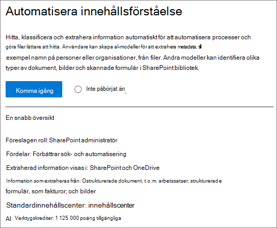
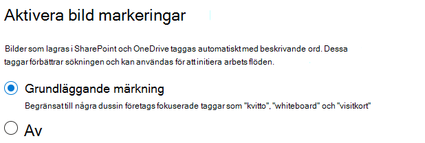
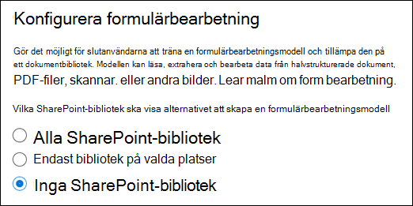
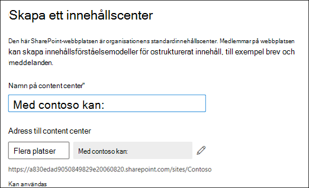
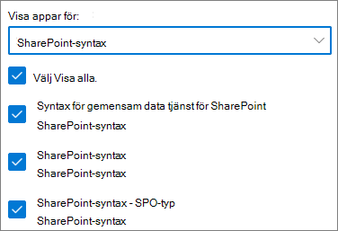

# Konfigurera SharePoint-SyntexSet up SharePoint Syntex

Administratörer kan använda administrations centret för Microsoft 365 för att konfigurera och Microsoft SharePoint-Syntex.Admins can use the Microsoft 365 admin center to set up and Microsoft SharePoint Syntex. 

Tänk på följande innan du börjar:Consider the following before you start:

- Vilka SharePoint-webbplatser aktiverar du formulär bearbetning?Which SharePoint sites will you enable form processing? Alla, vissa eller utvalda webbplatser?All of them, some, or select sites?
- Vad heter du för innehålls Center och vem är den primära webbplats administratören?What will you name of your content center, and who is the primary site admin?

Du kan ändra inställningarna efter den första installationen i Microsoft 365 Admin Center.You can change your settings after initial setup in the Microsoft 365 admin center.

Innehållet i den här artikeln gäller för projekt cortex privat för hands version.The content in this article is for the Project Cortex Private Preview. [Lär dig mer om Project cortex](https://aka.ms/projectcortex).[Find out more about Project Cortex](https://aka.ms/projectcortex).

Innan du konfigurerar dig bör du planera för det bästa sättet att konfigurera och konfigurera innehålls förståelse i din miljö.Prior to setup, make sure to plan for the best way to set up and configure content understanding in your environment. Du måste till exempel tänka på följande:For example, you need to make considerations about the following names of:

- SharePoint-webbplatserna som du vill aktivera bearbetning av formulär för – alla, vissa eller markerade webbplatserThe SharePoint sites that you want to enable form processing - all of them, some, or selected sites
- Ditt innehålls Center och namnet på den primära webbplats administratörenYour content center and the name of the primary site admin

## KravRequirements 

> [!NOTE]
> Du måste ha global administratör eller administratörs behörighet för SharePoint för att kunna komma åt Microsoft 365 Admin Center och ställa in innehålls förståelse.You must have Global admin or SharePoint admin permissions to be able to access the Microsoft 365 admin center and set up content understanding.

Som administratör kan du också göra ändringar i dina valda inställningar när som helst efter installationen och i alla inställningar för innehålls förståelse i administrations centret för Microsoft 365.As an admin, you can also make changes to your selected settings anytime after setup, and throughout the content understanding management settings in the Microsoft 365 Admin Center.

## Så här konfigurerar du SharePoint-SyntexTo set up SharePoint Syntex

1. I administrations centret för Microsoft 365 väljer du **Konfigurera**och sedan avsnittet **organisations** information.In the Microsoft 365 admin center, select **Setup**, and then view the **Organizational knowledge** section.

2. I avsnittet **organisationsinformation** väljer du **Automatisera innehålls förståelse**.In the **Organizational knowledge** section, select **Automate content understanding**. 

     

3. Gå igenom konfigurationen genom att klicka på **komma igång** på sidan **Automatisera SharePoint-Syntex** .On the **Automate SharePoint Syntex** page, click **Get started** to walk through the setup process. 

     

4. På sidan Aktivera bild taggning väljer du om du vill tillåta [bild märkning](image-tagging.md).On the Turn on image tagging page, choose if you want to allow [image tagging](image-tagging.md).

     

5. På sidan **Konfigurera formulär bearbetning** kan du välja om du vill låta användare kunna använda AI-verktyget för att skapa formulär bearbetnings modeller i specifika SharePoint-dokumentbibliotek.On the **Configure Form Processing** page, you can choose if you want to let users be able to use AI Builder to create form processing models in specific SharePoint document libraries. Ett meny alternativ är tillgängligt i menyfliksområdet dokument bibliotek för att **skapa en formulär bearbetnings modell** i SharePoint-dokumentbibliotek där den är aktive rad.A menu option will be available in the document library ribbon to **Create a form processing model** in SharePoint document libraries in which it is enabled.
 
     För **vilka SharePoint-bibliotek bör visa alternativ för att skapa en modell för formulär bearbetning**kan du välja:For **Which SharePoint libraries should show option to create a form processing model**, you can select: 
      - **Alla SharePoint-bibliotek** som gör det tillgängligt för alla SharePoint-bibliotek i organisationen.**All SharePoint libraries** to make it available to all SharePoint libraries in your organization. 
      - **Endast bibliotek på valda webbplatser**och välj de webbplatser som du vill göra tillgänglig för.**Only libraries in selected sites**, and then select the sites in which you want to make it available. 

   

   > [!Note]
   > Om du aktiverar den här inställningen i ett SharePoint-dokumentbibliotek påverkar det inte befintliga modeller som tillämpas på biblioteket eller möjligheten att tillämpa dokument förståelse på ett bibliotek.Enabling this setting on a SharePoint document library does not affect existing models applied to the library or the ability to apply document understanding models to a library. 
    
6. På sidan **skapa innehålls Center** kan du skapa en SharePoint-webbplats för innehålls Center där användarna kan skapa och hantera dokument förståelse modeller.On the **Create Content Center** page, you can create a SharePoint content center site on which your users can create and manage document understanding models.  
    a.a. För **webbplats namn**anger du det namn som du vill ge innehålls Center webbplatsen.For **Site name**, type the name you want to give your content center site. 
    b.b. **Webbplats adressen** visar URL-adressen för webbplatsen, baserat på vad du har valt för webbplats namnet.The **Site address** will show the URL for your site, based on what you selected for the site name. Om du vill ändra det klickar du på **Redigera**.If you want to change it, click **Edit**. 

       

    Välj **Nästa**.Select **Next**.

7. På sidan **Granska och slutför** kan du titta på den valda inställningen och välja att göra ändringar.On the **Review and finish** page, you can look at your selected setting and choose to make changes. Om du är nöjd med dina val väljer du **Aktivera**.If you are satisfied with your selections, select **Activate**.

8. På bekräftelse sidan klickar du på **klar**.On the confirmation page, click **Done**.

9. Du kommer att återföras till sidan **Automatisera innehålls förståelse** .You'll be returned to your **Automate content understanding** page. Från den här sidan kan du välja **Hantera** för att ändra dina konfigurations inställningar.From this page, you can select **Manage** to make any changes to your configuration settings. 

## Tilldela licenserAssign licenses

När du har konfigurerat en SharePoint-Syntex måste du tilldela licenser för de användare som ska använda formulär bearbetning och dokument förstå funktioner.Once you have configured SharePoint Syntex, you must assign licenses for the users who will be using form processing and document understanding features.

Så här tilldelar du licenser:To assign licenses:

1. Klicka på **aktiva användare**under **användare**i administrations centret för Microsoft 365.In the Microsoft 365 admin center, under **Users**, click **Active users**.

2. Välj de användare som du vill licensiera och klicka på **Hantera produkt licenser**.Select the users that you want to license, and click **Manage product licenses**.

3. Välj **tilldela mer**.Select **Assign more**.

4. Välj **intelligent Content Services**.Select **Intelligent Content Services**. Under **program**kontrollerar du att **gemensam data tjänst för intelligenta innehålls tjänster** och **intelligenta innehålls tjänster** är markerade.Under **Apps**, make sure **Common Data Service for Intelligent Content Services** and **Intelligent Content Services** are both selected.

    

5. Klicka på **Spara ändringar**.Click **Save changes**.

## Krediteringar för AI-byggareAI Builder credits

Om du har 300 eller fler SharePoint Syntex-licenser för SharePoint Syntex i organisationen tilldelas du 1 000 000 AI Builder-kredit.If you have 300 or more SharePoint Syntex licenses for SharePoint Syntex in your organization, you will be allocated one million AI Builder credits. Om du har färre än 300 licenser måste du köpa AI Builder-kredit för att kunna använda formulär bearbetning.If you have fewer than 300 licenses, you must purchase AI Builder credits in order to use forms processing.

Du kan uppskatta vilken AI Builder-kapacitet som passar dig med [AI Builder-kalkylatorn](https://powerapps.microsoft.com/ai-builder-calculator).You can estimate the AI Builder capacity that’s right for you with the [AI Builder calculator](https://powerapps.microsoft.com/ai-builder-calculator).

1. Gå till [administrations centret för Power Platform](https://admin.powerplatform.microsoft.com/resources/capacity) för att kontrol lera kredit och användning.Go to the [Power Platform admin center](https://admin.powerplatform.microsoft.com/resources/capacity) to check your credits and usage.

    > [!NOTE]
    > Aktivera den här inställningen i ett SharePoint-dokumentbibliotek påverkar inte befintliga modeller som tillämpas på biblioteket eller möjligheten att tillämpa dokument förståelse på ett bibliotek.Enable this setting on a SharePoint document library does not affect existing models applied to the library or the ability to apply document understanding models to a library. 
    
2. På sidan **skapa innehålls Center** kan du skapa en SharePoint-webbplats för innehålls Center där användare kan skapa och hantera dokument förståelse modeller.From the **Create Content Center** page, you can create a SharePoint content center site for which users can create and manage document understanding models.  
    a.a. För **webbplats namn**anger du det namn du vill använda för innehålls Center webbplatsen.For **Site name**, type the name you want for the content center site. 
    b.b. Webb **adressen** för din webbplats visas, baserat på webbplats namnet.The **Site address** shows the URL for your site, based on the site name. 

    > [!NOTE] 
    > Du kan välja ett språk som stöds, innehålls förstå modeller kan bara skapas för engelska.While you can select any supported language, content understanding models can only be created for English. 

       

3. Välj **Nästa**.Select **Next**.

4. På sidan **Slutför och granska** tittar du på den valda inställningen och väljer att göra ändringar.On the **Finish and review** page, look at your selected setting and choose to make changes. Om du är nöjd med dina val väljer du **Aktivera**.If you are satisfied with your selections, select **Activate**.

5. Sidan **innehålls användning aktive rad** visas och bekräftar att systemet har lagt till dina inställningar för formulär bearbetning och skapat innehålls Center webbplatsen.The **Content understanding activated** page displays, confirming the system added your form processing preferences and created the Content Center site. Välj **klar**.Select **Done**.

6. Du kommer att återföras till sidan **Automatisera innehålls förståelse** .You'll be returned to your **Automate content understanding** page. Från den här sidan kan du välja **Hantera** för att ändra dina konfigurations inställningar.From this page, you can select **Manage** to make any changes to your configuration settings. 

## Se ävenSee also

[Översikt över formulär bearbetnings modellenOverview of the form processing model](https://docs.microsoft.com/ai-builder/form-processing-model-overview)

[Steg-för-steg: hur du skapar en modell för dokument förståelse (video)Step-by-Step: How to Build a Document Understanding Model (video)](https://www.youtube.com/watch?v=DymSHObD-bg)

