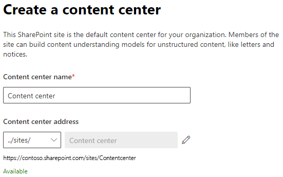

# Konfigurera innehållsförståelse (förhandsgranskning)Set up content understanding (Preview)

> [!Note] 
> Innehållet i den här artikeln är för Project Cortex Private Preview.The content in this article is for Project Cortex Private Preview. [Läs mer om Project Cortex](https://aka.ms/projectcortex).[Find out more about Project Cortex](https://aka.ms/projectcortex).

Administratörer kan använda Microsoft 365-administrationscentret för att konfigurera innehållsbeståelse.Admins can use the Microsoft 365 admin center to set up and configure content understanding. 

Innan du konfigurerar, se till att planera för det bästa sättet att ställa in och konfigurera innehållsförståelse i din miljö.Prior to setup, make sure to plan for the best way to set up and configure content understanding in your environment. Du måste till exempel ta hänsyn till följande:For example, you will need to make considerations about the following:
- Vilka SharePoint-webbplatser aktiverar du formulärbearbetning?Which SharePoint sites will you enable form processing? Alla av dem, vissa, eller välj webbplatser?All of them, some, or select sites?
- Namnet på ditt innehållscenter och vem är den primära webbplatsadministratören?Name of your content center, and who is the primary site admin?

En administratör kan också göra ändringar i dina valda inställningar när som helst efter installationen genom hanteringsinställningarna för innehålls förståelse i microsoft 365-administrationscentret.An admin can also make changes to your selected settings anytime after setup through the content understanding management settings in the Microsoft 365 admin center.

## KravRequirements 
Du måste ha behörigheten Global Admin eller SharePoint för att kunna komma åt Microsoft 365-administrationscentret och konfigurera innehållsförståelse.You must have Global Admin or SharePoint admin permissions to be able to access the Microsoft 365 admin center and set up content understanding.

## Så här ställer du in innehållsöverensningTo set up content understanding

1. I administrationscentret för Microsoft 365 väljer du **Installationsprogrammet**och visar sedan avsnittet **Organisationskunskap.**In the Microsoft 365 admin center, select **Setup**, and then view the **Organizational knowledge** section.
2. I avsnittet **Organisatorisk kunskap** väljer du **Automatisera innehållsöverensning**.In the **Organizational knowledge** section, select **Automate content understanding**. 

     

3. På sidan **Automatisera innehållsöverenskommelsen** klickar du på **Kom igång** för att gå igenom installationsprocessen.On the **Automate content understanding** page, click **Get started** to walk you through the setup process. 

     

4. På sidan **Konfigurera formulärbearbetning** kan du välja om du vill att användarna ska kunna använda AI Builder för att skapa formulärbearbetningsmodeller i specifika SharePoint-dokumentbibliotek.On the **Configure Form Processing** page, you can choose if you want to let users be able to use AI Builder to create form processing models in specific SharePoint document libraries. Ett menyalternativ är tillgängligt i menyfliksområdet för dokumentbiblioteket för att **skapa en formulärbearbetningsmodell** i SharePoint-dokumentbibliotek där den är aktiverad.A menu option will be available in the document library ribbon to **Create a form processing model** in SharePoint document libraries in which it is enabled.
 
     För **vilka SharePoint-bibliotek ska visa alternativet för att skapa en formulärbearbetningsmodell**kan du välja:For **Which SharePoint libraries should show option to create a form processing model**, you can select: 
    - **Alla SharePoint-bibliotek** för att göra det tillgängligt för alla SharePoint-bibliotek i din klientorganisation.**All SharePoint libraries** to make it available to all SharePoint libraries in your tenant. 
    - **Endast bibliotek på valda platser**och välj sedan de platser där du vill göra det tillgängligt.**Only libraries in selected sites**, and then select the sites in which you want to make it available. 
    - **Inga SharePoint-bibliotek** om du för närvarande inte vill göra det tillgängligt för några webbplatser (du kan ändra detta efter installationen).**No SharePoint libraries** if you currently don't want to make it available to any sites (you can change this after setup).
 

   

 

   > [!Note]
   > Om du aktiverar den här inställningen i ett SharePoint-dokumentbibliotek påverkas inte befintliga modeller som tillämpas på biblioteket eller möjligheten att tillämpa dokumentöverenstagande modeller i ett bibliotek.Enabling this setting on a SharePoint document library does not affect existing models applied to the library or the ability to apply document understanding models to a library. 

    
5. På sidan **Skapa innehållscenter** kan du skapa en SharePoint-webbplats för innehållscenter där användarna kan skapa och hantera dokumentöverenstagande modeller.On the **Create Content Center** page, you can create a SharePoint content center site on which your users can create and manage document understanding models.  
    a.a. För **Webbplatsnamn**skriver du det namn som du vill ge webbplatsen för innehållscentret.For **Site name**, type the name you want to give your content center site. 
    b.b. **Webbplatsadressen** visar webbadressen för din webbplats, baserat på vad du valde för webbplatsnamnet.The **Site address** will show the URL for your site, based on what you selected for the site name. 

    > [!Note] 
    > Du kan välja ett språk som stöds, observera att innehållsöverenseringsmodeller endast kan skapas för engelska.While you can select any supported language, note that content understanding models can only be created for English. 

       

    Välj **Nästa**.Select **Next**.
6. På sidan **Slutför och granska** kan du titta på den valda inställningen och välja att göra ändringar.On the **Finish and review** page, you can look at your selected setting and choose to make changes. Om du är nöjd med dina val väljer du **Aktivera**.If you are satisfied with your selections, select **Activate**.

7. Sidan **Innehållsförståelse aktiverad** visas, vilket bekräftar att systemet har lagt till dina inställningar för formulärbearbetning och skapat Content Center-webbplatsen.The **Content understanding activated** page will display, confirming that the system has added your form processing preferences and creating the Content Center site. Välj **Klar**.Select **Done**.

8. Du kommer tillbaka till sidan För att **förstå automatisera innehåll.**You'll be returned to your **Automate content understanding** page. På den här sidan kan du välja **Hantera** om du vill göra ändringar i konfigurationsinställningarna.From this page, you can select **Manage** to make any changes to your configuration settings. 

## Se ävenSee also

  

