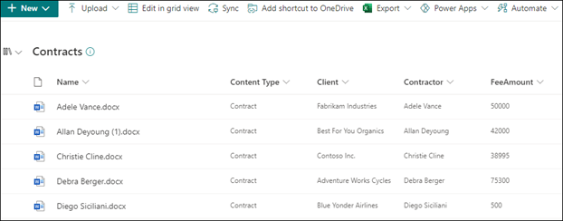

# Steg 1. Använda SharePoint Syntex för att identifiera kontraktsfiler och extrahera data

Din organisation behöver ett sätt att identifiera och klassificera alla kontraktsdokument från de många filer du får. Du vill också snabbt kunna visa flera nyckelelement i var och en av de identifierade kontraktsfilerna (till exempel *kund,* entreprenör *och* *avgiftsbelopp).* Det kan du göra genom att [SharePoint Syntex för](index.md) att skapa en dokumentförståelsemodell och använda den på ett dokumentbibliotek.

## Översikt över processen

[Dokument förstå](document-understanding-overview.md) använder artificiell intelligens (AI) modeller för att automatisera klassificering av filer och extrahering av information. Dokument förstå modeller är också optimala för att extrahera information från ostrukturerade och semi-strukturerade dokument där den information du behöver inte finns i tabeller eller formulär, till exempel kontrakt.

1. Först måste du hitta minst fem exempelfiler som du kan använda för att "utbilda" modellen för att söka efter egenskaper som är specifika för den innehållstyp som du försöker identifiera (ett kontrakt). 

2. Med SharePoint Syntex kan du skapa en ny modell för dokumentförståelse. När du använder exempelfilerna måste [du skapa en klassificerare](create-a-classifier.md). Genom att utbilda klassificeraren med dina exempelfiler lär du dig att söka efter egenskaper som är specifika för det du skulle se i företagets kontrakt. Skapa till [exempel en "förklaring"](create-a-classifier.md#create-an-explanation) som söker efter specifika strängar som finns i ditt avtal, till exempel *Tjänstavtal,* *Avtalsvillkor* och *Kompensation.* Du kan till och med utbilda din förklaring så att du kan leta efter de här strängarna i specifika avsnitt i dokumentet eller ligga bredvid andra strängar. När du tror att du har utbildat din klassificerare med den information som behövs kan du testa modellen på en exempeluppsättning exempelfiler för att se hur effektivt den är. Efter att ha testat kan du, om det behövs, välja att ändra dina förklaringar för att göra dem mer effektiva. 

3. I modellen kan du skapa [en extraherare för att](create-an-extractor.md) hämta specifika data från varje kontrakt. För varje kontrakt är den information som du är mest orolig för till exempel vem klienten är, namnet på entreprenören och totalkostnaden.

4. När du har skapat din modell kan [du använda den på SharePoint ett dokumentbibliotek](apply-a-model.md). När du laddar upp dokument till dokumentbiblioteket körs dokument förstå modellen för dokument och kommer att identifiera och klassificera alla filer som matchar den typ av innehåll som du har definierat i modellen. Alla filer som klassificeras som kontrakt visas i en anpassad biblioteksvy. Filerna visar också värdena från varje kontrakt som du definierade i extraheraren.

   

5. Om du har kvarhållningskrav för kontrakten kan  du även använda modellen för att använda en bevarandeetikett som gör att kontrakten inte raderas under en viss tidsperiod.

## Steg för att skapa och utbilda din modell

> [!NOTE]
> För de här stegen kan du använda exempelfilerna i [Microsoft SharePoint Syntex Samples-lagringsplatsen](https://github.com/pnp/syntex-samples). Exemplen på den här lagringsplatsen innehåller både modellfiler för dokument förstå och filer som används för att utbilda modellen.

### Skapa en kontraktsmodell

Det första steget är att skapa din kontraktsmodell.

1. I Innehållscentret välj **Ny** och sedan **Skapa en modell**.

2. I fönstret **Nytt dokument förstå modell** skriver du **namnet** på modellen i fältet Namn. För den här kontraktshanteringslösningen kan du namnge modellen *Kontrakt.*

4. Välj **Skapa**. Då skapas en startsida för modellen. 

    

### Utbilda din modell för att klassificera en typ av fil

#### Lägga till exempelfiler för modellen

Du måste lägga till minst fem exempelfiler som är kontraktsdokument och en exempelfil som inte är ett kontraktsdokument (till exempel en arbetshandling). 

1. På sidan **Modeller > Kontrakt under** Nyckelåtgärder Lägg till   >  **exempelfiler** väljer du Lägg **till filer.**

   

2. På sidan **Välj exempelfiler för modellen** öppnar du mappen Kontrakt, väljer de filer du vill använda och väljer sedan Lägg **till**. Om du inte har exempelfiler där väljer du Ta Upload för **att** lägga till dem.

#### Märka filerna som positiva eller negativa exempel

1. På sidan **Modeller > kontrakt** under **nyckelåtgärder**  >  **Klassificera filer och kör utbildning** väljer du **Utbildaren**.

   

2. På sidan **Modeller >** kontrakt > kontrakts klassificerare, i visningsprogrammet högst upp i den första exempelfilen, visas text som frågar om filen är ett exempel på den kontraktsmodell du skapade. Om det är ett positivt exempel välj **Ja**. Om det är ett positivt exempel välj **Nej**.

3. I listan **Exempel med etiketter** till vänster väljer du andra filer som du vill använda som exempel och etiketterar dem. 

     

#### Lägga till minst en förklaring för att utbilda klassificeraren 

1. Välj **fliken > > på** sidan Modeller eller > kontrakt. 

2. I avsnittet **Utbildningerade** filer visas en lista över de exempelfiler som du tidigare har etiketterat. Välj en av de positiva filerna i listan för att visa den i visningsprogrammet.

3. I avsnittet **Förklaringar** väljer du **Nytt** och sedan **Tom**.

4. På sidan för **Skapa en förklaring**:

    a. I fältet **Namn** skriver du namnet på förklaringen (till exempel &quot;Avtal").

    b. I fältet **Förklaringstyp** väljer du **Fraslista eftersom** du lägger till en textsträng.

    c. I **listrutan Fras** skriver du strängen (till exempel "AVTALET"). Du kan välja **Case sensitive** om strängen måste vara fallkänslig.

    d. Välj **Spara och utbilda**.

     

#### Testa din modell

Du kan testa din kontraktsmodell på exempelfiler som den inte har sett förut. Det här är valfritt, men det kan vara användbart.

1. På sidan **> eller > kontrakt väljer** du **fliken** Test. Det här kör modellen på de exempelfiler du inte har namn på.

2. I listan **Testfiler** visas och visas exempelfilerna om modellen förutsagt dem som positiva eller negativa. Använd den här informationen för att ta reda på hur effektivt din klassificerare är för att identifiera dina dokument.

     

3. När du är klar väljer **du Avsluta utbildning**.

### Skapa och utbilda en extraherare

1. På sidan **Modeller > Kontrakt** under **Nyckelåtgärder Skapa** och träna  >  **extraherare** väljer du Skapa **extraherare**.

   

2. Skriv **namnet på extraheraren** i fältet **Nytt namn** på panelen Ny entitet extraheraren. Ge den till exempel *namnet Klient* om du vill extrahera namnet på klienten från varje avtal.

3. När du är klar väljer du **Skapa**.

#### Märk den entitet som du vill extrahera

När du skapar extraheraren öppnas extraherarsidan. Här visas en lista över dina exempelfiler, och den första filen i listan visas i visningsprogrammet.

 

Så här märks entiteten:

1. Välj de data från visningsprogrammet som du vill extrahera från filerna. Om du till exempel vill extrahera *Klienten* markerar du klientvärdet i den första filen (i det här exemplet *Bäst* för dig organiskt) och väljer sedan **Spara**. Du ser värdet som visas från filen i listan **Exempel på etiketter** under **kolumnen** Etikett.

2. Välj **Nästa fil** för att spara automatiskt och öppna nästa fil i listan i visningsprogrammet. Eller välj **Spara** och välj sedan en annan fil i **listan Exempel med etiketter.**

3. Upprepa steg 1 och 2 i visningsprogrammet och upprepa sedan tills du har sparat etiketten i alla filer.

När du har etiketterat filerna visas en meddelandebanderoll med information om att gå över till utbildningen. Du kan välja att märka fler dokument eller gå vidare till utbildningen.

#### Lägg till förklaring

Du kan skapa en förklaring som ger en ledtråd om själva entitetsformatet och variationer som det kan ha i exempelfilerna. Ett datumvärde kan till exempel ha många olika format, till exempel:

- 10/14/2019
- 14 oktober 2019
- Måndag, den 14 oktober 2019

Du kan skapa en *mönsterförklaring för* att identifiera startdatumet för avtalet.

1. I avsnittet **Förklaringar** väljer du **Nytt** och sedan **Tom**.

2. På sidan för **Skapa en förklaring**:

    a. I fältet **Namn** skriver du namnet på förklaringen (till exempel *Datum).*

    b. I fältet **Förklaringstyp** väljer du **Mönsterlista**.

    c. Ange **datumvariationen** så som de visas i exempelfilerna i fältet Värde. Om du, till exempel, har datumformat som visas som 0/00/0000, kan du ange en variation som visas i dina dokument, till exempel:

    - 0/0/0000
    - 0/00/0000
    - 00/0/0000
    - 00/00/0000

4. Välj **Spara och utbilda**.

#### Testa modellen igen

Du kan testa din kontraktsmodell på exempelfiler som den inte har sett förut. Det här är valfritt, men det kan vara användbart.

1. På sidan **> eller > kontrakt väljer** du **fliken** Test. Det här kör modellen på de exempelfiler du inte har namn på.

2. I listan **Testa filer** visas exempelfilerna och visar om modellen kan extrahera den information du behöver. Använd den här informationen för att ta reda på hur effektivt din klassificerare är för att identifiera dina dokument.

3. När du är klar väljer **du Avsluta utbildning**.

### Använda modellen på ett dokumentbibliotek

Så här använder du modellen på SharePoint ett dokumentbibliotek:

1. På sidan **Modeller > Kontrakt** under Nyckelåtgärder **Använd** modell för  >  **bibliotek väljer** du Använd **modell.**

   

2. På panelen **Lägg till** kontrakt väljer du den SharePoint som innehåller det dokumentbibliotek där du vill använda modellen. Om webbplatsen inte visas i listan kan du använda sökrutan för att hitta den. Välj **Lägg till**.

    > [!NOTE]
    > Du måste ha behörighet för *Hantera list* eller *Redigera* för det dokumentbibliotek som du använder modellen på.

3. När du har valt webbplatsen väljer du det dokumentbibliotek där du vill använda modellen.

4. Eftersom modellen är kopplad till en innehållstyp kommer innehållstypen och dess vy att läggas till med etiketterna som du extraherade och visas som kolumner när du använder den på biblioteket. Den här vyn är bibliotekets standardvy som standard, men du kan välja att  den inte  ska vara standardvyn genom att markera Avancerade inställningar och avmarkera kryssrutan Ange den här nya vyn som standard.

5. Välj **Lägg till** för att tillämpa modellen på biblioteket.

6. I **avsnittet Bibliotek >** denna modell  på sidan Modeller eller kontrakt ser du URL-adressen till den SharePoint visas.

    

När du har tillämpat modellen på dokumentbiblioteket kan du börja ladda upp dokument till webbplatsen och se resultatet.

## Nästa steg

[Steg 2. Använd Microsoft Teams för att skapa din kanal för kontraktshantering](solution-manage-contracts-step2.md)