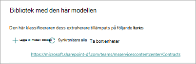

# Steg 1.Step 1. Använda SharePoint Syntex för att identifiera kontraktsfiler och extrahera dataUse SharePoint Syntex to identify contract files and extract data

Din organisation behöver ett sätt att identifiera och klassificera alla kontraktsdokument från de många filer du får.Your organization needs a way to identify and classify all contract documents from the many files you receive. Du vill också snabbt kunna visa flera nyckelelement i var och en av de identifierade kontraktsfilerna (till exempel *kund,* entreprenör *och* *avgiftsbelopp).*You also want to be able to quickly view several key elements in each of the contract files identified (for example, *Client*, *Contractor*, and *Fee amount*). Det kan du göra genom att [SharePoint Syntex](index.md) skapa en dokumentförståelsemodell och använda den i ett dokumentbibliotek.You can do this by using [SharePoint Syntex](index.md) to create a document understanding model and applying it to a document library.

## Översikt över processenOverview of the process

[Dokument förstå](document-understanding-overview.md) använder artificiell intelligens (AI) modeller för att automatisera klassificering av filer och extrahering av information.[Document understanding](document-understanding-overview.md) uses artificial intelligence (AI) models to automate classification of files and extraction of information. Dokument förstå modeller är också optimala för att extrahera information från ostrukturerade och semi-strukturerade dokument där den information du behöver inte finns i tabeller eller formulär, till exempel kontrakt.Document understanding models are also optimal in extracting information from unstructured and semi-structured documents where the information you need isn't contained in tables or forms, such as contracts. 

Dokument för dokumenttolkning använder optisk teckenläsning (OCR) för att skanna PDF-filer, bilder och TIFF-filer, både när du utbildar en modell med exempelfiler och när du kör modellen mot filer i ett dokumentbibliotek.Document understanding models use Optical Character Recognition (OCR) technology to scan PDFs, images, and TIFF files, both when you train a model with example files and when you run the model against files in a document library.

1. Först måste du hitta minst fem exempelfiler som du kan använda för att "utbilda" modellen för att söka efter egenskaper som är specifika för den innehållstyp som du försöker identifiera (ett kontrakt).First, you need to find at least five example files that you can use to "train" the model to search for characteristics that are specific to the content type you're trying to identify (a contract). 

2. Med SharePoint Syntex kan du skapa en ny modell för dokumentförståelse.Using SharePoint Syntex, create a new document understanding model. När du använder exempelfilerna måste [du skapa en klassificerare](create-a-classifier.md).Using your example files, you need to [create a classifier](create-a-classifier.md). Genom att utbilda klassificeraren med dina exempelfiler lär du dig att söka efter egenskaper som är specifika för det du skulle se i företagets kontrakt.By training the classifier with your example files, you teach it to search for characteristics that are specific to what you would see in your company's contracts. Skapa till [exempel en "förklaring"](create-a-classifier.md#create-an-explanation) som söker efter specifika strängar som finns i ditt avtal, till exempel *Tjänstavtal,* *Avtalsvillkor* och *Kompensation.*For example, [create an "explanation"](create-a-classifier.md#create-an-explanation) that searches for specific strings that are in your contracts, such as *Service Agreement*, *Terms of Agreement*, and *Compensation*. Du kan till och med utbilda din förklaring så att du kan leta efter de här strängarna i specifika avsnitt i dokumentet eller ligga bredvid andra strängar.You can even train your explanation to look for these strings in specific sections of the document, or located next to other strings. När du tror att du har utbildat din klassificerare med den information som behövs kan du testa modellen på en exempeluppsättning exempelfiler för att se hur effektivt den är.When you think you have trained your classifier with the information it needs, you can test your model on a sample set of example files to see how efficient it is. Efter att ha testat kan du, om det behövs, välja att ändra dina förklaringar för att göra dem mer effektiva.After testing, if needed you can choose to make changes to your explanations to make them more efficient. 

3. I modellen kan du skapa [en extraherare för att](create-an-extractor.md) hämta specifika data från varje kontrakt.In your model, you can [create an extractor](create-an-extractor.md) to pull out specific pieces of data from each contract. För varje kontrakt är den information som du är mest orolig för till exempel vem klienten är, namnet på entreprenören och totalkostnaden.For example, for each contract, the information you're most concerned about is who the client is, the name of the contractor, and the total cost.

4. När du har skapat din modell kan [du använda den på SharePoint ett dokumentbibliotek](apply-a-model.md).After you successfully create your model, [apply it to a SharePoint document library](apply-a-model.md). När du laddar upp dokument till dokumentbiblioteket körs dokument förstå modellen för dokument och kommer att identifiera och klassificera alla filer som matchar den typ av innehåll som du har definierat i modellen.As you upload documents to the document library, your document understanding model will run and will identify and classify all files that match the contracts content type you defined in your model. Alla filer som klassificeras som kontrakt visas i en anpassad biblioteksvy.All files that are classified as contracts will display in a custom library view. Filerna visar också värdena från varje kontrakt som du definierade i extraheraren.The files will also display the values from each contract that you defined in your extractor.

   

5. Om du har kvarhållnings- eller säkerhetskrav för kontrakten  kan du  även använda modellen för att använda en bevarandeetikett eller en känslighetsetikett som gör att kontrakten inte raderas under en viss tidsperiod eller för att begränsa vem som kan komma åt kontrakten.If you have retention or security requirements for your contracts, you can also use your model to apply a [retention label](apply-a-retention-label-to-a-model.md) or a [sensitivity label](apply-a-sensitivity-label-to-a-model.md) that will prevent your contracts from being deleted for a specified period of time or to restrict who can access the contracts.

## Steg för att skapa och utbilda din modellSteps to create and train your model

> [!NOTE]
> För de här stegen kan du använda exempelfilerna på lagringsplatsen för lösningstillgångar [i kontraktshantering.](https://github.com/pnp/syntex-samples/tree/main/scenario%20assets/Contracts%20Management)For these steps, you can use the example files in the [Contracts Management Solution Assets repository](https://github.com/pnp/syntex-samples/tree/main/scenario%20assets/Contracts%20Management). Exemplen på den här lagringsplatsen innehåller både modellfiler för dokument förstå och filer som används för att utbilda modellen.The examples in this repository contain both the document understanding model files and the files used to train the model.

### Skapa en kontraktsmodellCreate a Contract model

Det första steget är att skapa din kontraktsmodell.The first step is to create your Contract model.

1. I Innehållscentret välj **Ny** och sedan **Skapa en modell**.From the content center, select **New**, and then **Create a model**.

2. I fönstret **Nytt dokument förstå modell** skriver du **namnet** på modellen i fältet Namn.On the **New document understanding model** pane, in the **Name** field, type the name of the model. För den här kontraktshanteringslösningen kan du namnge modellen *Kontrakt.*For this contract management solution, you can name the model *Contract*.

4. Välj **Skapa**.Choose **Create**. Då skapas en startsida för modellen.This creates a home page for the model. 

    

### Utbilda din modell för att klassificera en typ av filTrain your model to classify a type of file

#### Lägga till exempelfiler för modellenAdd example files for your model

Du måste lägga till minst fem exempelfiler som är kontraktsdokument och en exempelfil som inte är ett kontraktsdokument (till exempel en arbetshandling).You need to add at least five example files that are contract documents, and one example file that's not a contract document (for example, a statement of work). 

1. På sidan **Modeller > Kontrakt under** Nyckelåtgärder Lägg till   >  **exempelfiler** väljer du Lägg **till filer.**On the **Models > Contract** page, under **Key actions** > **Add example files**, select **Add files**.

   

2. På sidan **Välj exempelfiler för modellen** öppnar du mappen Kontrakt, väljer de filer du vill använda och väljer sedan Lägg **till**.On the **Select example files for your model** page, open the Contract folder, select files you want to use, and then select **Add**. Om du inte har exempelfiler där väljer du Ta Upload för **att** lägga till dem.If you don't have example files there, select **Upload** to add them.

#### Märka filerna som positiva eller negativa exempelLabel the files as positive or negative examples

1. På sidan **Modeller > kontrakt** under **nyckelåtgärder**  >  **Klassificera filer och kör utbildning** väljer du **Utbildaren**.On the **Models > Contract** page, under **Key actions** > **Classify files and run training**, select **Train classifier**.

   

2. På sidan **Modeller >** kontrakt > kontrakts klassificerare, i visningsprogrammet högst upp i den första exempelfilen, visas text som frågar om filen är ett exempel på den kontraktsmodell du skapade.On the **Models > Contract > Contract classifier** page, in the viewer on the top of the first example file, you'll see text asking if the file is an example of the Contract model you created. Om det är ett positivt exempel välj **Ja**.If it is a positive example, select **Yes**. Om det är ett positivt exempel välj **Nej**.If it is a negative example, select **No**.

3. I listan **Exempel med etiketter** till vänster väljer du andra filer som du vill använda som exempel och etiketterar dem.From the **Labeled examples** list on the left, select other files that you want to use as examples, and label them. 

     

#### Lägga till minst en förklaring för att utbilda klassificerarenAdd at least one explanation to train the classifier 

1. Välj **fliken > > på** sidan Modeller eller > kontrakt. On the **Models > Contract > Contract classifier** page, select the **Train** tab.

2. I avsnittet **Utbildningerade** filer visas en lista över de exempelfiler som du tidigare har etiketterat.In the **Trained files** section, you'll see a list of the example files that you previously labeled. Välj en av de positiva filerna i listan för att visa den i visningsprogrammet.Select one of the positive files from the list to display it in the viewer.

3. I avsnittet **Förklaringar** väljer du **Nytt** och sedan **Tom**.In the **Explanations** section, select **New** and then **Blank**.

4. På sidan för **Skapa en förklaring**:On the **Create an explanation** page:

    a.a. I fältet **Namn** skriver du namnet på förklaringen (till exempel &quot;Avtal").In the **Name** field, type the name of the explanation (such as "Agreement").

    b.b. I fältet **Förklaringstyp** väljer du **Fraslista eftersom** du lägger till en textsträng.In the **Explanation type** field, select **Phrase list**, because you add a text string.

    c.c. I **listrutan Fras** skriver du strängen (till exempel "AVTALET").In the **Phrase list** box, type the string (such as "AGREEMENT"). Du kan välja **Case sensitive** om strängen måste vara fallkänslig.You can select **Case sensitive** if the string needs to be case-sensitive.

    d.d. Välj **Spara och utbilda**.Select **Save and train**.

     

#### Testa din modellTest your model

Du kan testa din kontraktsmodell på exempelfiler som den inte har sett förut.You can test your Contract model on example files it hasn’t seen before. Det här är valfritt, men det kan vara användbart.This is optional, but it can be a useful best practice.

1. På sidan **> eller > kontrakt väljer** du **fliken** Test. Det här kör modellen på de exempelfiler du inte har namn på.On the **Models > Contract > Contract classifier** page, select the **Test** tab. This runs the model on your unlabeled example files.

2. I listan **Testfiler** visas och visas exempelfilerna om modellen förutsagt dem som positiva eller negativa.In the **Test Files** list, your example files display and shows if the model predicted them to be positive or negative. Använd den här informationen för att ta reda på hur effektivt din klassificerare är för att identifiera dina dokument.Use this information to help determine the effectiveness of your classifier in identifying your documents.

     

3. När du är klar väljer **du Avsluta utbildning**.When done, select **Exit Training**.

### Skapa och utbilda en extraherareCreate and train an extractor

1. På sidan **Modeller > Kontrakt** under **Nyckelåtgärder Skapa** och träna  >  **extraherare** väljer du Skapa **extraherare**.On the **Models > Contract** page, under **Key actions** > **Create and train extractors**, select **Create extractor**.

   

2. Skriv **namnet på extraheraren** i fältet **Nytt namn** på panelen Ny entitet extraheraren.On the **New entity extractor** panel, in the **New name** field, type the name of your extractor. Ge den till exempel *namnet Klient* om du vill extrahera namnet på klienten från varje avtal.For example, name it *Client* if you want to extract the name of the client from each contract.

3. När du är klar väljer du **Skapa**.When you're done, select **Create**.

#### Märk den entitet som du vill extraheraLabel the entity you want to extract

När du skapar extraheraren öppnas extraherarsidan.When you create the extractor, the extractor page opens. Här visas en lista över dina exempelfiler, och den första filen i listan visas i visningsprogrammet.Here you see a list of your sample files, with the first file on the list displayed in the viewer.

 

Så här märks entiteten:To label the entity:

1. Välj de data från visningsprogrammet som du vill extrahera från filerna.From the viewer, select the data that you want to extract from the files. Om du till exempel vill extrahera *Klienten* markerar du klientvärdet i den första filen (i det här exemplet *Bäst* för dig organiskt) och väljer sedan **Spara**.For example, if you want to extract the *Client*, you highlight the client value in the first file (in this example, *Best For You Organics*), and then select **Save**. Du ser värdet som visas från filen i listan **Exempel på etiketter** under **kolumnen** Etikett.You'll see the value display from the file in the **Labeled examples** list, under the **Label** column.

2. Välj **Nästa fil** för att spara automatiskt och öppna nästa fil i listan i visningsprogrammet.Select **Next file** to autosave and open the next file in the list in the viewer. Eller välj **Spara** och välj sedan en annan fil i **listan Exempel med etiketter.**Or select **Save**, and then select another file from the **Labeled examples** list.

3. Upprepa steg 1 och 2 i visningsprogrammet och upprepa sedan tills du har sparat etiketten i alla filer.In the viewer, repeat steps 1 and 2, then repeat until you saved the label in all the files.

När du har etiketterat filerna visas en meddelandebanderoll med information om att gå över till utbildningen.After you've labeled the files, a notification banner displays informing you to move to training. Du kan välja att märka fler dokument eller gå vidare till utbildningen.You can choose to label more documents or advance to training.

#### Lägg till förklaringAdd an explanation

Du kan skapa en förklaring som ger en ledtråd om själva entitetsformatet och variationer som det kan ha i exempelfilerna.You can create an explanation that provides a hint about the entity format itself and variations it might have in the example files. Ett datumvärde kan till exempel ha många olika format, till exempel:For example, a date value can be in many different formats, such as:

- 10/14/201910/14/2019
- 14 oktober 2019October 14, 2019
- Måndag, den 14 oktober 2019Monday, October 14, 2019

Du kan skapa en *mönsterförklaring för* att identifiera startdatumet för avtalet.To help identify the *Contract Start Date*, you can create a pattern explanation.

1. I avsnittet **Förklaringar** väljer du **Nytt** och sedan **Tom**.In the **Explanations** section, select **New** and then **Blank**.

2. På sidan för **Skapa en förklaring**:On the **Create an explanation** page:

    a.a. I fältet **Namn** skriver du namnet på förklaringen (till exempel *Datum).*In the **Name** field, type the name of the explanation (such as *Date*).

    b.b. I fältet **Förklaringstyp** väljer du **Mönsterlista**.In the **Explanation type** field, select **Pattern list**.

    c.c. Ange **datumvariationen** så som de visas i exempelfilerna i fältet Värde.In the **Value** field, provide the date variation as they appear in the sample files. Om du, till exempel, har datumformat som visas som 0/00/0000, kan du ange en variation som visas i dina dokument, till exempel:For example, if you have date formats that appear as 0/00/0000, you enter any variations that appear in your documents, such as:

    - 0/0/00000/0/0000
    - 0/00/00000/00/0000
    - 00/0/000000/0/0000
    - 00/00/000000/00/0000

4. Välj **Spara och utbilda**.Select **Save and train**.

#### Testa modellen igenTest your model again

Du kan testa din kontraktsmodell på exempelfiler som den inte har sett förut.You can test your Contract model on example files it hasn’t seen before. Det här är valfritt, men det kan vara användbart.This is optional, but it can be a useful best practice.

1. På sidan **> eller > kontrakt väljer** du **fliken** Test. Det här kör modellen på de exempelfiler du inte har namn på.On the **Models > Contract > Contract classifier** page, select the **Test** tab. This runs the model on your unlabeled example files.

2. I listan **Testa filer** visas exempelfilerna och visar om modellen kan extrahera den information du behöver.In the **Test files** list, your example files display and shows if the model is able to extract the information you need. Använd den här informationen för att ta reda på hur effektivt din klassificerare är för att identifiera dina dokument.Use this information to help determine the effectiveness of your classifier in identifying your documents.

3. När du är klar väljer **du Avsluta utbildning**.When done, select **Exit Training**.

### Använda modellen på ett dokumentbibliotekApply your model to a document library

Så här använder du modellen på SharePoint ett dokumentbibliotek:To apply your model to a SharePoint document library:

1. På sidan **Modeller > Kontrakt** under Nyckelåtgärder **Använd** modell för  >  **bibliotek väljer** du Använd **modell.**On the **Models > Contract** page, under **Key actions** > **Apply model to libraries**, select **Apply model**.

   

2. På panelen **Lägg till** kontrakt väljer du den SharePoint som innehåller det dokumentbibliotek där du vill använda modellen.On the **Add Contract** panel, select the SharePoint site that contains the document library that you want to apply the model to. Om webbplatsen inte visas i listan kan du använda sökrutan för att hitta den.If the site does not show in the list, use the search box to find it. Välj **Lägg till**.Select **Add**.

    > [!NOTE]
    > Du måste ha behörighet för *Hantera list* eller *Redigera* för det dokumentbibliotek som du använder modellen på.You must have *Manage List* permissions or *Edit* rights to the document library you are applying the model to.

3. När du har valt webbplatsen väljer du det dokumentbibliotek där du vill använda modellen.After you select the site, select the document library to which you want to apply the model.

4. Eftersom modellen är kopplad till en innehållstyp kommer innehållstypen och dess vy att läggas till med etiketterna som du extraherade och visas som kolumner när du använder den på biblioteket.Because the model is associated to a content type, when you apply it to the library it will add the content type and its view with the labels you extracted showing as columns. Den här vyn är bibliotekets standardvy som standard, men du kan välja att  den inte  ska vara standardvyn genom att markera Avancerade inställningar och avmarkera kryssrutan Ange den här nya vyn som standard.This view is the library's default view by default, but you can optionally choose to have it not be the default view by selecting **Advanced settings** and clearing the **Set this new view as default** check box.

5. Välj **Lägg till** för att tillämpa modellen på biblioteket.Select **Add** to apply the model to the library.

6. I **avsnittet Bibliotek >** denna modell  på sidan Modeller eller kontrakt ser du URL-adressen till den SharePoint visas.On the **Models > Contract** page, in the **Libraries with this model** section, you'll see the URL to the SharePoint site listed.

    

7. Under **Inställningar**  >  **Inställningar för bibliotek:**Under **Settings** > **Library settings**:

   - Lägg till en kolumn **med namnet Status** och **välj** Alternativ som kolumntyp.Add a column named **Status** and select **Choice** as the column type.
   - Använd **värdena I** **granskning,** Godkänd **och Avvisad.**Apply the **In review**, **Approved**, and **Rejected** values.

När du har tillämpat modellen på dokumentbiblioteket kan du börja ladda upp dokument till webbplatsen och se resultatet.After you apply the model to the document library, you can begin uploading documents to the site and see the results.

## Nästa stegNext step

[Steg 2. Använd Microsoft Teams för att skapa din kanal för kontraktshanteringStep 2. Use Microsoft Teams to create your contract management channel](solution-manage-contracts-step2.md)