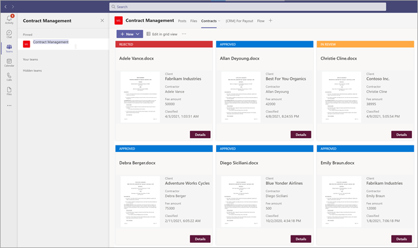

# <a name="step-2-use-microsoft-teams-to-create-your-contract-management-channel"></a>Steg 2. Använd Microsoft Teams för att skapa din kanal för kontraktshantering

När din organisation skapar en lösning för kontraktshantering behöver du en central plats där intressenter kan granska och hantera kontrakt. För detta ändamål kan du använda [Microsoft Teams](/microsoftteams/) konfigurera en kanal Teams och använda funktionerna i Teams för att:

- **Skapa en plats för intressenter för att enkelt kunna se alla kontrakt som kräver åtgärder.** I Teams kan du till exempel  skapa fliken Kontrakt i kanalen Kontraktshantering där medlemmarna kan se en användbar panelvy över alla kontrakt som kräver godkännande. Du kan också konfigurera vyn så att varje "kort" visar viktig information som är viktig för dig (t.ex. *klient,* leverantörer och *avgiftsbelopp).*

     

- **Ha en plats där medlemmarna kan interagera med varandra och se viktiga händelser.** I Teams till exempel kan  fliken Inlägg användas för att ha konversationer, få uppdateringar och visa åtgärder (till exempel en medlem som avvisar ett kontrakt). När något har hänt (till exempel om  ett nytt avtal har skickats in för godkännande) kan fliken Inlägg inte bara användas för att meddela den, utan också för att spara den. Och om medlemmarna prenumererar på aviseringar får de ett meddelande när det finns en uppdatering.

     

- **Ha en plats där medlemmarna kan se godkända kontrakt för att veta när de kan skickas in för betalning.** I SharePoint fall måste du skapa en  lista med utbetalnings och ta med kolumner för **Klient,** Leverantörer och Avgiftsbelopp **och** välja Enskild rad med **text** som kolumntyp. Du måste lägga till  listan För utbetalning som en Teams fliken i kanalen Kontraktshantering, ungefär som du gör för [ **fliken** Kontrakt.](solution-manage-contracts-step2.md#attach-your-sharepoint-document-library-to-the-contracts-tab) På **fliken För** utbetalningar visas alla kontrakt som ska skickas in för betalning. Du kan enkelt utöka den här lösningen så att den istället skriver den här informationen direkt till en ekonomisk app från tredje part (till exempel Dynamics CRM). 


## <a name="attach-your-sharepoint-document-library-to-the-contracts-tab"></a>Bifoga ditt SharePoint dokumentbibliotek på fliken Kontrakt

När du har skapat **fliken** Kontrakt i kanalen Kontraktshantering måste du bifoga ditt SharePoint [till det](https://support.microsoft.com/office/add-a-sharepoint-page-list-or-document-library-as-a-tab-in-teams-131edef1-455f-4c67-a8ce-efa2ebf25f0b). Den SharePoint dokumentbibliotek som du vill bifoga är den där du SharePoint Syntex din mall för dokument förstå i föregående avsnitt.

När du bifogat SharePoint-dokumentbiblioteket kan du visa alla klassificerade kontrakt i en standardlistvy.

   

## <a name="customize-your-contracts-tab-tile-view"></a>Anpassa panelvyn på fliken Kontrakt

> [!NOTE]
> Det här avsnittet refererar till kodexempel som finns [iContractTileFormatting.js](https://github.com/pnp/syntex-samples/blob/main/scenario%20assets/Contracts%20Management/View%20Formatter/ContractTileFormatting.json) filen som ingår i lagringsplatsen för lösningstillgångar [i kontraktshantering.](https://github.com/pnp/syntex-samples/tree/main/scenario%20assets/Contracts%20Management)

Även Teams visa kontrakten i en panelvy kan du anpassa dem för att visa de kontraktsdata du vill göra synliga på kontraktskortet. För fliken Kontrakt är **det till** exempel viktigt att medlemmarna ser klienten, leverantören och avgiftsbeloppet på kontraktskortet. Alla dessa fält har extraherats från varje kontrakt via din SharePoint Syntex modell som tillämpats på ditt dokumentbibliotek. Du vill också kunna ändra panelrubrikfältet till olika färger för varje status så att medlemmarna enkelt kan se var avtalet ligger i godkännandeprocessen. Alla godkända kontrakt kommer till exempel att ha en blå rubrikfält.

   

Den anpassade panelvyn du använder kräver att du gör ändringar i JSON-filen som används för att formatera den aktuella panelvyn. Du kan referera till den JSON-fil som används för att skapa kortvyn genom [att tittaContractTileFormatting.jsfilen.](https://github.com/pnp/syntex-samples/blob/main/scenario%20assets/Contracts%20Management/View%20Formatter/ContractTileFormatting.json) I följande avsnitt visas specifika avsnitt i koden för funktioner som finns på kontraktskorten.

Om du vill se eller göra ändringar i JSON-koden för vyn i din Teams-kanal går du till Teams-kanalen, väljer listrutan Vy och väljer sedan **Formatera aktuell vy.**

   

## <a name="card-size-and-shape"></a>Kortstorlek och -form

I [ContractTileFormatting.jsfilen](https://github.com/pnp/syntex-samples/blob/main/scenario%20assets/Contracts%20Management/View%20Formatter/ContractTileFormatting.json) finns i följande avsnitt för att se koden för hur kortets storlek och form är formaterade.

```JSON
                  {
                    "elmType": "div",
                    "style": {
                      "background-color": "#f5f5f5",
                      "padding": "5px",
                      "width": "180px"
                    },
                    "children": [
                      {
                        "elmType": "img",
                        "attributes": {
                          "src": "@thumbnail.large"
                        },
                        "style": {
                          "width": "185px",
                          "height": "248px"
                        }
                      }
```

## <a name="contract-status"></a>Kontraktsstatus

Med följande kod kan du ange status för varje titelkort. Observera att varje statusvärde *(Ny,* *I* *granskning,* Godkänd och *Avvisad)* visar olika färgkoder för varje statusvärde. I [ContractTileFormatting.jsfilen](https://github.com/pnp/syntex-samples/blob/main/scenario%20assets/Contracts%20Management/View%20Formatter/ContractTileFormatting.json) tittar du på avsnittet som definierar statusen.

```JSON
          {
            "elmType": "div",
            "children": [
              {
                "elmType": "div",
                "style": {
                  "color": "white",
                  "background-color": "=if([$Status] == 'New', '#00b7c3', if([$Status] == 'In review', '#ffaa44', if([$Status] == 'Approved', '#0078d4', if([$Status] == 'Rejected', '#d13438', '#8378de'))))",
                  "padding": "5px 15px",
                  "height": "auto",
                  "text-transform": "uppercase",
                  "font-size": "12.5px"
                },
                "txtContent": "[$Status]"
              }
```

## <a name="extracted-fields"></a>Extraherade fält

Varje kontraktskort visar tre fält som har extraherats för varje kontrakt *(klient,* *leverantörer* och *avgiftsbelopp).* Dessutom vill du visa det tid/datum då filen klassificerades av den SharePoint Syntex användes för att identifiera den.

I [ContractTileFormatting.jsfilen](https://github.com/pnp/syntex-samples/blob/main/scenario%20assets/Contracts%20Management/View%20Formatter/ContractTileFormatting.json) definierar följande avsnitt var och en av dessa.

### <a name="client"></a>Klient

Det här avsnittet definierar hur "Klient" visas på kortet och använder värdet för det specifika avtalet.

```JSON
                      {
                        "elmType": "div",
                        "style": {
                          "color": "#767676",
                          "font-size": "12px"
                        },
                        "txtContent": "Client"
                      },
                      {
                        "elmType": "div",
                        "style": {
                          "margin-bottom": "12px",
                          "font-size": "16px",
                          "font-weight": "600"
                        },
                        "txtContent": "[$Client]"
                      },
```

### <a name="contractor"></a>Entreprenör

Det här avsnittet definierar hur "Entreprenör" visas på kortet och använder värdet för det specifika avtalet.

```JSON
                        {
                          "elmType": "div",
                          "txtContent": "Contractor",
                          "style": {
                            "color": "#767676",
                            "font-size": "12px",
                            "margin-bottom": "2px"
                          }
                        },
                        {
                          "elmType": "div",
                          "style": {
                            "margin-bottom": "12px",
                            "font-size": "14px"
                          },
                          "txtContent": "[$Contractor]"
                        },
```

### <a name="fee-amount"></a>Avgiftsbelopp

Det här avsnittet definierar hur "Avgiftsbelopp" visas på kortet och använder värdet för det specifika avtalet.

```JSON
                      {
                        "elmType": "div",
                        "txtContent": "Fee amount",
                        "style": {
                          "color": "#767676",
                          "font-size": "12px",
                          "margin-bottom": "2px"
                        }
                      },
                      {
                        "elmType": "div",
                        "style": {
                          "margin-bottom": "12px",
                          "font-size": "14px"
                        },
                        "txtContent": "[$FeeAmount]"
                      },
```

### <a name="classification-date"></a>Klassificeringsdatum

Det här avsnittet definierar hur "Klassificering" visas på kortet och använder värdet för det specifika avtalet.

```JSON
                      {
                        "elmType": "div",
                        "txtContent": "Classified",
                        "style": {
                          "color": "#767676",
                          "font-size": "12px",
                          "margin-bottom": "2px"
                        }
                      },
                      {
                        "elmType": "div",
                        "style": {
                          "margin-bottom": "12px",
                          "font-size": "14px"
                        },
                        "txtContent": "[$PrimeLastClassified]"
                      }
```

## <a name="next-step"></a>Nästa steg

[Steg 3. Använd Power Automate för att skapa ett flöde för att bearbeta dina kontrakt](solution-manage-contracts-step3.md)
