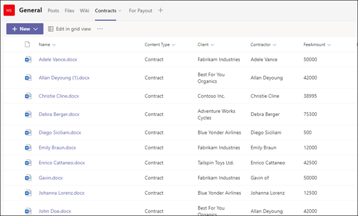

# <a name="step-2-use-microsoft-teams-to-create-your-contract-management-channel"></a><span data-ttu-id="ce4ab-104">Steg 2.</span><span class="sxs-lookup"><span data-stu-id="ce4ab-104">Step 2.</span></span> <span data-ttu-id="ce4ab-105">Använd Microsoft Teams för att skapa din kanal för kontraktshantering</span><span class="sxs-lookup"><span data-stu-id="ce4ab-105">Use Microsoft Teams to create your contract management channel</span></span>

<span data-ttu-id="ce4ab-106">När din organisation skapar en lösning för kontraktshantering behöver du en central plats där intressenter kan granska och hantera kontrakt.</span><span class="sxs-lookup"><span data-stu-id="ce4ab-106">When your organization sets up a contracts management solution, you need a central location in which stakeholders can review and manage contracts.</span></span> <span data-ttu-id="ce4ab-107">För detta ändamål kan du använda [Microsoft Teams](/microsoftteams/) konfigurera en kanal Teams och använda funktionerna i Teams för att:</span><span class="sxs-lookup"><span data-stu-id="ce4ab-107">For this purpose, you can use [Microsoft Teams](/microsoftteams/) to set up a Teams channel and use the features in Teams to:</span></span>

- <span data-ttu-id="ce4ab-108">**Skapa en plats för intressenter för att enkelt kunna se alla kontrakt som kräver åtgärder.**</span><span class="sxs-lookup"><span data-stu-id="ce4ab-108">**Create a location for stakeholders to easily see all contracts that require action.**</span></span> <span data-ttu-id="ce4ab-109">I Teams kan du till exempel  skapa fliken Kontrakt i kanalen Kontraktshantering där medlemmarna kan se en användbar panelvy över alla kontrakt som kräver godkännande.</span><span class="sxs-lookup"><span data-stu-id="ce4ab-109">For example, in Teams you can create a **Contracts** tab in the Contract Management channel in which members can see a useful tile view of all contracts that need approval.</span></span> <span data-ttu-id="ce4ab-110">Du kan också konfigurera vyn så att varje "kort" visar viktig information som är viktig för dig (t.ex. *klient,* leverantörer och *avgiftsbelopp).*</span><span class="sxs-lookup"><span data-stu-id="ce4ab-110">You can also configure the view so that each "card" lists the important data you care about (such as *Client*, *Contractor*, and *Fee amount*).</span></span>

     

- <span data-ttu-id="ce4ab-112">**Ha en plats där medlemmarna kan interagera med varandra och se viktiga händelser.**</span><span class="sxs-lookup"><span data-stu-id="ce4ab-112">**Have a location for members to interact with each other and see important events.**</span></span> <span data-ttu-id="ce4ab-113">I Teams till exempel kan  fliken Inlägg användas för att ha konversationer, få uppdateringar och visa åtgärder (till exempel en medlem som avvisar ett kontrakt).</span><span class="sxs-lookup"><span data-stu-id="ce4ab-113">For example, in Teams, the **Posts** tab can be used to have conversations, get updates, and see actions (such as a member rejecting a contract).</span></span> <span data-ttu-id="ce4ab-114">När något har hänt (till exempel om  ett nytt avtal har skickats in för godkännande) kan fliken Inlägg inte bara användas för att meddela den, utan också för att spara den.</span><span class="sxs-lookup"><span data-stu-id="ce4ab-114">When something has happened (such as a new contract submitted for approval), the **Posts** tab can be used not only to announce it, but also to keep a record of it.</span></span> <span data-ttu-id="ce4ab-115">Och om medlemmarna prenumererar på aviseringar får de ett meddelande när det finns en uppdatering.</span><span class="sxs-lookup"><span data-stu-id="ce4ab-115">And if members subscribe to notifications, they'll get notified whenever there's an update.</span></span>

     

- <span data-ttu-id="ce4ab-117">**Ha en plats där medlemmarna kan se godkända kontrakt för att veta när de kan skickas in för betalning.**</span><span class="sxs-lookup"><span data-stu-id="ce4ab-117">**Have a location for members to see approved contracts to know when they can be submitted for payment.**</span></span> <span data-ttu-id="ce4ab-118">I SharePoint fall måste du skapa en  lista med utbetalnings och ta med kolumner för **Klient,** Leverantörer och Avgiftsbelopp **och** välja Enskild rad med **text** som kolumntyp.</span><span class="sxs-lookup"><span data-stu-id="ce4ab-118">In SharePoint, you'll need to create a **For Payout** list and include columns for **Client**, **Contractor**, and **Fee amount**, selecting **Single line of text** as the column type.</span></span> <span data-ttu-id="ce4ab-119">Du måste lägga till  listan För utbetalning som en Teams fliken i kanalen Kontraktshantering, ungefär som du gör för [ **fliken** Kontrakt.](solution-manage-contracts-step2.md#attach-your-sharepoint-document-library-to-the-contracts-tab) På **fliken För** utbetalningar visas alla kontrakt som ska skickas in för betalning.</span><span class="sxs-lookup"><span data-stu-id="ce4ab-119">You'll need to add the **For Payout** list as a Teams tab in the Contract Management channel, similar to [what you'll do for the **Contracts** tab](solution-manage-contracts-step2.md#attach-your-sharepoint-document-library-to-the-contracts-tab). The **For Payout** tab will list all contracts that will need to be submitted for payment.</span></span> <span data-ttu-id="ce4ab-120">Du kan enkelt utöka den här lösningen så att den istället skriver den här informationen direkt till en ekonomisk app från tredje part (till exempel Dynamics CRM).</span><span class="sxs-lookup"><span data-stu-id="ce4ab-120">You can easily extend this solution to instead write this information directly to a third-party financial application (for example, Dynamics CRM).</span></span> 


## <a name="attach-your-sharepoint-document-library-to-the-contracts-tab"></a><span data-ttu-id="ce4ab-121">Bifoga ditt SharePoint dokumentbibliotek på fliken Kontrakt</span><span class="sxs-lookup"><span data-stu-id="ce4ab-121">Attach your SharePoint document library to the Contracts tab</span></span>

<span data-ttu-id="ce4ab-122">När du har skapat **fliken** Kontrakt i kanalen Kontraktshantering måste du bifoga ditt SharePoint [till det](https://support.microsoft.com/office/add-a-sharepoint-page-list-or-document-library-as-a-tab-in-teams-131edef1-455f-4c67-a8ce-efa2ebf25f0b).</span><span class="sxs-lookup"><span data-stu-id="ce4ab-122">After you create a **Contracts** tab in your Contracts Management channel, you need to [attach your SharePoint document library to it](https://support.microsoft.com/office/add-a-sharepoint-page-list-or-document-library-as-a-tab-in-teams-131edef1-455f-4c67-a8ce-efa2ebf25f0b).</span></span> <span data-ttu-id="ce4ab-123">Den SharePoint dokumentbibliotek som du vill bifoga är den där du SharePoint Syntex din mall för dokument förstå i föregående avsnitt.</span><span class="sxs-lookup"><span data-stu-id="ce4ab-123">The SharePoint document library you want to attach is the one in which you applied your SharePoint Syntex document understanding model to in the previous section.</span></span>

<span data-ttu-id="ce4ab-124">När du bifogat SharePoint-dokumentbiblioteket kan du visa alla klassificerade kontrakt i en standardlistvy.</span><span class="sxs-lookup"><span data-stu-id="ce4ab-124">After you attach the SharePoint document library, you'll be able to view any classified contracts through a default list view.</span></span>

   

## <a name="customize-your-contracts-tab-tile-view"></a><span data-ttu-id="ce4ab-126">Anpassa panelvyn på fliken Kontrakt</span><span class="sxs-lookup"><span data-stu-id="ce4ab-126">Customize your Contracts tab tile view</span></span>

> [!NOTE]
> <span data-ttu-id="ce4ab-127">Det här avsnittet refererar till kodexempel som finns [iContractTileFormatting.js](https://github.com/pnp/syntex-samples/blob/main/scenario%20assets/Contracts%20Management/View%20Formatter/ContractTileFormatting.json) filen som ingår i lagringsplatsen för lösningstillgångar [i kontraktshantering.](https://github.com/pnp/syntex-samples/tree/main/scenario%20assets/Contracts%20Management)</span><span class="sxs-lookup"><span data-stu-id="ce4ab-127">This section references code examples that are contained in the [ContractTileFormatting.json](https://github.com/pnp/syntex-samples/blob/main/scenario%20assets/Contracts%20Management/View%20Formatter/ContractTileFormatting.json) file that is included in the [Contracts Management Solution Assets repository](https://github.com/pnp/syntex-samples/tree/main/scenario%20assets/Contracts%20Management).</span></span>

<span data-ttu-id="ce4ab-128">Även Teams visa kontrakten i en panelvy kan du anpassa dem för att visa de kontraktsdata du vill göra synliga på kontraktskortet.</span><span class="sxs-lookup"><span data-stu-id="ce4ab-128">While Teams lets you view your contracts in a tile view, you might want to customize it to view the contract data you want to make visible in the contract card.</span></span> <span data-ttu-id="ce4ab-129">För fliken Kontrakt är **det till** exempel viktigt att medlemmarna ser klienten, leverantören och avgiftsbeloppet på kontraktskortet.</span><span class="sxs-lookup"><span data-stu-id="ce4ab-129">For example, for the **Contracts** tab, it is important for members to see the client, contractor, and fee amount on the contract card.</span></span> <span data-ttu-id="ce4ab-130">Alla dessa fält har extraherats från varje kontrakt via din SharePoint Syntex modell som tillämpats på ditt dokumentbibliotek.</span><span class="sxs-lookup"><span data-stu-id="ce4ab-130">All of these fields were extracted from each contract through your SharePoint Syntex model that was applied to your document library.</span></span> <span data-ttu-id="ce4ab-131">Du vill också kunna ändra panelrubrikfältet till olika färger för varje status så att medlemmarna enkelt kan se var avtalet ligger i godkännandeprocessen.</span><span class="sxs-lookup"><span data-stu-id="ce4ab-131">You also want to be able to change the tile header bar to different colors for each status so that members can easily see where the contract is in the approval process.</span></span> <span data-ttu-id="ce4ab-132">Alla godkända kontrakt kommer till exempel att ha en blå rubrikfält.</span><span class="sxs-lookup"><span data-stu-id="ce4ab-132">For example, all approved contracts will have a blue header bar.</span></span>

   

<span data-ttu-id="ce4ab-134">Den anpassade panelvyn du använder kräver att du gör ändringar i JSON-filen som används för att formatera den aktuella panelvyn.</span><span class="sxs-lookup"><span data-stu-id="ce4ab-134">The custom tile view you use requires you to make changes to the JSON file used to format the current tile view.</span></span> <span data-ttu-id="ce4ab-135">Du kan referera till den JSON-fil som används för att skapa kortvyn genom [att tittaContractTileFormatting.jsfilen.](https://github.com/pnp/syntex-samples/blob/main/scenario%20assets/Contracts%20Management/View%20Formatter/ContractTileFormatting.json)</span><span class="sxs-lookup"><span data-stu-id="ce4ab-135">You can reference the JSON file used to create the card view by looking at the [ContractTileFormatting.json](https://github.com/pnp/syntex-samples/blob/main/scenario%20assets/Contracts%20Management/View%20Formatter/ContractTileFormatting.json) file.</span></span> <span data-ttu-id="ce4ab-136">I följande avsnitt visas specifika avsnitt i koden för funktioner som finns på kontraktskorten.</span><span class="sxs-lookup"><span data-stu-id="ce4ab-136">In the following sections, you'll see specific sections of the code for features that are in the contract cards.</span></span>

<span data-ttu-id="ce4ab-137">Om du vill se eller göra ändringar i JSON-koden för vyn i din Teams-kanal går du till Teams-kanalen, väljer listrutan Vy och väljer sedan **Formatera aktuell vy.**</span><span class="sxs-lookup"><span data-stu-id="ce4ab-137">If you want to see or make changes to the JSON code for your view in your Teams channel, in the Teams channel, select the view drop-down menu, and then select **Format current view**.</span></span>

   

## <a name="card-size-and-shape"></a><span data-ttu-id="ce4ab-139">Kortstorlek och -form</span><span class="sxs-lookup"><span data-stu-id="ce4ab-139">Card size and shape</span></span>

<span data-ttu-id="ce4ab-140">I [ContractTileFormatting.jsfilen](https://github.com/pnp/syntex-samples/blob/main/scenario%20assets/Contracts%20Management/View%20Formatter/ContractTileFormatting.json) finns i följande avsnitt för att se koden för hur kortets storlek och form är formaterade.</span><span class="sxs-lookup"><span data-stu-id="ce4ab-140">In the [ContractTileFormatting.json](https://github.com/pnp/syntex-samples/blob/main/scenario%20assets/Contracts%20Management/View%20Formatter/ContractTileFormatting.json) file, look at the following section to see the code for how the size and shape of the card is formatted.</span></span>

```JSON
                  {
                    "elmType": "div",
                    "style": {
                      "background-color": "#f5f5f5",
                      "padding": "5px",
                      "width": "180px"
                    },
                    "children": [
                      {
                        "elmType": "img",
                        "attributes": {
                          "src": "@thumbnail.large"
                        },
                        "style": {
                          "width": "185px",
                          "height": "248px"
                        }
                      }
```

## <a name="contract-status"></a><span data-ttu-id="ce4ab-141">Kontraktsstatus</span><span class="sxs-lookup"><span data-stu-id="ce4ab-141">Contract status</span></span>

<span data-ttu-id="ce4ab-142">Med följande kod kan du ange status för varje titelkort.</span><span class="sxs-lookup"><span data-stu-id="ce4ab-142">The following code lets you define the status of each title card.</span></span> <span data-ttu-id="ce4ab-143">Observera att varje statusvärde *(Ny,* *I* *granskning,* Godkänd och *Avvisad)* visar olika färgkoder för varje statusvärde.</span><span class="sxs-lookup"><span data-stu-id="ce4ab-143">Note that each status value (*New*, *In review*, *Approved*, and *Rejected*) will display a different color code for each.</span></span> <span data-ttu-id="ce4ab-144">I [ContractTileFormatting.jsfilen](https://github.com/pnp/syntex-samples/blob/main/scenario%20assets/Contracts%20Management/View%20Formatter/ContractTileFormatting.json) tittar du på avsnittet som definierar statusen.</span><span class="sxs-lookup"><span data-stu-id="ce4ab-144">In the [ContractTileFormatting.json](https://github.com/pnp/syntex-samples/blob/main/scenario%20assets/Contracts%20Management/View%20Formatter/ContractTileFormatting.json) file, look at the section that defines the status.</span></span>

```JSON
          {
            "elmType": "div",
            "children": [
              {
                "elmType": "div",
                "style": {
                  "color": "white",
                  "background-color": "=if([$Status] == 'New', '#00b7c3', if([$Status] == 'In review', '#ffaa44', if([$Status] == 'Approved', '#0078d4', if([$Status] == 'Rejected', '#d13438', '#8378de'))))",
                  "padding": "5px 15px",
                  "height": "auto",
                  "text-transform": "uppercase",
                  "font-size": "12.5px"
                },
                "txtContent": "[$Status]"
              }
```

## <a name="extracted-fields"></a><span data-ttu-id="ce4ab-145">Extraherade fält</span><span class="sxs-lookup"><span data-stu-id="ce4ab-145">Extracted fields</span></span>

<span data-ttu-id="ce4ab-146">Varje kontraktskort visar tre fält som har extraherats för varje kontrakt *(klient,* *leverantörer* och *avgiftsbelopp).*</span><span class="sxs-lookup"><span data-stu-id="ce4ab-146">Each contract card will display three fields that were extracted for each contract (*Client*, *Contractor*, and *Fee Amount*).</span></span> <span data-ttu-id="ce4ab-147">Dessutom vill du visa det tid/datum då filen klassificerades av den SharePoint Syntex användes för att identifiera den.</span><span class="sxs-lookup"><span data-stu-id="ce4ab-147">Additionally, you also want to display the time/date that the file was classified by the SharePoint Syntex model used to identify it.</span></span>

<span data-ttu-id="ce4ab-148">I [ContractTileFormatting.jsfilen](https://github.com/pnp/syntex-samples/blob/main/scenario%20assets/Contracts%20Management/View%20Formatter/ContractTileFormatting.json) definierar följande avsnitt var och en av dessa.</span><span class="sxs-lookup"><span data-stu-id="ce4ab-148">In the [ContractTileFormatting.json](https://github.com/pnp/syntex-samples/blob/main/scenario%20assets/Contracts%20Management/View%20Formatter/ContractTileFormatting.json) file, the following sections define each of these.</span></span>

### <a name="client"></a><span data-ttu-id="ce4ab-149">Klient</span><span class="sxs-lookup"><span data-stu-id="ce4ab-149">Client</span></span>

<span data-ttu-id="ce4ab-150">Det här avsnittet definierar hur "Klient" visas på kortet och använder värdet för det specifika avtalet.</span><span class="sxs-lookup"><span data-stu-id="ce4ab-150">This section defines how "Client" will display on the card, and uses the value for the specific contract.</span></span>

```JSON
                      {
                        "elmType": "div",
                        "style": {
                          "color": "#767676",
                          "font-size": "12px"
                        },
                        "txtContent": "Client"
                      },
                      {
                        "elmType": "div",
                        "style": {
                          "margin-bottom": "12px",
                          "font-size": "16px",
                          "font-weight": "600"
                        },
                        "txtContent": "[$Client]"
                      },
```

### <a name="contractor"></a><span data-ttu-id="ce4ab-151">Entreprenör</span><span class="sxs-lookup"><span data-stu-id="ce4ab-151">Contractor</span></span>

<span data-ttu-id="ce4ab-152">Det här avsnittet definierar hur "Entreprenör" visas på kortet och använder värdet för det specifika avtalet.</span><span class="sxs-lookup"><span data-stu-id="ce4ab-152">This section defines how the "Contractor" will display on the card, and uses the value for the specific contract.</span></span>

```JSON
                        {
                          "elmType": "div",
                          "txtContent": "Contractor",
                          "style": {
                            "color": "#767676",
                            "font-size": "12px",
                            "margin-bottom": "2px"
                          }
                        },
                        {
                          "elmType": "div",
                          "style": {
                            "margin-bottom": "12px",
                            "font-size": "14px"
                          },
                          "txtContent": "[$Contractor]"
                        },
```

### <a name="fee-amount"></a><span data-ttu-id="ce4ab-153">Avgiftsbelopp</span><span class="sxs-lookup"><span data-stu-id="ce4ab-153">Fee amount</span></span>

<span data-ttu-id="ce4ab-154">Det här avsnittet definierar hur "Avgiftsbelopp" visas på kortet och använder värdet för det specifika avtalet.</span><span class="sxs-lookup"><span data-stu-id="ce4ab-154">This section defines how the "Fee Amount" will display on the card, and uses the value for the specific contract.</span></span>

```JSON
                      {
                        "elmType": "div",
                        "txtContent": "Fee amount",
                        "style": {
                          "color": "#767676",
                          "font-size": "12px",
                          "margin-bottom": "2px"
                        }
                      },
                      {
                        "elmType": "div",
                        "style": {
                          "margin-bottom": "12px",
                          "font-size": "14px"
                        },
                        "txtContent": "[$FeeAmount]"
                      },
```

### <a name="classification-date"></a><span data-ttu-id="ce4ab-155">Klassificeringsdatum</span><span class="sxs-lookup"><span data-stu-id="ce4ab-155">Classification date</span></span>

<span data-ttu-id="ce4ab-156">Det här avsnittet definierar hur "Klassificering" visas på kortet och använder värdet för det specifika avtalet.</span><span class="sxs-lookup"><span data-stu-id="ce4ab-156">This section defines how "Classification" will display on the card, and uses the value for the specific contract.</span></span>

```JSON
                      {
                        "elmType": "div",
                        "txtContent": "Classified",
                        "style": {
                          "color": "#767676",
                          "font-size": "12px",
                          "margin-bottom": "2px"
                        }
                      },
                      {
                        "elmType": "div",
                        "style": {
                          "margin-bottom": "12px",
                          "font-size": "14px"
                        },
                        "txtContent": "[$PrimeLastClassified]"
                      }
```

## <a name="next-step"></a><span data-ttu-id="ce4ab-157">Nästa steg</span><span class="sxs-lookup"><span data-stu-id="ce4ab-157">Next step</span></span>

[<span data-ttu-id="ce4ab-158">Steg 3. Använd Power Automate för att skapa ett flöde för att bearbeta dina kontrakt</span><span class="sxs-lookup"><span data-stu-id="ce4ab-158">Step 3. Use Power Automate to create your flow to process your contracts</span></span>](solution-manage-contracts-step3.md)
