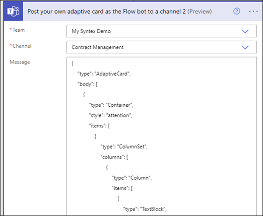

# <a name="step-3-use-power-automate-to-create-your-flow-to-process-your-contracts"></a>Steg 3. Använd Power Automate för att skapa ett flöde för att bearbeta dina kontrakt

Du har skapat din kanal för kontraktshantering och bifogat ditt SharePoint dokumentbibliotek. Nästa steg är att skapa ett Power Automate flöde för att bearbeta de kontrakt som SharePoint Syntex i modellen identifierar och klassificerar. Du kan göra det här steget genom [att skapa Power Automate ett flöde i SharePoint-dokumentbiblioteket](https://support.microsoft.com/office/create-a-flow-for-a-list-or-library-in-sharepoint-or-onedrive-a9c3e03b-0654-46af-a254-20252e580d01).

För din lösning för kontraktshantering vill du skapa ett Power Automate för att göra följande åtgärder:

-  När ett kontrakt har klassificerats av din SharePoint Syntex kan du ändra kontraktsstatus till **Vid granskning.**
- Avtalet granskas sedan och godkänns eller avvisas.
- För godkända kontrakt publiceras kontraktsinformationen på en flik för betalningsbearbetning.
- För avvisade kontrakt meddelas teamet för vidare analys. 

Följande diagram visar Power Automate för kontraktshanteringslösningen.


## <a name="prepare-your-contract-for-review"></a>Förbered ditt kontrakt för granskning

När ett kontrakt identifieras och klassificeras av din modell SharePoint Syntex dokumentförståelse kommer Power Automate att först ändra status till **Vid granskning.**


När du checkat ut filen ändrar du statusvärdet till **Vid granskning**.


Nästa steg är att skapa ett adaptivt kort som anger att avtalet väntar på granskning och publicerar det i kanalen Kontraktshantering.


Följande kod är det JSON som används för det här steget i Power Automate flöde.

```JSON
{
"$schema": "http://adaptivecards.io/schemas/adaptive-card.json",
"type": "AdaptiveCard",
"version": "1.0",
"body": [
    {
    "type": "TextBlock",
    "text": "Contract approval request",
    "size": "large",
    "weight": "bolder",
     "wrap": true
    },
        {
            "type": "Container",
            "items": [
                {
                    "type": "FactSet",
                    "spacing": "Large",
                    "facts": [
                        {
                            "title": "Client",
                            "value": "@{triggerOutputs()?['body/Client']}"
                        },
                        {
                            "title": "Contractor",
                            "value": "@{triggerOutputs()?['body/Contractor']}"
                        },
                        {
                            "title": "Fee amount",
                            "value": "@{triggerOutputs()?['body/FeeAmount']}"
                        },
                        {
                            "title": "Date created",
                            "value": "@{triggerOutputs()?['body/Modified']} "
                        },
                        {
                            "title": "Link",
                            "value": "[@{triggerOutputs()?['body/{FilenameWithExtension}']}](@{triggerOutputs()?['body/{Link}']})"
                        }
                    ]
                }
            ]
         },
    {
    "type": "TextBlock",
    "text": "Comment:"
    },
        {
            "type": "Input.Text",
            "placeholder": "Enter comments",
            "id": "acComments"
        }
],
"actions": [
    {
    "type": "Action.Submit",
    "title": "Approve",
    "data": {
        "x": "Approve"
    }
    },
    {
    "type": "Action.Submit",
    "title": "Reject",
    "data": {
        "x": "Reject"
    }
    }
]
}
```


## <a name="conditional-context"></a>Villkorsstyrd kontext

I ditt flöde måste du skapa ett villkor där avtalet antingen [godkänns](#if-the-contract-is-approved) eller [avvisas.](#if-the-contract-is-rejected)


## <a name="if-the-contract-is-approved"></a>Om avtalet godkänns

När ett kontrakt har godkänts inträffar följande:

- På **fliken** Kontrakt ändras statusen i kontraktskortet till **Godkänd.**

   

- I flödet ändras statusen till **Godkänd.**

   

- I den här lösningen läggs kontraktsdata till på **fliken För** utbetalning så att utbetalningarna kan hanteras. Den här processen kan utökas så att flödet kan skicka in avtal om betalning med en ekonomisk tredje part-app (till exempel Dynamics CRM).

   

- I flödet skapar du följande objekt för att flytta godkända kontrakt till **fliken För utbetalning.**

   

    Om du vill hämta uttrycken för den information Teams kort använder du värdena som visas i följande tabell.
 
    |Namn     |Expression |
    |---------|-----------|
    | Godkännandetillstånd  | brödtext('Post_an_Adaptive_Card_to_a_Teams_channel_and_wait_for_a_response')? ['submitActionId']         |
    | Godkänd av     | brödtext('Post_an_Adaptive_Card_to_a_Teams_channel_and_wait_for_a_response')? ['svarare'] ['displayName']        |
    | Godkännandedatum     | brödtext('Post_an_Adaptive_Card_to_a_Teams_channel_and_wait_for_a_response')? ['responseTime']         |
    | Kommentar     | brödtext('Post_an_Adaptive_Card_to_a_Teams_channel_and_wait_for_a_response')? ['data'] ['acComments']         |
    
    I följande exempel visas hur du använder formelrutan i Power Automate för att skriva ett uttryck.

       

- Ett adaptivt kort som anger att avtalet har godkänts skapas och publiceras i kanalen Kontraktshantering.

   

   


   Följande kod är det JSON som används för det här steget i Power Automate flöde.

```JSON
{ 
    "type": "AdaptiveCard",
    "body": [
        {
            "type": "Container",
            "style": "emphasis",
            "items": [
                {
                    "type": "ColumnSet",
                    "columns": [
                        {
                            "type": "Column",
                            "items": [
                                {
                                    "type": "TextBlock",
                                    "size": "Large",
                                    "weight": "Bolder",
                                    "text": "CONTRACT APPROVED"
                                }
                            ],
                            "width": "stretch"
                        }
                    ]
                }
            ],
            "bleed": true
        },
        {
            "type": "Container",
            "items": [
                {
                    "type": "FactSet",
                    "spacing": "Large",
                    "facts": [
                        {
                            "title": "Client",
                            "value": "@{triggerOutputs()?['body/Client']}"
                        },
                        {
                            "title": "Contractor",
                            "value": "@{triggerOutputs()?['body/Contractor']}"
                        },
                        {
                            "title": "Fee amount",
                            "value": "@{triggerOutputs()?['body/FeeAmount']}"
                        },
                        {
                            "title": "Approval by",
                            "value": "@{body('Post_an_Adaptive_Card_to_a_Teams_channel_and_wait_for_a_response')?['responder']['displayName']}"
                        },
                        {
                            "title": "Approved date",
                            "value": "@{body('Post_an_Adaptive_Card_to_a_Teams_channel_and_wait_for_a_response')?['responseTime']}"
                        },
                        {
                            "title": "Approval comment",
                            "value": "@{body('Post_an_Adaptive_Card_to_a_Teams_channel_and_wait_for_a_response')?['data']['acComments']}"
                        },
                        {
                            "title": " ",
                            "value": " "
                        },
                        {
                            "title": "Status",
                            "value": "Ready for payout"
                        }
                    ]
                }
            ]
        }
    ],
    "$schema": "http://adaptivecards.io/schemas/adaptive-card.json",
    "version": "1.2",
    "fallbackText": "This card requires Adaptive Cards v1.2 support to be rendered properly."
}
```

## <a name="if-the-contract-is-rejected"></a>Om avtalet avvisas

När ett kontrakt har avvisats inträffar följande:

- På **fliken** Kontrakt ändras statusen i kontraktskortet till **Avvisad**.

   

- I flödet checkar du ut kontraktsfilen, ändrar status till **Avvisat** och checkar sedan in filen igen.

   

- I flödet skapar du ett adaptivt kort som säger att avtalet har avvisats.

   

Följande kod är det JSON som används för det här steget i Power Automate flöde.

```JSON
{ 
    "type": "AdaptiveCard",
    "body": [
        {
            "type": "Container",
            "style": "attention",
            "items": [
                {
                    "type": "ColumnSet",
                    "columns": [
                        {
                            "type": "Column",
                            "items": [
                                {
                                    "type": "TextBlock",
                                    "size": "Large",
                                    "weight": "Bolder",
                                    "text": "CONTRACT REJECTED"
                                }
                            ],
                            "width": "stretch"
                        }
                    ]
                }
            ],
            "bleed": true
        },
        {
            "type": "Container",
            "items": [
                {
                    "type": "FactSet",
                    "spacing": "Large",
                    "facts": [
                        {
                            "title": "Client",
                            "value": "@{triggerOutputs()?['body/Client']}"
                        },
                        {
                            "title": "Contractor",
                            "value": "@{triggerOutputs()?['body/Contractor']}"
                        },
                        {
                            "title": "Fee amount",
                            "value": "@{triggerOutputs()?['body/FeeAmount']}"
                        },
                        {
                            "title": "Rejected by",
                            "value": "@{body('Post_an_Adaptive_Card_to_a_Teams_channel_and_wait_for_a_response')?['responder']['displayName']}"
                        },
                        {
                            "title": "Rejected date",
                            "value": "@{body('Post_an_Adaptive_Card_to_a_Teams_channel_and_wait_for_a_response')?['responseTime']}"
                        },
                        {
                            "title": "Comment",
                            "value": "@{body('Post_an_Adaptive_Card_to_a_Teams_channel_and_wait_for_a_response')?['data']['acComments']}"
                        },
                        {
                            "title": " ",
                            "value": " "
                        },
                        {
                            "title": "Status",
                            "value": "Needs review"
                        }
                    ]
                }
            ]
        }
    ],
    "$schema": "http://adaptivecards.io/schemas/adaptive-card.json",
    "version": "1.2",
    "fallbackText": "This card requires Adaptive Cards v1.2 support to be rendered properly."
}
```

- Kortet publiceras i kanalen Kontraktshantering.

   