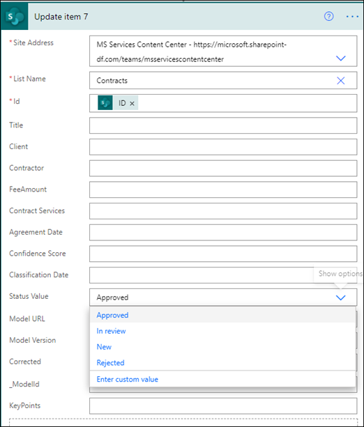

# <a name="step-3-use-power-automate-to-create-your-flow-to-process-your-contracts"></a><span data-ttu-id="8e583-104">Steg 3.</span><span class="sxs-lookup"><span data-stu-id="8e583-104">Step 3.</span></span> <span data-ttu-id="8e583-105">Använd Power Automate för att skapa ett flöde för att bearbeta dina kontrakt</span><span class="sxs-lookup"><span data-stu-id="8e583-105">Use Power Automate to create your flow to process your contracts</span></span>

<span data-ttu-id="8e583-106">Du har skapat din kanal för kontraktshantering och bifogat ditt SharePoint dokumentbibliotek.</span><span class="sxs-lookup"><span data-stu-id="8e583-106">You've created your Contract Management channel and have attached your SharePoint document library.</span></span> <span data-ttu-id="8e583-107">Nästa steg är att skapa ett Power Automate flöde för att bearbeta de kontrakt som SharePoint Syntex i modellen identifierar och klassificerar.</span><span class="sxs-lookup"><span data-stu-id="8e583-107">The next step is to create a Power Automate flow to process your contracts that your SharePoint Syntex model identifies and classifies.</span></span> <span data-ttu-id="8e583-108">Du kan göra det här steget genom [att skapa Power Automate ett flöde i SharePoint-dokumentbiblioteket](https://support.microsoft.com/office/create-a-flow-for-a-list-or-library-in-sharepoint-or-onedrive-a9c3e03b-0654-46af-a254-20252e580d01).</span><span class="sxs-lookup"><span data-stu-id="8e583-108">You can do this step by [creating a Power Automate flow in your SharePoint document library](https://support.microsoft.com/office/create-a-flow-for-a-list-or-library-in-sharepoint-or-onedrive-a9c3e03b-0654-46af-a254-20252e580d01).</span></span>

<span data-ttu-id="8e583-109">För din lösning för kontraktshantering vill du skapa ett Power Automate för att göra följande åtgärder:</span><span class="sxs-lookup"><span data-stu-id="8e583-109">For your contracts management solution, you want to create a Power Automate flow to do the following actions:</span></span>

-  <span data-ttu-id="8e583-110">När ett kontrakt har klassificerats av din SharePoint Syntex kan du ändra kontraktsstatus till **Vid granskning.**</span><span class="sxs-lookup"><span data-stu-id="8e583-110">After a contract has been classified by your SharePoint Syntex model, change the contract status to **In review**.</span></span>
- <span data-ttu-id="8e583-111">Avtalet granskas sedan och godkänns eller avvisas.</span><span class="sxs-lookup"><span data-stu-id="8e583-111">The contract is then reviewed and is either approved or rejected.</span></span>
- <span data-ttu-id="8e583-112">För godkända kontrakt publiceras kontraktsinformationen på en flik för betalningsbearbetning.</span><span class="sxs-lookup"><span data-stu-id="8e583-112">For approved contracts, the contract information is posted to a tab for payment processing.</span></span>
- <span data-ttu-id="8e583-113">För avvisade kontrakt meddelas teamet för vidare analys.</span><span class="sxs-lookup"><span data-stu-id="8e583-113">For rejected contracts, the team is notified for further analysis.</span></span> 

<span data-ttu-id="8e583-114">Följande diagram visar Power Automate för kontraktshanteringslösningen.</span><span class="sxs-lookup"><span data-stu-id="8e583-114">The following diagram shows the Power Automate flow for the contract management solution.</span></span>


## <a name="prepare-your-contract-for-review"></a><span data-ttu-id="8e583-116">Förbered ditt kontrakt för granskning</span><span class="sxs-lookup"><span data-stu-id="8e583-116">Prepare your contract for review</span></span>

<span data-ttu-id="8e583-117">När ett kontrakt identifieras och klassificeras av din modell SharePoint Syntex dokumentförståelse kommer Power Automate att först ändra status till **Vid granskning.**</span><span class="sxs-lookup"><span data-stu-id="8e583-117">When a contract is identified and classified by your SharePoint Syntex document understanding model, the Power Automate flow will first change the status to **In review**.</span></span>


<span data-ttu-id="8e583-119">När du checkat ut filen ändrar du statusvärdet till **Vid granskning**.</span><span class="sxs-lookup"><span data-stu-id="8e583-119">After checking out the file, change the status value to **In review**.</span></span>


<span data-ttu-id="8e583-121">Nästa steg är att skapa ett adaptivt kort som anger att avtalet väntar på granskning och publicerar det i kanalen Kontraktshantering.</span><span class="sxs-lookup"><span data-stu-id="8e583-121">The next step is to create an adaptive card stating that the contract is waiting for review and posting it to the Contract Management channel.</span></span>


<span data-ttu-id="8e583-124">Följande kod är det JSON som används för det här steget i Power Automate flöde.</span><span class="sxs-lookup"><span data-stu-id="8e583-124">The following code is the JSON used for this step in the Power Automate flow.</span></span>

```JSON
{
"$schema": "http://adaptivecards.io/schemas/adaptive-card.json",
"type": "AdaptiveCard",
"version": "1.0",
"body": [
    {
    "type": "TextBlock",
    "text": "Contract approval request",
    "size": "large",
    "weight": "bolder",
     "wrap": true
    },
        {
            "type": "Container",
            "items": [
                {
                    "type": "FactSet",
                    "spacing": "Large",
                    "facts": [
                        {
                            "title": "Client",
                            "value": "@{triggerOutputs()?['body/Client']}"
                        },
                        {
                            "title": "Contractor",
                            "value": "@{triggerOutputs()?['body/Contractor']}"
                        },
                        {
                            "title": "Fee amount",
                            "value": "@{triggerOutputs()?['body/FeeAmount']}"
                        },
                        {
                            "title": "Date created",
                            "value": "@{triggerOutputs()?['body/Modified']} "
                        },
                        {
                            "title": "Link",
                            "value": "[@{triggerOutputs()?['body/{FilenameWithExtension}']}](@{triggerOutputs()?['body/{Link}']})"
                        }
                    ]
                }
            ]
         },
    {
    "type": "TextBlock",
    "text": "Comment:"
    },
        {
            "type": "Input.Text",
            "placeholder": "Enter comments",
            "id": "acComments"
        }
],
"actions": [
    {
    "type": "Action.Submit",
    "title": "Approve",
    "data": {
        "x": "Approve"
    }
    },
    {
    "type": "Action.Submit",
    "title": "Reject",
    "data": {
        "x": "Reject"
    }
    }
]
}
```


## <a name="conditional-context"></a><span data-ttu-id="8e583-125">Villkorsstyrd kontext</span><span class="sxs-lookup"><span data-stu-id="8e583-125">Conditional context</span></span>

<span data-ttu-id="8e583-126">I ditt flöde måste du skapa ett villkor där avtalet antingen [godkänns](#if-the-contract-is-approved) eller [avvisas.](#if-the-contract-is-rejected)</span><span class="sxs-lookup"><span data-stu-id="8e583-126">In your flow, next you need to create a condition in which your contract will be either  [approved](#if-the-contract-is-approved) or [rejected](#if-the-contract-is-rejected).</span></span>


## <a name="if-the-contract-is-approved"></a><span data-ttu-id="8e583-128">Om avtalet godkänns</span><span class="sxs-lookup"><span data-stu-id="8e583-128">If the contract is approved</span></span>

<span data-ttu-id="8e583-129">När ett kontrakt har godkänts inträffar följande:</span><span class="sxs-lookup"><span data-stu-id="8e583-129">When a contract has been approved, the following things occur:</span></span>

- <span data-ttu-id="8e583-130">På **fliken** Kontrakt ändras statusen i kontraktskortet till **Godkänd.**</span><span class="sxs-lookup"><span data-stu-id="8e583-130">On the **Contracts** tab, the status in the contract card will change to **Approved**.</span></span>

   

- <span data-ttu-id="8e583-132">I flödet ändras statusen till **Godkänd.**</span><span class="sxs-lookup"><span data-stu-id="8e583-132">In your flow, the status is changed to **Approved**.</span></span>

   

- <span data-ttu-id="8e583-134">I den här lösningen läggs kontraktsdata till på **fliken För** utbetalning så att utbetalningarna kan hanteras.</span><span class="sxs-lookup"><span data-stu-id="8e583-134">In this solution, the contract data will be added to the **For Payout** tab so that the payouts can be managed.</span></span> <span data-ttu-id="8e583-135">Den här processen kan utökas så att flödet kan skicka in avtal om betalning med en ekonomisk tredje part-app (till exempel Dynamics CRM).</span><span class="sxs-lookup"><span data-stu-id="8e583-135">This process can be extended to allow the flow to submit the contracts for payment by a third-party financial application (for example, Dynamics CRM).</span></span>

   

- <span data-ttu-id="8e583-137">I flödet skapar du följande objekt för att flytta godkända kontrakt till **fliken För utbetalning.**</span><span class="sxs-lookup"><span data-stu-id="8e583-137">In the flow, you create the following item to move approved contracts to the **For Payout** tab.</span></span>

   

    <span data-ttu-id="8e583-139">Om du vill hämta uttrycken för den information Teams kort använder du värdena som visas i följande tabell.</span><span class="sxs-lookup"><span data-stu-id="8e583-139">To get the expressions for the information needed from the Teams card, use the values shown in the following table.</span></span>
 
    |<span data-ttu-id="8e583-140">Namn</span><span class="sxs-lookup"><span data-stu-id="8e583-140">Name</span></span>     |<span data-ttu-id="8e583-141">Expression</span><span class="sxs-lookup"><span data-stu-id="8e583-141">Expression</span></span> |
    |---------|-----------|
    | <span data-ttu-id="8e583-142">Godkännandetillstånd</span><span class="sxs-lookup"><span data-stu-id="8e583-142">Approval state</span></span>  | <span data-ttu-id="8e583-143">brödtext('Post_an_Adaptive_Card_to_a_Teams_channel_and_wait_for_a_response')? ['submitActionId']</span><span class="sxs-lookup"><span data-stu-id="8e583-143">body('Post_an_Adaptive_Card_to_a_Teams_channel_and_wait_for_a_response')?['submitActionId']</span></span>         |
    | <span data-ttu-id="8e583-144">Godkänd av</span><span class="sxs-lookup"><span data-stu-id="8e583-144">Approved by</span></span>     | <span data-ttu-id="8e583-145">brödtext('Post_an_Adaptive_Card_to_a_Teams_channel_and_wait_for_a_response')? ['svarare'] ['displayName']</span><span class="sxs-lookup"><span data-stu-id="8e583-145">body('Post_an_Adaptive_Card_to_a_Teams_channel_and_wait_for_a_response')?['responder']['displayName']</span></span>        |
    | <span data-ttu-id="8e583-146">Godkännandedatum</span><span class="sxs-lookup"><span data-stu-id="8e583-146">Approval date</span></span>     | <span data-ttu-id="8e583-147">brödtext('Post_an_Adaptive_Card_to_a_Teams_channel_and_wait_for_a_response')? ['responseTime']</span><span class="sxs-lookup"><span data-stu-id="8e583-147">body('Post_an_Adaptive_Card_to_a_Teams_channel_and_wait_for_a_response')?['responseTime']</span></span>         |
    | <span data-ttu-id="8e583-148">Kommentar</span><span class="sxs-lookup"><span data-stu-id="8e583-148">Comment</span></span>     | <span data-ttu-id="8e583-149">brödtext('Post_an_Adaptive_Card_to_a_Teams_channel_and_wait_for_a_response')? ['data'] ['acComments']</span><span class="sxs-lookup"><span data-stu-id="8e583-149">body('Post_an_Adaptive_Card_to_a_Teams_channel_and_wait_for_a_response')?['data']['acComments']</span></span>         |
    
    <span data-ttu-id="8e583-150">I följande exempel visas hur du använder formelrutan i Power Automate för att skriva ett uttryck.</span><span class="sxs-lookup"><span data-stu-id="8e583-150">The following example shows how to use the formula box in Power Automate to write an expression.</span></span>

       

- <span data-ttu-id="8e583-152">Ett adaptivt kort som anger att avtalet har godkänts skapas och publiceras i kanalen Kontraktshantering.</span><span class="sxs-lookup"><span data-stu-id="8e583-152">An adaptive card stating that the contract has been approved is created and posted to the Contract Management channel.</span></span>

   

   


   <span data-ttu-id="8e583-155">Följande kod är det JSON som används för det här steget i Power Automate flöde.</span><span class="sxs-lookup"><span data-stu-id="8e583-155">The following code is the JSON used for this step in the Power Automate flow.</span></span>

```JSON
{ 
    "type": "AdaptiveCard",
    "body": [
        {
            "type": "Container",
            "style": "emphasis",
            "items": [
                {
                    "type": "ColumnSet",
                    "columns": [
                        {
                            "type": "Column",
                            "items": [
                                {
                                    "type": "TextBlock",
                                    "size": "Large",
                                    "weight": "Bolder",
                                    "text": "CONTRACT APPROVED"
                                }
                            ],
                            "width": "stretch"
                        }
                    ]
                }
            ],
            "bleed": true
        },
        {
            "type": "Container",
            "items": [
                {
                    "type": "FactSet",
                    "spacing": "Large",
                    "facts": [
                        {
                            "title": "Client",
                            "value": "@{triggerOutputs()?['body/Client']}"
                        },
                        {
                            "title": "Contractor",
                            "value": "@{triggerOutputs()?['body/Contractor']}"
                        },
                        {
                            "title": "Fee amount",
                            "value": "@{triggerOutputs()?['body/FeeAmount']}"
                        },
                        {
                            "title": "Approval by",
                            "value": "@{body('Post_an_Adaptive_Card_to_a_Teams_channel_and_wait_for_a_response')?['responder']['displayName']}"
                        },
                        {
                            "title": "Approved date",
                            "value": "@{body('Post_an_Adaptive_Card_to_a_Teams_channel_and_wait_for_a_response')?['responseTime']}"
                        },
                        {
                            "title": "Approval comment",
                            "value": "@{body('Post_an_Adaptive_Card_to_a_Teams_channel_and_wait_for_a_response')?['data']['acComments']}"
                        },
                        {
                            "title": " ",
                            "value": " "
                        },
                        {
                            "title": "Status",
                            "value": "Ready for payout"
                        }
                    ]
                }
            ]
        }
    ],
    "$schema": "http://adaptivecards.io/schemas/adaptive-card.json",
    "version": "1.2",
    "fallbackText": "This card requires Adaptive Cards v1.2 support to be rendered properly."
}
```

## <a name="if-the-contract-is-rejected"></a><span data-ttu-id="8e583-156">Om avtalet avvisas</span><span class="sxs-lookup"><span data-stu-id="8e583-156">If the contract is rejected</span></span>

<span data-ttu-id="8e583-157">När ett kontrakt har avvisats inträffar följande:</span><span class="sxs-lookup"><span data-stu-id="8e583-157">When a contract has been rejected, the following things occur:</span></span>

- <span data-ttu-id="8e583-158">På **fliken** Kontrakt ändras statusen i kontraktskortet till **Avvisad**.</span><span class="sxs-lookup"><span data-stu-id="8e583-158">On the **Contracts** tab, the status in the contract card will change to **Rejected**.</span></span>

   

- <span data-ttu-id="8e583-160">I flödet checkar du ut kontraktsfilen, ändrar status till **Avvisat** och checkar sedan in filen igen.</span><span class="sxs-lookup"><span data-stu-id="8e583-160">In your flow, you check out the contract file, change the status to **Rejected**, and then check the file back in.</span></span>

   

- <span data-ttu-id="8e583-162">I flödet skapar du ett adaptivt kort som säger att avtalet har avvisats.</span><span class="sxs-lookup"><span data-stu-id="8e583-162">In your flow, you create an adaptive card stating that the contract has been rejected.</span></span>

   

<span data-ttu-id="8e583-164">Följande kod är det JSON som används för det här steget i Power Automate flöde.</span><span class="sxs-lookup"><span data-stu-id="8e583-164">The following code is the JSON used for this step in the Power Automate flow.</span></span>

```JSON
{ 
    "type": "AdaptiveCard",
    "body": [
        {
            "type": "Container",
            "style": "attention",
            "items": [
                {
                    "type": "ColumnSet",
                    "columns": [
                        {
                            "type": "Column",
                            "items": [
                                {
                                    "type": "TextBlock",
                                    "size": "Large",
                                    "weight": "Bolder",
                                    "text": "CONTRACT REJECTED"
                                }
                            ],
                            "width": "stretch"
                        }
                    ]
                }
            ],
            "bleed": true
        },
        {
            "type": "Container",
            "items": [
                {
                    "type": "FactSet",
                    "spacing": "Large",
                    "facts": [
                        {
                            "title": "Client",
                            "value": "@{triggerOutputs()?['body/Client']}"
                        },
                        {
                            "title": "Contractor",
                            "value": "@{triggerOutputs()?['body/Contractor']}"
                        },
                        {
                            "title": "Fee amount",
                            "value": "@{triggerOutputs()?['body/FeeAmount']}"
                        },
                        {
                            "title": "Rejected by",
                            "value": "@{body('Post_an_Adaptive_Card_to_a_Teams_channel_and_wait_for_a_response')?['responder']['displayName']}"
                        },
                        {
                            "title": "Rejected date",
                            "value": "@{body('Post_an_Adaptive_Card_to_a_Teams_channel_and_wait_for_a_response')?['responseTime']}"
                        },
                        {
                            "title": "Comment",
                            "value": "@{body('Post_an_Adaptive_Card_to_a_Teams_channel_and_wait_for_a_response')?['data']['acComments']}"
                        },
                        {
                            "title": " ",
                            "value": " "
                        },
                        {
                            "title": "Status",
                            "value": "Needs review"
                        }
                    ]
                }
            ]
        }
    ],
    "$schema": "http://adaptivecards.io/schemas/adaptive-card.json",
    "version": "1.2",
    "fallbackText": "This card requires Adaptive Cards v1.2 support to be rendered properly."
}
```

- <span data-ttu-id="8e583-165">Kortet publiceras i kanalen Kontraktshantering.</span><span class="sxs-lookup"><span data-stu-id="8e583-165">The card is posted in the Contract Management channel.</span></span>

   