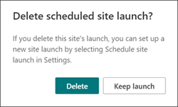

# <a name="launch-your-portal-using-the-sharepoint-portal-launch-scheduler"></a>Starta portalen med hjälp SharePoint- eller portalstartschemaläggeren

En portal är en SharePoint-kommunikationswebbplats i intranätet med hög trafik – en webbplats med allt från 10 000 till över 100 000 användare under några veckor. Använd portalstartschemaläggren för att starta portalen för att se till att användarna får en smidigare visningsupplevelse när de använder den nya SharePoint portalen.
<br>
<br>
Med portalstartschemaläggeren får du hjälp med att fasa in lanseringen genom att samla användare i vågor och hantera URL-omdirigeringar för den nya portalen. Under lanseringen av varje omgång kan du samla in feedback från användare, övervaka portalens prestanda och pausa lanseringen för att lösa problem innan du fortsätter med nästa omgång. Läs mer om hur du [planerar en portalstart i SharePoint](/microsoft-365/Enterprise/Planportallaunchroll-out?view=o365-worldwide).

**Det finns två typer av omdirigeringar:**

- **Dubbelriktad**: starta en ny modern SharePoint att ersätta en befintlig klassisk SharePoint eller modern portal
- **Omdirigera till en tillfällig sida**: starta en ny modern SharePoint portal utan befintlig SharePoint portal

Webbplatsbehörigheter måste ställas in separat från vågor som en del av lanseringen. Om du till exempel släpper en organisationsomfattande portal kan du ange behörigheter till "Alla utom externa användare" och sedan dela upp användarna i vågor med hjälp av säkerhetsgrupper. Att lägga till en säkerhetsgrupp i en omgång ger inte säkerhetsgruppen åtkomst till webbplatsen.

> [!NOTE]
>
> - Den här funktionen kommer att vara åtkomlig från **panelen Inställningar** på startsidan för SharePoint-kommunikationswebbplatser för kunder med riktad version från och med maj 2021 och blir tillgänglig för alla kunder senast i juli 2021
> - PowerShell-versionen av det här verktyget är tillgänglig i dag
> - Den här funktionen kan endast användas på moderna SharePoint kommunikationswebbplatser
> - Du måste ha behörigheten webbplatsägare för webbplatsen för att anpassa och schemalägga lanseringen av en portal
> - Lanseringar måste schemaläggas minst sju dagar i förväg och varje omgång kan pågå i en till sju dagar
> - Antalet vågor som krävs bestäms automatiskt av det förväntade antalet användare
> - Innan du schemalägger en portalstart [måste SharePoint för](https://aka.ms/perftool) att kontrollera att startsidan på webbplatsen är felfri
> - I slutet av lanseringen kommer alla användare med behörighet till webbplatsen att kunna komma åt den nya webbplatsen
> - Om din organisation använder [Viva Connections](/SharePoint/viva-connections)kan användarna se organisationens ikon i appfältet i Microsoft Teams, men när ikonen väljs kan användarna inte komma åt portalen förrän deras omgång har startats
> - Den här funktionen är inte tillgänglig för Office 365 Germany, Office 365 som drivs av 21Vianet (Kina) eller i Microsoft 365 för myndigheter i USA

## <a name="understand-the-differences-between-portal-launch-scheduler-options"></a>Förstå skillnaderna mellan alternativen för portalstartschemaläggare:

Tidigare kunde portalstarter bara schemaläggas via SharePoint PowerShell. Nu har du två alternativ som hjälper dig att schemalägga och hantera portalens lansering. Lär dig mer om de viktigaste skillnaderna mellan båda verktygen:

**SharePoint PowerShell-version:**

- Administratörsautentiseringsuppgifter krävs [för att använda SharePoint PowerShell](/powershell/sharepoint/sharepoint-online/introduction-sharepoint-online-management-shell)
- Minimikravet för en våg
- Schemalägg lanseringen baserat på UTC-tidszon (Coordinated Universal Time)

**I produktversion:**

- Autentiseringsuppgifter för webbplatsägare krävs
- Minimikravet för två vågor
- Schemalägga lanseringen baserat på portalens lokala tidszon enligt de nationella inställningarna

## <a name="get-started-using-the-portal-launch-scheduler"></a>Komma igång med portalstartschemaläggeren

1. Innan du använder schemaläggaren [](https://support.microsoft.com/office/share-a-site-958771a8-d041-4eb8-b51c-afea2eae3658) för portalen ska du lägga till  alla användare som behöver åtkomst till den här webbplatsen via Webbplatsbehörigheter som webbplatsägare, Webbplatsmedlem eller Besökare.

2. Börja sedan schemalägga portalens lansering genom att öppna portalstartschemaläggningen på ett av två sätt:

   **Alternativ 1:** De första gånger som du redigerar och publicerar om ändringar på startsidan – eller upp till startsidan version 3.0 – uppmanas du att använda schemaläggningsverktyget för portalstart. Välj **Schemalägg lansering** för att gå framåt med schemaläggning. Eller välj **Publicera om** för att publicera om sidredigeringarna utan att schemalägga lanseringen.

   

   **Alternativ 2:** Du kan när som helst gå till startsidan för SharePoint-kommunikationswebbplatsen, välja **Inställningar** och sedan Schemalägga lanseringen av webbplatsen för att schemalägga portalens lansering. 

   

3. Bekräfta sedan portalens hälsoresultat och gör förbättringar i portalen om det **behövs** med hjälp av siddiagnostik för [SharePoint](https://aka.ms/perftool) tills portalen får ett hälsoresultat. Välj sedan **Nästa**.

   

   > [!NOTE]
   > Du kan inte redigera webbplatsens namn och beskrivning från portalstartschemaläggaren och i stället  ändra den genom att **välja Inställningar** och sedan Webbplatsinformation på startsidan.

4. Välj **antalet förväntade användare** i listrutan. I den här bilden visas det antal användare som troligen behöver åtkomst till webbplatsen. Uppstartsschemat för portalen bestämmer automatiskt det bästa antalet vågor beroende på vilka användare som förväntas göra så här:

   - Mindre än 10 000 användare: två vågor
   - 10k-till-30k-användare: Tre vågor
   - 30k+ till 100 000 användare: Fem vågor
   - Fler än 100 000 användare: Fem vågor och kontakta microsoft via stegen som anges i Starta portalen med över 100 000 användare.

5. Fastställ sedan vilken **typ av omdirigering som** behövs:

   Alternativ 1: Skicka användare till en **befintlig SharePoint -sida (dubbelriktad)** – Använd det här alternativet när du startar en ny modern SharePoint-portal för att ersätta en SharePoint portal. Användare i aktiva vågor omdirigeras till den nya webbplatsen oavsett om de navigerar till den gamla eller nya webbplatsen. Användare i en icke-lanserad omgång som försöker komma åt den nya webbplatsen omdirigeras tillbaka till den gamla webbplatsen tills deras omgång startar.

   > [!NOTE]
   > När du använder dubbelriktat alternativ måste den person som schemalägger lanseringen också ha webbplatsägaresbehörighet till den andra SharePoint portalen.

   **Alternativ 2:** Skicka användare till en automatiskt genererad tillfällig sida (tillfällig sidomdirigering) – Använd en tillfällig sidomdirigering när det inte finns någon SharePoint portal. Användare dirigeras till en ny modern SharePoint-portal och om en användare befinner sig i en omgång som inte har startats omdirigeras de till en tillfällig sida.

   **Alternativ 3: Skicka användare** till en extern sida – Ge en extern URL till en tillfällig landningssida tills användaromgången lanseras.

6. Dela upp åhörarna i vågor. Addera upp till 20 säkerhetsgrupper per omgång. Omgångsinformation kan redigeras till lanseringen av varje omgång. Varje omgång kan pågå minst en dag (24 timmar) och som mest sju dagar. Det gör SharePoint och den tekniska miljön en möjlighet att anpassa sig till och skala till det stora antalet webbplatsanvändare. När du schemalägger en start via användargränssnittet baseras tidszonen på webbplatsens nationella inställningar.

   > [!NOTE]
   >
   > - Startschemat för portalen används automatiskt i minst två omgångar. Men PowerShell-versionen av det här verktyget ger möjlighet till 1 omgång.
   > - Microsoft 365-grupper stöds inte av den här versionen av portalstartschemaläggaren.

7. Bestäm vilka som behöver visa webbplatsen direkt och ange sin information i fältet **Användare undantas från vågor.** Dessa användare utesluts från vågor och omdirigeras inte före, under eller efter lanseringen.

    > [!NOTE]
    > Upp till 50 distinkta användare eller säkerhetsgrupper max kan användas under hela lanseringen. Varje start är oberoende av varandra, så om du schemalägger en lansering på en annan portal kan du använda upp till 50 användare/säkerhetsgrupper för den lanseringen. Dessutom kan du använda upp till 20 distinkta användare eller säkerhetsgrupper per omgång. 

>Schemaläggaren för portalstart har stöd för säkerhetsgrupper och e-postaktiverade säkerhetsgrupper. 


8. Bekräfta portalstartinformationen och välj **Schemalägg**. När lanseringen har schemalagts måste ändringar på startsidan för SharePoint-portalen få ett felfritt diagnostikresultat innan portalstarten återupptas.

### <a name="launch-a-portal-with-over-100k-users"></a>Starta en portal med fler än 100 000 användare

Om du planerar att starta en portal med över 100 000 användare kan du skicka en supportbegäran enligt anvisningarna nedan. Se till att inkludera all information som efterfrågas.

**Gör så här:**

1. Gå till <https://admin.microsoft.com>.
2. Se till att du använder den nya förhandsversionen av administrationscentret
3. I det vänstra navigeringsfönstret väljer du **Support** och sedan **Ny tjänstbegäran**

   Detta aktiverar fönstret **Behöver du hjälp?** till höger på skärmen.

4. Ange **"Starta e-SharePoint** med 100 000 användare" för Kort beskrivning av problemet</br>
5. Välj sedan **Kontakta support**
6. Under **Beskrivning** anger du "Starta SharePoint portal med 100 000 användare"
7. Fyll i resten av informationen och välj **sedan Kontakta mig**
8. När biljetten har skapats bör du ange följande information för supportagenten:
   - URL:er för portalen
   - Antal användare som förväntat
   - Beräknat startschema

## <a name="make-changes-to-a-scheduled-portal-launch"></a>Göra ändringar i en schemalagd portalstart

Information om lanseringen kan redigeras för varje omgång fram till datumet för vågens lansering.

1. Om du vill redigera informationen om portalstart går **du Inställningar** väljer **Schemalägg webbplatsstart.**
2. Välj sedan **Redigera**.
3. När du är klar med redigeringarna väljer du **Uppdatera**.

## <a name="delete-a-scheduled-portal-launch"></a>Ta bort en schemalagd portalstart

Startar schemalagda med hjälp av schemaläggningsverktyget för portalstart kan avbrytas eller tas bort när som helst även om vissa vågor redan har startats.

1. Om du vill avbryta portalens lansering går du till **Inställningar** **Schemalägg webbplatsstart.**

2. Välj sedan Ta **bort** och när du ser meddelandet nedan väljer du Ta **bort** igen.

   

## <a name="use-the-powershell-portal-launch-scheduler"></a>Använda PowerShell-portalens startschemaläggare

Startschemaverktyget SharePoint Portal var ursprungligen endast tillgängligt via [SharePoint PowerShell](/powershell/sharepoint/sharepoint-online/introduction-sharepoint-online-management-shell) och kommer att fortsätta stödjas via PowerShell för kunder som föredrar den här metoden. Samma anteckningar i början av den här artikeln gäller båda versionerna av portalstartschemaläggeren.

> [!NOTE]
> Du behöver administratörsbehörighet för att använda SharePoint PowerShell.
> Information om portalstart för lanseringar som skapas i PowerShell visas och kan hanteras i det nya startschemaverktyget för portal i SharePoint.

### <a name="app-setup-and-connecting-to-sharepoint-online"></a>Appkonfiguration och anslutning till SharePoint Online

1. [Ladda ned de senaste SharePoint Online Management Shell.](https://go.microsoft.com/fwlink/p/?LinkId=255251)

    > [!NOTE]
    > Om du har installerat en tidigare version av SharePoint Online Management Shell går du till Lägga till eller ta bort program och avinstallerar "SharePoint Online Management Shell". <br>På sidan Download Center väljer du språk och klickar sedan på knappen Ladda ned. Du uppmanas att välja mellan att ladda ned en x64- och x86-.msi fil. Ladda ned x64-filen om du kör 64-bitarsversionen av Windows eller x86-filen om du kör 32-bitarsversionen. Om du inte vet vilken version av [operativsystemet Windows använder jag?](https://support.microsoft.com/help/13443/windows-which-operating-system). När filen har laddats ned kör du den och följer anvisningarna i Installationsguiden.

2. Anslut att SharePoint som [global administratör eller SharePoint administratör](/sharepoint/sharepoint-admin-role) i Microsoft 365. Mer information finns i Komma [igång med SharePoint Online Management Shell.](/powershell/sharepoint/sharepoint-online/connect-sharepoint-online)

### <a name="view-any-existing-portal-launch-setups"></a>Visa eventuella befintliga startinställningar för portalen

Så här ser du om det finns befintliga konfigurationer för portalstart:

   ```PowerShell
   Get-SPOPortalLaunchWaves -LaunchSiteUrl <object> -DisplayFormat <object>
   ```

### <a name="schedule-a-portal-launch-on-the-site"></a>Schemalägga en portalstart på webbplatsen

Antalet vågor som krävs beror på den förväntade startstorleken.

- Färre än 10 000 användare: en omgång
- 10k-till-30k-användare: Tre vågor 
- 30k+ till 100 000 användare: Fem vågor
- Fler än 100 000 användare: Fem vågor och kontakta ditt Microsoft-kontoteam

#### <a name="steps-for-bidirectional-redirection"></a>Steg för dubbelriktad omdirigering

Dubbelriktad omdirigering innebär att en ny modern onlineportal SharePoint lanseras och ersätter en befintlig SharePoint klassisk eller modern portal. Användare i aktiva vågor omdirigeras till den nya webbplatsen oavsett om de navigerar till den gamla eller nya webbplatsen. Användare i en icke-lanserad omgång som försöker komma åt den nya webbplatsen omdirigeras tillbaka till den gamla webbplatsen tills deras omgång startar.

Vi stöder endast omdirigering mellan standardhemsidan på den gamla webbplatsen och standardhemsidan på den nya webbplatsen. Om du har administratörer eller ägare som behöver åtkomst till de gamla och nya webbplatserna utan att omdirigeras, se till att de listas med `WaveOverrideUsers` parametern.

Så här migrerar du användare från SharePoint webbplats till en SharePoint webbplats på ett stegat sätt:

1. Kör följande kommando för att ange portalstartsvågar.

   ```PowerShell
   New-SPOPortalLaunchWaves -LaunchSiteUrl <object> -RedirectionType Bidirectional -RedirectUrl <string> -ExpectedNumberOfUsers <object> -WaveOverrideUsers <object> -Waves <object>
   ```

   Exempel:

   ```PowerShell
   New-SPOPortalLaunchWaves -LaunchSiteUrl "https://contoso.sharepoint.com/teams/newsite" -RedirectionType Bidirectional -RedirectUrl "https://contoso.sharepoint.com/teams/oldsite" -ExpectedNumberOfUsers 10kTo30kUsers -WaveOverrideUsers "admin@contoso.com" -Waves ' 
   [{Name:"Wave 1", Groups:["Viewers 1"], LaunchDateUtc:"2020/10/14"}, 
   {Name:"Wave 2", Groups:["Viewers 2"], LaunchDateUtc:"2020/10/15"},
   {Name:"Wave 3", Groups:["Viewers 3"], LaunchDateUtc:"2020/10/16"}]'
   ```

2. Bekräfta verifieringen. Det kan ta 5–10 minuter innan omdirigeringen slutförs i hela tjänsten.

#### <a name="steps-for-redirection-to-temporary-page"></a>Steg för omdirigering till tillfällig sida

Tillfällig sidomdirigering bör användas när det inte SharePoint en befintlig portal. Användare dirigeras till en ny modern SharePoint Online-portal på ett enhetligt sätt. Om en användare går i en omgång som inte har startats omdirigeras de till en tillfällig sida (alla URL-adresser).

1. Kör följande kommando för att ange portalstartsvågar.

   ```PowerShell
   New-SPOPortalLaunchWaves -LaunchSiteUrl <object> -RedirectionType ToTemporaryPage -RedirectUrl <string> -ExpectedNumberOfUsers <object> -WaveOverrideUsers <object> -Waves <object>
   ```

   Exempel:

   ```PowerShell
   New-SPOPortalLaunchWaves -LaunchSiteUrl "https://contoso.sharepoint.com/teams/newsite" -RedirectionType ToTemporaryPage -RedirectUrl "https://portal.contoso.com/UnderConstruction.aspx" -ExpectedNumberOfUsers 10kTo30kUsers -WaveOverrideUsers "admin@contoso.com" -Waves ' 
   [{Name:"Wave 1", Groups:["Viewers 1"], LaunchDateUtc:"2020/10/14"}, 
   {Name:"Wave 2", Groups:["Viewers 2"], LaunchDateUtc:"2020/10/15"},
   {Name:"Wave 3", Groups:["Viewers 3"], LaunchDateUtc:"2020/10/16"}]'
   ```

2. Bekräfta verifieringen. Det kan ta 5–10 minuter innan omdirigeringen slutförs i hela tjänsten.

### <a name="pause-or-restart-a-portal-launch-on-the-site"></a>Pausa eller starta om en portalstart på webbplatsen

1. Kör följande kommando för att pausa en pågående portalstart och tillfälligt förhindra att kommande omgångsförlopp uppstår:

   ```PowerShell
   Set-SPOPortalLaunchWaves -Status Pause - LaunchSiteUrl <object>
   ```

2. Verifiera att alla användare omdirigeras till den gamla webbplatsen.

3. Om du vill starta om en portalstart som har pausats kör du följande kommando:

   ```PowerShell
   Set-SPOPortalLaunchWaves -Status Restart - LaunchSiteUrl <object>
   ```

4. Kontrollera att omdirigeringen nu har återställts.

### <a name="delete-a-portal-launch-on-the-site"></a>Ta bort en portalstart på webbplatsen

1. Kör följande kommando för att ta bort en portalstart som är schemalagd eller pågår för en webbplats.

   ```PowerShell
   Remove-SPOPortalLaunchWaves -LaunchSiteUrl <object>
   ```

2. Verifiera att ingen omdirigering sker för alla användare.

## <a name="learn-more"></a>Mer information

[Planera lanseringsplanen för portalen i SharePoint Online](./planportallaunchroll-out.md)

[Planera din kommunikationswebbplats](https://support.microsoft.com/office/plan-your-sharepoint-communication-site-35d9adfe-d5cc-462f-a63a-bae7f2529182)
