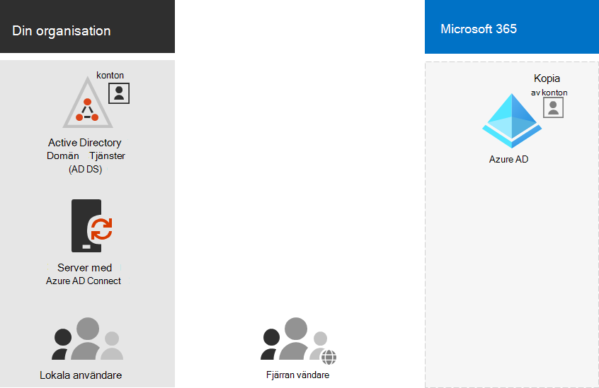

# Microsoft 365-Identity-modeller och Azure Active Directory

*Den här artikeln gäller både Microsoft 365 Enterprise och Office 365 Enterprise.*

Microsoft 365 använder Azure Active Directory (Azure AD), en molnbaserad användar identitets-och autentiseringstjänst som ingår i ditt Microsoft 365-abonnemang, för att hantera identiteter och inloggningsautentisering för Microsoft 365. Att få din identitets infrastruktur konfigurerad korrekt är viktig för att hantera Microsoft 365-användarnas åtkomst och behörigheter för din organisation.

Innan du börjar kan du titta på den här videon för att få en översikt över identitets modeller och för Microsoft 365.

> [!VIDEO https://www.microsoft.com/videoplayer/embed/RE2Pjwu]

Ditt första planerings val är Microsoft 365-Identity-modellen.

## Microsoft 365-ID-modeller

För att planera för användar konton måste du först förstå de två identitets modellerna i Microsoft 365. Du kan endast underhålla organisationens identiteter i molnet, eller så kan du underhålla dina lokala Active Directory Domain Services-identiteter (AD DS) och använda dem för att verifiera när användare har åtkomst till Microsoft 365-moln tjänster.  

Här är de två typerna av identitet och deras bästa passning och fördelar.

| Attribut | Moln-Only-identitet | Hybrididentitet |
|:-------|:-----|:-----|
| **Definition** | Användar kontot finns bara i Azure AD-innehavaren för ditt Microsoft 365-abonnemang. | Användar kontot finns i AD DS och en kopia finns också i Azure AD-innehavaren för ditt Microsoft 365-abonnemang. Användar kontot i Azure AD kan också innehålla en hash-version av det redan hashade lösen ordet för AD DS-användarkontot. |
| **Hur Microsoft 365 verifierar användarautentiseringsuppgifter** | Azure AD-klientaren för din Microsoft 365-prenumeration utför autentiseringsprocessen med moln identitets kontot. | Azure AD-klientaren för din Microsoft 365-prenumeration hanterar antingen autentiseringsprocessen eller omdirigerar användaren till en annan identitets leverantör. |
| **Bäst för** | Organisationer som inte har eller behöver en lokal AD DS. | Organisationer som använder AD DS eller en annan identitets leverantör. |
| **Största fördelen** | Lätt att använda. Inga extra katalog verktyg eller servrar behövs. | Användare kan använda samma inloggnings uppgifter när de använder lokala eller molnbaserade resurser. |
||||

## Moln-Only-identitet

En endast moln identitet använder användar konton som bara finns i Azure AD. Moln identitet används vanligt vis av små organisationer som inte har lokala servrar eller som inte använder AD DS för att hantera lokal identitet. 

Här är de grundläggande komponenterna i moln-Only-identitet.
 

Både lokala och fjärranslutna användare använder sina Azure AD-användarkonton och lösen ord för att komma åt Microsoft 365-moln tjänster. Azure AD autentiserar användarautentiseringsuppgifter baserat på dess lagrade användar konton och lösen ord.

### Administration
Eftersom användar konton bara lagras i Azure AD hanterar du moln identiteter med verktyg som [Microsoft 365 Admin Center](https://admin.microsoft.com) och [Windows PowerShell](manage-user-accounts-and-licenses-with-microsoft-365-powershell.md). 

## Hybrididentitet

Hybrid identitet använder konton som kommer från en lokal AD DS och har en kopia i Azure AD-klient organisationen för en Microsoft 365-prenumeration. De flesta ändringar är dock bara ett sätt. Ändringar som du gör i AD DS-användarkonton synkroniseras till deras kopia i Azure AD. Men ändringar av molnbaserade konton i Azure AD, till exempel nya användar konton, synkroniseras inte med AD DS.

Azure AD Connect tillhandahåller den pågående synkroniseringen av kontot. Den körs på en lokal server, söker efter ändringar i AD DS och vidarebefordrar dessa ändringar till Azure AD. Azure AD Connect ger möjlighet att filtrera fram vilka konton som ska synkroniseras och om du vill synkronisera en hashad version av användar lösen ord, som kallas Lösenordssynkronisering för lösen ord (PHS).

När du implementerar hybrid identitet är din lokala AD DS auktoritär källa för konto information. Det innebär att du utför administrations uppgifter mest lokalt, vilka sedan synkroniseras till Azure AD. 

Här är komponenterna i hybrid identiteten.

Azure AD-innehavaren har en kopia av AD DS-kontona. I den här konfigurationen verifierar både lokala och fjärran vändare åtkomst till Microsoft 365-molntjänster för Azure AD.

>[!Note]
>Du behöver alltid använda Azure AD Connect för att synkronisera användar konton för Hybrid identitet. Du behöver synkroniserade användar konton i Azure AD för att utföra licens tilldelning och grupp hantering, konfigurera behörigheter och andra administrativa uppgifter som inbegriper användar konton.
>

### Administration

Eftersom de ursprungliga och auktoritativa användar kontona lagras i den lokala AD DS hanterar du dina identiteter med samma verktyg som AD DS, till exempel verktyget Active Directory-användare och datorer. 

Du använder inte Microsoft 365 Admin Center eller PowerShell för Microsoft 365 för att hantera synkroniserade användar konton i Azure AD.

## Nästa steg

Om du behöver den molnbaserade identitets modellen kan du läsa den här [moln identiteten](cloud-only-identities.md).

Om du behöver hybrid identitets modellen, se [hybrid identitet](plan-for-directory-synchronization.md).

## Se även

[Översikt över Microsoft 365 Enterprise](microsoft-365-overview.md)
