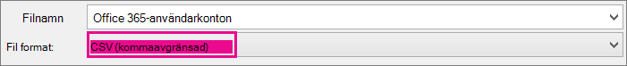
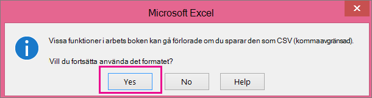

# <a name="add-several-users-at-the-same-time-to-microsoft-365---admin-help"></a>Lägga till flera användare samtidigt till Microsoft 365 – hjälp för administratörer

Varje person i gruppen behöver ett användar konto innan de kan logga in och komma åt Microsoft 365-tjänster, till exempel e-post och Office. Om du har många personer kan du lägga till deras konton samtidigt från ett Excel-kalkylblad eller en annan fil som sparats i CSV-format. [Är du osäker på vad CSV-formatet är?](add-several-users-at-the-same-time.md#__toc316652088)
  
> [!NOTE] 
> Om du inte använder det nya administrationscentret för Microsoft 365 kan du aktivera det genom att välja **Prova det nya administrationscentret** längst upp på startsidan.

## <a name="add-multiple-users-in-the-microsoft-365-admin-center"></a>Lägga till flera användare i administrations centret för Microsoft 365

1. Logga in på Microsoft 365 med ditt arbets- eller skolkonto. 
    
2. Välj **användare** \> **aktiva användare** i administrations centret.

3. Välj **Lägg till flera användare**.

4. På panelen **Importera flera användare** kan du ladda ned en CSV-exempelfil med eller utan ifyllda exempeldata. 
    
    Kalkyl bladet måste innehålla **exakt samma kolumn rubriker** som exempel ett (användar namn, Förnamn o.s.v.). Om du använder mallen öppnar du den i ett text redigerings verktyg, till exempel anteckningar, och du kan låta alla data i rad 1 vara skrivskyddade och bara ange data på raderna 2 och nedanför. 
    
    Kalkylbladet måste också innehålla värden för användarnamn (t.ex. jens@contoso.com) och ett visningsnamn (t.ex. Jens Persson) för varje användare. 
    
  ```
  User Name,First Name,Last Name,Display Name,Job Title,Department,Office Number,Office Phone,Mobile Phone,Address,City,State or Province,ZIP or Postal Code,Country or Region
  chris@contoso.com,Chris,Green,Chris Green,IT Manager,Information Technology,123451,123-555-1211,123-555-6641,1 Microsoft way,Redmond,Wa,98052,United States
  ben@contoso.com,Ben,Andrews,Ben Andrews,IT Manager,Information Technology,123452,123-555-1212,123-555-6642,1 Microsoft way,Redmond,Wa,98052,United States
  david@contoso.com,David,Longmuir,David Longmuir,IT Manager,Information Technology,123453,123-555-1213,123-555-6643,1 Microsoft way,Redmond,Wa,98052,United States
  cynthia@contoso.com,Cynthia,Carey,Cynthia Carey,IT Manager,Information Technology,123454,123-555-1214,123-555-6644,1 Microsoft way,Redmond,Wa,98052,United States
  melissa@contoso.com,Melissa,MacBeth,Melissa MacBeth,IT Manager,Information Technology,123455,123-555-1215,123-555-6645,1 Microsoft way,Redmond,Wa,98052,United States
  
  ```

5. Ange en filsökväg i rutan eller välj **Bläddra** för att bläddra till CSV-filens plats. Välj sedan **Verifiera**.
  
    Om det finns problem med filen visas de problemen i panelen. Du kan också ladda ned en loggfil.
    
5. I dialogrutan **Ange användaralternativ** kan du ange inloggningsstatus och välja den produktlicens som tilldelas till alla användare. 
    
6. I dialogrutan **Visa resultat** kan du välja att skicka resultaten till dig själv eller till andra användare (lösenord anges i oformaterad text) och du kan se hur många användare som har skapats och om du måste köpa fler licenser att tilldela till några av de nya användarna. 

## <a name="next-steps"></a>Nästa steg
<a name="bk_preview"> </a>

- Nu när de här personerna har konton måste de [Ladda ned och installera eller installera om Microsoft 365 eller Office 2016 på en PC eller Mac](https://support.office.com/article/4414eaaf-0478-48be-9c42-23adc4716658). Varje person i teamet kan installera Microsoft 365 på upp till 5 PC-eller Mac-datorer. 
    
- Varje person kan också [Konfigurera Office-appar och e-post på en mobil enhet](https://support.office.com/article/7dabb6cb-0046-40b6-81fe-767e0b1f014f) på upp till 5 surfplattor och 5 telefoner, till exempel iPhone, iPad och Android-telefoner och-surfplattor. Tack vare det här kan de redigera Office-filer var de än befinner sig. 
    
    I [Konfigurera Microsoft 365 för företag](https://support.office.com/article/6a3a29a0-e616-4713-99d1-15eda62d04fa) finns en komplett lista över konfigurations stegen. 
    
## <a name="more-information-about-how-to-add-users-to-microsoft-365"></a>Mer information om hur du lägger till användare i Microsoft 365
<a name="bk_preview"> </a>

### <a name="not-sure-what-csv-format-is"></a>Är du osäker på vad CSV-formatet är?
<a name="__toc316652088"> </a>

En CSV-fil är en fil med kommaavgränsade värden. Du kan skapa eller redigera en sådan fil med en textredigerare eller med ett kalkylprogram, t.ex. Excel.
  
Du kan ladda ned [det här exempelkalkylbladet](https://www.microsoft.com/download/details.aspx?id=45485) som en startpunkt. Kom ihåg att Microsoft 365 kräver kolumn rubriker på den första raden och ersätter dem inte med något annat. 
  
Spara filen med ett nytt namn och ange CSV-format.
  

  
När du sparar filen visas antagligen ett meddelande om att vissa funktioner i arbetsboken kan gå förlorade om du sparar filen i CSV-format. Det är OK. Klicka på **Ja** för att fortsätta. 
  

  
### <a name="tips-for-formatting-your-spreadsheet"></a>Tips på hur du formaterar kalkylbladet
<a name="__toc314595848"> </a>

- **Behöver jag samma kolumnrubriker som i exempelkalkylbladet?** Ja. Exempelkalkylbladet innehåller kolumnrubriker på första raden. De här rubrikerna är obligatoriska. Skapa en rad under rubriken för varje användare som du vill lägga till i Microsoft 365. Om du lägger till, ändrar eller tar bort någon av kolumn rubrikerna kanske inte Microsoft 365 kan skapa användare från informationen i filen. 
    
- **Vad gör jag om jag inte har all information som behövs om en användare?** Fälten Användarnamn och Visningsnamn är obligatoriska, och du kan inte lägga till en ny användare om du inte har de uppgifterna. Om du saknar någon annan uppgift, till exempel faxnummer, kan du lägga in ett blanksteg och ett kommatecken för att visa att fältet ska vara tomt. 
    
- **Hur litet eller stort kan kalkyl bladet vara?** Kalkyl bladet måste innehålla minst två rader. One is for the column headings (the user data column label) and one for the user. You cannot have more than 251 rows. If you need to import more than 250 users, you can create more than one spreadsheet. 
    
- **Vilka språk kan jag använda?** När du skapar ett kalkyl blad kan du ange kolumn etiketter för användar data på alla språk och tecken, men du får inte ändra ordningen på etiketterna, som du ser i exemplet. Sedan kan du lägga in data i fälten, på vilket språk och med vilka tecken som helst, och spara filen i Unicode- eller UTF-8-format. 
    
- **Vad gäller om jag lägger till användare från andra länder och regioner?** Skapa ett separat kalkylblad för varje område. Du måste gå igenom guiden Lägg till användare i grupp för varje kalkylblad, och då ange en enda plats för alla användare som ingår i den fil du arbetar med. 
    
- **Finns det någon begränsning för hur många tecken jag kan använda?** I följande tabell visas kolumnetiketter för användardata med motsvarande maximalt antal tecken i exempelkalkylbladet. 
    
|**Kolumnetikett med användardata**|**Maximalt antal tecken**|
|:-----|:-----|
|Användarnamn (obligatoriskt)  <br/> |79 inklusive snabel-a (@) i formatet name@domain. \<extension\> . Användarens alias får inte överstiga 50 tecken och domän namnet får inte vara längre än 48 tecken.  <br/> |
|Förnamn  <br/> |64  <br/> |
|Efternamn  <br/> |64  <br/> |
|Visningsnamn (obligatoriskt)  <br/> |256  <br/> |
|Befattning  <br/> |64  <br/> |
|Avdelning  <br/> |64  <br/> |
|Kontorsnummer  <br/> |128  <br/> |
|Telefonnr till arbetet  <br/> |64  <br/> |
|Mobiltelefon  <br/> |64  <br/> |
|Fax  <br/> |64  <br/> |
|Adress  <br/> |1023  <br/> |
|Ort  <br/> |128  <br/> |
|Region  <br/> |128  <br/> |
|Postnummer  <br/> |40  <br/> |
|Land eller region  <br/> |128  <br/> |
   
### <a name="still-having-problems-when-adding-users-to-microsoft-365"></a>Har du fortfarande problem med att lägga till användare i Microsoft 365?

- **Kontrollera en extra gång att kalkylbladet är rätt formaterat.** Kontrollera kolumnrubrikerna och se till att de överensstämmer med rubrikerna i exempelfilen. Se till att du följer reglerna om maximalt antal tecken och att varje fält avgränsas med ett komma. 
    
- **Om du inte ser de nya användarna i Microsoft 365 direkt, vänta några minuter.** Det kan ta en liten stund för ändringar att gå över alla tjänster i Microsoft 365. 
    
## <a name="related-articles"></a>Relaterade artiklar

[Lägga till användare individuellt eller i bulk till Microsoft 365](https://docs.microsoft.com/office365/admin/add-users/add-users)


