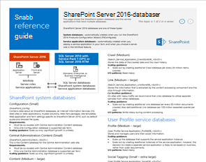
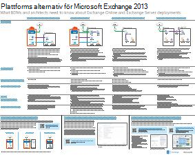
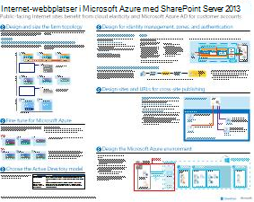
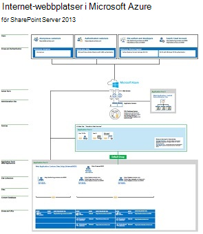

# Arkitekturmodeller för SharePoint, Exchange, Skype för företag och LyncArchitectural models for SharePoint, Exchange, Skype for Business, and Lync

IT-förhands granskning i den här artikeln beskriver arkitektur-och distributions alternativ för SharePoint, Exchange, Skype för företag och Lync.The IT posters in this article describe the architectural models and deployment options for SharePoint, Exchange, Skype for Business, and Lync. De ger också design information för att distribuera SharePoint i Microsoft Azure.They also provide design information for deploying SharePoint in Microsoft Azure.
  
Genom att använda Microsoft 365 kan du tillhandahålla välbekanta samarbets-och kommunikations tjänster via molnet.By using Microsoft 365, you can provide familiar collaboration and communication services through the cloud. Med några få undantag är användar upplevelsen detsamma likadan oavsett om du håller på att underhålla en lokal distribution eller använder Microsoft 365.With a few exceptions, the user experience remains the same whether you're maintaining an on-premises deployment or using Microsoft 365. 

Den här enhetliga användar upplevelsen är ett problem med beslutet att placera varje arbets belastning.This unified user experience complicates the decision of where to place each workload. Det ger också frågor:It also raises questions:
  
- Hur väljer jag en plattform för enskilda arbets belastningar?How do you choose a platform for individual workloads?
    
- Är det lämpligt att förvara all lokal tjänst?Does it make sense to keep any service on-premises?
    
- I vilket fall är en hybrid distribution lämplig?In what scenario is a hybrid deployment appropriate?
    
- Hur passar Azure in i bilden?How does Azure fit into the picture?
    
- Vilka konfigurationer av arbets belastning för Office Server fungerar med Azure?What configurations of Office server workloads does Azure support?
    
> [!TIP]
> De flesta förhands granskningar i den här artikeln är tillgängliga på flera språk.Most posters in this article are available in multiple languages. Tillgängliga språk inkluderar kinesiska, engelska, franska, tyska, italienska, japanska, koreanska, portugisiska, ryska och spanska.Available languages include Chinese, English, French, German, Italian, Japanese, Korean, Portuguese, Russian, and Spanish. Om du vill ladda ned en affisch på något av de här språken väljer du **fler språk** under miniatyr bilden.To download a poster in one of these languages, under the poster thumbnail image, select **More languages**.
  
Låt oss veta vad du tycker!Let us know what you think! Skicka e-post till oss på [cloudadopt@microsoft.com](mailto:cloudadopt@microsoft.com).Send us email at [cloudadopt@microsoft.com](mailto:cloudadopt@microsoft.com). 
  
Använd följande länkar för att få de affischer du behöver:Use the following links to get the posters you need:
  
- **Arkitektur modeller** : Använd de här resurserna för att fastställa din ideal plattform och konfiguration för SharePoint 2016 och Skype för företag 2015.**Architectural models** : Use these resources to determine your ideal platform and configuration for SharePoint 2016 and Skype for Business 2015.
    
  - [Microsoft SharePoint 2016-arkitektur modellerMicrosoft SharePoint 2016 architectural models](architectural-models-for-sharepoint-exchange-skype-for-business-and-lync.md#SP2016_ArchModel)
    
  - [SharePoint Server 2016-databaserSharePoint Server 2016 databases](architectural-models-for-sharepoint-exchange-skype-for-business-and-lync.md#SP2016_Databases)
    
  - [Arkitektur modeller för Microsoft Skype för företag 2015Microsoft Skype for Business 2015 architectural models](architectural-models-for-sharepoint-exchange-skype-for-business-and-lync.md#SfB2015_ArchModel)
    
- **Plattform** : Använd de här resurserna för att fastställa din ideal plattform och konfiguration för SharePoint 2013, Exchange 2013 och Lync 2013.**Platform** : Use these resources to determine your ideal platform and configuration for SharePoint 2013, Exchange 2013, and Lync 2013.
    
  - [SharePoint 2013-plattforms alternativSharePoint 2013 platform options](architectural-models-for-sharepoint-exchange-skype-for-business-and-lync.md#SP2013_Options)
    
  - [Alternativ för Exchange 2013-plattformExchange 2013 platform options](architectural-models-for-sharepoint-exchange-skype-for-business-and-lync.md#Exch2013_options)
    
  - [Lync 2013-plattforms alternativLync 2013 platform options](architectural-models-for-sharepoint-exchange-skype-for-business-and-lync.md#Lync2013_Options)
    
- **SharePoint server 2013 i Azure** : Använd de här IT-förhands granskningarna för att designa och konfigurera SharePoint Server 2013-arbets belastning i Azure Infrastructure Services.**SharePoint Server 2013 in Azure** : Use these IT posters to design and configure SharePoint Server 2013 workloads in Azure infrastructure services.
    
  - [Internet webbplatser i Azure med SharePoint Server 2013Internet sites in Azure using SharePoint Server 2013](architectural-models-for-sharepoint-exchange-skype-for-business-and-lync.md#Azure_sharepoint2013)
    
  - [Design exempel: Internet-webbplatser i Azure för SharePoint 2013Design sample: Internet sites in Azure for SharePoint 2013](architectural-models-for-sharepoint-exchange-skype-for-business-and-lync.md#DesignSampleInternetSites)
    
  - [SharePoint-återställning till AzureSharePoint disaster recovery to Azure](architectural-models-for-sharepoint-exchange-skype-for-business-and-lync.md#sharepoint_recovery_Azure)
    
## Affisch modellerArchitectural models posters

IT-affischen för SharePoint 2016 och Skype för företag 2015 är ett sätt att jämföra distributions metoder i ett lättanvänt format.The IT posters for SharePoint 2016 and Skype for Business 2015 provide a way to compare deployment methods in an easy-to-print format. Affischerna visar alla konfigurations-eller plattforms alternativ.The posters list all configuration or platform options. De innehåller följande information för varje alternativ:They provide the following information for each option:
  
- **Översikt** : en kort sammanfattning av plattformen, inklusive ett konceptuellt diagram.**Overview** : A brief summary of the platform, including a conceptual diagram.
    
- **Bäst för** : vanliga scenarier som passar plattformen.**Best for** : Common scenarios that are ideally suited for the platform.
    
- **Licens krav** : de licenser du behöver för distribution.**License requirements** : The licenses you need for deployment.
    
- **Arkitektur uppgifter** : de beslut som du måste skapa som arkitekt.**Architecture tasks** : The decisions you need to make as an architect.
    
- **IT-uppgifter eller ansvars områden** : de dagliga ansvars områden som IT-personalen måste planera för.**IT pro tasks or responsibilities** : The daily responsibilities that your IT staff needs to plan for.
    

### Microsoft SharePoint Server 2016-arkitektur modellerMicrosoft SharePoint Server 2016 Architectural Models

|ObjektItem|BeskrivningDescription|
|---|---|
|[          ](https://www.microsoft.com/download/details.aspx?id=52650)[          ](https://www.microsoft.com/download/details.aspx?id=52650)   [PDF](https://download.microsoft.com/download/4/F/A/4FA0F94B-EE2F-41DB-A047-D9864FEF41E9/SharePoint2016ArchitecturalModels.pdf)  \| [Visio](https://download.microsoft.com/download/4/F/A/4FA0F94B-EE2F-41DB-A047-D9864FEF41E9/SharePoint2016ArchitecturalModels.vsdx)  \| [Fler språk](https://www.microsoft.com/download/details.aspx?id=52650)[PDF](https://download.microsoft.com/download/4/F/A/4FA0F94B-EE2F-41DB-A047-D9864FEF41E9/SharePoint2016ArchitecturalModels.pdf)  \| [Visio](https://download.microsoft.com/download/4/F/A/4FA0F94B-EE2F-41DB-A047-D9864FEF41E9/SharePoint2016ArchitecturalModels.vsdx)  \| [More languages](https://www.microsoft.com/download/details.aspx?id=52650)|Det här är en affisch som beskriver de lokala konfigurationerna för SharePoint Online, Azure och SharePoint som affärs besluts fattare och lösnings arkitekter måste känna till.This IT poster describes the SharePoint Online, Azure, and SharePoint on-premises configurations that business decision makers and solutions architects need to know about.    - **SharePoint Online (SaaS)** : konsumera SharePoint via en program vara som tjänst för abonnemang (SaaS).- **SharePoint Online (SaaS)** : Consume SharePoint through a software as a service (SaaS) subscription model.   - **SharePoint-hybrid** : flytta dina SharePoint-webbplatser och-appar till molnet i din egen takt.- **SharePoint hybrid** : Move your SharePoint sites and apps to the cloud at your own pace.   - **SharePoint i Azure (IaaS)** : utöka din lokala miljö till Azure och distribuera SharePoint 2016-servrar där.- **SharePoint in Azure (IaaS)** : Extend your on-premises environment into Azure, and deploy SharePoint 2016 servers there. (Den här modellen rekommenderas för hög tillgänglighet eller katastrof återställning och utvecklings miljöer.)(This model is recommended for high availability or disaster recovery environments and dev/test environments.)   - **SharePoint lokalt** : planera, distribuera, underhålla och anpassa din SharePoint-miljö i ett Data Center som du upprätthåller.- **SharePoint on-premises** : Plan, deploy, maintain, and customize your SharePoint environment in a datacenter that you maintain.|
   

### SharePoint Server 2016-databaserSharePoint Server 2016 Databases

|ObjektItem|BeskrivningDescription|
|---|---|
|   [PDF](https://download.microsoft.com/download/D/5/D/D5DC1121-8BC5-4953-834F-1B5BB03EB691/DBrefguideSPS2016_tabloid.pdf)  \| [Visio](https://download.microsoft.com/download/D/5/D/D5DC1121-8BC5-4953-834F-1B5BB03EB691/DBrefguideSPS2016_tabloid.vsdx)  \| [Fler språk](https://www.microsoft.com/download/details.aspx?id=55041)[PDF](https://download.microsoft.com/download/D/5/D/D5DC1121-8BC5-4953-834F-1B5BB03EB691/DBrefguideSPS2016_tabloid.pdf)  \| [Visio](https://download.microsoft.com/download/D/5/D/D5DC1121-8BC5-4953-834F-1B5BB03EB691/DBrefguideSPS2016_tabloid.vsdx)  \| [More languages](https://www.microsoft.com/download/details.aspx?id=55041)|Denna IT-affisch är en snabb referens för SharePoint Server 2016-databaser.This IT poster is a quick reference for SharePoint Server 2016 databases. Du kommer att se information för varje databas:You'll see details for each database:    -Storlek- Size   -Skalnings vägledning- Scaling guidance   -I/O-mönster- I/O patterns   -Krav- Requirements     Den första sidan visar de SharePoint-systemdatabaser och tjänst program som har flera databaser.The first page shows the SharePoint system databases and the service applications that have multiple databases. På den andra sidan visas alla tjänst program som har enskilda databaser.The second page shows all of the service applications that have single databases.     Mer information finns i [databas typer och beskrivningar i SharePoint Server 2016](https://docs.microsoft.com/SharePoint/technical-reference/database-types-and-descriptions).For more information, see [Database types and descriptions in SharePoint Server 2016](https://docs.microsoft.com/SharePoint/technical-reference/database-types-and-descriptions).|
   

### Arkitektur modeller för Microsoft Skype för företag 2015Microsoft Skype for Business 2015 Architectural Models

|ObjektItem|BeskrivningDescription|
|---|---|
|   [PDF](https://download.microsoft.com/download/7/7/4/7741262C-A60D-41F7-863B-99BF5964FBFE/Skype%20for%20Business%20Architectural%20Models.pdf)  \| [Visio](https://download.microsoft.com/download/7/7/4/7741262C-A60D-41F7-863B-99BF5964FBFE/Skype%20for%20Business%20Architectural%20Models.vsd)  \| [Fler språk](https://www.microsoft.com/download/details.aspx?id=55022)[PDF](https://download.microsoft.com/download/7/7/4/7741262C-A60D-41F7-863B-99BF5964FBFE/Skype%20for%20Business%20Architectural%20Models.pdf)  \| [Visio](https://download.microsoft.com/download/7/7/4/7741262C-A60D-41F7-863B-99BF5964FBFE/Skype%20for%20Business%20Architectural%20Models.vsd)  \| [More languages](https://www.microsoft.com/download/details.aspx?id=55022)|Denna affisch beskriver Skype för företag – Online, lokal-, hybrid-och moln privat gren Exchange (PBX).This poster describes Skype for Business Online, on-premises, hybrid, and cloud private branch exchange (PBX). Den beskriver också integrering med Exchange-och SharePoint-konfigurationer som företags besluts fattare och lösnings arkitekter måste känna till.It also describes integration with Exchange and SharePoint configurations that business decision makers and solutions architects need to know about.    Affischen är avsedd för IT-tekniker att få kännedom om de grundläggande arkitektur modellerna genom vilka Skype för företag – Online och lokal Skype för företag kan utnyttjas.The poster is intended for IT pros to raise awareness of the fundamental architectural models through which Skype for Business Online and Skype for Business on-premises can be consumed.   Börja med den konfiguration som bäst passar organisationens behov och abonnemang.Start with the configuration that best suits your organization's needs and plans. Överväg att använda andra konfigurationer efter behov.Consider and use other configurations as needed. Du kanske till exempel vill integrera med Exchange och SharePoint eller en lösning som utnyttjar Microsofts Cloud PBX-erbjudande.For example, you might want to consider integration with Exchange and SharePoint or a solution that takes advantage of the Microsoft cloud PBX offering.|
   
## Affischer för plattforms alternativPlatform options posters

IT-affischer för SharePoint 2013, Exchange 2013 och Lync 2013 ger en överblick över distributions metoderna.The IT posters for SharePoint 2013, Exchange 2013, and Lync 2013 provide a way to compare the deployment methods at a glance. Varje affisch visar alla konfigurationer eller plattforms alternativ.Each poster lists all of the configurations or platform options. Den innehåller följande information för varje alternativ:It provides the following information for each option:
  
- **Översikt** : en kort sammanfattning av plattformen, inklusive ett konceptuellt diagram.**Overview** : A brief summary of the platform, including a conceptual diagram.
    
- **Bäst för** : vanliga scenarier som passar plattformen.**Best for** : Common scenarios that are ideally suited for the platform.
    
- **Licens krav** : de licenser du behöver för distribution.**License requirements** : The licenses you need for deployment.
    
- **Arkitektur uppgifter** : de beslut som du måste skapa som arkitekt.**Architecture tasks** : The decisions you need to make as an architect.
    
- **IT-uppgifter eller ansvars områden** : de dagliga ansvars områden som IT-personalen måste planera för.**IT pro tasks or responsibilities** : The daily responsibilities that your IT staff needs to plan for.
    

## SharePoint 2013-plattforms alternativSharePoint 2013 Platform Options

|ObjektItem|BeskrivningDescription|
|---|---|
|   [PDF](https://go.microsoft.com/fwlink/p/?LinkId=324594)  \| [Visio](https://go.microsoft.com/fwlink/p/?LinkId=324593)  \| [Fler språk](https://www.microsoft.com/download/details.aspx?id=40332)[PDF](https://go.microsoft.com/fwlink/p/?LinkId=324594)  \| [Visio](https://go.microsoft.com/fwlink/p/?LinkId=324593)  \| [More languages](https://www.microsoft.com/download/details.aspx?id=40332)|För företags besluts fattare och arkitekter visar den här affischen plattforms alternativen för SharePoint 2013, SharePoint i Microsoft 365, lokal hybrid med Microsoft 365, Azure och lokala distributioner.For business decision makers and architects, this poster shows the platform options for SharePoint 2013, SharePoint in Microsoft 365, on-premises hybrid with Microsoft 365, Azure, and on-premises-only deployments. Den innehåller en översikt över varje arkitektur, rekommendationer, licens krav och listor över arkitekt-och IT-uppgifter för varje plattform.It includes an overview of each architecture, recommendations, license requirements, and lists of architect and IT pro tasks for each platform. Affischen visar flera SharePoint-lösningar på Azure.The poster highlights several SharePoint solutions on Azure.|
   

## Alternativ för Exchange 2013-plattformExchange 2013 Platform Options

|ObjektItem|BeskrivningDescription|
|---|---|
|[          ](https://www.microsoft.com/download/details.aspx?id=42676)[          ](https://www.microsoft.com/download/details.aspx?id=42676)   [PDF](https://go.microsoft.com/fwlink/p/?LinkID=398740)  \| [Visio](https://go.microsoft.com/fwlink/p/?LinkID=398742)  \| [Fler språk](https://www.microsoft.com/download/details.aspx?id=42676)[PDF](https://go.microsoft.com/fwlink/p/?LinkID=398740)  \| [Visio](https://go.microsoft.com/fwlink/p/?LinkID=398742)  \| [More languages](https://www.microsoft.com/download/details.aspx?id=42676)|För företags besluts fattare och arkitekter beskriver den här affischen plattforms alternativen för Exchange 2013.For business decision makers and architects, this poster describes the platform options for Exchange 2013. Kunderna kan välja mellan Exchange Online med Microsoft 365, hybrid Exchange, Exchange Server lokalt och värdbaserad Exchange.Customers can choose from Exchange Online with Microsoft 365, hybrid Exchange, Exchange Server on-premises, and hosted Exchange. Affischen visar alla olika arkitektur alternativ, inklusive de ideala scenarierna för var och en av licens kraven och IT-ansvar.The poster details each architectural option, including the ideal scenarios for each, the license requirements, and IT pro responsibilities.|
   

## Lync 2013-plattforms alternativLync 2013 Platform Options

|ObjektItem|BeskrivningDescription|
|---|---|
|[          ](https://www.microsoft.com/download/details.aspx?id=41677)[          ](https://www.microsoft.com/download/details.aspx?id=41677)   [PDF](https://go.microsoft.com/fwlink/p/?LinkID=391837)  \| [Visio](https://go.microsoft.com/fwlink/p/?LinkID=391839)  \| [Fler språk](https://www.microsoft.com/download/details.aspx?id=41677)[PDF](https://go.microsoft.com/fwlink/p/?LinkID=391837)  \| [Visio](https://go.microsoft.com/fwlink/p/?LinkID=391839)  \| [More languages](https://www.microsoft.com/download/details.aspx?id=41677)|För företags besluts fattare och arkitekter beskriver den här affischen plattforms alternativen för Lync 2013.For business decision makers and architects, this poster describes the platform options for Lync 2013. Kunderna kan välja från Lync Online med Microsoft 365, hybrid Lync, Lync Server lokalt och värdbaserade Lync.Customers can choose from Lync Online with Microsoft 365, hybrid Lync, Lync Server on-premises, and hosted Lync. IT-affischen visar alla arkitektur alternativ, inklusive de ideala scenarierna för var och en av licens kraven och IT-ansvar.The IT poster details each architectural option, including the ideal scenarios for each, the license requirements, and IT pro responsibilities.|
   

## SharePoint i en Azure Solutions-affischSharePoint in Azure solutions posters

IT-affisch för SharePoint i Azure show Azure-baserade lösningar som använder SharePoint Server 2013.The IT posters for SharePoint in Azure show Azure-based solutions that use SharePoint Server 2013.
  

### Internet-webbplatser i Microsoft Azure med SharePoint Server 2013Internet Sites in Microsoft Azure Using SharePoint Server 2013

|ObjektItem|BeskrivningDescription|
|---|---|
|[          ](https://www.microsoft.com/download/details.aspx?id=41992)[          ](https://www.microsoft.com/download/details.aspx?id=41992)   [PDF](https://go.microsoft.com/fwlink/p/?LinkId=392552)  \| [Visio](https://go.microsoft.com/fwlink/p/?LinkId=392551)  \| [Fler språk](https://www.microsoft.com/download/details.aspx?id=41992)[PDF](https://go.microsoft.com/fwlink/p/?LinkId=392552)  \| [Visio](https://go.microsoft.com/fwlink/p/?LinkId=392551)  \| [More languages](https://www.microsoft.com/download/details.aspx?id=41992)|Denna affisch som beskriver viktiga design aktiviteter och Rekommenderad arkitektur för Internet-webbplatser i Azure.This poster outlines key design activities and recommended architecture for internet-facing sites in Azure.     Mer information finns i följande artiklar:For more information, see the following articles:     - [Internet webbplatser i Azure med SharePoint Server 2013](internet-sites-in-microsoft-azure-using-sharepoint-server-2013.md)- [Internet sites in Azure using SharePoint Server 2013](internet-sites-in-microsoft-azure-using-sharepoint-server-2013.md)   - [Azure-arkitekturer för SharePoint 2013](microsoft-azure-architectures-for-sharepoint-2013.md)- [Azure architectures for SharePoint 2013](microsoft-azure-architectures-for-sharepoint-2013.md)|
   

### Internet webbplatser i Azure för SharePoint 2013Internet sites in Azure for SharePoint 2013

|ObjektItem|BeskrivningDescription|
|---|---|
|[          ](https://www.microsoft.com/download/details.aspx?id=41991)[          ](https://www.microsoft.com/download/details.aspx?id=41991)   [PDF](https://go.microsoft.com/fwlink/p/?LinkId=392549)  \| [Visio](https://go.microsoft.com/fwlink/p/?LinkId=392548)  \| [Fler språk](https://www.microsoft.com/download/details.aspx?id=41991)[PDF](https://go.microsoft.com/fwlink/p/?LinkId=392549)  \| [Visio](https://go.microsoft.com/fwlink/p/?LinkId=392548)  \| [More languages](https://www.microsoft.com/download/details.aspx?id=41991)|Använd det här design exemplet som utgångs punkt för din egen arkitektur på en Internet-webbplats i Azure med SharePoint Server 2013.Use this design sample as a starting point for your own architecture of an internet-facing site in Azure using SharePoint Server 2013.    Mer information finns i följande artiklar:For more information, see the following articles:     - [Internet webbplatser i Azure med SharePoint Server 2013](internet-sites-in-microsoft-azure-using-sharepoint-server-2013.md)- [Internet sites in Azure using SharePoint Server 2013](internet-sites-in-microsoft-azure-using-sharepoint-server-2013.md)   - [Azure-arkitekturer för SharePoint 2013](microsoft-azure-architectures-for-sharepoint-2013.md)- [Azure architectures for SharePoint 2013](microsoft-azure-architectures-for-sharepoint-2013.md)|
   

### SharePoint-återställning till Microsoft AzureSharePoint Disaster Recovery to Microsoft Azure

|ObjektItem|BeskrivningDescription|
|---|---|
|[          ](https://www.microsoft.com/download/details.aspx?id=41993)[          ](https://www.microsoft.com/download/details.aspx?id=41993)   [PDF](https://go.microsoft.com/fwlink/p/?LinkId=392555)  \| [Visio](https://go.microsoft.com/fwlink/p/?LinkId=392554)  \| [Fler språk](https://www.microsoft.com/download/details.aspx?id=41993)[PDF](https://go.microsoft.com/fwlink/p/?LinkId=392555)  \| [Visio](https://go.microsoft.com/fwlink/p/?LinkId=392554)  \| [More languages](https://www.microsoft.com/download/details.aspx?id=41993)|Denna IT-affisch visar arkitektur principer för en katastrof återställnings miljö i Azure.This IT poster shows architecture principles for a disaster recovery environment in Azure.    Mer information finns i följande artiklar:For more information, see the following articles:     - [SharePoint Server 2013 katastrof återställning i Azure](sharepoint-server-2013-disaster-recovery-in-microsoft-azure.md)- [SharePoint Server 2013 disaster recovery in Azure](sharepoint-server-2013-disaster-recovery-in-microsoft-azure.md)   - [Azure-arkitekturer för SharePoint 2013](microsoft-azure-architectures-for-sharepoint-2013.md)- [Azure architectures for SharePoint 2013](microsoft-azure-architectures-for-sharepoint-2013.md)|
   
## Se ävenSee also

- [Microsoft 365-center för lösningar och arkitekturMicrosoft 365 solution and architecture center](../solutions/solution-architecture-center.md)
  
- [Microsoft Cloud-arkitekturmodellerMicrosoft cloud architecture models](../solutions/cloud-architecture-models.md)
  
- [Microsoft 365 test labb guiderMicrosoft 365 test lab guides](m365-enterprise-test-lab-guides.md)
  
- [HybridlösningarHybrid solutions](hybrid-solutions.md)

