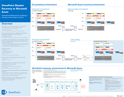

# Arkitekturmodeller för SharePoint, Exchange, Skype för företag och LyncArchitectural models for SharePoint, Exchange, Skype for Business, and Lync

De här IT-förhands granskningen beskriver arkitektur modellerna och distributions alternativen för SharePoint, Exchange, Skype för företag och Lync och ger design information om hur du distribuerar SharePoint i Microsoft Azure.These IT posters describe the architectural models and deployment options for SharePoint, Exchange, Skype for Business, and Lync, and they provide design information for deploying SharePoint in Microsoft Azure.
  
Med Microsoft 365 kan du tillhandahålla samarbets-och kommunikations tjänster som användarna känner till som en molnbaserad tjänst.With Microsoft 365, you can provide the collaboration and communication services your users are familiar with as a cloud-based service. Med några få undantag är användar upplevelsen detsamma likadan oavsett om du bevarar en lokal distribution eller använder Microsoft 365.With a few exceptions, the user experience remains the same whether you are maintaining an on-premises deployment or using Microsoft 365. Den här enhetliga användar upplevelsen gör det mindre okomplicerat att bestämma var de ska placeras och uppställa frågor, till exempel:This unified user experience makes it less straightforward to decide where to place each workload and raises questions such as:
  
- Hur avgör jag vilket plattforms alternativ du ska välja för dina egna arbets belastningar?How do you determine which platform option to choose for your individual workloads?
    
- Är det lämpligt att förvara all lokal tjänst?Does it make sense to keep any service on-premises?
    
- Vad är det för scenario med hybrid distribution?What is a scenario where a hybrid deployment is appropriate?
    
- Hur passar Microsoft Azure in i bilden?How does Microsoft Azure fit in the picture?
    
- Vilka konfigurationer stöds för Office Server-arbetsbelastningar i Azure?What are the supported configurations for Office Server workloads in Azure?
    
> [!TIP]
> De flesta av affischerna på den här sidan är tillgängliga på flera språk, inklusive kinesiska, engelska, franska, tyska, italienska, japanska, koreanska, portugisiska, ryska och spanska.Most of the posters on this page are available in multiple languages, including Chinese, English, French, German, Italian, Japanese, Korean, Portuguese, Russian, and Spanish. Om du vill hämta en affisch på något av de här språken klickar du på länken **fler språk** för den affischen.To download a poster in one of these languages, click the **More languages** link for that poster.
  
Låt oss veta vad du tycker!Let us know what you think! Skicka e-post till oss på [cloudadopt@microsoft.com](mailto:cloudadopt@microsoft.com).Send us email at [cloudadopt@microsoft.com](mailto:cloudadopt@microsoft.com). 
  
Den här sidan länkar dig till följande affischer:This page links you to the following posters:
  
- **Affisch modeller** Du kan använda de här resurserna för att fastställa din ideal plattform och konfiguration för SharePoint 2016 och Skype för företag 2015.**Architectural models posters** You can use these resources to determine your ideal platform and configuration for SharePoint 2016 and Skype for Business 2015.
    
  - [Microsoft SharePoint 2016-arkitektur modellerMicrosoft SharePoint 2016 Architectural Models](architectural-models-for-sharepoint-exchange-skype-for-business-and-lync.md#SP2016_ArchModel)
    
  - [SharePoint Server 2016-databaserSharePoint Server 2016 Databases](architectural-models-for-sharepoint-exchange-skype-for-business-and-lync.md#SP2016_Databases)
    
  - [Arkitektur modeller för Microsoft Skype för företag 2015Microsoft Skype for Business 2015 Architectural Models](architectural-models-for-sharepoint-exchange-skype-for-business-and-lync.md#SfB2015_ArchModel)
    
- **Affischer för plattforms alternativ** Du kan använda de här resurserna för att fastställa din ideal plattform och konfiguration för SharePoint 2013, Exchange 2013 och Lync 2013.**Platform options posters** You can use these resources to determine your ideal platform and configuration for SharePoint 2013, Exchange 2013, and Lync 2013.
    
  - [SharePoint 2013-plattforms alternativSharePoint 2013 Platform Options](architectural-models-for-sharepoint-exchange-skype-for-business-and-lync.md#SP2013_Options)
    
  - [Alternativ för Exchange 2013-plattformExchange 2013 Platform Options](architectural-models-for-sharepoint-exchange-skype-for-business-and-lync.md#Exch2013_options)
    
  - [Lync 2013-plattforms alternativLync 2013 Platform Options](architectural-models-for-sharepoint-exchange-skype-for-business-and-lync.md#Lync2013_Options)
    
- **SharePoint Server 2013 i Azure Solutions-affischer** Du kan använda dessa IT-affischer för att fastställa utformningen och konfigurationen för SharePoint Server 2013-arbets belastning i Azure Infrastructure Services.**SharePoint Server 2013 in Azure solutions posters** You can use these IT posters to determine the design and configuration for SharePoint Server 2013 workloads in Azure infrastructure services.
    
  - [Internet-webbplatser i Microsoft Azure med SharePoint Server 2013Internet sites in Microsoft Azure using SharePoint Server 2013](architectural-models-for-sharepoint-exchange-skype-for-business-and-lync.md#Azure_sharepoint2013)
    
  - [Design exempel: Internet-webbplatser i Microsoft Azure för SharePoint 2013Design sample: Internet sites in Microsoft Azure for SharePoint 2013](architectural-models-for-sharepoint-exchange-skype-for-business-and-lync.md#DesignSampleInternetSites)
    
  - [SharePoint-återställning till Microsoft AzureSharePoint Disaster Recovery to Microsoft Azure](architectural-models-for-sharepoint-exchange-skype-for-business-and-lync.md#sharepoint_recovery_Azure)
    
## Affisch modellerArchitectural models posters

Dessa nya IT-affischer för SharePoint 2016 och Skype för företag 2015 är ett sätt att jämföra olika distributions metoder i ett lättanvänt format.These new IT posters for SharePoint 2016 and Skype for Business 2015 provide a way to compare the various deployment methods in an easy-to-print format. Varje affisch visar en lista över alla tillgängliga konfigurationer eller plattforms alternativ och ger dig följande information för varje alternativ:Each poster provides a list of all the configurations or platform options available and gives you the following information for each option:
  
- **Översikt** En kort sammanfattning av plattformen, inklusive ett konceptuellt diagram.**Overview** A brief summary of the platform, including a conceptual diagram.
    
- **Bäst för** Vanliga scenarier som passar just den plattformen.**Best for** Common scenarios that are ideally suited for the particular platform.
    
- **Licens krav** De licenser du behöver för distribution.**License requirements** The licenses you need for deployment.
    
- **Arkitektur uppgifter** De beslut som du måste skapa som arkitekt.**Architecture tasks** The decisions you need to make as an architect.
    
- **IT-uppgifter eller ansvars områden** De dagliga ansvars områden som IT-personalen måste planera för.**IT Pro tasks or responsibilities** The daily responsibilities that your IT staff needs to plan for.
    

### Microsoft SharePoint 2016-arkitektur modellerMicrosoft SharePoint 2016 Architectural Models

|**Objekt****Item**|**Beskrivning****Description**|
|:-----|:-----|
|[          ](https://www.microsoft.com/download/details.aspx?id=52650)[          ](https://www.microsoft.com/download/details.aspx?id=52650)   [PDF](https://download.microsoft.com/download/4/F/A/4FA0F94B-EE2F-41DB-A047-D9864FEF41E9/SharePoint2016ArchitecturalModels.pdf)  \| [Visio](https://download.microsoft.com/download/4/F/A/4FA0F94B-EE2F-41DB-A047-D9864FEF41E9/SharePoint2016ArchitecturalModels.vsdx)  \| [Fler språk](https://www.microsoft.com/download/details.aspx?id=52650)[PDF](https://download.microsoft.com/download/4/F/A/4FA0F94B-EE2F-41DB-A047-D9864FEF41E9/SharePoint2016ArchitecturalModels.pdf)  \| [Visio](https://download.microsoft.com/download/4/F/A/4FA0F94B-EE2F-41DB-A047-D9864FEF41E9/SharePoint2016ArchitecturalModels.vsdx)  \| [More languages](https://www.microsoft.com/download/details.aspx?id=52650)   | Det här är en affisch som beskriver de lokala konfigurationerna för SharePoint Online, Microsoft Azure och SharePoint som affärs besluts fattare och lösnings arkitekter måste känna till.This IT poster describes the SharePoint Online, Microsoft Azure, and SharePoint on-premises configurations that business decision makers and solutions architects need to know about.    - **SharePoint Online (SaaS)** -förbruka SharePoint via en program vara för tjänste abonnemang (SaaS).- **SharePoint Online (SaaS)** - Consume SharePoint through a Software as a Service (SaaS) subscription model.   - **SharePoint-hybrid** – flytta dina SharePoint-webbplatser och-appar till molnet i din egen takt.- **SharePoint Hybrid** - Move your SharePoint sites and apps to the cloud at your own pace.   - **SharePoint i Azure (IaaS)** -utöka din lokala miljö till Microsoft Azure och installera SharePoint 2016-servrar där.- **SharePoint in Azure (IaaS)** - You extend your on-premises environment into Microsoft Azure and deploy SharePoint 2016 Servers there. (Detta rekommenderas för hög tillgänglighet/katastrof återställning och dev-och test miljöer.)(This is recommended for High Availability/Disaster Recovery and dev/test environments.)   - **Lokalt SharePoint** -abonnemang, distribuera, underhålla och anpassa din SharePoint-miljö i ett Data Center som du upprätthåller.- **SharePoint On-premises** - You plan, deploy, maintain and customize your SharePoint environment in a datacenter that you maintain.   |
   

### SharePoint Server 2016-databaserSharePoint Server 2016 Databases

|**Objekt****Item**|**Beskrivning****Description**|
|:-----|:-----|
|[          ](https://www.microsoft.com/download/details.aspx?id=55041)[          ](https://www.microsoft.com/download/details.aspx?id=55041)   [PDF](https://download.microsoft.com/download/D/5/D/D5DC1121-8BC5-4953-834F-1B5BB03EB691/DBrefguideSPS2016_tabloid.pdf)  \| [Visio](https://download.microsoft.com/download/D/5/D/D5DC1121-8BC5-4953-834F-1B5BB03EB691/DBrefguideSPS2016_tabloid.vsdx)  \| [Fler språk](https://www.microsoft.com/download/details.aspx?id=55041)[PDF](https://download.microsoft.com/download/D/5/D/D5DC1121-8BC5-4953-834F-1B5BB03EB691/DBrefguideSPS2016_tabloid.pdf)  \| [Visio](https://download.microsoft.com/download/D/5/D/D5DC1121-8BC5-4953-834F-1B5BB03EB691/DBrefguideSPS2016_tabloid.vsdx)  \| [More languages](https://www.microsoft.com/download/details.aspx?id=55041)   | Denna IT-affisch är en snabb referens guide för SharePoint Server 2016-databaser.This IT poster is a quick reference guide for SharePoint Server 2016 databases. Varje databas har följande uppgifter:Each database has the following details:    -Storlek- Size   -Skalnings vägledning- Scaling guidance   -I/O-mönster- I/O patterns   -Krav- Requirements     Den första sidan har SharePoint-systemdatabaser och tjänst program som har flera databaser.The first page has the SharePoint system databases and the service applications that have multiple databases. På den andra sidan visas alla tjänst program som har enskilda databaser.The second page shows all of the service applications that have single databases.     Mer information om SharePoint Server 2016-databaser finns i [databas typer och beskrivningar i SharePoint Server 2016](https://docs.microsoft.com/SharePoint/technical-reference/database-types-and-descriptions)For more information about the SharePoint Server 2016 databases, see [Database types and descriptions in SharePoint Server 2016](https://docs.microsoft.com/SharePoint/technical-reference/database-types-and-descriptions)   |
   

### Arkitektur modeller för Microsoft Skype för företag 2015Microsoft Skype for Business 2015 Architectural Models

|**Objekt****Item**|**Beskrivning****Description**|
|:-----|:-----|
|[          ](https://www.microsoft.com/download/details.aspx?id=55022)[          ](https://www.microsoft.com/download/details.aspx?id=55022)   [PDF](https://download.microsoft.com/download/7/7/4/7741262C-A60D-41F7-863B-99BF5964FBFE/Skype%20for%20Business%20Architectural%20Models.pdf)  \| [Visio](https://download.microsoft.com/download/7/7/4/7741262C-A60D-41F7-863B-99BF5964FBFE/Skype%20for%20Business%20Architectural%20Models.vsd)  \| [Fler språk](https://www.microsoft.com/download/details.aspx?id=55022)[PDF](https://download.microsoft.com/download/7/7/4/7741262C-A60D-41F7-863B-99BF5964FBFE/Skype%20for%20Business%20Architectural%20Models.pdf)  \| [Visio](https://download.microsoft.com/download/7/7/4/7741262C-A60D-41F7-863B-99BF5964FBFE/Skype%20for%20Business%20Architectural%20Models.vsd)  \| [More languages](https://www.microsoft.com/download/details.aspx?id=55022)   |Denna affisch beskriver Skype för företag – Online, lokal, hybrid, Cloud PBX och integrering med Exchange-och SharePoint-konfigurationer som affärs besluts fattare och lösnings arkitekter måste känna till.This poster describes the Skype for Business Online, on-premises, hybrid, cloud PBX, and integration with Exchange and SharePoint configurations that business decision makers and solutions architects need to know about.    Det är avsett för IT-deltagarna att få kännedom om de olika grundläggande arkitektur modellerna genom vilka Skype för företag – Online och Skype för företag kan utnyttjas.It is intended for the IT Pro audience to raise awareness of the different fundamental architectural models through which Skype for Business Online and Skype for Business on premises can be consumed.   Börja med den konfiguration som passar bäst för din organisations behov och framtida abonnemang.Start with whichever configuration best suits your organization's needs and future plans. Överväg att använda andra efter behov.Consider and use others as needed. Du kanske till exempel vill integrera med Exchange och SharePoint eller en lösning som utnyttjar Microsofts Cloud PBX-erbjudande.For example, you might want to consider integration with Exchange and SharePoint or a solution that takes advantage of Microsoft's Cloud PBX offering.    |
   
## Affischer för plattforms alternativPlatform options posters

De här IT-affischerna för SharePoint 2013, Exchange 2013 och Lync 2013 är ett sätt att jämföra olika distributions metoder i ett stort affisch format.These IT posters for SharePoint 2013, Exchange 2013, and Lync 2013 provide a way to compare the various deployment methods at a single glance in a large poster format. Varje affisch visar en lista över alla tillgängliga konfigurationer eller plattforms alternativ och ger dig följande information för varje alternativ:Each poster provides a list of all the configurations or platform options available and gives you the following information for each option:
  
- **Översikt** En kort sammanfattning av plattformen, inklusive ett konceptuellt diagram.**Overview** A brief summary of the platform, including a conceptual diagram.
    
- **Bäst för** Vanliga scenarier som passar just den plattformen.**Best for** Common scenarios that are ideally suited for the particular platform.
    
- **Licens krav** De licenser du behöver för distribution.**License requirements** The licenses you need for deployment.
    
- **Arkitektur uppgifter** De beslut som du måste skapa som arkitekt.**Architecture tasks** The decisions you need to make as an architect.
    
- **IT-uppgifter eller ansvars områden** De dagliga ansvars områden som IT-personalen måste planera för.**IT Pro tasks or responsibilities** The daily responsibilities that your IT staff needs to plan for.
    

## SharePoint 2013-plattforms alternativSharePoint 2013 Platform Options

****

|**Objekt****Item**|**Beskrivning****Description**|
|:-----|:-----|
|[          ](https://www.microsoft.com/download/details.aspx?id=40332)[          ](https://www.microsoft.com/download/details.aspx?id=40332)   [PDF](https://go.microsoft.com/fwlink/p/?LinkId=324594)  \| [Visio](https://go.microsoft.com/fwlink/p/?LinkId=324593)  \| [Fler språk](https://www.microsoft.com/download/details.aspx?id=40332)[PDF](https://go.microsoft.com/fwlink/p/?LinkId=324594)  \| [Visio](https://go.microsoft.com/fwlink/p/?LinkId=324593)  \| [More languages](https://www.microsoft.com/download/details.aspx?id=40332)   |För företags besluts fattare (BDMs) och Architects visar den här modellen plattforms alternativen för SharePoint 2013, SharePoint i Microsoft 365, lokal hybrid med Microsoft 365, Azure och lokala distributioner.For business decision makers (BDMs) and architects, this model shows the platform options for SharePoint 2013, SharePoint in Microsoft 365, on-premises hybrid with Microsoft 365, Azure, and on-premises only deployments. Den innehåller en översikt över varje arkitektur, rekommendationer, licens krav och listor över arkitekt-och IT-uppgifter för varje plattform.It includes an overview of each architecture, recommendations, license requirements, and lists of architect and IT Pro tasks for each platform. Flera SharePoint-lösningar på Azure är markerade.Several SharePoint solutions on Azure are highlighted.   |
   

## Alternativ för Exchange 2013-plattformExchange 2013 Platform Options

****

|**Objekt****Item**|**Beskrivning****Description**|
|:-----|:-----|
|[          ](https://www.microsoft.com/download/details.aspx?id=42676)[          ](https://www.microsoft.com/download/details.aspx?id=42676)   [PDF](https://go.microsoft.com/fwlink/p/?LinkID=398740)  \| [Visio](https://go.microsoft.com/fwlink/p/?LinkID=398742)  \| [Fler språk](https://www.microsoft.com/download/details.aspx?id=42676)[PDF](https://go.microsoft.com/fwlink/p/?LinkID=398740)  \| [Visio](https://go.microsoft.com/fwlink/p/?LinkID=398742)  \| [More languages](https://www.microsoft.com/download/details.aspx?id=42676)   |För BDMs och Architects beskriver den här modellen de tillgängliga plattforms alternativen för Exchange 2013.For BDMs and architects, this model describes the available platform options for Exchange 2013. Kunderna kan välja mellan Exchange Online med Microsoft 365, hybrid Exchange, Exchange Server lokalt och värdbaserade Exchange.Customers can choose from Exchange Online with Microsoft 365, Hybrid Exchange, Exchange Server on-premises and Hosted Exchange. Affischen innehåller information om varje arkitektur alternativ, inklusive de mest ideala scenarierna för respektive, licens krav och IT-ansvar.The poster includes details of each architectural option, including the most ideal scenarios for each, the license requirements and IT Pro responsibilities.   |
   

## Lync 2013-plattforms alternativLync 2013 Platform Options

****

|**Objekt****Item**|**Beskrivning****Description**|
|:-----|:-----|
|[          ](https://www.microsoft.com/download/details.aspx?id=41677)[          ](https://www.microsoft.com/download/details.aspx?id=41677)   [PDF](https://go.microsoft.com/fwlink/p/?LinkID=391837)  \| [Visio](https://go.microsoft.com/fwlink/p/?LinkID=391839)  \| [Fler språk](https://www.microsoft.com/download/details.aspx?id=41677)[PDF](https://go.microsoft.com/fwlink/p/?LinkID=391837)  \| [Visio](https://go.microsoft.com/fwlink/p/?LinkID=391839)  \| [More languages](https://www.microsoft.com/download/details.aspx?id=41677)   |För BDMs och Architects beskriver den här modellen de tillgängliga plattforms alternativen för Lync 2013.For BDMs and architects, this model describes the available platform options for Lync 2013. Kunderna kan välja mellan Lync Online med Microsoft 365, hybrid Lync, Lync Server lokalt och en Lync-värd.Customers can choose from Lync Online with Microsoft 365, Hybrid Lync, Lync Server on-premises and Hosted Lync. IT-affischen innehåller detaljerad information om varje arkitektur alternativ, inklusive de bästa scenarierna för respektive, licens krav och IT-ansvar.The IT poster includes details of each architectural option, including the most ideal scenarios for each, the license requirements and IT Pro responsibilities.    |
   

## SharePoint i en Azure Solutions-affischSharePoint in Azure solutions posters

De här IT-affischerna visar Azure-baserade lösningar med SharePoint Server 2013 i ett stort affisch format.These IT posters show Azure-based solutions using SharePoint Server 2013 in a large poster format.
  

### Internet-webbplatser i Microsoft Azure med SharePoint Server 2013Internet sites in Microsoft Azure using SharePoint Server 2013

****

|**Objekt****Item**|**Beskrivning****Description**|
|:-----|:-----|
|[          ](https://www.microsoft.com/download/details.aspx?id=41992)[          ](https://www.microsoft.com/download/details.aspx?id=41992)   [PDF](https://go.microsoft.com/fwlink/p/?LinkId=392552)  \| [Visio](https://go.microsoft.com/fwlink/p/?LinkId=392551)  \| [Fler språk](https://www.microsoft.com/download/details.aspx?id=41992)[PDF](https://go.microsoft.com/fwlink/p/?LinkId=392552)  \| [Visio](https://go.microsoft.com/fwlink/p/?LinkId=392551)  \| [More languages](https://www.microsoft.com/download/details.aspx?id=41992)   |Denna affisch som beskriver viktiga design aktiviteter och rekommenderade arkitektur alternativ för Internet-webbplatser i Azure.This poster outlines key design activities and recommended architecture choices for Internet-facing sites in Azure.     Mer information finns i följande artiklar:For more information, see the following articles:     - [Internet-webbplatser i Microsoft Azure med SharePoint Server 2013](internet-sites-in-microsoft-azure-using-sharepoint-server-2013.md)- [Internet Sites in Microsoft Azure using SharePoint Server 2013](internet-sites-in-microsoft-azure-using-sharepoint-server-2013.md)   - [Microsoft Azure-arkitekturer för SharePoint 2013](microsoft-azure-architectures-for-sharepoint-2013.md)- [Microsoft Azure Architectures for SharePoint 2013](microsoft-azure-architectures-for-sharepoint-2013.md)   |
   

### Design exempel: Internet-webbplatser i Microsoft Azure för SharePoint 2013Design sample: Internet sites in Microsoft Azure for SharePoint 2013

****

|**Objekt****Item**|**Beskrivning****Description**|
|:-----|:-----|
|[          ](https://www.microsoft.com/download/details.aspx?id=41991)[          ](https://www.microsoft.com/download/details.aspx?id=41991)   [PDF](https://go.microsoft.com/fwlink/p/?LinkId=392549)  \| [Visio](https://go.microsoft.com/fwlink/p/?LinkId=392548)  \| [Fler språk](https://www.microsoft.com/download/details.aspx?id=41991)[PDF](https://go.microsoft.com/fwlink/p/?LinkId=392549)  \| [Visio](https://go.microsoft.com/fwlink/p/?LinkId=392548)  \| [More languages](https://www.microsoft.com/download/details.aspx?id=41991)   |Använd det här design exemplet som utgångs punkt för din egen arkitektur på Internet med hjälp av SharePoint Server 2013.Use this design sample as a starting point for your own architecture Internet-facing site in Azure using SharePoint Server 2013.    Mer information finns i följande artiklar:For more information, see the following articles:     - [Internet-webbplatser i Microsoft Azure med SharePoint Server 2013](internet-sites-in-microsoft-azure-using-sharepoint-server-2013.md)- [Internet Sites in Microsoft Azure using SharePoint Server 2013](internet-sites-in-microsoft-azure-using-sharepoint-server-2013.md)   - [Microsoft Azure-arkitekturer för SharePoint 2013](microsoft-azure-architectures-for-sharepoint-2013.md)- [Microsoft Azure Architectures for SharePoint 2013](microsoft-azure-architectures-for-sharepoint-2013.md)   |
   

### SharePoint-återställning till Microsoft AzureSharePoint Disaster Recovery to Microsoft Azure

****

|**Objekt****Item**|**Beskrivning****Description**|
|:-----|:-----|
|[          ](https://www.microsoft.com/download/details.aspx?id=41993)[          ](https://www.microsoft.com/download/details.aspx?id=41993)   [PDF](https://go.microsoft.com/fwlink/p/?LinkId=392555)  \| [Visio](https://go.microsoft.com/fwlink/p/?LinkId=392554)  \| [Fler språk](https://www.microsoft.com/download/details.aspx?id=41993)[PDF](https://go.microsoft.com/fwlink/p/?LinkId=392555)  \| [Visio](https://go.microsoft.com/fwlink/p/?LinkId=392554)  \| [More languages](https://www.microsoft.com/download/details.aspx?id=41993)   |Denna IT-affisch visar arkitektur principer för en katastrof återställnings miljö i Azure.This IT poster shows architecture principles for a disaster recovery environment in Azure.    Mer information finns i följande artiklar:For more information, see the following articles:     - [SharePoint Server 2013 katastrof återställning i Microsoft Azure](sharepoint-server-2013-disaster-recovery-in-microsoft-azure.md)- [SharePoint Server 2013 Disaster Recovery in Microsoft Azure](sharepoint-server-2013-disaster-recovery-in-microsoft-azure.md)   - [Microsoft Azure-arkitekturer för SharePoint 2013](microsoft-azure-architectures-for-sharepoint-2013.md)- [Microsoft Azure Architectures for SharePoint 2013](microsoft-azure-architectures-for-sharepoint-2013.md)   |
   
## Se ävenSee Also

[Microsoft 365-center för lösningar och arkitekturMicrosoft 365 solution and architecture center](../solutions/solution-architecture-center.md)
  
[Microsoft Cloud för Enterprise Architects-illustrationerMicrosoft cloud for enterprise architects illustrations](../solutions/cloud-architecture-models.md)
  
[Microsoft 365 test labb guiderMicrosoft 365 Test Lab Guides](m365-enterprise-test-lab-guides.md)
  
[Hybrid lösningarHybrid solutions](hybrid-solutions.md)

