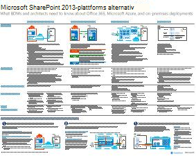
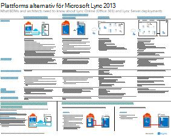

# Arkitekturmodeller för SharePoint, Exchange, Skype för företag och Lync

De här IT-förhands granskningen beskriver arkitektur modellerna och distributions alternativen för SharePoint, Exchange, Skype för företag och Lync och ger design information om hur du distribuerar SharePoint i Microsoft Azure.
  
Med Microsoft 365 kan du tillhandahålla samarbets-och kommunikations tjänster som användarna känner till som en molnbaserad tjänst. Med några få undantag är användar upplevelsen detsamma likadan oavsett om du bevarar en lokal distribution eller använder Microsoft 365. Den här enhetliga användar upplevelsen gör det mindre okomplicerat att bestämma var de ska placeras och uppställa frågor, till exempel:
  
- Hur avgör jag vilket plattforms alternativ du ska välja för dina egna arbets belastningar?
    
- Är det lämpligt att förvara all lokal tjänst?
    
- Vad är det för scenario med hybrid distribution?
    
- Hur passar Microsoft Azure in i bilden?
    
- Vilka konfigurationer stöds för Office Server-arbetsbelastningar i Azure?
    
> [!TIP]
> De flesta av affischerna på den här sidan är tillgängliga på flera språk, inklusive kinesiska, engelska, franska, tyska, italienska, japanska, koreanska, portugisiska, ryska och spanska. Om du vill hämta en affisch på något av de här språken klickar du på länken **fler språk** för den affischen.
  
Låt oss veta vad du tycker! Skicka e-post till oss på [cloudadopt@microsoft.com](mailto:cloudadopt@microsoft.com). 
  
Den här sidan länkar dig till följande affischer:
  
- **Affisch modeller** Du kan använda de här resurserna för att fastställa din ideal plattform och konfiguration för SharePoint 2016 och Skype för företag 2015.
    
  - [Microsoft SharePoint 2016-arkitektur modeller](architectural-models-for-sharepoint-exchange-skype-for-business-and-lync.md#SP2016_ArchModel)
    
  - [SharePoint Server 2016-databaser](architectural-models-for-sharepoint-exchange-skype-for-business-and-lync.md#SP2016_Databases)
    
  - [Arkitektur modeller för Microsoft Skype för företag 2015](architectural-models-for-sharepoint-exchange-skype-for-business-and-lync.md#SfB2015_ArchModel)
    
- **Affischer för plattforms alternativ** Du kan använda de här resurserna för att fastställa din ideal plattform och konfiguration för SharePoint 2013, Exchange 2013 och Lync 2013.
    
  - [SharePoint 2013-plattforms alternativ](architectural-models-for-sharepoint-exchange-skype-for-business-and-lync.md#SP2013_Options)
    
  - [Alternativ för Exchange 2013-plattform](architectural-models-for-sharepoint-exchange-skype-for-business-and-lync.md#Exch2013_options)
    
  - [Lync 2013-plattforms alternativ](architectural-models-for-sharepoint-exchange-skype-for-business-and-lync.md#Lync2013_Options)
    
- **SharePoint Server 2013 i Azure Solutions-affischer** Du kan använda dessa IT-affischer för att fastställa utformningen och konfigurationen för SharePoint Server 2013-arbets belastning i Azure Infrastructure Services.
    
  - [Internet-webbplatser i Microsoft Azure med SharePoint Server 2013](architectural-models-for-sharepoint-exchange-skype-for-business-and-lync.md#Azure_sharepoint2013)
    
  - [Design exempel: Internet-webbplatser i Microsoft Azure för SharePoint 2013](architectural-models-for-sharepoint-exchange-skype-for-business-and-lync.md#DesignSampleInternetSites)
    
  - [SharePoint-återställning till Microsoft Azure](architectural-models-for-sharepoint-exchange-skype-for-business-and-lync.md#sharepoint_recovery_Azure)
    
## Affisch modeller

Dessa nya IT-affischer för SharePoint 2016 och Skype för företag 2015 är ett sätt att jämföra olika distributions metoder i ett lättanvänt format. Varje affisch visar en lista över alla tillgängliga konfigurationer eller plattforms alternativ och ger dig följande information för varje alternativ:
  
- **Översikt** En kort sammanfattning av plattformen, inklusive ett konceptuellt diagram.
    
- **Bäst för** Vanliga scenarier som passar just den plattformen.
    
- **Licens krav** De licenser du behöver för distribution.
    
- **Arkitektur uppgifter** De beslut som du måste skapa som arkitekt.
    
- **IT-uppgifter eller ansvars områden** De dagliga ansvars områden som IT-personalen måste planera för.
    

### Microsoft SharePoint 2016-arkitektur modeller

|**Objekt**|**Beskrivning**|
|:-----|:-----|
|[          ](https://www.microsoft.com/download/details.aspx?id=52650)   [PDF](https://download.microsoft.com/download/4/F/A/4FA0F94B-EE2F-41DB-A047-D9864FEF41E9/SharePoint2016ArchitecturalModels.pdf)  \| [Visio](https://download.microsoft.com/download/4/F/A/4FA0F94B-EE2F-41DB-A047-D9864FEF41E9/SharePoint2016ArchitecturalModels.vsdx)  \| [Fler språk](https://www.microsoft.com/download/details.aspx?id=52650)   | Det här är en affisch som beskriver de lokala konfigurationerna för SharePoint Online, Microsoft Azure och SharePoint som affärs besluts fattare och lösnings arkitekter måste känna till.    - **SharePoint Online (SaaS)** -förbruka SharePoint via en program vara för tjänste abonnemang (SaaS).   - **SharePoint-hybrid** – flytta dina SharePoint-webbplatser och-appar till molnet i din egen takt.   - **SharePoint i Azure (IaaS)** -utöka din lokala miljö till Microsoft Azure och installera SharePoint 2016-servrar där. (Detta rekommenderas för hög tillgänglighet/katastrof återställning och dev-och test miljöer.)   - **Lokalt SharePoint** -abonnemang, distribuera, underhålla och anpassa din SharePoint-miljö i ett Data Center som du upprätthåller.   |
   

### SharePoint Server 2016-databaser

|**Objekt**|**Beskrivning**|
|:-----|:-----|
|[          ](https://www.microsoft.com/download/details.aspx?id=55041)   [PDF](https://download.microsoft.com/download/D/5/D/D5DC1121-8BC5-4953-834F-1B5BB03EB691/DBrefguideSPS2016_tabloid.pdf)  \| [Visio](https://download.microsoft.com/download/D/5/D/D5DC1121-8BC5-4953-834F-1B5BB03EB691/DBrefguideSPS2016_tabloid.vsdx)  \| [Fler språk](https://www.microsoft.com/download/details.aspx?id=55041)   | Denna IT-affisch är en snabb referens guide för SharePoint Server 2016-databaser. Varje databas har följande uppgifter:    -Storlek   -Skalnings vägledning   -I/O-mönster   -Krav     Den första sidan har SharePoint-systemdatabaser och tjänst program som har flera databaser. På den andra sidan visas alla tjänst program som har enskilda databaser.     Mer information om SharePoint Server 2016-databaser finns i [databas typer och beskrivningar i SharePoint Server 2016](https://docs.microsoft.com/SharePoint/technical-reference/database-types-and-descriptions)   |
   

### Arkitektur modeller för Microsoft Skype för företag 2015

|**Objekt**|**Beskrivning**|
|:-----|:-----|
|[          ](https://www.microsoft.com/download/details.aspx?id=55022)   [PDF](https://download.microsoft.com/download/7/7/4/7741262C-A60D-41F7-863B-99BF5964FBFE/Skype%20for%20Business%20Architectural%20Models.pdf)  \| [Visio](https://download.microsoft.com/download/7/7/4/7741262C-A60D-41F7-863B-99BF5964FBFE/Skype%20for%20Business%20Architectural%20Models.vsd)  \| [Fler språk](https://www.microsoft.com/download/details.aspx?id=55022)   |Denna affisch beskriver Skype för företag – Online, lokal, hybrid, Cloud PBX och integrering med Exchange-och SharePoint-konfigurationer som affärs besluts fattare och lösnings arkitekter måste känna till.    Det är avsett för IT-deltagarna att få kännedom om de olika grundläggande arkitektur modellerna genom vilka Skype för företag – Online och Skype för företag kan utnyttjas.   Börja med den konfiguration som passar bäst för din organisations behov och framtida abonnemang. Överväg att använda andra efter behov. Du kanske till exempel vill integrera med Exchange och SharePoint eller en lösning som utnyttjar Microsofts Cloud PBX-erbjudande.    |
   
## Affischer för plattforms alternativ

De här IT-affischerna för SharePoint 2013, Exchange 2013 och Lync 2013 är ett sätt att jämföra olika distributions metoder i ett stort affisch format. Varje affisch visar en lista över alla tillgängliga konfigurationer eller plattforms alternativ och ger dig följande information för varje alternativ:
  
- **Översikt** En kort sammanfattning av plattformen, inklusive ett konceptuellt diagram.
    
- **Bäst för** Vanliga scenarier som passar just den plattformen.
    
- **Licens krav** De licenser du behöver för distribution.
    
- **Arkitektur uppgifter** De beslut som du måste skapa som arkitekt.
    
- **IT-uppgifter eller ansvars områden** De dagliga ansvars områden som IT-personalen måste planera för.
    

## SharePoint 2013-plattforms alternativ

****

|**Objekt**|**Beskrivning**|
|:-----|:-----|
|[          ](https://www.microsoft.com/download/details.aspx?id=40332)   [PDF](https://go.microsoft.com/fwlink/p/?LinkId=324594)  \| [Visio](https://go.microsoft.com/fwlink/p/?LinkId=324593)  \| [Fler språk](https://www.microsoft.com/download/details.aspx?id=40332)   |För företags besluts fattare (BDMs) och Architects visar den här modellen plattforms alternativen för SharePoint 2013, SharePoint i Microsoft 365, lokal hybrid med Microsoft 365, Azure och lokala distributioner. Den innehåller en översikt över varje arkitektur, rekommendationer, licens krav och listor över arkitekt-och IT-uppgifter för varje plattform. Flera SharePoint-lösningar på Azure är markerade.   |
   

## Alternativ för Exchange 2013-plattform

****

|**Objekt**|**Beskrivning**|
|:-----|:-----|
|[          ](https://www.microsoft.com/download/details.aspx?id=42676)   [PDF](https://go.microsoft.com/fwlink/p/?LinkID=398740)  \| [Visio](https://go.microsoft.com/fwlink/p/?LinkID=398742)  \| [Fler språk](https://www.microsoft.com/download/details.aspx?id=42676)   |För BDMs och Architects beskriver den här modellen de tillgängliga plattforms alternativen för Exchange 2013. Kunderna kan välja mellan Exchange Online med Microsoft 365, hybrid Exchange, Exchange Server lokalt och värdbaserade Exchange. Affischen innehåller information om varje arkitektur alternativ, inklusive de mest ideala scenarierna för respektive, licens krav och IT-ansvar.   |
   

## Lync 2013-plattforms alternativ

****

|**Objekt**|**Beskrivning**|
|:-----|:-----|
|[          ](https://www.microsoft.com/download/details.aspx?id=41677)   [PDF](https://go.microsoft.com/fwlink/p/?LinkID=391837)  \| [Visio](https://go.microsoft.com/fwlink/p/?LinkID=391839)  \| [Fler språk](https://www.microsoft.com/download/details.aspx?id=41677)   |För BDMs och Architects beskriver den här modellen de tillgängliga plattforms alternativen för Lync 2013. Kunderna kan välja mellan Lync Online med Microsoft 365, hybrid Lync, Lync Server lokalt och en Lync-värd. IT-affischen innehåller detaljerad information om varje arkitektur alternativ, inklusive de bästa scenarierna för respektive, licens krav och IT-ansvar.    |
   

## SharePoint i en Azure Solutions-affisch

De här IT-affischerna visar Azure-baserade lösningar med SharePoint Server 2013 i ett stort affisch format.
  

### Internet-webbplatser i Microsoft Azure med SharePoint Server 2013

****

|**Objekt**|**Beskrivning**|
|:-----|:-----|
|[          ](https://www.microsoft.com/download/details.aspx?id=41992)   [PDF](https://go.microsoft.com/fwlink/p/?LinkId=392552)  \| [Visio](https://go.microsoft.com/fwlink/p/?LinkId=392551)  \| [Fler språk](https://www.microsoft.com/download/details.aspx?id=41992)   |Denna affisch som beskriver viktiga design aktiviteter och rekommenderade arkitektur alternativ för Internet-webbplatser i Azure.     Mer information finns i följande artiklar:     - [Internet-webbplatser i Microsoft Azure med SharePoint Server 2013](internet-sites-in-microsoft-azure-using-sharepoint-server-2013.md)   - [Microsoft Azure-arkitekturer för SharePoint 2013](microsoft-azure-architectures-for-sharepoint-2013.md)   |
   

### Design exempel: Internet-webbplatser i Microsoft Azure för SharePoint 2013

****

|**Objekt**|**Beskrivning**|
|:-----|:-----|
|[          ](https://www.microsoft.com/download/details.aspx?id=41991)   [PDF](https://go.microsoft.com/fwlink/p/?LinkId=392549)  \| [Visio](https://go.microsoft.com/fwlink/p/?LinkId=392548)  \| [Fler språk](https://www.microsoft.com/download/details.aspx?id=41991)   |Använd det här design exemplet som utgångs punkt för din egen arkitektur på Internet med hjälp av SharePoint Server 2013.    Mer information finns i följande artiklar:     - [Internet-webbplatser i Microsoft Azure med SharePoint Server 2013](internet-sites-in-microsoft-azure-using-sharepoint-server-2013.md)   - [Microsoft Azure-arkitekturer för SharePoint 2013](microsoft-azure-architectures-for-sharepoint-2013.md)   |
   

### SharePoint-återställning till Microsoft Azure

****

|**Objekt**|**Beskrivning**|
|:-----|:-----|
|[          ](https://www.microsoft.com/download/details.aspx?id=41993)   [PDF](https://go.microsoft.com/fwlink/p/?LinkId=392555)  \| [Visio](https://go.microsoft.com/fwlink/p/?LinkId=392554)  \| [Fler språk](https://www.microsoft.com/download/details.aspx?id=41993)   |Denna IT-affisch visar arkitektur principer för en katastrof återställnings miljö i Azure.    Mer information finns i följande artiklar:     - [SharePoint Server 2013 katastrof återställning i Microsoft Azure](sharepoint-server-2013-disaster-recovery-in-microsoft-azure.md)   - [Microsoft Azure-arkitekturer för SharePoint 2013](microsoft-azure-architectures-for-sharepoint-2013.md)   |
   
## Se även

[Microsoft 365-center för lösningar och arkitektur](../solutions/solution-architecture-center.md)
  
[Microsoft Cloud för Enterprise Architects-illustrationer](../solutions/cloud-architecture-models.md)
  
[Microsoft 365 test labb guider](m365-enterprise-test-lab-guides.md)
  
[Hybrid lösningar](hybrid-solutions.md)

