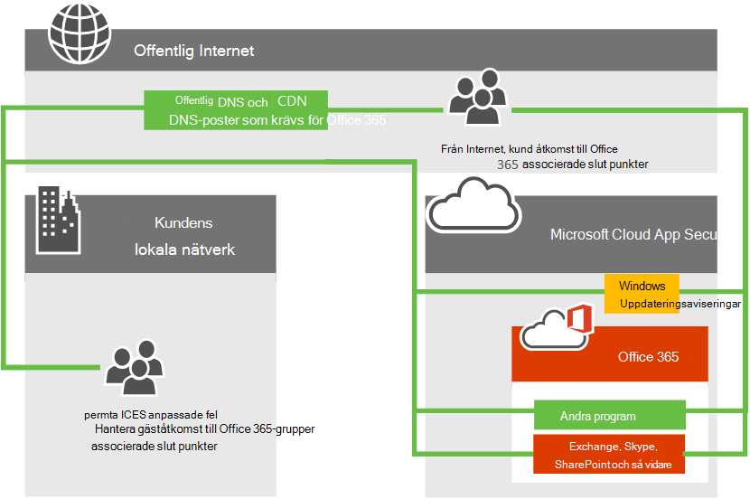
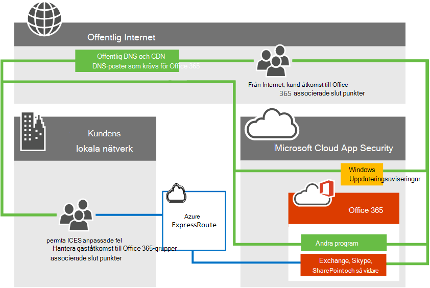

# Azure ExpressRoute för Office 365

*Denna artikel gäller för både Microsoft 365 Enterprise och Office 365 Enterprise.*

Läs om hur Azure ExpressRoute används med Office 365 och hur du planerar den nätverksimplementering som krävs om du distribuerar Azure ExpressRoute för användning med Office 365. Infrastruktur- och plattformstjänster som körs i Azure kommer ofta att ha nytta av nätverksarkitektur och prestandaöverväganden. Vi rekommenderar ExpressRoute för Azure i dessa fall. Programvara som en tjänst-erbjudanden som Office 365 och Dynamics 365 har skapats för säker och tillförlitlig åtkomst via Internet. Du kan läsa om Internetprestanda och internetsäkerhet och när du bör överväga Azure ExpressRoute för Office 365 i artikeln [Som utvärderar Office 365 nätverksanslutningar.](assessing-network-connectivity.md)

> [!NOTE]
> Microsoft Defender för Endpoint tillhandahåller inte integrering med Azure ExpressRoute. Även om detta inte stoppar kunder från att definiera ExpressRoute-regler som aktiverar anslutning från ett privat nätverk till Microsoft Defender för Endpoint-molntjänster är det upp till kunden att underhålla regler allt eftersom tjänsten eller molninfrastrukturen utvecklas.

> [!NOTE]
> Vi rekommenderar inte ExpressRoute för Microsoft 365 eftersom den i de flesta fall inte ger den bästa anslutningsmodellen för tjänsten. Därför krävs Microsoft-auktorisering för att använda den här anslutningsmodellen för Microsoft 365. Vi granskar varje kundbegäran och godkänner ExpressRoute för Microsoft 365 endast i sällsynta fall där det är nödvändigt. Läs [ExpressRoute](https://aka.ms/erguide) för Microsoft 365 guide för mer information och efter en omfattande granskning av dokumentet med dina produktivitets-, nätverks- och säkerhetsteam, arbeta med ditt Microsoft-konto team för att skicka ett undantag vid behov. Obehöriga prenumerationer som försöker skapa routefilter för Office 365 får [ett felmeddelande.](https://support.microsoft.com/kb/3181709)

## Planera Azure ExpressRoute för Office 365

Utöver internetanslutningen kan du välja att dirigera en delmängd av deras Office 365-nätverkstrafik via en förutsägbar direktanslutning och ett serviceavtal på 99,95 % tillgänglighet för nätverkskomponenter från Microsoft. Med Azure ExpressRoute får du den här dedikerade nätverksanslutningen för Office 365 och andra Microsoft-molntjänster.

Oavsett om du har ett befintligt MPLS-WAN kan ExpressRoute läggas till i nätverksarkitekturen på ett av tre sätt. via en molnutbytesleverantör som stöds, via en punkt till punkt-koppling via Ethernet eller via en MPLS-anslutningsleverantör. Se vilka [leverantörer som är tillgängliga i din region.](/azure/expressroute/expressroute-locations) Direktanslutningen för ExpressRoute gör det möjligt att ansluta till de program [som beskrivs Office 365 vilka tjänster ingår?](azure-expressroute.md#BKMK_WhatDoIGet) nedan. Nätverkstrafiken för alla andra program och tjänster fortsätter att gå via internet.

I följande högnivånätverksdiagram visas en typisk Office 365-kund som ansluter till Microsofts datacenter via internet för åtkomst till alla Microsoft-program som Office 365, Windows Update och TechNet. Kunder använder en liknande nätverkssökväg oavsett om de ansluter från ett lokalt nätverk eller från en oberoende Internetanslutning.

Titta nu på det uppdaterade diagrammet som föreställer en Office 365 som använder både Internet och ExpressRoute för att ansluta till Office 365. Observera att vissa anslutningar, till exempel offentlig DNS Content Delivery Network noder, kräver fortfarande den offentliga Internetanslutningen. Lägg också märke till att kunder som inte befinner sig på den ExpressRoute-anslutna byggnaden ansluter via Internet.

Vill du ha mer information? Lär dig hur [du hanterar din nätverkstrafik med Azure ExpressRoute för Office 365](https://support.office.com/article/e1da26c6-2d39-4379-af6f-4da213218408) och lär dig hur du [konfigurerar Azure ExpressRoute för Office 365.](/azure/expressroute/expressroute-faqs) Vi har även spelat in en tiodels [Azure ExpressRoute](https://channel9.msdn.com/series/aer) för Office 365 på Kanal 9 för att bättre förklara begreppen.

## Vilka Office 365 tjänster ingår?

I följande tabell visas Office 365 tjänster som stöds via ExpressRoute. Läs artikeln om [Office 365 nätverksslutpunkter för att](./urls-and-ip-address-ranges.md) förstå vilka nätverksbegäranden för dessa program som kräver internetanslutning.

| Program som ingår |
|:-----|
|Exchange Online1   Exchange Online Protection1   Delve1   |
|Skype för företag Online1   Microsoft Teams 1   |
|SharePoint Online1   OneDrive för företag1   Project Online1   |
|Portal och delat1   Azure Active Directory (Azure AD) 1   Azure AD Anslut1   Office1   |

1 Var och en av de här programmen har internetanslutningskrav som inte stöds via ExpressRoute. Mer information [Office 365 finns i](./urls-and-ip-address-ranges.md) artikeln om Office 365-slutpunkter.

De tjänster som inte ingår i ExpressRoute för Office 365 är Microsoft 365-appar för företag-klientnedladdningar, inloggning till lokal identitetsprovider och Office 365-tjänsten (som drivs av 21 Vianet) i Kina.

## Implementera ExpressRoute för Office 365

För implementeringen av ExpressRoute måste nätverks- och programägare delta och det krävs noggrann planering för att fastställa ny arkitektur för nätverksroutning [,](https://support.office.com/article/e1da26c6-2d39-4379-af6f-4da213218408)bandbreddskrav, var säkerhet ska implementeras, hög tillgänglighet och så vidare. Om du vill implementera ExpressRoute måste du:

1. Helt förstå vilka behov ExpressRoute uppfyller Office 365 anslutningsplanering. Förstå vilka program som kommer att använda internet eller ExpressRoute och helt planera nätverkskapacitet, säkerhet och behov av hög tillgänglighet när det gäller att använda både internet och ExpressRoute för Office 365 trafik.

2. Fastställa utgångs- och peeringplatser för både internet- och ExpressRoute-trafik1.

3. Fastställa vilken kapacitet som krävs för internet- och ExpressRoute-anslutningarna.

4. Ha en plan för att implementera säkerhet och andra vanliga perimeterkontroller1.

5. Ha ett giltigt Microsoft Azure för att prenumerera på ExpressRoute.

6. Välj en anslutningsmodell och en [godkänd leverantör](/azure/expressroute/expressroute-locations). Kom ihåg att kunder kan välja flera anslutningsmodeller och partner och att partnern inte behöver vara samma som din befintliga nätverksleverantör.

7. Validera distributionen innan du dirigerar trafik till ExpressRoute.

8. Alternativt [implementerar du QoS](https://support.office.com/article/ExpressRoute-and-QoS-in-Skype-for-Business-Online-20c654da-30ee-4e4f-a764-8b7d8844431d) och utvärderar regional expansion.

1 Viktiga prestandaöverväganden. De beslut du fattar i det här beslutet kan ha stor påverkan på svarstiden, vilket är avgörande för program som Skype för företag.

För ytterligare referenser använder du [routningsguiden](https://support.office.com/article/Routing-with-ExpressRoute-for-Office-365-e1da26c6-2d39-4379-af6f-4da213218408) utöver [ExpressRoute-dokumentationen.](/azure/expressroute/expressroute-introduction)

För att kunna köpa ExpressRoute för Office 365 måste du arbeta  med en eller flera godkända leverantörer för att tillhandahålla önskade kretsar för antal och storlekar med en ExpressRoute Premium-prenumeration. Det finns inga ytterligare licenser att köpa från Office 365.

Här är en kort länk som du kan använda för att komma tillbaka: [https://aka.ms/expressrouteoffice365]()

Är du redo att registrera dig [för ExpressRoute för Office 365?](https://aka.ms/ert)

## Relaterade ämnen

[Utvärdera Nätverksanslutningar för Office 365](assessing-network-connectivity.md)

[Hantera ExpressRoute för Office 365 anslutning](managing-expressroute-for-connectivity.md)

[Dirigering med ExpressRoute för Office 365](routing-with-expressroute.md)

[Nätverksplanering med ExpressRoute för Office 365](network-planning-with-expressroute.md)

[Implementera ExpressRoute för Office 365](implementing-expressroute.md)

[Använda BGP-communities i ExpressRoute för Office 365 scenarier](bgp-communities-in-expressroute.md)

[Prestanda för mediekvalitet och nätverksanslutning i Skype för företag – Online](https://support.office.com/article/5fe3e01b-34cf-44e0-b897-b0b2a83f0917)

[Prestandajustering för Office 365 med baslinjer och prestandahistorik](performance-tuning-using-baselines-and-history.md)

[Plan för prestandafelsökning för Office 365](performance-troubleshooting-plan.md).

[URL-adresser och IP-adressintervall för Office 365](urls-and-ip-address-ranges.md)

[Office 365 nätverks- och prestandajustering](network-planning-and-performance.md)

## Se även

[Microsoft 365 Enterprise översikt](microsoft-365-overview.md)
