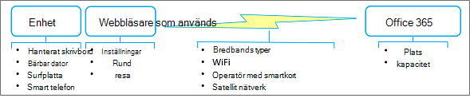

# Metod tips för att använda Office 365 på en långsam nätverksBest practices for using Office 365 on a slow network

Vore det inte bra om din Internet anslutning alltid är snabb och aldrig upphörde?Wouldn't it be nice if your Internet connection was always fast and never down? Kanske kommer den att komma.Perhaps that day will come. Under tiden finns det praktiska saker du kan göra för att arbeta i ett balky nätverk och ändå få det dagliga arbetet.But in the meantime, there are practical things you can do to work around a balky network and still get your day-to-day work done. Även om Office 365 är en molnbaserad tjänst finns det också på många sätt att arbeta med innehållet offline och för att det ska bli lättare att synkronisera dina ändringar.Although Office 365 is a cloud-based service, it also provides many ways to work with your content offline and to smoothly keep your changes synchronized. Dessutom är det ibland mer effektivt att arbeta med innehållet offline bara för att programmen körs snabbare och användar gränssnittet svarar mer.Besides, it's sometimes more efficient to work with content offline just because applications run faster and the user interface is more responsive. Nu är det här: Office 365 ger dig det bästa av två världar.The point is this: Office 365 gives you the best of both worlds. Så här drar du nytta av det.Here's how to take advantage of that. 
  
> [!TIP]
> Vill du se hur långsamt (eller fast) din nätverks anslutning är?Want to see how slow (or fast) your network connection is? Prova [ OOKLA ](https://www.speedtest.net/) eller testa [nätverks hastigheten](https://www.windowsphone.com/store/app/network-speed-test/9b9ae06b-2961-41ef-987d-b09567cffe70).Try the [ OOKLA Speed test ](https://www.speedtest.net/) or the [Network Speed Test App](https://www.windowsphone.com/store/app/network-speed-test/9b9ae06b-2961-41ef-987d-b09567cffe70). 

## Varför är mitt nätverk så långsamt?Why is my network so slow?

Även om du inte har kontroll över nätverkets prestanda kan du förstå vad som händer bakom kulisserna.Although you don't have control over network performance itself, it helps to understand what's going on behind the scenes. Internet är mycket komplicerat, men det finns några koncept som kan hjälpa dig att förstå situationen bättre.The Internet is enormously complex, but there are a few concepts that can help you understand the situation much better. Med de bästa metoderna i den här artikeln kan du undvika prestanda problem och minska godheten.Following the best practices in this article can help workaround performance issues and reduce frustration.
  
**Viktiga faktorer som påverkar nätverks prestanda****Major factors that affect network performance**

  
 **Bandbredd och svars tid** De två viktigaste måtten för nätverks prestanda är bandbredd och svars tid:**Bandwidth and latency** The two most important measures of network performance are bandwidth and latency: 
  
- Bandbredd är överföringshastigheten mätt i bitar per sekund.Bandwidth is the rate of throughput measured in bits per second. Större är bättre.Bigger is better. Bandbredden är som en vatten pipe.Bandwidth is like a water pipe. Ju större rör desto mer vatten kan du lägga på den.The larger the pipe, the more water that you can "put through" it.

- Fördröjning är den tid det tar för innehållet att komma från en server eller tjänst till din enhet och mäts i millisekunder.Latency is the time it takes for content to get from a server or service to your device and is measured in milliseconds. Snabbare är bättre.Faster is better. Fördröjningen kan orsakas av olika faktorer, till exempel dålig bandbredd, en sparse-anslutning eller överförings tid.Latency can be caused by a number of factors including low bandwidth, a sparse connection, or transmission time.

 **Vanliga problem** Utöver bandbredd och svars tid kan andra problem påverka nätverkets prestanda och är ofta oförutsägbart.**Common issues** Besides bandwidth and latency, other issues have an impact on network performance and are often unpredictable. Nätverks prestanda kan variera beroende på tiden på dagen eller din fysiska plats.Network performance can fluctuate based on the time of the day or your physical location. Nätverket kan bli tilltäppt när vissa händelser uppstår som tar hänsyn till användningen av Internet, till exempel en natur katastrof eller en allmän offentlig händelse.The network can become clogged when certain events occur that spike the use of the Internet, such as a natural disaster or a major public event. Storleken på och komplexiteten hos den sida som laddas och antalet filer som överförs har en direkt påverkan på prestanda.The size and complexity of the page being loaded and the number and size of files being transferred have a direct bearing on performance. En WiFi-anslutning kan tillfälligt sänkas: till exempel avsöker du ett stort konferens möte med tusentals samtal genom att begära alla till tweet samtidigt.A WiFi connection can temporarily degrade: for example, you poll a large conference meeting of thousands by requesting everyone to tweet at the same time. 
  
 **Överväganden för ett satellit nätverk** Ett satellit nät är användbart när ett land nät inte är genomförbart, till exempel ett bakre land, ett surfat fartyg eller ett vetenskapligt avancerat område.**Considerations for a satellite network**A satellite network is useful when a terrestrial network is not feasible, such as the back country, a cruise ship, or a remote scientific area. Dessa nätverk förlitar sig på satelliter som är placerade i en mitt synkrona bana 22 000 mil ovanför likställaren.These networks rely on satellites positioned in a geosynchronous orbit 22,000 miles above the equator. Överföringen tar emellertid faktiskt ca 90 000 miles och så att ett satellit nät har en långsam fördröjning (500 ms eller mer) än ett land nät (20 till 50ms).However, a transmission actually travels about 90,000 miles, and so a satellite network has a slower latency (500 ms or more) than a terrestrial network (20 to 50ms). Under de bästa förhållandena är det möjligt att du inte märker denna svars tid, men för att ladda ned stora filer, direktuppspelade videoklipp och spel spelas antagligen det.Under the best of conditions, you may not notice this latency, but for downloading large files, streaming videos, and playing games, you probably will. Ett annat problem är "regn toning" där tunga väder, till exempel thunderstorms och Blizzards, kan avbryta satellit sändningen tillfälligt.Another issue is "rain fade" in which heavy weather, such as thunderstorms and blizzards, can temporarily interrupt satellite transmission.
  
## Är du säker på att det är nätverket?Are you sure it's the network?

När du får prestanda problem bör du först kontrol lera att din enhet inte orsakar problemet.Whenever you experience performance problems, first make sure that your device is not the root cause of the problem. Det finns två saker du kan göra för att göra en större förbättring:There are two things you can do that might make a big improvement:
  
- Kontrol lera att din enhet är igång och att det inte finns någon skadlig program vara på datorn.Make sure your device is running well and there is no malware on your computer.

- Köp om möjligt mer minne.If possible, buy more memory. Att lägga till minne är det enklaste och mest effektiva sättet att förbättra datorns prestanda.Adding memory is the simplest and often most effective way to improve performance on your device. Det är särskilt användbart när du arbetar med stora filer och videor.It's especially helpful when working with large files and videos.

Mer information finns i [ Windows-prestanda och-underhåll ](https://windows.microsoft.com/windows/performance-maintenance-help#performance-maintenance-help) och [tips för att förbättra datorns prestanda i Windows 10](https://support.microsoft.com/en-za/help/4002019/windows-10-improve-pc-performance).For more information, see [ Windows Performance and maintenance ](https://windows.microsoft.com/windows/performance-maintenance-help#performance-maintenance-help) and [Tips to improve PC performance in Windows 10](https://support.microsoft.com/en-za/help/4002019/windows-10-improve-pc-performance).

## Metod tips för att använda webbläsarenBest practices for using your browser

Webbläsaren är din gateway för Office 365, så att den kan påverka prestanda, särskilt med den tid det tar att läsa in en sida och hur ofta du ska resa till Office 365-tjänsten.Your browser is your gateway to Office 365, so it can have an impact on performance, especially with the time it takes to load a page and how often you round trip to the Office 365 service.
  
 **Webbläsare allmänt****Browsers in general**
  
Här är några förslag för webbläsare i allmänhet:Here are some suggestions for browsers in general:
  
- Inaktivera tilläggs komponenter som kan påverka prestanda eller som du inte behöver.Disable browser add-ons that might impact performance or that you don't really need.

- Öka cachestorleken för dina tillfälliga Internet-filer.Increase the cache size for your temporary internet files.

- När du har loggat in på ditt arbets-eller skol konto håller du webbläsarfönstret öppet under hela dagen.Once you have signed into your work or school account, keep the browser window open throughout the day. Du kan öppna andra flikar och fönster utan att logga in igen.You can open other tabs and windows without signing in again. Om du behöver logga in på ett annat konto kan du använda privat surfning.If you need to sign in to another account, use Private Browsing. 

- När alla sidor har laddats ned och öppnats behåller du dem öppna med flikar.Once each page is downloaded and open, keep them open by using tabs. Det är enkelt att navigera mellan flikar och att använda sidan senare på dagen.It's easy to navigate between tabs and use the page later on in the day. Uppdatera endast en sida om du vill ha den senaste informationen på den sidan.Refresh a page only if you need the latest data on that page.

- Om det tar för lång tid att öppna en sida stoppar du sid nedladdningen (tryck på ESC) och uppdaterar sidan (tryck på F5).If a page is taking too long to open, stop the page download (press ESC) and then refresh the page (press F5). 

-  Minska rund resan till Office 365 när det är möjligt.When possible, reduce round trips to Office 365. I stället för att bläddra igenom listor eller bibliotek kan du till exempel söka efter filer i ett stort bibliotek och filtrera i en lista för att få fram de resultat du vill.For example, rather than paging through lists or libraries, use search to locate files in a large library and filtering in a list to get directly to the results you want. Du kan dessutom skapa vyer som minimerar sid inläsnings tid.Or, create views that minimize page load time. Mer information finns i [hantera stora listor och bibliotek i Office 365](https://support.office.com/article/b4038448-ec0e-49b7-b853-679d3d8fb784#BKMK_PAGES).For more information, see [Manage large lists and libraries in Office 365](https://support.office.com/article/b4038448-ec0e-49b7-b853-679d3d8fb784#BKMK_PAGES).

- Om video prestanda är dåligt kan du kanske Ladda ner videon och titta på den på enheten.If video performance is poor, you may be able to download the video and watch it on your device. En nedladdnings länk kan vara tillgänglig, eller så kan du högerklicka på video länken och välja **Spara mål som**.A download link may be available, or you may be able to right click the video link, and select **Save Target as**.

 **Webbläsarbaserad****Browser-specific**
  
Här är några förslag för din specifika webbläsare:Here are some suggestions for your specific browser:
  
- **Internet Explorer** Uppgradera till Internet Explorer version 11 eller senare för att få avsevärda förbättringar av prestandan jämfört med tidigare versioner.**Internet Explorer** Upgrade to Internet Explorer Version 11 or later for substantial performance improvements over previous versions. Mer information finns i [fel söknings guide för Internet Explorer](https://support.microsoft.com/help/2437121/troubleshooting-guide-for-internet-explorer-when-you-access-office-365).For more information, see [Troubleshooting guide for Internet Explorer](https://support.microsoft.com/help/2437121/troubleshooting-guide-for-internet-explorer-when-you-access-office-365).

- **Firefox** Mer information finns i så här [fungerar Firefox långsamt eller slutar fungera](https://support.mozilla.org/products/firefox/fix-problems/slowness-or-hanging).**FireFox**For more information, see [Firefox is slow or stops working](https://support.mozilla.org/products/firefox/fix-problems/slowness-or-hanging).

- **Safari** Mer information finns i [Apple-Safari](https://www.apple.com/safari/).**Safari** For more information, see [Apple - Safari](https://www.apple.com/safari/).

- **Chrome** Mer information finns i [Hjälp för Chrome](https://support.google.com/chrome/?hl=en).**Chrome** For more information, see [Chrome Help](https://support.google.com/chrome/?hl=en).
  
## Metod tips för att använda Outlook och Outlook Web AppBest practices for using Outlook and Outlook Web App

Att läsa, skriva och ordna e-post är en stor del av alla dagar.Reading, writing, and organizing email is a big part of everyone's day. Både Outlook och Outlook Web App (OWA) ger stöd för offline-support.Both Outlook and Outlook Web App (OWA) offer offline support. Att använda ett e-postprogram på din mobil telefon är ett annat användbart alternativ.Using an email app on your smart phone is another useful alternative. Använd följande alternativ som bäst passar dina behov:Use the following options that best fit your needs:
  
- Uppgradera till den senaste versionen av Outlook för att få avsevärda prestanda förbättringar jämfört med tidigare versioner.Upgrade to the latest version of Outlook for substantial performance improvements over previous versions. 

-  Med Outlook Web App kan du skapa offline-meddelanden, kontakter och Kalender händelser som laddas upp när OWA kan ansluta till Office 365.Outlook Web App lets you create offline messages, contacts, and calendar events that are uploaded when OWA is next able to connect to Office 365. Mer information om hur du konfigurerar och använder OWA i offlineläge finns i [använda Outlook Web App offline](https://support.office.com/article/3214839c-0604-4162-8a97-6856b4c27b36).For more information about setting up and using OWA in offline mode, see [Using Outlook Web App offline](https://support.office.com/article/3214839c-0604-4162-8a97-6856b4c27b36).

- I Outlook kan du arbeta i cachelagrat läge där det automatiskt ansluter när så är möjligt.Outlook lets you work in cached mode, in which it automatically connects whenever possible. Du kan låta Outlook Ladda ner hela post lådan eller bara en del av den.You can have Outlook download your entire mailbox, or just a portion of it. Mer information finns i [Aktivera cachelagrat Exchange-läge](https://support.office.com/article/7885af08-9a60-4ec3-850a-e221c1ed0c1c) och [arbeta offline i Outlook](https://support.office.com/article/f3a1251c-6dd5-4208-aef9-7c8c9522d633).For more information, see [Turn on Cached Exchange Mode](https://support.office.com/article/7885af08-9a60-4ec3-850a-e221c1ed0c1c) and [Work offline in Outlook](https://support.office.com/article/f3a1251c-6dd5-4208-aef9-7c8c9522d633).

- Outlook erbjuder också ett offline-läge.Outlook also offers an offline mode. För att använda detta måste du först aktivera cachelagrat läge så att informationen från ditt konto kopieras till datorn.To use this, you must first set up cached mode so that information from your account is copied down to your computer. I offline-läge försöker Outlook ansluta med inställningarna för skicka och ta emot, eller när du har angett att det ska fungera online.In offline mode, Outlook will try to connect using the send and receive settings, or when you manually set it to work online. Mer information finns i [arbeta offline för att undvika data anslutnings avgifter](https://support.office.com/article/827fe51f-5609-4062-82b4-3578057f9282), [ändra inställningar för skicka och ta emot när du arbetar offline](https://support.office.com/article/f681ec10-cb14-40cb-8709-1909a13c304a)och [Växla från att arbeta offline till online](https://support.office.com/article/2460e4a8-16c7-47fc-b204-b1549275aac9).For more information, see [Work offline to avoid data connection charges](https://support.office.com/article/827fe51f-5609-4062-82b4-3578057f9282), [Change send and receive settings when you work offline](https://support.office.com/article/f681ec10-cb14-40cb-8709-1909a13c304a), and [Switch from working offline to online](https://support.office.com/article/2460e4a8-16c7-47fc-b204-b1549275aac9).

- Om du har en mobil telefon kan du använda den för att postsortering din e-post och kalender över operatörens nätverk.If you have a smart phone, you can use it to triage your email and calendar over your phone carrier's network.

> [!NOTE]
> Här är några råd om när du ska använda Outlook eller OWA.Here is some guidance on when to use Outlook or OWA. Om det inte finns något problem på din enhet finns det en fullständig uppsättning funktioner och det passar bäst för dig.If disk space is not an issue on your device, Outlook has a full set of features and might work best for you. Om disk utrymmet är ett problem på din enhet bör du överväga att använda OWA som har en delmängd funktioner men fungerar bäst på ett online-läge.If disk space is an issue on your device, consider using OWA which has a subset of features, but also works best in an online situation. Du kan naturligtvis använda det på grund av att de fungerar bra tillsammans.Of course, you can use either because they work well together.
  
## Metod tips för att använda OneDrive för företagBest practices for using OneDrive for Business

OneDrive för företag är utformat för att arbeta med dina filer online och offline.OneDrive for Business is designed from the ground up to work with your files online and offline. När du har konfigurerat det sker synkronisering av ändringar automatiskt och tillförlitligt var och när du gör dem.Once you set it up, synchronization of changes occurs automatically and reliably wherever and whenever you make them. Om nätverket är långsamt kan du arbeta med offline-versionen av filerna.If the network is slow, you can work with the offline version of the files.
  
Synkroniseringsprogrammet för OneDrive för företag innehåller en SharePoint Online-eller Office 365 Business-prenumeration, eller så kan du [Ladda ner](https://support.microsoft.com/kb/2903984) OneDrive för företag-synkroniseringsprogrammet gratis.The OneDrive for Business sync app comes with a SharePoint Online and Office 365 business subscription, or you can [download](https://support.microsoft.com/kb/2903984) the OneDrive for Business sync app for free. Det här programmet är också snabbare än att använda kommandona **Öppna i Utforskaren** och **Ladda upp** .This app is also faster than using the **Open in Explorer** or **Upload** commands. Mer information finns i [Konfigurera datorn för att synkronisera dina OneDrive för företag-filer i Office 365](https://support.office.com/article/23e1f12b-d896-4cb1-a238-f91d19827a16).For more information, see [Set up your computer to sync your OneDrive for Business files in Office 365](https://support.office.com/article/23e1f12b-d896-4cb1-a238-f91d19827a16).
  
Här är några ytterligare vägledningar för att använda synkroniseringsprogrammet för OneDrive för företag:Here's some additional guidance for using the OneDrive for Business sync app:
  
- Om du synkroniserar ett stort bibliotek för första gången ska du börja synkronisera under tiden, till exempel över natten.If you're syncing a large library for the first time, start the sync during off hours, for example, overnight.

- Du kan använda funktionen [stoppa synkronisering av ett bibliotek med appen OneDrive för företag](https://support.office.com/article/a7e41f1f-3a98-4ca7-9443-f10250688330) för att tillfälligt stoppa synkroniseringen av uppdateringar.You can use the [Stop syncing a library with the OneDrive for Business app](https://support.office.com/article/a7e41f1f-3a98-4ca7-9443-f10250688330) feature to temporarily stop syncing updates. Men Använd den här funktionen för korta perioder, till exempel ett par timmar i taget, för att undvika ett stort antal uppdateringar och för att minimera risken att slå samman konflikter om flera personer arbetar med samma dokument.However, use this feature for brief periods, such as a few hours at a time, to avoid queuing large numbers of updates, and to minimize the risk of merge conflicts if several people work on the same document.
  
## Metod tips för att använda OneNoteBest practices for using OneNote

Alla SharePoint-gruppwebbplatser har en inbyggd OneNote-anteckningsbok och du kan enkelt skapa din egen.Every SharePoint team site has a built-in OneNote notebook and you can easily create your own. OneNote är ett bra sätt att samla in information som du behöver varje dag för att få uppgifter gjorda.OneNote is a great way to collect timely information that you need every day to get tasks done. Många team använder till exempel OneNote som en samlings plats för vecko möten, projekt anteckningar, idéer, planer och status rapporter.For example, many teams use OneNote as a collection point for weekly meetings, project notes, ideas, plans, and status reports. Du kan strukturera denna information med hjälp av sidor, avsnitt och flikar.You can neatly organize this disparate information by using pages, sections, and tabs.
  
Det fina med OneNote är att du kan komma åt innehållet från i stort sett vilken enhet som helst, oavsett om det är ett skriv bord, en bärbar dator, en surfplatta eller en mobil telefon.The beauty of OneNote is that you can access the content from virtually any device, whether a desktop, a laptop, a tablet, or a smart phone. Men du behöver inte oroa dig för att spara eller synkronisera eftersom OneNote gör det åt dig.And you don't have to worry about saving or synchronizing because OneNote does it for you.
  
Mer information finns i [Microsoft OneNote](https://office.microsoft.com/onenote).For more information, see [Microsoft OneNote](https://office.microsoft.com/onenote).

## Metod tips för Skype för företag och Lync OnlineBest practices for using Skype for Business and Lync Online

Här följer allmänna rikt linjer för hur du använder Skype för företag eller Lync Online när nätverket är långsamt:The following are general guidelines for using Skype for Business or Lync Online when your network is slow:

- Använd snabb meddelanden när du kan på ett långsamt nätverk.Use instant messaging whenever you can because it works well on a slow network.

- Undvik att ringa telefonsamtal via virtuella privata nätverk (VPN) eller RAS-anslutningar (fjärråtkomst).Avoid making phone calls over a virtual private network (VPN) or remote access service (RAS) connections.

- Kontrol lera att din ljuden het är godkänd.Make sure your audio device is approved. Mer information finns i [telefoner och enheter som är kvalificerade för Microsoft Lync](https://docs.microsoft.com/skypeforbusiness/lync-cert/ip-phones).For more information, see [Phones and Devices Qualified for Microsoft Lync](https://docs.microsoft.com/skypeforbusiness/lync-cert/ip-phones).

- När du använder PowerPoint i en onlinepresentation kan du minska storleken och komplexiteten för bilderna.When using PowerPoint in an online presentation, reduce the size and complexity of the slides. Mer information finns i [tips om hur du förbättrar presentationens prestanda](https://support.office.com/article/34c82835-5f23-4bf0-98cc-72235bbd2949).For more information, see [Tips for improving the performance of your presentation](https://support.office.com/article/34c82835-5f23-4bf0-98cc-72235bbd2949).

- Video prestanda är beroende av nätverks prestanda.Video performance is very dependent on network performance. Undvik att använda video om nätverket är långsamt.Avoid using video if your network is slow.

Mer information finns i [dålig ljud-eller video kvalitet i Lync Online](https://support.microsoft.com/kb/2386655)eller så här [felsöker du anslutnings problem i Skype för företag](https://support.office.com/article/troubleshoot-connection-issues-in-skype-for-business-ca302828-783f-425c-bbe2-356348583771).For more information, see [Poor audio or video quality in Lync Online](https://support.microsoft.com/kb/2386655), or how to [troubleshoot connection issues in Skype for Business](https://support.office.com/article/troubleshoot-connection-issues-in-skype-for-business-ca302828-783f-425c-bbe2-356348583771).
  
## Metod tips för att använda SharePoint-listorBest practices for using SharePoint lists

Att arbeta med listdata offline för att "svepa in", analysera eller rapportera data är ett bra sätt att minimera påverkan på långsamma nätverk.Working with list data offline to "scrub", analyze, or report data is a great way to minimize the impact of a slow network. Du kan läsa och skriva de flesta listor från Microsoft Access 2019 och Microsoft Access 2016 genom att länka till dem.You can read and write most lists from Microsoft Access 2019 and Microsoft Access 2016 by linking to them. Du kan också exportera en lista till en Excel-tabell, som skapar en enkelriktad data anslutning mellan Excel-tabellen och listan.You can also export a list to an Excel Table, which creates a one-way data connection between the Excel table and the list. Lär dig hur du [arbetar offline med tabeller som är länkade till SharePoint-listor](https://support.office.com/article/work-offline-with-tables-that-are-linked-to-sharepoint-lists-5d66594a-6176-4a25-a198-320f13ccf41e).Learn how to [Work offline with tables that are linked to SharePoint lists](https://support.office.com/article/work-offline-with-tables-that-are-linked-to-sharepoint-lists-5d66594a-6176-4a25-a198-320f13ccf41e).
  
Mer information finns i avsnittet "mer om hur du hanterar stora listor" i [hantera stora listor och bibliotek i Office 365](https://support.office.com/article/b4038448-ec0e-49b7-b853-679d3d8fb784).For more information, see the section "More about managing large lists" in [Manage large lists and libraries in Office 365](https://support.office.com/article/b4038448-ec0e-49b7-b853-679d3d8fb784).
  
## Metod tips för att anpassa webb sidorBest practices for customizing web pages

När du anpassar en webb sida kan du oavsiktligt orsaka dålig prestanda på sidan.When you customize a web page, you may inadvertently cause poor performance with the page. Ett antal faktorer kan påverka storleken på sidan, till exempel hur många webb delar som läggs till, hur många listor eller biblioteks objekt som visas först och hur du kodar sidan.A number of factors can have an impact, such as the complexity and size of the page, how many web parts are added, how many list or library items are initially displayed, and the way you code the page.
  
Mer information finns i [Justera SharePoint Online-prestanda](tune-sharepoint-online-performance.md).For more information, see [Tune SharePoint Online performance](tune-sharepoint-online-performance.md).
  
## Metod tips för att använda Project OnlineBest practices for using Project Online

Följande rikt linjer kan förbättra nätverks prestanda.The following guidelines can help improve network performance.
  
- Project Online och SharePoint Online kräver synkronisering, vilket kan vara tidsödande.Project Online and SharePoint Online require synchronization, which can be time consuming. Om dina projekt grupper har en liten omsättning kan du inaktivera synkronisering av projekt webbplats för att förbättra prestandan för projekt publicering och projekt information.If your project teams have low turnover, disable Project Site Sync to improve the Project Publish and Project Detail Pages performance. Begränsa Active Directory-synkronisering till grupper av resurser som faktiskt behöver använda systemet och övervaka eventuella eventuella behörighets problem efter synkroniseringen av stora grupper.Limit Active Directory sync to groups of resources that actually need to use the system, and monitor any potential permission issues after the synchronization of large groups.

- Om din organisation använder Project-webbplatser kan du skapa dem på begäran istället för automatiskt.If your organization uses project sites, create them on demand rather than automatically. Detta påskyndar den första publicerings upplevelsen och undviker onödiga webbplatser och innehåll.This speeds up the first publishing experience and avoids creating unnecessary sites and content.

- Med projekt informations sidor (PDP) kan du utlösa en omberäkning av hela projektet och genomföra arbets flödes åtgärder, som båda kan vara prestanda intensiva.Project Detail Pages (PDP) can trigger a recalculation of the entire project and kick off workflow actions, both of which can be performance-intensive operations. Undvik att utlösa två uppdaterings processer samtidigt på samma PDP genom att inte uppdatera kalender fälten (start datum, slutdatum, rapport datum och aktuellt datum) och icke-schemalagda fält (projekt namn, beskrivning och ägare).To avoid triggering two update processes at the same time on the same PDP, avoid updating the calendar fields (Start date, Finish date, Status date, and Current date) and the non-scheduled fields (project name, description, and owner).

- Minska antalet webb delar och anpassade fält som visas i varje PDP.Reduce the number of Web Parts and custom fields displayed on each PDP. Skapa en dedikerad PDP med bara fält som kräver uppdatering för att förbättra belastningen och spara tid.Create a dedicated PDP with the only fields that require updating to improve load and save time.

- När du använder OData för rapportering kan du begränsa mängden data du frågar efter genom att använda Server filter.When you use OData for reporting, limit the amount of data you query at runtime by using server-side filtering.

Mer information finns i [Justera Project Online-prestanda](https://support.office.com/article/12ba0ebd-c616-42e5-b9b6-cad570e8409c).For more information, see [Tune Project Online performance](https://support.office.com/article/12ba0ebd-c616-42e5-b9b6-cad570e8409c).
  
## Vilket är det bästa sättet att rapportera problem?What's the best way to report problems?

Microsoft förbättrar kontinuerligt den allmänna prestandan hos Office 365 genom att övervaka nätverket, mäta bandbredd och fördröjning, öka sid inläsnings tiden, minska disk-I/O-omdesigna sidor för att använda minimal nedladdnings strategi, lägga till maskin vara i Data Center och lägga till fler data Center.Microsoft continually improves the overall performance of Office 365 by monitoring the network, measuring bandwidth and latency, improving page load time, reducing disk I/O, redesigning pages to use Minimal Download Strategy, adding hardware to data centers and adding more data centers. Mer information om hur du kontrollerar aktuella status-och rapporterings problem finns i [så här kontrollerar du Office 365-tjänstens hälsa](view-service-health.md).For more information about checking your current status and reporting issues, see [How to check Office 365 service health](view-service-health.md).
  
## Se ävenSee also

[Network planning and performance tuning for Office 365Network planning and performance tuning for Office 365](network-planning-and-performance.md)
  
[Principer för nätverks anslutning för Office 365Office 365 Network Connectivity Principles](microsoft-365-network-connectivity-principles.md)
  
[Hantera slut punkter för Office 365Managing Office 365 endpoints](https://support.office.com/article/99cab9d4-ef59-4207-9f2b-3728eb46bf9a)
  
[Vanliga frågor om Office 365-slut punkterOffice 365 endpoints FAQ](https://support.office.com/article/d4088321-1c89-4b96-9c99-54c75cae2e6d)
 
