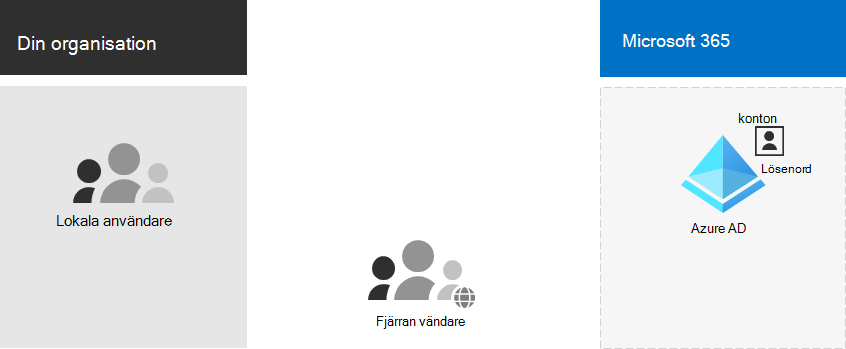

# Microsoft 365 identitet endast i molnet

*Denna artikel gäller för både Microsoft 365 Enterprise och Office 365 Enterprise.*

Med identiteter som endast är molnbaserade lagras alla dina användare, grupper och kontakter i Azure Active Directory -klientorganisationen (Azure AD) i Microsoft 365-prenumerationen. Här är de grundläggande komponenterna i identiteter som bara är molnbaserade.
 

Användare och deras användarkonton i organisationer kan kategoriseras på olika sätt. Vissa är till exempel anställda och har permanent status. Vissa är leverantörer, leverantörer eller partners som har en tillfällig status. Vissa är externa användare som inte har några användarkonton men som fortfarande måste beviljas åtkomst till specifika tjänster och resurser för att stödja interaktion och samarbete. Till exempel:

- Klientkonton representerar användare i organisationen som du licensierar för molntjänster

- B2B-konton (företag till företag) representerar användare utanför organisationen som du bjuder in att delta i samarbete

Gå in på olika typer av användare i organisationen. Vad är grupperingarna? Du kan till exempel gruppera användare efter funktion eller syfte på hög nivå i organisationen.

Dessutom kan vissa molntjänster delas med användare utanför organisationen utan några användarkonton. Du måste även identifiera de här grupperna av användare.

Du kan använda grupper i Azure AD för flera ändamål som förenklar hanteringen av din molnmiljö. Med Azure AD-grupper kan du till exempel:

- Använd gruppbaserad licensiering för att automatiskt tilldela licenser Microsoft 365 till dina användarkonton så snart de läggs till som medlemmar.
- Lägg till användarkonton i specifika grupper dynamiskt baserat på användarkontoattribut, till exempel avdelningsnamn.
- Tillhandahålla automatiskt användare för SaaS-program (programvara som en tjänst) och för att skydda åtkomsten till dessa program med multifaktorautentisering (MFA) och andra villkorsstyrda åtkomstprinciper.
- Etablera behörigheter och åtkomstnivåer för SharePoint Online-gruppwebbplatser.

## Nästa steg för identitet med endast molnet

- [Hantera användarkonton](manage-microsoft-365-accounts.md)
- [Tilldela licenser till användarkonton](assign-licenses-to-user-accounts.md)
- [Hantera grupper och gruppmedlemskap](manage-microsoft-365-groups.md)
- [Hantera lösenord för användarkonton](manage-microsoft-365-passwords.md)
