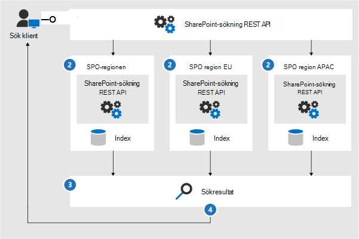
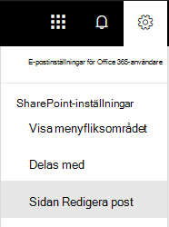
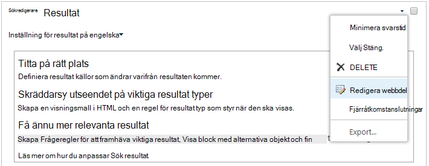

# <a name="configure-search-for-microsoft-365-multi-geo"></a>Konfigurera sökning efter Microsoft 365 multi-geo

I en geomiljö med flera platser har varje geoplats ett eget sökindex och ett sökcenter. När en användare söker visas frågan i alla index och de returnerade resultaten sammanfogas.

En användare på en geoplats kan till exempel söka efter innehåll som lagrats på en annan geoplats eller efter innehåll på en SharePoint-webbplats som är begränsad till en annan geoplats. Om användaren har åtkomst till innehållet visas resultatet i sökningen.

## <a name="which-search-clients-work-in-a-multi-geo-environment"></a>Vilka sökklienter fungerar i en geomiljö med flera sökklienter?

Dessa klienter kan returnera resultat från alla geoplatser:

- OneDrive för företag
- Delve
- Sidan SharePoint startsida
- Sökcenter
- Anpassade sökprogram som använder SharePoint Search API

### <a name="onedrive-for-business"></a>OneDrive för företag

Så snart multigeomiljön har ställts in kan användare som söker i OneDrive få resultat från alla geografiska platser.

### <a name="delve"></a>Delve

Så snart multigeomiljön har ställts in kan användare som söker i Delve få resultat från alla geografiska platser.

I Delve och profilkortet visas bara förhandsgranskningar av filer som lagras på den centrala platsen. För filer som lagras på satellitplatser visas ikonen för filtypen i stället.

### <a name="the-sharepoint-home-page"></a>Sidan SharePoint startsida

Så snart multi geomiljön har SharePoint kan användarna se nyheter, senaste och följda webbplatser från flera geografiska platser på SharePoint startsida. Om de använder sökrutan på SharePoint startsida får de kopplade resultat från flera geografiska platser.

### <a name="the-search-center"></a>Sökcenter

Efter att multigeomiljön har ställts in fortsätter varje sökcenter bara att visa resultat från sin egen geoplats. Administratörer måste [ändra inställningarna för varje sökcenter för](#_Set_up_a_1) att få resultat från alla geoplatser. Därefter får användare som söker i sökcentret resultat från alla geoplatser.

### <a name="custom-search-applications"></a>Anpassade sökprogram

Som vanligt interagerar anpassade sökprogram med sökindex genom att använda de befintliga SharePoint REST-API:er. Om du vill få resultat från alla, eller vissa geoplatser, måste programmet anropa API:t och inkludera de nya parametrarna för [multi-geofråga](#_Get_custom_search) i begäran. Det här utlöser en fan av frågan på alla geoplatser.

## <a name="whats-different-about-search-in-a-multi-geo-environment"></a>Vad är så annorlunda med sökning i en geomiljö med flera platser?

Vissa sökfunktioner som du kanske är van vid fungerar annorlunda i en geomiljö med flera platser.

<table>
<thead>
<tr class="header">
<th align="left"><strong>Funktion</strong></th>
<th align="left"><strong>Så här fungerar det</strong></th>
<th align="left"><strong>Lösning</strong></th>
</tr>
</thead>
<tbody>
<tr class="odd">
<td align="left">Framhävda resultat</td>
<td align="left">Du kan skapa frågeregler med framhävda resultat på olika nivåer: för hela klientorganisationen, för en webbplatssamling eller för en webbplats. Definiera framhävda resultat på innehavarnivå i en geomiljö så att sökresultatet framhävs till sökcentren på alla geoplatser. Om du bara vill lyfta fram resultat i Sökcenter som finns på den geografiska platsen för webbplatssamlingen eller webbplatsen definierar du framhävda resultat på webbplatssamlingen eller webbplatsnivån. Dessa resultat framhävs inte på andra geografiska platser.</td>
<td align="left">Om du inte behöver olika framhävda resultat per geoplats, till exempel olika regler för resor, rekommenderar vi att du definierar framhävda resultat på innehavarnivå.</td>
</tr>
<tr class="even">
<td align="left">Sök förfining</td>
<td align="left">Sökningen returnerar förfiningar från alla geoplatser för en klientorganisation och aggregerar dem sedan. Aggregeringen är en bästa ansträngning, vilket innebär att förfiningen kanske inte är 100 % korrekt. För de flesta sökdrivna scenarier är den här precisionen tillräcklig. 
</td>
<td align="left">För sökdrivna program som är beroende av förfiningens fullständighet bör du köra frågor för varje geoplats oberoende av varandra.</td>
</tr>
<tr class="odd">
<td align="left"></td>
<td align="left">Geosökning med flera har inte stöd för dynamisk bucketing för numeriska förfining.</td>
<td align="left">Använd <a href="/sharepoint/dev/general-development/query-refinement-in-sharepoint">parametern "Diskretize" för numeriska</a> förfining.</td>
</tr>
<tr class="even">
<td align="left">Dokument-IDs</td>
<td align="left">Om du utvecklar ett sökdrivna program som är beroende av dokument-ID:t är dokument-ID:t i en geomiljö inte unika för flera geografiska platser, utan unika per geoplats.</td>
<td align="left">Vi har lagt till en kolumn som identifierar geoplatsen. Använd den här kolumnen för att uppnå unikhet. Den här kolumnen heter "GeoLocationSource".</td>
</tr>
<tr class="odd">
<td align="left">Antal resultat</td>
<td align="left">Sökresultatsidan visar kombinerade resultat från geoplatserna, men det går inte att ha mer än 500 resultat.</td>
<td align="left"></td>
</tr>
<tr class="even">
<td align="left">Hybridsökning</td>
<td align="left">I en SharePoint miljö med <a href="/sharepoint/hybrid/learn-about-cloud-hybrid-search-for-sharepoint"></a>molnhybridsökning läggs lokalt innehåll till i Microsoft 365 för den centrala platsen.</td>
<td align="left"></td>
</tr>
</tbody>
</table>

## <a name="whats-not-supported-for-search-in-a-multi-geo-environment"></a>Vad stöds inte för sökning i en miljö med flera geoer?

Vissa av de sökfunktioner du kanske är van vid stöds inte i en miljö med flera geofunktioner.

<table>
<thead>
<tr class="header">
<th align="left"><strong>Sökfunktion</strong></th>
<th align="left"><strong>Obs!</strong></th>
</tr>
</thead>
<tbody>
<tr class="odd">
<td align="left">Endast appautentisering</td>
<td align="left">Endast programautentisering (behörighet från tjänster) stöds inte i Multi-Geo-sökning.</td>
</tr>
<tr class="even">
<td align="left">Gästanvändare</td>
<td align="left">Gästanvändare får bara resultat från den geoplats de söker från.</td>
</tr>
</tbody>
</table>

## <a name="how-does-search-work-in-a-multi-geo-environment"></a>Hur fungerar sökning i en geomiljö med flera sökverktyg?

Alla sökklienter använder befintliga REST-API:SharePoint för sökning för att interagera med sökindexen.



1. En sökklient anropar SÖK REST-slutpunkten med frågeegenskapen EnableMultiGeoSearch= true.
2. Frågan skickas till alla geoplatser i klientorganisationen.
3. Sökresultat från varje geoplats sammanfogas och rangordnas.
4. Klienten får enhetliga sökresultat.

<span id="_Set_up_a" class="anchor"><span id="_Ref501388384" class="anchor"></span></span>Observera att vi inte slår samman sökresultaten förrän vi har fått resultat från alla geoplatser. Det innebär att flera geosökningar har ytterligare fördröjning jämfört med sökningar i en miljö med bara en geoplats.

<span id="_Set_up_a_1" class="anchor"><span id="_Ref505252370" class="anchor"></span></span>
## <a name="get-a-search-center-to-show-results-from-all-geo-locations"></a>Hämta ett sökcenter för att visa resultat från alla geografiska platser

Varje sökcenter har flera lodräta och du måste konfigurera varje lodrätt individuellt.

1. Se till att du utför de här stegen med ett konto som har behörighet att redigera sökresultatsidan och webbdelen Sökresultat.

2. Gå till sidan med sökresultat (se [listan över](https://support.office.com/article/174d36e0-2f85-461a-ad9a-8b3f434a4213) sökresultatsidor)

3. Markera den lodräta för att konfigurera, **Inställningar** kugghjulsikonen i det övre högra hörnet och klicka sedan på **Redigera sida.** Sidan med sökresultat öppnas i redigeringsläge.

   

4. I webbdelen Sökresultat flyttar du pekaren till det övre högra hörnet av webbdelen, klickar på pilen och klickar sedan på Redigera **webbdel** på menyn. Verktygsfönstret för webbdelen Sökresultat öppnas under menyfliksområdet längst upp till höger på sidan.

   

5. I verktygsfönstret Webbdel, i **avsnittet Inställningar,** **under** Inställningar för resultatkontroll väljer du Visa **multi georesultat** för att få webbdelen Sökresultat för att visa resultat från alla geoplatser.

6. Klicka **på OK** för att spara ändringen och stänga verktygsfönstret Webbdel.

7. Kontrollera ändringarna i webbdelen Sökresultat genom att klicka **på Checka in** på fliken Sida i huvudmenyn.

8. Publicera ändringarna med hjälp av länken som finns i anteckningen högst upp på sidan.

<span id="_Get_custom_search" class="anchor"><span id="_Ref501388387" class="anchor"></span></span>
## <a name="get-custom-search-applications-to-show-results-from-all-or-some-geo-locations"></a>Hämta anpassade sökprogram för att visa resultat från alla eller vissa geografiska platser

Anpassade sökprogram får resultat från alla, eller vissa, geoplatser genom att ange frågeparametrar med begäran till SharePoint REST API. Beroende på frågeparametrarna är frågan borta från alla geoplatser eller till vissa geografiska platser. Om du till exempel bara behöver söka efter relevant information på en delmängd av geoplatserna kan du hålla koll på endast dessa. Om begäran lyckas returnerar SharePoint REST API svarsdata.

### <a name="requirement"></a>Krav

För varje geoplats måste du säkerställa att alla användare  i organisationen har beviljats läsbehörighetsnivå för rotwebbplatsen (till exempel contoso **APAC**.sharepoint.com/ och contoso **EU**.sharepoint.com/). [Läs mer om behörigheter.](https://support.office.com/article/understanding-permission-levels-in-sharepoint-87ecbb0e-6550-491a-8826-c075e4859848)

### <a name="query-parameters"></a>Frågeparametrar

EnableMultiGeoSearch – Det här är ett booleskt värde som anger om frågan ska rensas mot index för andra geoplatser för den geoklientorganisationen. Sätt det på **sant** för att skapa en bra fråga; **false** to not fan out the query. Om du inte tar med den här parametern är standardvärdet falskt **,** förutom när du ringer ett REST API-anrop mot en webbplats som använder sökcentermallen för företag, är standardvärdet **sant.** Om du använder parametern i en miljö som inte innehåller flera geovärden ignoreras parametern.

ClientType – det här är en sträng. Ange ett unikt klientnamn för varje sökprogram. Om du inte tar med den här parametern är frågan inte borta från andra geoplatser.

MultiGeoSearchConfiguration – Det här är en valfri lista över vilka geoplatser i multi-geoklientorganisationen som du kan ta frågan till när **EnableMultiGeoSearch** är **sant.** Om du inte tar med den här parametern eller lämnar den tom kommer frågan att visas för alla geoplatser. För varje geoplats anger du följande objekt i JSON-format:

<table>
<thead>
<tr class="header">
<th align="left">Objekt</th>
<th align="left">Beskrivning</th>
</tr>
</thead>
<tbody>
<tr class="odd">
<td align="left">DataLocation</td>
<td align="left">Geoplatsen, till exempel NAM.</td>
</tr>
<tr class="even">
<td align="left">EndPoint</td>
<td align="left">Slutpunkten som du vill ansluta till, till exempel https://contoso.sharepoint.com</td>
</tr>
<tr class="odd">
<td align="left">SourceId</td>
<td align="left">GUID för resultatkällan, till exempel B81EAB55-3140-4312-B0F4-9459D1B4FFEE.</td>
</tr>
</tbody>
</table>

Om du utelämnar DataLocation eller EndPoint, eller om en DataLocation dupliceras, misslyckas begäran. [Du kan få information om slutpunkten för en klientorganisations geografiska platser med hjälp av Microsoft Graph.](/sharepoint/dev/solution-guidance/multigeo-discovery)

### <a name="response-data"></a>Svarsdata

MultiGeoSearchStatus – Det här är en egenskap som SharePoint Search API returnerar som svar på en begäran. Värdet för egenskapen är en sträng och ger följande information om de resultat som Sök-API:t för SharePoint returnerar:

<table>
<thead>
<tr class="header">
<th align="left">Värde</th>
<th align="left">Beskrivning</th>
</tr>
</thead>
<tbody>
<tr class="odd">
<td align="left">Fullständig</td>
<td align="left">Fullständiga resultat <strong>från</strong> alla geoplatser.</td>
</tr>
<tr class="even">
<td align="left">Delvis</td>
<td align="left">Ofullständiga resultat från en eller flera geografiska platser. Resultatet är ofullständigt på grund av ett tillfälligt fel.</td>
</tr>
</tbody>
</table>

### <a name="query-using-the-rest-service"></a>Fråga med REST-tjänsten

Med en HÄMTA-begäran anger du frågeparametrar i URL-adressen. Med en POST-begäran skickar du frågeparametrarna i brödtexten i JavaScript Object Notation-formatet (JSON).

#### <a name="request-headers"></a>Frågerubriker

<table>
<thead>
<tr class="header">
<th align="left">Namn</th>
<th align="left">Värde</th>
</tr>
</thead>
<tbody>
<tr class="odd">
<td align="left">Content-Type</td>
<td align="left">application/json;odata=verbose</td>
</tr>
</tbody>
</table>

#### <a name="sample-get-request-thats-fanned-out-to-all-geo-locations"></a>Exempel på HÄMTA-begäran som är **bortskad från alla** geografiska platser

https:// \<tenant\> / \_ api/search/query?querytext='sharepoint'&Properties='EnableMultiGeoSearch:true'&ClientType='my \_ client \_ id'

#### <a name="sample-get-request-to-fan-out-to-some-geo-locations"></a>Exempel på HÄMTA begäran att ta del **av en** del geografiska platser

https:// \<tenant\> / \_ api/search/query?querytext='site'&ClientType='my_client_id'&Properties='EnableMultiGeoSearch:true, MultiGeoSearchConfiguration:[{DataLocation \\ :"NAM" \\ ,Endpoint \\ :"https \\ ://contosoNAM.sharepoint.com" \\ ,SourceId \\ :"B81EAB55-3140-4312-B0F4-9459D1B4FFEE"} \\ ,{DataLocation \\ :"CAN" \\ ,Endpoint \\ :"https \\ ://contosoCAN.sharepoint-df.com"}]'

> [!NOTE]
> Kommatecken och kolon i listan över geografiska platser för egenskapen MultiGeoSearchConfiguration föregås av **omstöpen** snedstreck. Det beror på att HÄMTA-begäranden använder kolon för att separera egenskaper och kommatecken för att separera egenskapsargument. Utan om baksnedstrecket som ett escape-tecken tolkas egenskapen MultiGeoSearchConfiguration felaktigt.

#### <a name="sample-post-request-thats-fanned-out-to-all-geo-locations"></a>Exempel på EFTER-begäran som är **bortskad från alla** geografiska platser

```text
    {
    "request": {
            "__metadata": {
            "type": "Microsoft.Office.Server.Search.REST.SearchRequest"
        },
        "Querytext": "sharepoint",
        "Properties": {
            "results": [
                {
                    "Name": "EnableMultiGeoSearch",
                    "Value": {
                        "QueryPropertyValueTypeIndex": 3,
                        "BoolVal": true
                    }
                }
            ]
        },
        "ClientType": "my_client_id"
        }
    }
```

#### <a name="sample-post-request-thats-fanned-out-to-some-geo-locations"></a>Exempel på INLÄGG-begäran som är **bortskad från vissa** geografiska platser

```text
    {
        "request": {
            "Querytext": "SharePoint",
            "ClientType": "my_client_id",
            "Properties": {
                "results": [
                    {
                        "Name": "EnableMultiGeoSearch",
                        "Value": {
                            "QueryPropertyValueTypeIndex": 3,
                            "BoolVal": true
                        }
                    },
                    {
                        "Name": "MultiGeoSearchConfiguration",
                        "Value": {
                        "StrVal": "[{\"DataLocation\":\"NAM\",\"Endpoint\":\"https://contoso.sharepoint.com\",\"SourceId\":\"B81EAB55-3140-4312-B0F4-9459D1B4FFEE\"},{\"DataLocation\":\"CAN\",\"Endpoint\":\"https://contosoCAN.sharepoint.com\"}]",
                            "QueryPropertyValueTypeIndex": 1
                        }
                    }
                ]
            }
        }
    }
```

### <a name="query-using-csom"></a>Fråga med CSOM

Här är ett exempel på en CSOM-fråga som är borta **från alla** geoplatser:

```text
var keywordQuery = new KeywordQuery(ctx);
keywordQuery.QueryText = query.SearchQueryText;
keywordQuery.ClientType = <enter a string here>;
keywordQuery.Properties["EnableMultiGeoSearch"] = true;
```
