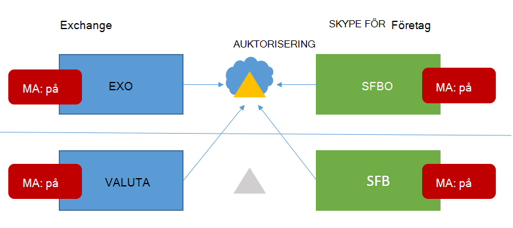
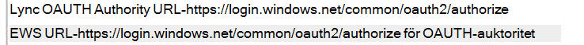

# <a name="how-to-configure-skype-for-business-on-premises-to-use-hybrid-modern-authentication"></a><span data-ttu-id="fe3e7-103">Så här konfigurerar du lokal Skype för företag för användning av modern hybridautentisering</span><span class="sxs-lookup"><span data-stu-id="fe3e7-103">How to configure Skype for Business on-premises to use Hybrid Modern Authentication</span></span>

<span data-ttu-id="fe3e7-104">*Denna artikel gäller för både Microsoft 365 Enterprise och Office 365 Enterprise.*</span><span class="sxs-lookup"><span data-stu-id="fe3e7-104">*This article applies to both Microsoft 365 Enterprise and Office 365 Enterprise.*</span></span>

<span data-ttu-id="fe3e7-105">Modern autentisering är en metod för identitetshantering som ger säkrare användarautentisering och auktorisering. Den är tillgänglig för Skype för företag – server lokalt och Lokal Exchange-server samt Skype för företag-hybrider med delad domän.</span><span class="sxs-lookup"><span data-stu-id="fe3e7-105">Modern Authentication, is a method of identity management that offers more secure user authentication and authorization, is available for Skype for Business server on-premises and Exchange server on-premises, and split-domain Skype for Business hybrids.</span></span>
  
 <span data-ttu-id="fe3e7-106">**Viktigt** Vill du veta mer om modern autentisering (MA) och varför du kanske vill använda den i ditt företag eller din organisation?</span><span class="sxs-lookup"><span data-stu-id="fe3e7-106">**Important** Would you like to know more about Modern Authentication (MA) and why you might prefer to use it in your company or organization?</span></span> <span data-ttu-id="fe3e7-107">Titta [i det här dokumentet](hybrid-modern-auth-overview.md) för en översikt.</span><span class="sxs-lookup"><span data-stu-id="fe3e7-107">Check [this document](hybrid-modern-auth-overview.md) for an overview.</span></span> <span data-ttu-id="fe3e7-108">Om du behöver veta vilka Topologier i Skype för företag som stöds med ma finns det information här!</span><span class="sxs-lookup"><span data-stu-id="fe3e7-108">If you need to know what Skype for Business topologies are supported with MA, that's documented here!</span></span>
  
 <span data-ttu-id="fe3e7-109">**Innan vi börjar** använder jag följande termer:</span><span class="sxs-lookup"><span data-stu-id="fe3e7-109">**Before we begin**, I use these terms:</span></span>
  
- <span data-ttu-id="fe3e7-110">Modern autentisering (MA)</span><span class="sxs-lookup"><span data-stu-id="fe3e7-110">Modern Authentication (MA)</span></span>

- <span data-ttu-id="fe3e7-111">Modern hybridautentisering (HMA)</span><span class="sxs-lookup"><span data-stu-id="fe3e7-111">Hybrid Modern Authentication (HMA)</span></span>

- <span data-ttu-id="fe3e7-112">Lokal Exchange (EXCH)</span><span class="sxs-lookup"><span data-stu-id="fe3e7-112">Exchange on-premises (EXCH)</span></span>

- <span data-ttu-id="fe3e7-113">Exchange Online (EXO)</span><span class="sxs-lookup"><span data-stu-id="fe3e7-113">Exchange Online (EXO)</span></span>

- <span data-ttu-id="fe3e7-114">Skype för företag lokalt (SFB)</span><span class="sxs-lookup"><span data-stu-id="fe3e7-114">Skype for Business on-premises (SFB)</span></span>

- <span data-ttu-id="fe3e7-115">Skype för företag – Online (SFBO)</span><span class="sxs-lookup"><span data-stu-id="fe3e7-115">Skype for Business Online (SFBO)</span></span>

<span data-ttu-id="fe3e7-116">Om en bild i den här artikeln har ett objekt som är nedtonat  eller nedtonat, vilket innebär att det element som visas med grått inte ingår i MA-specifik konfiguration.</span><span class="sxs-lookup"><span data-stu-id="fe3e7-116">Also, if a graphic in this article has an object that's grayed-out or dimmed that means the element shown in gray **isn't** included in MA-specific configuration.</span></span>
  
## <a name="read-the-summary"></a><span data-ttu-id="fe3e7-117">Läs sammanfattningen</span><span class="sxs-lookup"><span data-stu-id="fe3e7-117">Read the summary</span></span>

<span data-ttu-id="fe3e7-118">Den här sammanfattningen bryter ned processen i steg som annars skulle kunna gå förlorade under körningen, och är bra för en övergripande checklista för att hålla reda på var du befinner dig i processen.</span><span class="sxs-lookup"><span data-stu-id="fe3e7-118">This summary breaks down the process into steps that might otherwise get lost during the execution, and is good for an overall checklist to keep track of where you are in the process.</span></span>
  
1. <span data-ttu-id="fe3e7-119">Kontrollera först att du uppfyller alla krav.</span><span class="sxs-lookup"><span data-stu-id="fe3e7-119">First, make sure you meet all the prerequisites.</span></span>

1. <span data-ttu-id="fe3e7-120">Eftersom det finns många krav som är gemensamma för både Skype för företag och Exchange kan du läsa **översiktsartikeln** för [din checklista för tidigare frågor.](hybrid-modern-auth-overview.md)</span><span class="sxs-lookup"><span data-stu-id="fe3e7-120">Since many **prerequisites** are common for both Skype for Business and Exchange, [see the overview article for your pre-req checklist](hybrid-modern-auth-overview.md).</span></span> <span data-ttu-id="fe3e7-121">Gör detta  *innan*  du påbörjar något av stegen i den här artikeln.</span><span class="sxs-lookup"><span data-stu-id="fe3e7-121">Do this  *before*  you begin any of the steps in this article.</span></span>

1. <span data-ttu-id="fe3e7-122">Samla in HMA-specifik information som du behöver i en fil eller OneNote.</span><span class="sxs-lookup"><span data-stu-id="fe3e7-122">Collect the HMA-specific info you'll need in a file, or OneNote.</span></span>

1. <span data-ttu-id="fe3e7-123">Aktivera modern autentisering för EXO (om det inte redan är aktiverat).</span><span class="sxs-lookup"><span data-stu-id="fe3e7-123">Turn ON Modern Authentication for EXO (if it isn't already turned on).</span></span>

1. <span data-ttu-id="fe3e7-124">Aktivera modern autentisering för SFBO (om det inte redan är aktiverat).</span><span class="sxs-lookup"><span data-stu-id="fe3e7-124">Turn ON Modern Authentication for SFBO (if it isn't already turned on).</span></span>

1. <span data-ttu-id="fe3e7-125">Aktivera modern hybridautentisering för Exchange lokalt.</span><span class="sxs-lookup"><span data-stu-id="fe3e7-125">Turn ON Hybrid Modern Authentication for Exchange on-premises.</span></span>

1. <span data-ttu-id="fe3e7-126">Aktivera modern hybridautentisering för skype för företag lokalt.</span><span class="sxs-lookup"><span data-stu-id="fe3e7-126">Turn ON Hybrid Modern Authentication for Skype for Business on-premises.</span></span>

<span data-ttu-id="fe3e7-127">Dessa steg aktiverar MA för SFB, SFBO, EXCH och EXO – det vill säga alla produkter som kan ingå i HMA-konfigurationen av SFB och SFBO (inklusive beroenden på EXCH/EXO).</span><span class="sxs-lookup"><span data-stu-id="fe3e7-127">These steps turn on MA for SFB, SFBO, EXCH, and EXO - that is, all the products that can participate in an HMA configuration of SFB and SFBO (including dependencies on EXCH/EXO).</span></span> <span data-ttu-id="fe3e7-128">Med andra ord, om användarna finns i/har postlådor skapade i någon del av Hybrid (EXO + SFBO, EXO + SFB, EXCH + SFBO eller EXCH + SFB), kommer din färdiga produkt att se ut så här:</span><span class="sxs-lookup"><span data-stu-id="fe3e7-128">In other words, if your users are homed in/have mailboxes created in any part of the Hybrid (EXO + SFBO, EXO + SFB, EXCH + SFBO, or EXCH + SFB), your finished product will look like this:</span></span>
  

  
<span data-ttu-id="fe3e7-130">Som du ser finns det fyra olika platser att aktivera MA!</span><span class="sxs-lookup"><span data-stu-id="fe3e7-130">As you can see there are four different places to turn on MA!</span></span> <span data-ttu-id="fe3e7-131">För bästa användarupplevelse rekommenderar vi att du aktiverar MA på alla fyra av dessa platser.</span><span class="sxs-lookup"><span data-stu-id="fe3e7-131">For the best user experience, we recommend you turn on MA in all four of these locations.</span></span> <span data-ttu-id="fe3e7-132">Om du inte kan aktivera MA på alla de här platserna justerar du stegen så att du aktiverar MA endast på de platser som krävs för din miljö.</span><span class="sxs-lookup"><span data-stu-id="fe3e7-132">If you can't turn MA on in all these locations, adjust the steps so that you turn on MA only in the locations that are necessary for your environment.</span></span>
  
<span data-ttu-id="fe3e7-133">Se avsnittet [Support för Skype för företag med MA för](/skypeforbusiness/plan-your-deployment/modern-authentication/topologies-supported) topologier som stöds.</span><span class="sxs-lookup"><span data-stu-id="fe3e7-133">See the [Supportability topic for Skype for Business with MA](/skypeforbusiness/plan-your-deployment/modern-authentication/topologies-supported) for supported topologies.</span></span>
  
 <span data-ttu-id="fe3e7-134">**Viktigt** Kontrollera att du har uppfyllt alla krav innan du börjar.</span><span class="sxs-lookup"><span data-stu-id="fe3e7-134">**Important** Double-check that you've met all the prerequisites before you begin.</span></span> <span data-ttu-id="fe3e7-135">Du hittar den informationen i Översikt över [och förutsättningar för modern hybridautentisering.](hybrid-modern-auth-overview.md)</span><span class="sxs-lookup"><span data-stu-id="fe3e7-135">You'll find that information in [Hybrid modern authentication overview and prerequisites](hybrid-modern-auth-overview.md).</span></span>
  
## <a name="collect-all-hma-specific-info-youll-need"></a><span data-ttu-id="fe3e7-136">Samla in all HMA-specifik information som du behöver</span><span class="sxs-lookup"><span data-stu-id="fe3e7-136">Collect all HMA-specific info you'll need</span></span>

<span data-ttu-id="fe3e7-137">När du har dubbelkollat att [](hybrid-modern-auth-overview.md) du uppfyller kraven för att använda modern autentisering (se anmärkningen ovan) bör du skapa en fil som innehåller den information du behöver för att konfigurera HMA i stegen som ligger före.</span><span class="sxs-lookup"><span data-stu-id="fe3e7-137">After you've double-checked that you meet the [prerequisites](hybrid-modern-auth-overview.md) to use Modern Authentication (see the note above), you should create a file to hold the info you'll need for configuring HMA in the steps ahead.</span></span> <span data-ttu-id="fe3e7-138">Exempel som används i den här artikeln:</span><span class="sxs-lookup"><span data-stu-id="fe3e7-138">Examples used in this article:</span></span>
  
- <span data-ttu-id="fe3e7-139">**SIP-/SMTP-domän**</span><span class="sxs-lookup"><span data-stu-id="fe3e7-139">**SIP/SMTP domain**</span></span>

  - <span data-ttu-id="fe3e7-140">Exempel.</span><span class="sxs-lookup"><span data-stu-id="fe3e7-140">Ex.</span></span> <span data-ttu-id="fe3e7-141">contoso.com (är extern från Office 365)</span><span class="sxs-lookup"><span data-stu-id="fe3e7-141">contoso.com (is federated with Office 365)</span></span>

- <span data-ttu-id="fe3e7-142">**Klientorganisations-ID**</span><span class="sxs-lookup"><span data-stu-id="fe3e7-142">**Tenant ID**</span></span>

  - <span data-ttu-id="fe3e7-143">DET GUID som representerar din Office 365-klientorganisation (vid inloggningen contoso.onmicrosoft.com).</span><span class="sxs-lookup"><span data-stu-id="fe3e7-143">The GUID that represents your Office 365 tenant (at the login of contoso.onmicrosoft.com).</span></span>

- <span data-ttu-id="fe3e7-144">**SFB 2015 CU5 WEBBTJÄNST-URL:er**</span><span class="sxs-lookup"><span data-stu-id="fe3e7-144">**SFB 2015 CU5 Web Service URLs**</span></span>

<span data-ttu-id="fe3e7-145">Du behöver interna och externa webbtjänst-URL:er för alla SfB 2015-pooler distribuerade.</span><span class="sxs-lookup"><span data-stu-id="fe3e7-145">you'll need internal and external web service URLs for all SfB 2015 pools deployed.</span></span> <span data-ttu-id="fe3e7-146">Hämta dessa genom att köra följande från Skype för företag Management Shell:</span><span class="sxs-lookup"><span data-stu-id="fe3e7-146">To obtain these, run the following from Skype for Business Management Shell:</span></span>
  
```powershell
Get-CsService -WebServer | Select-Object PoolFqdn, InternalFqdn, ExternalFqdn | FL
```

- <span data-ttu-id="fe3e7-147">Exempel.</span><span class="sxs-lookup"><span data-stu-id="fe3e7-147">Ex.</span></span> <span data-ttu-id="fe3e7-148">Internt: https://lyncwebint01.contoso.com</span><span class="sxs-lookup"><span data-stu-id="fe3e7-148">Internal: https://lyncwebint01.contoso.com</span></span>

- <span data-ttu-id="fe3e7-149">Exempel.</span><span class="sxs-lookup"><span data-stu-id="fe3e7-149">Ex.</span></span> <span data-ttu-id="fe3e7-150">Externt: https://lyncwebext01.contoso.com</span><span class="sxs-lookup"><span data-stu-id="fe3e7-150">External: https://lyncwebext01.contoso.com</span></span>

<span data-ttu-id="fe3e7-151">Om du använder en Standard Edition-server är den interna URL:en tom.</span><span class="sxs-lookup"><span data-stu-id="fe3e7-151">If you're using a Standard Edition server, the internal URL will be blank.</span></span> <span data-ttu-id="fe3e7-152">I det här fallet ska du använda poolens fqdn för den interna URL:en.</span><span class="sxs-lookup"><span data-stu-id="fe3e7-152">In this case, use the pool fqdn for the internal URL.</span></span>
  
## <a name="turn-on-modern-authentication-for-exo"></a><span data-ttu-id="fe3e7-153">Aktivera modern autentisering för EXO</span><span class="sxs-lookup"><span data-stu-id="fe3e7-153">Turn on Modern Authentication for EXO</span></span>

<span data-ttu-id="fe3e7-154">Följ anvisningarna här: [Exchange Online: Så här aktiverar du klientorganisationen för modern autentisering.](https://social.technet.microsoft.com/wiki/contents/articles/32711.exchange-online-how-to-enable-your-tenant-for-modern-authentication.aspx)</span><span class="sxs-lookup"><span data-stu-id="fe3e7-154">Follow the instructions here: [Exchange Online: How to enable your tenant for modern authentication.](https://social.technet.microsoft.com/wiki/contents/articles/32711.exchange-online-how-to-enable-your-tenant-for-modern-authentication.aspx)</span></span>
  
## <a name="turn-on-modern-authentication-for-sfbo"></a><span data-ttu-id="fe3e7-155">Aktivera modern autentisering för SFBO</span><span class="sxs-lookup"><span data-stu-id="fe3e7-155">Turn on Modern Authentication for SFBO</span></span>

<span data-ttu-id="fe3e7-156">Följ anvisningarna här: [Skype för företag – Online: Aktivera modern autentisering för klientorganisationen.](https://social.technet.microsoft.com/wiki/contents/articles/34339.skype-for-business-online-enable-your-tenant-for-modern-authentication.aspx)</span><span class="sxs-lookup"><span data-stu-id="fe3e7-156">Follow the instructions here: [Skype for Business Online: Enable your tenant for modern authentication](https://social.technet.microsoft.com/wiki/contents/articles/34339.skype-for-business-online-enable-your-tenant-for-modern-authentication.aspx).</span></span>
  
## <a name="turn-on-hybrid-modern-authentication-for-exchange-on-premises"></a><span data-ttu-id="fe3e7-157">Aktivera modern hybridautentisering för Exchange lokalt</span><span class="sxs-lookup"><span data-stu-id="fe3e7-157">Turn on Hybrid Modern Authentication for Exchange on-premises</span></span>

<span data-ttu-id="fe3e7-158">Följ anvisningarna här: [Konfigurera lokal Exchange Server för användning av modern hybridautentisering.](configure-exchange-server-for-hybrid-modern-authentication.md)</span><span class="sxs-lookup"><span data-stu-id="fe3e7-158">Follow the instructions here: [How to configure Exchange Server on-premises to use Hybrid Modern Authentication](configure-exchange-server-for-hybrid-modern-authentication.md).</span></span>
  
## <a name="turn-on-hybrid-modern-authentication-for-skype-for-business-on-premises"></a><span data-ttu-id="fe3e7-159">Aktivera modern hybridautentisering för Skype för företag lokalt</span><span class="sxs-lookup"><span data-stu-id="fe3e7-159">Turn on Hybrid Modern Authentication for Skype for Business on-premises</span></span>

### <a name="add-on-premises-web-service-urls-as-spns-in-azure-active-directory"></a><span data-ttu-id="fe3e7-160">Lägga till lokala webbtjänst-URL:er som SPN i Azure Active Directory</span><span class="sxs-lookup"><span data-stu-id="fe3e7-160">Add on-premises web service URLs as SPNs in Azure Active Directory</span></span>

<span data-ttu-id="fe3e7-161">Nu måste du köra kommandon för att lägga till URL-adresser (som samlats in tidigare) som tjänsthuvudnamn i SFBO.</span><span class="sxs-lookup"><span data-stu-id="fe3e7-161">Now you'll need to run commands to add the URLs (collected earlier) as Service Principals in SFBO.</span></span>
  
 <span data-ttu-id="fe3e7-162">**Obs!** Service principal names (SPNs) identifierar webbtjänster och associerar dem med ett säkerhetshuvudnamn (t.ex. ett kontonamn eller en grupp) så att tjänsten kan agera för en behörig användares räkning.</span><span class="sxs-lookup"><span data-stu-id="fe3e7-162">**Note** Service principal names (SPNs) identify web services and associate them with a security principal (such as an account name or group) so that the service can act on the behalf of an authorized user.</span></span> <span data-ttu-id="fe3e7-163">Klienter som autentiserar på en server använder information som finns i SPNs.</span><span class="sxs-lookup"><span data-stu-id="fe3e7-163">Clients authenticating to a server make use of information that's contained in SPNs.</span></span>
  
1. <span data-ttu-id="fe3e7-164">Börja med att ansluta till Azure Active Directory (Azure AD) med [de här instruktionerna.](/powershell/azure/active-directory/overview?view=azureadps-1.0)</span><span class="sxs-lookup"><span data-stu-id="fe3e7-164">First, connect to Azure Active Directory (Azure AD) with [these instructions](/powershell/azure/active-directory/overview?view=azureadps-1.0).</span></span>

2. <span data-ttu-id="fe3e7-165">Kör det här kommandot lokalt för att få en lista över SFB-webbtjänstwebbwebbadresser.</span><span class="sxs-lookup"><span data-stu-id="fe3e7-165">Run this command, on-premises, to get a list of SFB web service URLs.</span></span>

   <span data-ttu-id="fe3e7-166">Observera att AppPrincipalId börjar med `00000004` .</span><span class="sxs-lookup"><span data-stu-id="fe3e7-166">Note that the AppPrincipalId begins with `00000004`.</span></span> <span data-ttu-id="fe3e7-167">Detta motsvarar Skype för företag – Online.</span><span class="sxs-lookup"><span data-stu-id="fe3e7-167">This corresponds to Skype for Business Online.</span></span>

   <span data-ttu-id="fe3e7-168">Notera (och skärmbilder för senare jämförelser) utdata för det här kommandot, som innehåller en SE- och WS-URL, men oftast består av SPN som börjar med `00000004-0000-0ff1-ce00-000000000000/` .</span><span class="sxs-lookup"><span data-stu-id="fe3e7-168">Take note of (and screenshot for later comparison) the output of this command, which will include an SE and WS URL, but mostly consist of SPNs that begin with `00000004-0000-0ff1-ce00-000000000000/`.</span></span>

```powershell
Get-MsolServicePrincipal -AppPrincipalId 00000004-0000-0ff1-ce00-000000000000 | Select -ExpandProperty ServicePrincipalNames
```

3. <span data-ttu-id="fe3e7-169">Om de interna **eller** externa SAB-URL:erna från den lokala platsen saknas (till exempel, och vi måste lägga till de specifika https://lyncwebint01.contoso.com https://lyncwebext01.contoso.com) posterna i den här listan.</span><span class="sxs-lookup"><span data-stu-id="fe3e7-169">If the internal **or** external SFB URLs from on-premises are missing (for example, https://lyncwebint01.contoso.com and https://lyncwebext01.contoso.com) we will need to add those specific records to this list.</span></span>

    <span data-ttu-id="fe3e7-170">Se till att ersätta  *exempeladresserna nedan* med dina faktiska URL:er i Lägg till kommandon!</span><span class="sxs-lookup"><span data-stu-id="fe3e7-170">Be sure to replace  *the example URLs* below with your actual URLs in the Add commands!</span></span>
  
```powershell
$x= Get-MsolServicePrincipal -AppPrincipalId 00000004-0000-0ff1-ce00-000000000000
$x.ServicePrincipalnames.Add("https://lyncwebint01.contoso.com/")
$x.ServicePrincipalnames.Add("https://lyncwebext01.contoso.com/")
Set-MSOLServicePrincipal -AppPrincipalId 00000004-0000-0ff1-ce00-000000000000 -ServicePrincipalNames $x.ServicePrincipalNames
```
  
4. <span data-ttu-id="fe3e7-171">Kontrollera att dina nya poster har lagts till genom att köra **kommandot Get-MsolServicePrincipal** från steg 2 igen och titta igenom utdata.</span><span class="sxs-lookup"><span data-stu-id="fe3e7-171">Verify your new records were added by running the **Get-MsolServicePrincipal** command from step 2 again, and looking through the output.</span></span> <span data-ttu-id="fe3e7-172">Jämför listan eller skärmbilden före med den nya listan med SPN.</span><span class="sxs-lookup"><span data-stu-id="fe3e7-172">Compare the list or screenshot from before to the new list of SPNs.</span></span> <span data-ttu-id="fe3e7-173">Du kan även skärmbilda den nya listan för dina poster.</span><span class="sxs-lookup"><span data-stu-id="fe3e7-173">You might also screenshot the new list for your records.</span></span> <span data-ttu-id="fe3e7-174">Om det lyckades visas de två nya webbadresserna i listan.</span><span class="sxs-lookup"><span data-stu-id="fe3e7-174">If you were successful, you'll see the two new URLs in the list.</span></span> <span data-ttu-id="fe3e7-175">Om vi går igenom exemplet innehåller listan med SPN nu specifika URL:er https://lyncwebint01.contoso.com och https://lyncwebext01.contoso.com/ .</span><span class="sxs-lookup"><span data-stu-id="fe3e7-175">Going by our example, the list of SPNs will now include the specific URLs https://lyncwebint01.contoso.com and https://lyncwebext01.contoso.com/.</span></span>

### <a name="create-the-evosts-auth-server-object"></a><span data-ttu-id="fe3e7-176">Create the UndersTS Auth Server-objektet</span><span class="sxs-lookup"><span data-stu-id="fe3e7-176">Create the EvoSTS Auth Server Object</span></span>

<span data-ttu-id="fe3e7-177">Kör följande kommando i Skype för företag Management Shell.</span><span class="sxs-lookup"><span data-stu-id="fe3e7-177">Run the following command in the Skype for Business Management Shell.</span></span>
  
```powershell
New-CsOAuthServer -Identity evoSTS -MetadataURL https://login.windows.net/common/FederationMetadata/2007-06/FederationMetadata.xml -AcceptSecurityIdentifierInformation $true -Type AzureAD
```

### <a name="enable-hybrid-modern-authentication"></a><span data-ttu-id="fe3e7-178">Aktivera modern hybridautentisering</span><span class="sxs-lookup"><span data-stu-id="fe3e7-178">Enable Hybrid Modern Authentication</span></span>

<span data-ttu-id="fe3e7-179">Det här är det steg som faktiskt aktiverar ma.</span><span class="sxs-lookup"><span data-stu-id="fe3e7-179">This is the step that actually turns on MA.</span></span> <span data-ttu-id="fe3e7-180">Alla tidigare steg kan köras i förväg utan att ändra klientautentiseringsflödet.</span><span class="sxs-lookup"><span data-stu-id="fe3e7-180">All the previous steps can be run ahead of time without changing the client authentication flow.</span></span> <span data-ttu-id="fe3e7-181">När du är redo att ändra autentiseringsflödet kör du det här kommandot i Skype för företag Management Shell.</span><span class="sxs-lookup"><span data-stu-id="fe3e7-181">When you're ready to change the authentication flow, run this command in the Skype for Business Management Shell.</span></span>

```powershell
Set-CsOAuthConfiguration -ClientAuthorizationOAuthServerIdentity evoSTS
```

## <a name="verify"></a><span data-ttu-id="fe3e7-182">Verifiera</span><span class="sxs-lookup"><span data-stu-id="fe3e7-182">Verify</span></span>

<span data-ttu-id="fe3e7-183">När du har aktiverat HMA används det nya autentiseringsflödet för klientens nästa inloggning.</span><span class="sxs-lookup"><span data-stu-id="fe3e7-183">Once you enable HMA, a client's next login will use the new auth flow.</span></span> <span data-ttu-id="fe3e7-184">Observera att endast aktivera HMA utlöser inte en nyauthentication för någon klient.</span><span class="sxs-lookup"><span data-stu-id="fe3e7-184">Note that just turning on HMA won't trigger a reauthentication for any client.</span></span> <span data-ttu-id="fe3e7-185">Klienterna återauthenticate baserat på livslängden för autentiseringstoken och/eller certifikat de har.</span><span class="sxs-lookup"><span data-stu-id="fe3e7-185">The clients reauthenticate based on the lifetime of the auth tokens and/or certs they have.</span></span>
  
<span data-ttu-id="fe3e7-186">Om du vill testa att HMA fungerar efter att du har aktiverat det loggar du ut från en TEST SFB Windows-klient och klickar på "ta bort mina autentiseringsuppgifter".</span><span class="sxs-lookup"><span data-stu-id="fe3e7-186">To test that HMA is working after you've enabled it, sign out of a test SFB Windows client and be sure to click 'delete my credentials'.</span></span> <span data-ttu-id="fe3e7-187">Logga in igen.</span><span class="sxs-lookup"><span data-stu-id="fe3e7-187">Sign in again.</span></span> <span data-ttu-id="fe3e7-188">Klienten ska nu använda flödet modern a auth och din inloggning kommer nu att innehålla en **Office 365-uppmaning** om ett arbets- eller skolkonto, som visas direkt innan klienten kontaktar servern och loggar in dig.</span><span class="sxs-lookup"><span data-stu-id="fe3e7-188">The client should now use the Modern Auth flow and your login will now include an **Office 365** prompt for a 'Work or school' account, seen right before the client contacts the server and logs you in.</span></span>
  
<span data-ttu-id="fe3e7-189">Du bör också kontrollera "Konfigurationsinformation" för Skype för företag-klienter för en OAuth-myndighet.</span><span class="sxs-lookup"><span data-stu-id="fe3e7-189">You should also check the 'Configuration Information' for Skype for Business Clients for an 'OAuth Authority'.</span></span> <span data-ttu-id="fe3e7-190">Om du vill göra detta på din klientdator håller du ned CTRL-tangenten samtidigt som du högerklickar på Skype för företag-ikonen i meddelandefältet i Windows.</span><span class="sxs-lookup"><span data-stu-id="fe3e7-190">To do this on your client computer, hold down the CTRL key at the same time you right-click the Skype for Business Icon in the Windows Notification tray.</span></span> <span data-ttu-id="fe3e7-191">Klicka **på Konfigurationsinformation** i menyn som visas.</span><span class="sxs-lookup"><span data-stu-id="fe3e7-191">Click **Configuration Information** in the menu that appears.</span></span> <span data-ttu-id="fe3e7-192">I fönstret Konfigurationsinformation för Skype för företag som visas på skrivbordet letar du efter följande:</span><span class="sxs-lookup"><span data-stu-id="fe3e7-192">In the 'Skype for Business Configuration Information' window that will appear on the desktop, look for the following:</span></span>
  

  
<span data-ttu-id="fe3e7-194">Du bör också hålla ned CTRL-tangenten samtidigt som du högerklickar på ikonen för Outlook-klienten (även i systemfältet Windows-meddelanden) och klickar på "Anslutningsstatus".</span><span class="sxs-lookup"><span data-stu-id="fe3e7-194">You should also hold down the CTRL key at the same time you right-click the icon for the Outlook client (also in the Windows Notifications tray) and click 'Connection Status'.</span></span> <span data-ttu-id="fe3e7-195">Leta efter klientens SMTP-adress mot autentiseringstypen "Bearer", som representerar den bearer-token som används \* i OAuth.</span><span class="sxs-lookup"><span data-stu-id="fe3e7-195">Look for the client's SMTP address against an AuthN type of 'Bearer\*', which represents the bearer token used in OAuth.</span></span>
  
## <a name="related-articles"></a><span data-ttu-id="fe3e7-196">Relaterade artiklar</span><span class="sxs-lookup"><span data-stu-id="fe3e7-196">Related articles</span></span>

<span data-ttu-id="fe3e7-197">[Länka tillbaka till översikten över Modern autentisering.](hybrid-modern-auth-overview.md)</span><span class="sxs-lookup"><span data-stu-id="fe3e7-197">[Link back to the Modern Authentication overview](hybrid-modern-auth-overview.md).</span></span>
  
<span data-ttu-id="fe3e7-198">Behöver du veta hur du använder modern autentisering (ADAL) för dina Skype för företag-klienter?</span><span class="sxs-lookup"><span data-stu-id="fe3e7-198">Do you need to know how to use Modern Authentication (ADAL) for your Skype for Business clients?</span></span> <span data-ttu-id="fe3e7-199">Vi har steg [här](./hybrid-modern-auth-overview.md).</span><span class="sxs-lookup"><span data-stu-id="fe3e7-199">We've got steps [here](./hybrid-modern-auth-overview.md).</span></span>