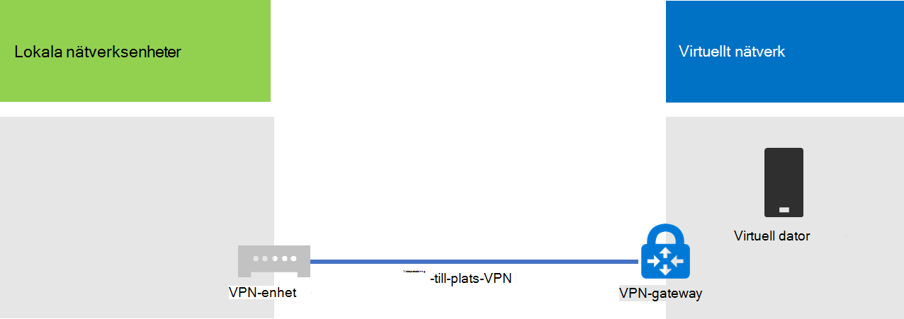
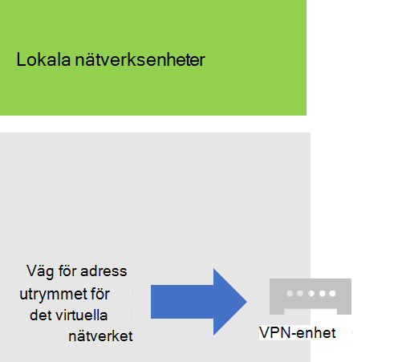
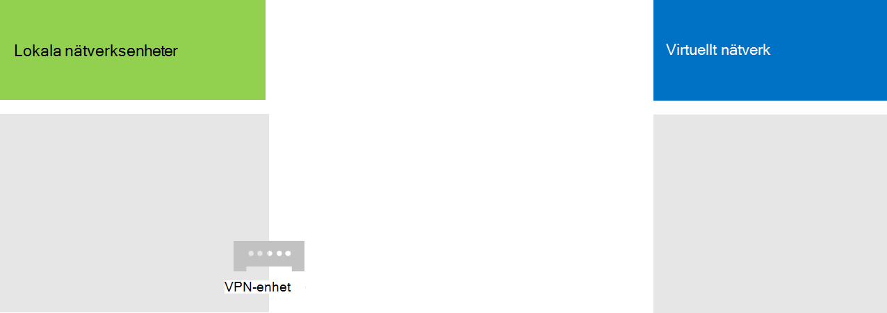
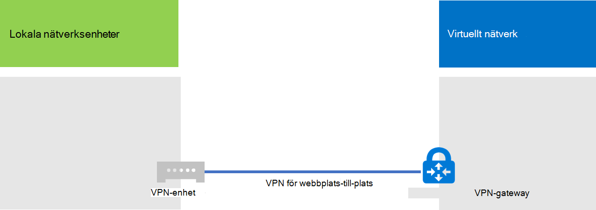

# <a name="connect-an-on-premises-network-to-a-microsoft-azure-virtual-network"></a>Ansluta ett lokalt nätverk till ett virtuellt Microsoft Azure-nätverk

Ett virtuellt Azure-nätverk är anslutet till ditt lokala nätverk och utökar ditt nätverk så att undernät och virtuella datorer som finns i Azures infrastrukturtjänster inkluderas. Med den här anslutningen kan datorer i det lokala nätverket få direkt åtkomst till virtuella datorer i Azure och vice versa. 

Till exempel måste en katalogsynkroniseringsserver som körs på en virtuell Azure-dator fråga dina lokala domänkontrollanter om ändringar i konton och synkronisera dessa ändringar med din Microsoft 365-prenumeration. I den här artikeln finns information om hur du kryssar upp ett virtuellt Azure-nätverk på en plats till en webbplats med en anslutning för virtuellt privat nätverk (VPN) som är redo att vara värd för virtuella Azure-datorer.

## <a name="configure-a-cross-premises-azure-virtual-network"></a>Konfigurera ett virtuellt Azure-nätverk på plats

Dina virtuella datorer i Azure behöver inte isoleras från din lokala miljö. Om du vill ansluta virtuella Azure-datorer till dina lokala nätverksresurser måste du konfigurera ett virtuellt Azure-nätverk på plats. Följande diagram visar de komponenter som krävs för att distribuera ett virtuellt Azure-nätverk med en virtuell dator i Azure.
  

 
I diagrammet finns det två nätverk som är anslutna med en VPN-anslutning mellan webbplatser: det lokala nätverket och det virtuella Azure-nätverket. VPN-anslutningen mellan webbplatser är:

- Mellan två slutpunkter som är adresserbara och placerade på det offentliga Internet.
- Avslutas av en VPN-enhet i det lokala nätverket och en Azure VPN-gateway i det virtuella Azure-nätverket.

Det virtuella Azure-nätverket är värd för virtuella datorer. Nätverkstrafik som kommer från virtuella datorer i det virtuella Azure-nätverket vidarebefordras till VPN-gatewayen, som sedan vidarebefordrar trafiken via VPN-anslutningen mellan kontor till VPN-enheten i det lokala nätverket. Routningsinfrastrukturen i det lokala nätverket vidarebefordrar sedan trafiken till destinationen.

>[!Note]
>Du kan också använda [ExpressRoute](https://azure.microsoft.com/services/expressroute/), som är en direkt anslutning mellan din organisation och Microsofts nätverk. Trafik genom ExpressRoute färdas inte via det offentliga Internet. I den här artikeln beskrivs inte hur ExpressRoute används.
>
  
Om du vill konfigurera VPN-anslutningen mellan ditt virtuella Azure-nätverk och ditt lokala nätverk gör du så här: 
  
1. **Lokalt:** Definiera och skapa en lokal nätverksrutt för adressutrymmet i det virtuella Azure-nätverket som pekar på din lokala VPN-enhet.
    
2. **Microsoft Azure:** Skapa ett virtuellt Azure-nätverk med en VPN-anslutning mellan webbplatser. 
    
3. **Lokalt:** Konfigurera din lokala maskinvara eller programvara VPN-enhet för att avsluta VPN-anslutningen som använder IPsec (Internet Protocol security).
    
När du har upprättat VPN-anslutningen mellan webbplatser lägger du till Virtuella Azure-datorer till undernäten för det virtuella nätverket.
  
## <a name="plan-your-azure-virtual-network"></a>Planera ditt virtuella Azure-nätverk
<a name="PlanningVirtual"></a>

### <a name="prerequisites"></a>Förutsättningar
<a name="Prerequisites"></a>

- En Azure-prenumeration. Mer information om Azure-prenumerationer finns på [sidan Så här köper du Azure.](https://azure.microsoft.com/pricing/purchase-options/)
    
- Ett tillgängligt privat IPv4-adressutrymme för tilldelning till det virtuella nätverket och dess undernät, med tillräckligt med utrymme för tillväxt för att hantera antalet virtuella maskiner som behövs både nu och i framtiden.
    
- En tillgänglig VPN-enhet i ditt lokala nätverk för att avsluta VPN-anslutningen mellan webbplatser som stöder kraven för IPsec. Mer information finns i [Om VPN-enheter för virtuella nätverksanslutningar](/azure/vpn-gateway/vpn-gateway-about-vpn-devices)till webbplatser.
    
- Ändringar av din routningsinfrastruktur så att trafik som dirigeras till adressutrymmet i det virtuella Azure-nätverket vidarebefordras till VPN-enheten som är värd för VPN-anslutningen mellan webbplatser.
    
- En webbproxy som ger datorer som är anslutna till det lokala nätverket och Azure-virtuella nätverket åtkomst till Internet.
    
### <a name="solution-architecture-design-assumptions"></a>Antaganden om design av lösningsarkitektur

I följande lista visas de designval som har gjorts för den här lösningsarkitekturen. 
  
- Den här lösningen använder ett enda virtuellt Azure-nätverk med en VPN-anslutning mellan webbplatser. Det virtuella Azure-nätverket är värd för ett enda undernät som kan innehålla flera virtuella datorer. 
    
- Du kan använda routnings- och fjärråtkomsttjänsten (RRAS) i Windows Server 2016 eller Windows Server 2012 för att upprätta en VPN-anslutning mellan det lokala nätverket och det virtuella Azure-nätverket. Du kan också använda andra alternativ, till exempel Cisco eller Juniper Networks VPN-enheter.
    
- Det lokala nätverket kan fortfarande ha nätverkstjänster som AD DS (Active Directory Domain Services), DNS (Domain Name System) och proxyservrar. Beroende på dina behov kan det vara bra att placera några av dessa nätverksresurser i det virtuella Azure-nätverket.
    
För ett befintligt virtuellt Azure-nätverk med ett eller flera undernät ska du avgöra om det finns återstående adressutrymme för ett extra undernät som värd för dina virtuella maskiner, baserat på dina behov. Om du inte har kvar adressutrymmet för ytterligare ett undernät skapar du ett ytterligare virtuellt nätverk som har en egen VPN-anslutning mellan webbplatser.
  
### <a name="plan-the-routing-infrastructure-changes-for-the-azure-virtual-network"></a>Planera ändringar i routningsinfrastrukturen för det virtuella Azure-nätverket

Du måste konfigurera den lokala routningsinfrastrukturen för att vidarebefordra trafik till adressutrymmet i det virtuella Azure-nätverket till den lokala VPN-enhet som är värd för VPN-anslutningen mellan webbplatser.
  
Den exakta metoden för att uppdatera routningsinfrastrukturen beror på hur du hanterar routningsinformationen, vilket kan vara:
  
- Uppdateringar av routningstabeller baserat på manuell konfiguration.
    
- Uppdateringar av routningstabeller baserade på routningsprotokoll, t.ex. ROUTING Information Protocol (USA) eller Open Shortest Path First (OSPF).
    
Kontakta din routingspecialist för att se till att trafik med destinationen till det virtuella Azure-nätverket vidarebefordras till den lokala VPN-enheten.
  
### <a name="plan-for-firewall-rules-for-traffic-to-and-from-the-on-premises-vpn-device"></a>Planera för brandväggsregler för trafik till och från den lokala VPN-enheten

Om din VPN-enhet finns i ett perimeternätverk som har en brandvägg mellan perimeternätverket och Internet kan du behöva konfigurera brandväggen för följande regler för att tillåta VPN-anslutningen mellan webbplatser.
  
- Trafik till VPN-enheten (inkommande från Internet):
    
  - Mål-IP-adress för VPN-enheten och IP-protokollet 50
    
  - Mål-IP-adressen för VPN-enheten och UDP-målport 500
    
  - Mål-IP-adressen för VPN-enheten och UDP-målport 4500
    
- Trafik från VPN-enheten (utgående till Internet):
    
  - Käll-IP-adressen för VPN-enheten och IP-protokollet 50
    
  - Käll-IP-adressen för VPN-enheten och UDP-källport 500
    
  - Käll-IP-adressen för VPN-enheten och UDP-källport 4500
    
### <a name="plan-for-the-private-ip-address-space-of-the-azure-virtual-network"></a>Planera för det privata IP-adressutrymmet i det virtuella Azure-nätverket

Det privata IP-adressutrymmet i det virtuella Azure-nätverket måste kunna hantera adresser som används av Azure som värd för det virtuella nätverket och med minst ett undernät som har tillräckligt med adresser för dina virtuella Azure-datorer.
  
Beräkna antalet adresser som behövs för undernätet genom att räkna antalet virtuella maskiner som du behöver nu, uppskatta framtida tillväxt och använd sedan följande tabell för att fastställa storleken på undernätet.
  
|**Antal virtuella maskiner som behövs**|**Antal värd bitar som behövs**|**Storlek på undernätet**|
|:-----|:-----|:-----|
|1-3  <br/> |3  <br/> |/29  <br/> |
|4-11  <br/> |4  <br/> |/28  <br/> |
|12-27  <br/> |5  <br/> |/27  <br/> |
|28-59  <br/> |6  <br/> |/26  <br/> |
|60-123  <br/> |7  <br/> |/25  <br/> |
   
### <a name="planning-worksheet-for-configuring-your-azure-virtual-network"></a>Planeringskalkylblad för konfiguration av ditt virtuella Azure-nätverk
<a name="worksheet"> </a>

Innan du skapar ett virtuellt Azure-nätverk som värd för virtuella maskiner måste du fastställa de inställningar som krävs i följande tabeller.
  
Fyll i Tabell V för inställningarna för det virtuella nätverket.
  
 **Tabell V: Konfiguration av virtuellt nätverk på flera platser**
  
|**Objekt**|**Konfigurationselement**|**Beskrivning**|**Värde**|
|:-----|:-----|:-----|:-----|
|1.  <br/> |Namn på virtuellt nätverk  <br/> |Ett namn att tilldela till det virtuella Azure-nätverket (exempel DirSyncNet).  <br/> | |
|2.  <br/> |Virtuell nätverksplats  <br/> |Azure-datacentret som kommer att innehålla det virtuella nätverket (t.ex. Väst USA).  <br/> |  <br/> |
|3.  <br/> |IP-adress för VPN-enhet  <br/> |Den offentliga IPv4-adressen till VPN-enhetens gränssnitt på Internet. Ta reda på adressen tillsammans med IT-avdelningen.  <br/> |  <br/> |
|4.  <br/> |Virtuellt nätverksadressutrymme  <br/> |Adressutrymmet (som definierats i ett enda privat adressprefix) för det virtuella nätverket. Ta reda på det här adressutrymmet tillsammans med IT-avdelningen. Adressutrymmet ska vara i CIDR-format (Classless Interdomain Routing), även kallat nätverksprefixformat. Ett exempel är 10.24.64.0/20.  <br/> | <br/> |
|5.  <br/> |Delad IPsec-nyckel  <br/> |En slumpmässig alfanumerisk sträng med 32 tecken som används för att autentisera båda sidorna av VPN-anslutningen mellan webbplatser. Arbeta med IT- eller säkerhetsavdelningen för att fastställa det här nyckelvärdet och lagra det sedan på en säker plats. Alternativt kan du gå till [Skapa en slumpmässig sträng för en IPsec-fördelsnyckel](https://social.technet.microsoft.com/wiki/contents/articles/32330.create-a-random-string-for-an-ipsec-preshared-key.aspx).  <br/> | <br/> |
   
Fyll i Tabell S för undernäten för den här lösningen.
  
- För det första undernätet bestämmer du ett 28-bitars adressutrymme (med prefixlängden /28) för Azure Gateway-undernätet. Mer [information om hur du fastställer det här adressutrymmet finns i](/archive/blogs/solutions_advisory_board/calculating-the-gateway-subnet-address-space-for-azure-virtual-networks) Beräkna gatewayundernätets adressutrymme för virtuella Azure-nätverk.
    
- För det andra undernätet anger du ett eget namn, ett enda IP-adressutrymme baserat på det virtuella nätverksadressutrymmet och ett beskrivande syfte.
    
Arbeta med IT-avdelningen för att fastställa dessa adressutrymmen från det virtuella nätverksadressutrymmet. Båda adress blankstegen ska vara i CIDR-format.
  
 **Tabell S: Undernät i det virtuella nätverket**
  
|**Objekt**|**Undernätsnamn**|**Adressutrymme för undernät**|**Syfte**|
|:-----|:-----|:-----|:-----|
|1.  <br/> |GatewaySubnet  <br/> |  <br/> |Det undernät som används av Azure Gateway.  <br/> |
|2.  <br/> |  <br/> |  <br/> |  <br/> |
   
Fyll i Tabell D för de lokala DNS-servrar som du vill att de virtuella maskinerna i det virtuella nätverket ska använda. Ge varje DNS-server ett eget namn och en enda IP-adress. Det här användarvänliga namnet behöver inte matcha DNS-serverns värdnamn eller datornamn. Observera att två tomma poster visas, men du kan lägga till fler. Ta reda på listan tillsammans med IT-avdelningen.
  
 **Tabell D: Lokala DNS-servrar**
  
|**Objekt**|**Eget namn för DNS-server**|**IP-adress för DNS-server**|
|:-----|:-----|:-----|
|1.  <br/> |  <br/> |  <br/> |
|2.  <br/> |  <br/> |  <br/> |
   
Om du vill dirigera paket från det virtuella Azure-nätverket till organisationens nätverk via VPN-anslutningen mellan webbplatser måste du konfigurera det virtuella nätverket med ett lokalt nätverk. Det här lokala nätverket har en lista med adressutrymmen (i CIDR-format) för alla platser i organisationens lokala nätverk som virtuella maskiner i det virtuella nätverket måste nå. Det kan vara alla platser i det lokala nätverket eller en delmängd. Listan med adressutrymmen som definierar ditt lokala nätverk måste vara unik och får inte överlappa med de adressutrymmen som används för det här virtuella nätverket eller andra virtuella korslokala nätverk.
  
För de lokala nätverksadressutrymmena fyller du i Tabell L. Observera att tre tomma poster visas, men du behöver vanligtvis mer. Ta reda på listan tillsammans med IT-avdelningen.
  
 **Tabell L: Adressprefix för det lokala nätverket**
  
|**Objekt**|**Lokalt nätverksadressutrymme**|
|:-----|:-----|
|1.  <br/> |  <br/> |
|2.  <br/> |  <br/> |
|3.  <br/> |  <br/> |
   
## <a name="deployment-roadmap"></a>Distributionsöversikt
<a name="DeploymentRoadmap"> </a>

Att skapa det virtuella nätverket på plats och lägga till virtuella maskiner i Azure består av tre faser:
  
- Fas 1: Förbereda det lokala nätverket.
    
- Fas 2: Skapa det virtuella korslokala nätverket i Azure.
    
- Fas 3 (valfritt): Lägg till virtuella datorer.
    
### <a name="phase-1-prepare-your-on-premises-network"></a>Fas 1: Förbereda det lokala nätverket
<a name="Phase1"></a>

Du måste konfigurera det lokala nätverket med en route som pekar på och i slutänden levererar trafik till det virtuella nätverkets adressutrymme till routern vid kanten av det lokala nätverket. Fråga nätverksadministratören hur du lägger till routningen i det lokala nätverkets routningsinfrastruktur.
  
Här är konfigurationsresultatet.
  

  
### <a name="phase-2-create-the-cross-premises-virtual-network-in-azure"></a>Fas 2: Skapa det virtuella korslokala nätverket i Azure
<a name="Phase2"></a>

Öppna först en Azure PowerShell-uppmaning. Om du inte har installerat Azure PowerShell kan du gå [till Komma igång med Azure PowerShell.](/powershell/azure/get-started-azureps)

 
Sedan loggar du in på ditt Azure-konto med det här kommandot.
  
```powershell
Connect-AzAccount
```

Hämta ditt prenumerationsnamn med följande kommando.
  
```powershell
Get-AzSubscription | Sort SubscriptionName | Select SubscriptionName
```

Ställ in din Azure-prenumeration med de här kommandona. Ersätt allt inom citattförfrågningarna, inklusive < och > tecken, med rätt prenumerationsnamn.
  
```powershell
$subscrName="<subscription name>"
Select-AzSubscription -SubscriptionName $subscrName
```

Skapa sedan en ny resursgrupp för ditt virtuella nätverk. Använd det här kommandot för att lista dina befintliga resursgrupper när du ska fastställa ett unikt resursgruppnamn.
  
```powershell
Get-AzResourceGroup | Sort ResourceGroupName | Select ResourceGroupName
```

Skapa den nya resursgruppen med dessa kommandon.
  
```powershell
$rgName="<resource group name>"
$locName="<Table V - Item 2 - Value column>"
New-AzResourceGroup -Name $rgName -Location $locName
```

Därefter skapar du det virtuella Azure-nätverket.
  
```powershell
# Fill in the variables from previous values and from Tables V, S, and D
$rgName="<name of your new resource group>"
$locName="<Azure location of your new resource group>"
$vnetName="<Table V - Item 1 - Value column>"
$vnetAddrPrefix="<Table V - Item 4 - Value column>"
$gwSubnetPrefix="<Table S - Item 1 - Subnet address space column>"
$SubnetName="<Table S - Item 2 - Subnet name column>"
$SubnetPrefix="<Table S - Item 2 - Subnet address space column>"
$dnsServers=@( "<Table D - Item 1 - DNS server IP address column>", "<Table D - Item 2 - DNS server IP address column>" )
$locShortName=(Get-AzResourceGroup -Name $rgName).Location

# Create the Azure virtual network and a network security group that allows incoming remote desktop connections to the subnet that is hosting virtual machines
$gatewaySubnet=New-AzVirtualNetworkSubnetConfig -Name "GatewaySubnet" -AddressPrefix $gwSubnetPrefix
$vmSubnet=New-AzVirtualNetworkSubnetConfig -Name $SubnetName -AddressPrefix $SubnetPrefix
New-AzVirtualNetwork -Name $vnetName -ResourceGroupName $rgName -Location $locName -AddressPrefix $vnetAddrPrefix -Subnet $gatewaySubnet,$vmSubnet -DNSServer $dnsServers
$rule1=New-AzNetworkSecurityRuleConfig -Name "RDPTraffic" -Description "Allow RDP to all VMs on the subnet" -Access Allow -Protocol Tcp -Direction Inbound -Priority 100 -SourceAddressPrefix Internet -SourcePortRange * -DestinationAddressPrefix * -DestinationPortRange 3389
New-AzNetworkSecurityGroup -Name $SubnetName -ResourceGroupName $rgName -Location $locShortName -SecurityRules $rule1
$vnet=Get-AzVirtualNetwork -ResourceGroupName $rgName -Name $vnetName
$nsg=Get-AzNetworkSecurityGroup -Name $SubnetName -ResourceGroupName $rgName
Set-AzVirtualNetworkSubnetConfig -VirtualNetwork $vnet -Name $SubnetName -AddressPrefix $SubnetPrefix -NetworkSecurityGroup $nsg
$vnet | Set-AzVirtualNetwork
```

Här är konfigurationsresultatet.
  

  
Använd sedan dessa kommandon för att skapa gateways för VPN-anslutningen mellan webbplatser.
  
```powershell
# Fill in the variables from previous values and from Tables V and L
$vnetName="<Table V - Item 1 - Value column>"
$localGatewayIP="<Table V - Item 3 - Value column>"
$localNetworkPrefix=@( <comma-separated, double-quote enclosed list of the local network address prefixes from Table L, example: "10.1.0.0/24", "10.2.0.0/24"> )
$vnetConnectionKey="<Table V - Item 5 - Value column>"
$vnet=Get-AzVirtualNetwork -Name $vnetName -ResourceGroupName $rgName
# Attach a virtual network gateway to a public IP address and the gateway subnet
$publicGatewayVipName="PublicIPAddress"
$vnetGatewayIpConfigName="PublicIPConfig"
New-AzPublicIpAddress -Name $vnetGatewayIpConfigName -ResourceGroupName $rgName -Location $locName -AllocationMethod Dynamic
$publicGatewayVip=Get-AzPublicIpAddress -Name $vnetGatewayIpConfigName -ResourceGroupName $rgName
$vnetGatewayIpConfig=New-AzVirtualNetworkGatewayIpConfig -Name $vnetGatewayIpConfigName -PublicIpAddressId $publicGatewayVip.Id -SubnetId $vnet.Subnets[0].Id
# Create the Azure gateway
$vnetGatewayName="AzureGateway"
$vnetGateway=New-AzVirtualNetworkGateway -Name $vnetGatewayName -ResourceGroupName $rgName -Location $locName -GatewayType Vpn -VpnType RouteBased -IpConfigurations $vnetGatewayIpConfig
# Create the gateway for the local network
$localGatewayName="LocalNetGateway"
$localGateway=New-AzLocalNetworkGateway -Name $localGatewayName -ResourceGroupName $rgName -Location $locName -GatewayIpAddress $localGatewayIP -AddressPrefix $localNetworkPrefix
# Create the Azure virtual network VPN connection
$vnetConnectionName="S2SConnection"
$vnetConnection=New-AzVirtualNetworkGatewayConnection -Name $vnetConnectionName -ResourceGroupName $rgName -Location $locName -ConnectionType IPsec -SharedKey $vnetConnectionKey -VirtualNetworkGateway1 $vnetGateway -LocalNetworkGateway2 $localGateway
```

Här är konfigurationsresultatet.
  

  
Konfigurera sedan din lokala VPN-enhet för att ansluta till Azure VPN-gatewayen. Mer information finns i [Om VPN-enheter för Azure Virtual Network-anslutningar](/azure/vpn-gateway/vpn-gateway-about-vpn-devices)mellan webbplatser.
  
För att konfigurera VPN-enheten behöver du följande:
  
- Den offentliga IPv4-adressen för Azure VPN-gatewayen för ditt virtuella nätverk. Använd kommandot **Get-AzPublicIpAddress -Name $vnetGatewayIpConfigName -ResourceGroupName $rgName** för att visa den här adressen.
    
- IPsec-fördelade nyckeln för VPN-anslutningen mellan webbplatser (Tabell V- Objekt 5 – Värdekolumn).
    
Här är konfigurationsresultatet.
  

  
### <a name="phase-3-optional-add-virtual-machines"></a>Fas 3 (valfritt): Lägg till virtuella datorer

Skapa de virtuella datorer du behöver i Azure. Mer information finns i Skapa [en virtuell Windows-dator med Azure Portal.](https://go.microsoft.com/fwlink/p/?LinkId=393098)
  
Använd följande inställningar:
  
- På fliken **Grunder väljer** du samma prenumerations- och resursgrupp som det virtuella nätverket. Du behöver dem senare för att logga in på den virtuella datorn. I avsnittet **Instansinformation** väljer du rätt storlek på den virtuella datorn. Registrera användarnamnet och lösenordet för administratörskontot på en säker plats. 
    
- På fliken **Nätverk** väljer du namnet på ditt virtuella nätverk och undernätet för värd för virtuella maskiner (inte GatewaySubnet). Lämna alla andra inställningar för standardvärdena.
    
Kontrollera att den virtuella datorn använder DNS korrekt genom att kontrollera din interna DNS så att adressposterna (A) har lagts till åt den nya virtuella datorn. För att du ska kunna komma åt Internet måste dina virtuella Azure-datorer vara konfigurerade för att använda ditt lokala nätverks proxyserver. Kontakta nätverksadministratören för att få ytterligare konfigurationssteg att utföra på servern.
  
Här är konfigurationsresultatet.
  

  
## <a name="next-step"></a>Nästa steg
  
[Distribuera Microsoft 365-katalogsynkronisering i Microsoft Azure](deploy-microsoft-365-directory-synchronization-dirsync-in-microsoft-azure.md)