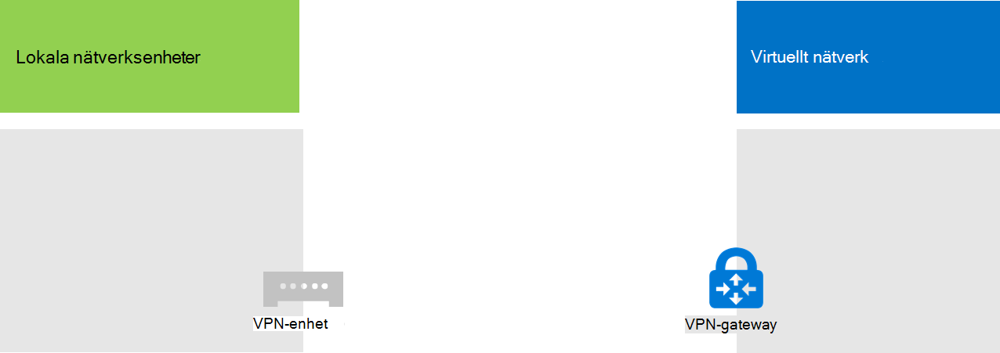

# <a name="connect-an-on-premises-network-to-a-microsoft-azure-virtual-network"></a>Ansluta ett lokalt nätverk till ett Microsoft Azure-nätverk

Ett lokalt Azure-nätverk ansluts till ditt lokala nätverk, så att nätverket utökas för att omfatta delnät och virtuella datorer i Azure Infrastructure Services. Med den här anslutningen kan datorer i ditt lokala nätverk direkt komma åt virtuella datorer i Azure och vice versa. 

En programkatalogpartition som körs på en virtuell Azure-dator måste till exempel söka efter ändringar i de lokala domän kontrol Lanterna och synkronisera ändringarna med ditt Microsoft 365-abonnemang. I den här artikeln beskrivs hur du konfigurerar ett lokalt Azure-nätverk med en VPN-anslutning som är redo att vara värd för virtuella Azure-datorer.

## <a name="configure-a-cross-premises-azure-virtual-network"></a>Konfigurera ett lokalt Azure-virtuellt nätverk

De virtuella datorerna i Azure behöver inte isoleras från din lokala miljö. För att ansluta virtuella Azure-datorer till lokala nätverks resurser måste du konfigurera ett lokalt Azure-virtuellt nätverk. I följande diagram visas de komponenter som krävs för att distribuera ett interlokalt Azure-virtuellt nätverk med en virtuell dator i Azure.
  

 
I diagrammet finns det två nätverk anslutna med en VPN-anslutning för plats-till-plats: det lokala nätverket och det virtuella Azure-nätverket. VPN-anslutningen för webbplats-till-plats är:

- Mellan två slut punkter som är adresser bara och finns på det offentliga Internet.
- Avbröts av en VPN-enhet i det lokala nätverket och en Azure VPN gateway i det virtuella Azure-nätverket.

Virtuella datorer för Azure virtuella nätverk värdar. Nätverks trafik från virtuella datorer i det virtuella Azure-nätverket vidarebefordras till VPN-gatewayen, som sedan vidarebefordrar trafiken via plats-till-plats-anslutningen till VPN-enheten i det lokala nätverket. Infrastrukturen för routning i det lokala nätverket vidarebefordrar sedan trafiken till dess mål.

>[!Note]
>Du kan också använda [ExpressRoute](https://azure.microsoft.com/services/expressroute/), som är en direkt förbindelse mellan din organisation och Microsofts nätverk. Trafik över ExpressRoute reser inte över det offentliga Internet. I den här artikeln beskrivs inte hur ExpressRoute används.
>
  
Följ de här stegen om du vill konfigurera VPN-anslutningen mellan Azure Virtual Network och det lokala nätverket: 
  
1. **Lokalt:** Definiera och skapa en lokal nätverks väg för adress utrymmet för det virtuella Azure-nätverket som pekar på din lokala VPN-enhet.
    
2. **Microsoft Azure:** Skapa ett Azure Virtual Network med en VPN-anslutning för plats-till-plats. 
    
3. **Lokalt:** Konfigurera den lokala maskinvaru-eller program varu-VPN-enheten för att avsluta VPN-anslutningen, som använder IP-säkerhet (IPsec).
    
När du har upprättat VPN-anslutningen för plats-till-plats lägger du till virtuella Azure-datorer i under näten för det virtuella nätverket.
  
## <a name="plan-your-azure-virtual-network"></a>Planera det virtuella Azure-nätverket
<a name="PlanningVirtual"></a>

### <a name="prerequisites"></a>Förutsättningar
<a name="Prerequisites"></a>

- En Azure-prenumeration. Om du vill ha mer information om Azure-prenumerationer går du till [sidan om att köpa Azure](https://azure.microsoft.com/pricing/purchase-options/).
    
- Ett tillgängligt privat IPv4-adress utrymme som kan kopplas till det virtuella nätverket och dess undernät, med tillräckligt utrymme för tillväxt för att rymma det antal virtuella datorer som behövs nu och i framtiden.
    
- En tillgänglig VPN-enhet i det lokala nätverket för att avsluta VPN-anslutningen för webbplats-till-plats som stöder kraven för IPsec. Mer information finns i [om VPN-enheter för virtuella nätverks anslutningar mellan](https://go.microsoft.com/fwlink/p/?LinkId=393093)webbplatser.
    
- Ändringar i infrastrukturen för routning så att trafiken dirigeras till den VPN-enhet som är värd för VPN-anslutningen för plats-till-plats.
    
- En webbproxy som ger datorer som är anslutna till det lokala nätverket och det virtuella Azure-nätverket till gång till Internet.
    
### <a name="solution-architecture-design-assumptions"></a>Utvecklings antagande för lösnings arkitektur

Följande lista visar de design alternativ som har gjorts för den här lösnings arkitekturen. 
  
- Den här lösningen använder ett enda virtuellt Azure-nätverk med en VPN-anslutning för plats-till-plats. Det virtuella Azure-nätverket har ett enda undernät som kan innehålla flera virtuella datorer. 
    
- Du kan använda tjänsten Routning och fjärråtkomst (RRAS) i Windows Server 2016 eller Windows Server 2012 för att upprätta en IPsec-plats-till-plats-VPN-anslutning mellan det lokala nätverket och det virtuella Azure-nätverket. Du kan också använda andra alternativ, till exempel Cisco-eller Juniper-nätverk.
    
- Det lokala nätverket kan fortfarande ha nätverks tjänster, till exempel AD DS (Active Directory Domain Services), DNS (Domain Name System) och proxyservrar. Beroende på dina behov kan det vara bra att placera vissa av de här nätverks resurserna i Azure Virtual Network.
    
För ett befintligt Azure Virtual Network med ett eller flera undernät kan du ta reda på om det finns återstående adress utrymme för ytterligare undernät som är värdar för dina nödvändiga virtuella datorer, baserat på dina behov. Om du inte har kvar adress utrymmet för ytterligare ett undernät kan du skapa ett ytterligare virtuellt nätverk som har sin egen VPN-anslutning för plats-till-plats.
  
### <a name="plan-the-routing-infrastructure-changes-for-the-azure-virtual-network"></a>Planera ändringar i infrastrukturs infrastrukturen för Azure Virtual Network

Du måste konfigurera den lokala infrastruktur infrastrukturen för att vidarekoppla trafik till den lokala VPN-enhet som är värd för det virtuella Azure-nätverkets adress utrymme.
  
Exakt hur du uppdaterar infrastrukturen för routning beror på hur du hanterar routningsinformation, som kan vara:
  
- Uppdateringar för routningstabell baserat på manuell konfiguration.
    
- Uppdateringar för routningstabell baserat på routningsprotokoll, till exempel RIP (Routing Information Protocol) eller Open Shortest Path First (OSPF).
    
Råd fråga din routningsgrupp för att se till att trafiken till den lokala VPN-enheten vidarebefordras till den.
  
### <a name="plan-for-firewall-rules-for-traffic-to-and-from-the-on-premises-vpn-device"></a>Planera för brand Väggs regler för trafik till och från den lokala VPN-enheten

Om din VPN-enhet finns i ett perimeternätverk med en brand vägg mellan perimeternätverket och Internet kan du behöva konfigurera brand väggen för följande regler för att tillåta VPN-anslutningen för webbplats-till-plats.
  
- Trafik till VPN-enheten (inkommande från Internet):
    
  - Mål-IP-adress för VPN-enhet och IP-protokoll 50
    
  - Mål-IP-adress för VPN-enhet och UDP-målport 500
    
  - Mål-IP-adress för VPN-enhet och UDP-målport 4500
    
- Trafik från VPN-enheten (utgående till Internet):
    
  - Käll-IP-adress för VPN-enhet och IP-protokoll 50
    
  - Käll-IP-adress för VPN-enhet och UDP-källport 500
    
  - Käll-IP-adress för VPN-enhet och UDP-källport 4500
    
### <a name="plan-for-the-private-ip-address-space-of-the-azure-virtual-network"></a>Planera för det privata IP-adressutrymmet för Azure Virtual Network

Det privata IP-adressutrymmet för Azure Virtual Network måste kunna hantera adresser som används av Azure för att hantera det virtuella nätverket och med minst ett undernät som har tillräckligt med adresser för dina virtuella Azure-datorer.
  
Om du vill ta reda på antalet adresser som behövs för under nätet kan du räkna antalet virtuella datorer du behöver nu, uppskatta för framtida tillväxt och sedan använda tabellen nedan för att bestämma storleken på under nätet.
  
|**Antal virtuella datorer som behövs**|**Antal värd bitar som behövs**|**Storlek på under nätet**|
|:-----|:-----|:-----|
|1-3  <br/> |amp;3D  <br/> |/29  <br/> |
|4-11  <br/> |9.4  <br/> |/28  <br/> |
|12-27  <br/> |T5  <br/> |/27  <br/> |
|28-59  <br/> |18.6  <br/> |/26  <br/> |
|60-123  <br/> |borttagning  <br/> |/25  <br/> |
   
### <a name="planning-worksheet-for-configuring-your-azure-virtual-network"></a>Planera kalkyl blad för att konfigurera ditt Azure Virtual Network
<a name="worksheet"> </a>

Innan du skapar ett virtuellt Azure-nätverk för att vara värd för virtuella datorer måste du bestämma vilka inställningar som behövs i följande tabeller.
  
Fyll i tabell V för att få inställningar för det virtuella nätverket.
  
 **Tabell V: konfiguration för lokalt nätverk**
  
|**Objekt**|**Konfigurations element**|**Beskrivning**|**Värde**|
|:-----|:-----|:-----|:-----|
|1.  <br/> |Virtuellt nätverks namn  <br/> |Ett namn som ska tilldelas Azure Virtual Network (exempel DirSyncNet).  <br/> | |
|2.  <br/> |Virtuell nätverks plats  <br/> |Azure-datacentret som kommer att innehålla det virtuella nätverket (till exempel västra USA).  <br/> |  <br/> |
|3.  <br/> |IP-adress för VPN-enhet  <br/> |Offentlig IPv4-adress för din VPN-enhets gränssnitt på Internet. Arbeta med IT-avdelningen för att bestämma den här adressen.  <br/> |  <br/> |
|4.  <br/> |Adress utrymme för virtuellt nätverk  <br/> |Adress utrymmet (definierat i ett prefix för enskilda privata adresser) för det virtuella nätverket. Arbeta med IT-avdelningen för att ta reda på det här adress utrymmet. Adress utrymmet bör vara i CIDR-format (Classless Interdomain Routing), som även kallas för nätverksprefix. Ett exempel är 10.24.64.0/20.  <br/> | <br/> |
|5.  <br/> |Delad IPsec-nycklar  <br/> |En 32-tecken slumpmässig, alfanumerisk sträng som används för att autentisera båda sidor av VPN-anslutningen för webbplats-till-plats. Arbeta med din IT-eller säkerhets avdelning för att fastställa det här nyckelvärdet och spara det på en säker plats. Du kan också läsa [skapa en slumpmässig sträng för en förutdelad IPsec-produktnyckel](https://social.technet.microsoft.com/wiki/contents/articles/32330.create-a-random-string-for-an-ipsec-preshared-key.aspx).  <br/> | <br/> |
   
Fyll i tabell S för under nätet i den här lösningen.
  
- För det första under nätet bestämmer du ett 28-bitars adress utrymme (med en/28 prefixlängd) för Azure Gateway-undernätet. Se [Beräkna adress utrymmet för gateway-adressundernät för virtuella Azure-nätverk](https://blogs.technet.microsoft.com/solutions_advisory_board/2016/12/01/calculating-the-gateway-subnet-address-space-for-azure-virtual-networks/) för information om hur du tar reda på det här adress utrymmet.
    
- För det andra under nätet anger du ett eget namn, ett enskilt IP-adressutrymmet baserat på adress utrymmet för det virtuella nätverket och ett beskrivande syfte.
    
Arbeta med IT-avdelningen för att fastställa dessa adress utrymmen från det virtuella nätverkets adress utrymme. Båda adress utrymmen bör vara i CIDR-format.
  
 **Tabell S: undernät i det virtuella nätverket**
  
|**Objekt**|**Namn på undernät**|**Adress utrymme för undernät**|**Ändamål**|
|:-----|:-----|:-----|:-----|
|1.  <br/> |GatewaySubnet  <br/> |  <br/> |Under nätet som används av Azure Gateway.  <br/> |
|2.  <br/> |  <br/> |  <br/> |  <br/> |
   
Fyll i tabell D för de lokala DNS-servrar som du vill att de virtuella datorerna i det virtuella nätverket ska använda. ge varje DNS-Server ett eget namn och en enda IP-adress. Det eget namnet behöver inte matcha värd namnet eller dator namnet för DNS-servern. Observera att två tomma poster visas, men du kan lägga till fler. Arbeta med IT-avdelningen för att fastställa den här listan.
  
 **Tabell D: lokala DNS-servrar**
  
|**Objekt**|**Eget namn på DNS-Server**|**IP-adress för DNS-Server**|
|:-----|:-----|:-----|
|1.  <br/> |  <br/> |  <br/> |
|2.  <br/> |  <br/> |  <br/> |
   
Om du vill dirigera paket från det virtuella Azure-nätverket till organisationens nätverk via VPN-anslutningen för webbplats-till-plats måste du konfigurera det virtuella nätverket med ett lokalt nätverk. Det här lokala nätverket har en lista med adress utrymmen (i CIDR-format) för alla platser i organisationens lokala nätverk som de virtuella datorerna måste nå. Detta kan vara alla platser i det lokala nätverket eller en del uppsättning. Listan med adress utrymmen som definierar ditt lokala nätverk måste vara unikt och får inte överlappa adresserna som används för det här virtuella nätverket eller andra lokala nätverk.
  
För uppsättningen med lokala nätverks adress utrymmen fyller du i tabell L. Lägg märke till att tre tomma poster visas, men att du oftast behöver mer. Arbeta med IT-avdelningen för att fastställa den här listan.
  
 **Tabell L: adressprefix för det lokala nätverket**
  
|**Objekt**|**Lokala nätverks adress utrymmet**|
|:-----|:-----|
|1.  <br/> |  <br/> |
|2.  <br/> |  <br/> |
|3.  <br/> |  <br/> |
   
## <a name="deployment-roadmap"></a>Distributions översikt
<a name="DeploymentRoadmap"> </a>

Att skapa det lokala virtuella nätverket och lägga till virtuella datorer i Azure består av tre faser:
  
- Fas 1: förbereda det lokala nätverket.
    
- Fas 2: skapa det lokala virtuella nätverket i Azure.
    
- Phase 3 (valfritt): lägga till virtuella datorer.
    
### <a name="phase-1-prepare-your-on-premises-network"></a>Fas 1: förbereda ditt lokala nätverk
<a name="Phase1"></a>

Du måste konfigurera det lokala nätverket med en väg som pekar på och slutligen levererar trafik till det virtuella nätverkets adress utrymme till routern på kanten av det lokala nätverket. Kontakta nätverks administratören för att få reda på hur du lägger till vägen i infrastrukturen för det lokala nätverket.
  
Här är konfigurationsresultatet.
  

  
### <a name="phase-2-create-the-cross-premises-virtual-network-in-azure"></a>Fas 2: skapa det lokala virtuella nätverket i Azure
<a name="Phase2"></a>

Öppna först en Azure PowerShell-kommandotolk. Om du inte har installerat Azure PowerShell läser du [komma igång med Azure PowerShell](https://docs.microsoft.com/powershell/azure/get-started-azureps).

 
Logga sedan in på ditt Azure-konto med det här kommandot.
  
```powershell
Connect-AzAccount
```

Hämta ditt prenumerationsnamn med följande kommando.
  
```powershell
Get-AzSubscription | Sort SubscriptionName | Select SubscriptionName
```

Ställ in ditt Azure-abonnemang med dessa kommandon. Ersätt allt inom citat tecken, inklusive < och > tecken, med rätt prenumerations namn.
  
```powershell
$subscrName="<subscription name>"
Select-AzSubscription -SubscriptionName $subscrName
```

Skapa sedan en ny resurs grupp för ditt virtuella nätverk. Använd det här kommandot för att lista dina befintliga resursgrupper när du ska fastställa ett unikt resursgruppnamn.
  
```powershell
Get-AzResourceGroup | Sort ResourceGroupName | Select ResourceGroupName
```

Skapa den nya resursgruppen med dessa kommandon.
  
```powershell
$rgName="<resource group name>"
$locName="<Table V - Item 2 - Value column>"
New-AzResourceGroup -Name $rgName -Location $locName
```

Sedan skapar du Azure Virtual Network.
  
```powershell
# Fill in the variables from previous values and from Tables V, S, and D
$rgName="<name of your new resource group>"
$locName="<Azure location of your new resource group>"
$vnetName="<Table V - Item 1 - Value column>"
$vnetAddrPrefix="<Table V - Item 4 - Value column>"
$gwSubnetPrefix="<Table S - Item 1 - Subnet address space column>"
$SubnetName="<Table S - Item 2 - Subnet name column>"
$SubnetPrefix="<Table S - Item 2 - Subnet address space column>"
$dnsServers=@( "<Table D - Item 1 - DNS server IP address column>", "<Table D - Item 2 - DNS server IP address column>" )
$locShortName=(Get-AzResourceGroup -Name $rgName).Location

# Create the Azure virtual network and a network security group that allows incoming remote desktop connections to the subnet that is hosting virtual machines
$gatewaySubnet=New-AzVirtualNetworkSubnetConfig -Name "GatewaySubnet" -AddressPrefix $gwSubnetPrefix
$vmSubnet=New-AzVirtualNetworkSubnetConfig -Name $SubnetName -AddressPrefix $SubnetPrefix
New-AzVirtualNetwork -Name $vnetName -ResourceGroupName $rgName -Location $locName -AddressPrefix $vnetAddrPrefix -Subnet $gatewaySubnet,$vmSubnet -DNSServer $dnsServers
$rule1=New-AzNetworkSecurityRuleConfig -Name "RDPTraffic" -Description "Allow RDP to all VMs on the subnet" -Access Allow -Protocol Tcp -Direction Inbound -Priority 100 -SourceAddressPrefix Internet -SourcePortRange * -DestinationAddressPrefix * -DestinationPortRange 3389
New-AzNetworkSecurityGroup -Name $SubnetName -ResourceGroupName $rgName -Location $locShortName -SecurityRules $rule1
$vnet=Get-AzVirtualNetwork -ResourceGroupName $rgName -Name $vnetName
$nsg=Get-AzNetworkSecurityGroup -Name $SubnetName -ResourceGroupName $rgName
Set-AzVirtualNetworkSubnetConfig -VirtualNetwork $vnet -Name $SubnetName -AddressPrefix $SubnetPrefix -NetworkSecurityGroup $nsg
$vnet | Set-AzVirtualNetwork
```

Här är konfigurationsresultatet.
  

  
Använd sedan dessa kommandon för att skapa gatewayen för VPN-anslutningen för webbplats-till-plats.
  
```powershell
# Fill in the variables from previous values and from Tables V and L
$vnetName="<Table V - Item 1 - Value column>"
$localGatewayIP="<Table V - Item 3 - Value column>"
$localNetworkPrefix=@( <comma-separated, double-quote enclosed list of the local network address prefixes from Table L, example: "10.1.0.0/24", "10.2.0.0/24"> )
$vnetConnectionKey="<Table V - Item 5 - Value column>"
$vnet=Get-AzVirtualNetwork -Name $vnetName -ResourceGroupName $rgName
# Attach a virtual network gateway to a public IP address and the gateway subnet
$publicGatewayVipName="PublicIPAddress"
$vnetGatewayIpConfigName="PublicIPConfig"
New-AzPublicIpAddress -Name $vnetGatewayIpConfigName -ResourceGroupName $rgName -Location $locName -AllocationMethod Dynamic
$publicGatewayVip=Get-AzPublicIpAddress -Name $vnetGatewayIpConfigName -ResourceGroupName $rgName
$vnetGatewayIpConfig=New-AzVirtualNetworkGatewayIpConfig -Name $vnetGatewayIpConfigName -PublicIpAddressId $publicGatewayVip.Id -SubnetId $vnet.Subnets[0].Id
# Create the Azure gateway
$vnetGatewayName="AzureGateway"
$vnetGateway=New-AzVirtualNetworkGateway -Name $vnetGatewayName -ResourceGroupName $rgName -Location $locName -GatewayType Vpn -VpnType RouteBased -IpConfigurations $vnetGatewayIpConfig
# Create the gateway for the local network
$localGatewayName="LocalNetGateway"
$localGateway=New-AzLocalNetworkGateway -Name $localGatewayName -ResourceGroupName $rgName -Location $locName -GatewayIpAddress $localGatewayIP -AddressPrefix $localNetworkPrefix
# Create the Azure virtual network VPN connection
$vnetConnectionName="S2SConnection"
$vnetConnection=New-AzVirtualNetworkGatewayConnection -Name $vnetConnectionName -ResourceGroupName $rgName -Location $locName -ConnectionType IPsec -SharedKey $vnetConnectionKey -VirtualNetworkGateway1 $vnetGateway -LocalNetworkGateway2 $localGateway
```

Här är konfigurationsresultatet.
  

  
Konfigurera sedan din lokala VPN-enhet för att ansluta till Azure VPN gateway. Mer information finns i [om VPN-enheter för virtuella Azure-anslutningar mellan](https://docs.microsoft.com/azure/vpn-gateway/vpn-gateway-about-vpn-devices)webbplatser.
  
För att konfigurera din VPN-enhet behöver du följande:
  
- Den offentliga IPv4-adressen för Azure VPN gateway för ditt virtuella nätverk. Använd kommandot **Get-AzPublicIpAddress-Name $vnetGatewayIpConfigName-ResourceGroupName $rgName** för att visa denna adress.
    
- Den fördelade IPsec-länken för VPN för webbplats-till-plats (tabell V-post 5-värde-kolumnen).
    
Här är konfigurationsresultatet.
  

  
### <a name="phase-3-optional-add-virtual-machines"></a>Phase 3 (valfritt): lägga till virtuella datorer

Skapa de virtuella datorerna du behöver i Azure. Mer information finns i [skapa en virtuell Windows-dator med Azure-portalen](https://go.microsoft.com/fwlink/p/?LinkId=393098).
  
Använd följande inställningar:
  
- På fliken **grundläggande** väljer du samma prenumeration och resurs grupp som ditt virtuella nätverk. Du behöver dessa senare för att logga in på den virtuella datorn. I avsnittet **instans information** väljer du en lämplig virtuell dator storlek. Spela in användar namnet och lösen ordet för administratörs kontot på en säker plats. 
    
- På fliken **nätverk** väljer du namnet på ditt virtuella nätverk och under nätet för att vara värd för virtuella datorer (inte GatewaySubnet). Lämna övriga inställningar till standardvärdena.
    
Kontrol lera att din virtuella dator använder DNS på rätt sätt genom att kontrol lera den interna DNS-servern för att se till att adress posterna (A) har lagts till för en ny virtuell dator. För att få åtkomst till Internet måste dina virtuella Azure-datorer vara konfigurerade för att använda det lokala nätverkets proxyserver. Kontakta nätverks administratören för ytterligare konfigurations steg för servern.
  
Här är konfigurationsresultatet.
  

  
## <a name="next-step"></a>Nästa steg
  
[Distribuera Microsoft 365-profilsynkronisering i Microsoft Azure](deploy-microsoft-365-directory-synchronization-dirsync-in-microsoft-azure.md)
