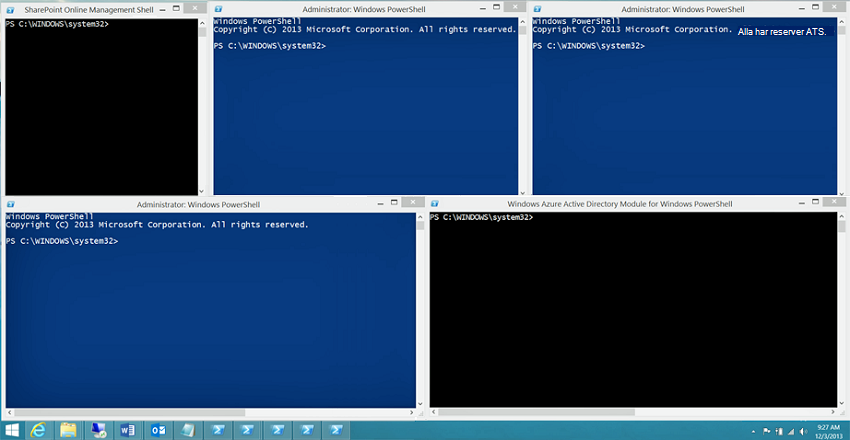

# <a name="connect-to-all-microsoft-365-services-in-a-single-windows-powershell-window"></a>Ansluta till alla Microsoft 365-tjänster i ett enda Windows PowerShell-fönster

När du använder PowerShell för att hantera Microsoft 365 går det att ha upp till fem olika Windows PowerShell-sessioner öppna samtidigt, vilket motsvarar Administrationscenter för Microsoft 365, SharePoint Online, Exchange Online, Skype för företag – Online, Microsoft Teams och &amp; säkerhet- och efterlevnadscenter. Med fem olika anslutningsmetoder i skilda Windows PowerShell-sessioner kan skrivbordet se ut så här:
  

  
Du kan inte använda det här alternativet för att hantera Microsoft 365 eftersom du inte kan utbyta data mellan dessa fem fönster för hantering av flera tjänster. I den här artikeln beskrivs hur du använder en enda instans av Windows PowerShell, som du kan använda för att hantera Microsoft 365-konton, Skype för företag – Online, Exchange Online, SharePoint Online, Microsoft Teams och &amp; säkerhet- och efterlevnadscenter.

>[!Note]
>I den här artikeln finns för närvarande bara kommandon för att ansluta till molnet över hela världen (+GCC). I fler kommentarer finns länkar till artiklar med information om hur du ansluter till andra Microsoft 365-moln.
>

## <a name="before-you-begin"></a>Innan du börjar

Innan du kan hantera hela Microsoft 365 från en enda instans av Windows PowerShell måste följande förutsättningar vara uppfyllda:
  
- Det Microsoft 365-konto för arbete eller skola som du använder för de här procedurerna måste vara medlem i en administratörsroll för Microsoft 365. Mer information finns i [Om administratörsroller](https://docs.microsoft.com/microsoft-365/admin/add-users/about-admin-roles?view=o365-worldwide). Det här är ett krav för PowerShell för Microsoft 365, inte nödvändigtvis för alla andra Microsoft 365-tjänster.
    
- Du kan använda följande 64-bitars versioner av Windows:
    
  - Windows 10
    
  - Windows 8.1 eller Windows 8
    
  - Windows Server 2019
    
  - Windows Server 2016
    
  - Windows Server 2012 R2- eller Windows Server 2012
    
  - Windows 7 Service Pack 1 (SP1)*
    
  - Windows Server 2008 R2 SP1*
    
    \* Du måste installera Microsoft .NET Framework 4.5.*x* och sedan antingen Windows Management Framework 3.0 eller Windows Management Framework 4.0. Mer information finns i [installera .NET Framework](https://go.microsoft.com/fwlink/p/?LinkId=257868) och [Windows Management Framework 3.0](https://go.microsoft.com/fwlink/p/?LinkId=272757) eller [Windows Management Framework 4.0](https://go.microsoft.com/fwlink/p/?LinkId=391344).
    
    Du måste använda en 64-bitars version av Windows på grund av kraven för Skype för företag – Online-modulen och en av Microsoft 365-modulerna.
    
- Du måste installera de moduler som krävs för Azure Active Directory (Azure AD), Exchange Online, SharePoint Online, Skype för företag – Online och Teams:
    
   - [Azure Active Directory V2](connect-to-microsoft-365-powershell.md#connect-with-the-azure-active-directory-powershell-for-graph-module)
   - [SharePoint Online Management Shell](https://go.microsoft.com/fwlink/p/?LinkId=255251)
   - [Skype för företag – Online, Windows PowerShell-modul](https://go.microsoft.com/fwlink/p/?LinkId=532439)
   - [Exchange Online PowerShell V2](https://docs.microsoft.com/powershell/exchange/exchange-online/exchange-online-powershell-v2/exchange-online-powershell-v2?view=exchange-ps#install-and-maintain-the-exchange-online-powershell-v2-module)
   - [Teams PowerShell översikt](https://docs.microsoft.com/microsoftteams/teams-powershell-overview)
    
-  Windows PowerShell måste konfigureras för körning av signerade skript för Skype för företag – Online och &amp; säkerhet- och efterlevnadscenter. Det gör du genom att köra följande kommando i en upphöjd Windows PowerShell-session (ett Windows PowerShell-fönster som du öppnar genom att välja **Kör som administratör**).
    
   ```powershell
   Set-ExecutionPolicy RemoteSigned
   ```

## <a name="connection-steps-when-using-just-a-password"></a>Anslutningssteg när du bara använder ett lösenord

Här är några steg för att ansluta till alla tjänster i ett enda PowerShell-fönster när du bara använder ett lösenord för inloggning.
  
1. Öppna Windows PowerShell.
    
2. Kör detta kommando och ange inloggningsuppgifter för ditt Microsoft 365-arbets-eller skolkonto.
    
   ```powershell
   $credential = Get-Credential
   ```

3. Kör det här kommandot för att ansluta till Azure AD med hjälp av Azure Active Directory PowerShell för Graph-modulen.
    
   ```powershell
   Connect-AzureAD -Credential $credential
   ```
  
   Om du använder modulen Microsoft Azure Active Directory-modul för Windows PowerShell kör du det här kommandot.
      
   ```powershell
   Connect-MsolService -Credential $credential
   ```

   > [!Note]
   > PowerShell Core stöder inte Microsoft Azure Active Directory-modul för Windows PowerShell-modulen och-cmdlets med **MSOL** i namnet. Om du vill fortsätta använda dessa cmdlets måste du köra dem från Windows PowerShell.

4. Kör dessa kommandon för att ansluta till SharePoint Online. Ange organisationsnamnet för din domän. Till exempel, för "litwareinc.onmicrosoft.com" är organisationensnamnet "litwareinc".
    
   ```powershell
   $orgName="<for example, litwareinc for litwareinc.onmicrosoft.com>"
   Connect-SPOService -Url https://$orgName-admin.sharepoint.com -Credential $userCredential
   ```

5. Kör dessa kommandon för att ansluta till Skype för företag – Online. Ett varningsmeddelande om att öka `WSMan NetworkDelayms` värdet förväntas första gången du ansluter och ska ignoreras.
     
   ```powershell
   Import-Module SkypeOnlineConnector
   $sfboSession = New-CsOnlineSession -Credential $credential
   Import-PSSession $sfboSession
   ```

6. Kör det här kommandot när du vill ansluta till Exchange Online.
    
   ```powershell
   Connect-ExchangeOnline -Credential $credential -ShowProgress $true
   ```

   > [!Note]
   > Om du vill ansluta till Exchange Online för Microsoft 365-moln som inte är världsomspännande använder du **-ExchangeEnvironmentName** parameter. Mer information finns i [Connect-ExchangeOnline](https://docs.microsoft.com/powershell/module/exchange/powershell-v2-module/connect-exchangeonline?view=exchange-ps).

7. Kör dessa kommandon för att ansluta till Teams PowerShell.
    
   ```powershell
   Import-Module MicrosoftTeams
   Connect-MicrosoftTeams -Credential $credential
   ```
  
   > [!Note]
   > Om du vill ansluta till Microsoft Teams-moln som inte är världsomspännande läser du [Connect-MicrosoftTeams](https://docs.microsoft.com/powershell/module/teams/connect-microsoftteams?view=teams-ps).

8. Kör dessa kommandon för att ansluta till &amp; säkerhet- och efterlevnadscenter.
    
   ```powershell
   $SccSession = New-PSSession -ConfigurationName Microsoft.Exchange -ConnectionUri https://ps.compliance.protection.outlook.com/powershell-liveid/ -Credential $credential -Authentication "Basic" -AllowRedirection
   Import-PSSession $SccSession -Prefix cc
   ```

   > [!Note]
   > Om du vill ansluta till &amp; säkerhet- och efterlevnadscenter för Microsoft 365-moln, annat än världsomspännande läser du [Ansluta till Säkerhets- och efterlevnadscenter PowerShell](https://docs.microsoft.com/powershell/exchange/office-365-scc/connect-to-scc-powershell/connect-to-scc-powershell).

Här är alla kommandon i ett enda block när du använder Azure Active Directory PowerShell för Graph-moduler. Ange namnet på domänvärden och kör alla samtidigt.
  
```powershell
$orgName="<for example, litwareinc for litwareinc.onmicrosoft.com>"
$credential = Get-Credential
Connect-AzureAD -Credential $credential
Import-Module Microsoft.Online.SharePoint.PowerShell -DisableNameChecking
Connect-SPOService -Url https://$orgName-admin.sharepoint.com -credential $credential
Import-Module SkypeOnlineConnector
$sfboSession = New-CsOnlineSession -Credential $credential
Import-PSSession $sfboSession
$SccSession = New-PSSession -ConfigurationName Microsoft.Exchange -ConnectionUri https://ps.compliance.protection.outlook.com/powershell-liveid/ -Credential $credential -Authentication "Basic" -AllowRedirection
Import-PSSession $SccSession -Prefix cc
Connect-ExchangeOnline -Credential $credential -ShowProgress $true
Import-Module MicrosoftTeams
Connect-MicrosoftTeams -Credential $credential
```

Här finns alla kommandon i ett enda block när du använder Microsoft Azure Active Directory-modul för Windows PowerShell-modul. Ange namnet på domänvärden och kör alla samtidigt.
  
```powershell
$orgName="<for example, litwareinc for litwareinc.onmicrosoft.com>"
$credential = Get-Credential
Connect-MsolService -Credential $credential
Import-Module Microsoft.Online.SharePoint.PowerShell -DisableNameChecking
Connect-SPOService -Url https://$orgName-admin.sharepoint.com -credential $credential
Import-Module SkypeOnlineConnector
$sfboSession = New-CsOnlineSession -Credential $credential
Import-PSSession $sfboSession
$SccSession = New-PSSession -ConfigurationName Microsoft.Exchange -ConnectionUri https://ps.compliance.protection.outlook.com/powershell-liveid/ -Credential $credential -Authentication "Basic" -AllowRedirection
Import-PSSession $SccSession -Prefix cc
Connect-ExchangeOnline -Credential $credential -ShowProgress $true
Import-Module MicrosoftTeams
Connect-MicrosoftTeams -Credential $credential
```

När du är redo att stänga Windows PowerShell-fönstret kör du det här kommandot för att ta bort aktiva sessioner till Skype för företag – Online, SharePoint Online, &amp; säkerhet- och efterlevnadscenter, och Teams:
  
```powershell
Remove-PSSession $sfboSession ; Remove-PSSession $SccSession ; Disconnect-SPOService ; Disconnect-MicrosoftTeams 
```

## <a name="connection-steps-when-using-multi-factor-authentication"></a>Anslutningssteg när du använder multifaktorautentisering

Här är alla kommandon i ett enda block för att ansluta till Azure AD, SharePoint Online, Skype för företag, Exchange Online och Teams med multifaktorautentisering in ett enda fönster med hjälp av Azure Active Directory PowerShell för Graph-modul. Ange användarhuvudnamn (UPN) för ett användarkonto och domänvärdens namn och kör alla samtidigt.

```powershell
$acctName="<UPN of the account, such as belindan@litwareinc.onmicrosoft.com>"
$orgName="<for example, litwareinc for litwareinc.onmicrosoft.com>"
#Azure Active Directory
Connect-AzureAD
#SharePoint Online
Connect-SPOService -Url https://$orgName-admin.sharepoint.com
#Skype for Business Online
$sfboSession = New-CsOnlineSession -UserName $acctName
Import-PSSession $sfboSession
#Exchange Online
Connect-ExchangeOnline -UserPrincipalName $acctName -ShowProgress $true
#Teams
Import-Module MicrosoftTeams
Connect-MicrosoftTeams
```

Här finns alla kommandon när du använder Microsoft Azure Active Directory-modul för Windows PowerShell-modul.

```powershell
$acctName="<UPN of the account, such as belindan@litwareinc.onmicrosoft.com>"
$orgName="<for example, litwareinc for litwareinc.onmicrosoft.com>"
#Azure Active Directory
Connect-MsolService
#SharePoint Online
Connect-SPOService -Url https://$orgName-admin.sharepoint.com
#Skype for Business Online
$sfboSession = New-CsOnlineSession -UserName $acctName
Import-PSSession $sfboSession
#Exchange Online
Connect-ExchangeOnline -UserPrincipalName $acctName -ShowProgress $true
#Teams
Import-Module MicrosoftTeams
Connect-MicrosoftTeams
```

I &amp; säkerhet- och efterlevnadscenter hittar du information om [Ansluta till säkerhet- och efterlevnadscenter PowerShell med multifaktorautentisering](https://docs.microsoft.com/powershell/exchange/office-365-scc/connect-to-scc-powershell/mfa-connect-to-scc-powershell?view=exchange-ps) för att ansluta med multifaktorautentisering:

## <a name="see-also"></a>Se även

- [Ansluta till Microsoft 365 med PowerShell](connect-to-microsoft-365-powershell.md)
- [Hantera SharePoint Online med PowerShell](manage-sharepoint-online-with-microsoft-365-powershell.md)
- [Hantera Microsoft 365-användarkonton,-licenser och-grupper med PowerShell](manage-user-accounts-and-licenses-with-microsoft-365-powershell.md)
- [Använda Windows PowerShell för att skapa rapporter i Microsoft 365](use-windows-powershell-to-create-reports-in-microsoft-365.md)
