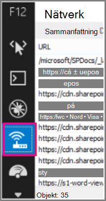
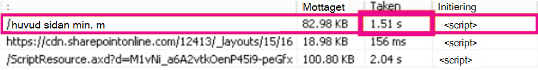
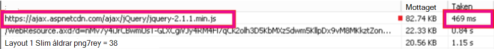

# <a name="content-delivery-networks-cdns"></a><span data-ttu-id="81b63-103">Innehålls leverans nätverk (CDN)</span><span class="sxs-lookup"><span data-stu-id="81b63-103">Content Delivery Networks (CDNs)</span></span>

<span data-ttu-id="81b63-104">*Den här artikeln gäller både Microsoft 365 Enterprise och Office 365 Enterprise.*</span><span class="sxs-lookup"><span data-stu-id="81b63-104">*This article applies to both Microsoft 365 Enterprise and Office 365 Enterprise.*</span></span>

<span data-ttu-id="81b63-105">CDN hjälper till att hålla Office 365 snabbt och tillförlitligt för slutanvändarna.</span><span class="sxs-lookup"><span data-stu-id="81b63-105">CDNs help keep Office 365 fast and reliable for end users.</span></span> <span data-ttu-id="81b63-106">Moln tjänster som Office 365 använder CDN för att cachelagra statiska till gångar i webbläsare för att kunna göra nedladdningar snabbare och minska svars tiden.</span><span class="sxs-lookup"><span data-stu-id="81b63-106">Cloud services like Office 365 use CDNs to cache static assets closer to the browsers requesting them to speed up downloads and reduce perceived end user latency.</span></span> <span data-ttu-id="81b63-107">Informationen i det här avsnittet hjälper dig att lära dig om innehålls leverans nätverk (CDN) och hur de används i Office 365.</span><span class="sxs-lookup"><span data-stu-id="81b63-107">The information in this topic will help you learn about Content Delivery Networks (CDNs) and how they are used by Office 365.</span></span>

## <a name="what-exactly-is-a-cdn"></a><span data-ttu-id="81b63-108">Vad är det för ett CDN?</span><span class="sxs-lookup"><span data-stu-id="81b63-108">What exactly is a CDN?</span></span>

<span data-ttu-id="81b63-109">Ett CDN är ett geografiskt distribuerat nätverk bestående av proxyservrar och fil servrar i Data Center som är anslutna via höghastighets stamnät nätverk.</span><span class="sxs-lookup"><span data-stu-id="81b63-109">A CDN is a geographically distributed network consisting of proxy and file servers in datacenters connected by high-speed backbone networks.</span></span> <span data-ttu-id="81b63-110">CDN används för att minska svars tid och inläsnings tid för en viss uppsättning filer och objekt på en webbplats eller tjänst.</span><span class="sxs-lookup"><span data-stu-id="81b63-110">CDNs are used to reduce latency and load times for a specified set of files and objects in a web site or service.</span></span> <span data-ttu-id="81b63-111">Ett CDN kan ha många tusen slut punkter för optimal behandling av inkommande förfrågningar från valfri plats.</span><span class="sxs-lookup"><span data-stu-id="81b63-111">A CDN may have many thousands of endpoints for optimal servicing of incoming requests from any location.</span></span>

<span data-ttu-id="81b63-112">CDN används ofta för att ge snabbare nedladdning av allmänt innehåll för en webbplats eller tjänst, till exempel JavaScript-filer, ikoner och bilder och kan ge privat åtkomst till användar innehåll som filer i SharePoint Online-dokumentbibliotek, direktuppspelade mediefiler och anpassad kod.</span><span class="sxs-lookup"><span data-stu-id="81b63-112">CDNs are commonly used to provide faster downloads of generic content for a web site or service such as javascript files, icons and images, and can also provide private access to user content such as files in SharePoint Online document libraries, streaming media files, and custom code.</span></span>

<span data-ttu-id="81b63-113">CDN används av de flesta moln tjänster för företag.</span><span class="sxs-lookup"><span data-stu-id="81b63-113">CDNs are used by most enterprise cloud services.</span></span> <span data-ttu-id="81b63-114">Moln tjänster som Office 365 har miljon tals kunder som laddar ner en blandning av eget innehåll (till exempel e-post) och allmänt innehåll (till exempel ikoner) samtidigt.</span><span class="sxs-lookup"><span data-stu-id="81b63-114">Cloud services like Office 365 have millions of customers downloading a mix of proprietary content (such as emails) and generic content (such as icons) at one time.</span></span> <span data-ttu-id="81b63-115">Det är mer effektivt att placera bilder som alla använder, till exempel ikoner, så nära användarens dator som möjligt.</span><span class="sxs-lookup"><span data-stu-id="81b63-115">It's more efficient to put images everyone uses, like icons, as close to the user's computer as possible.</span></span> <span data-ttu-id="81b63-116">Det är inte praktiskt för varje moln tjänst att bygga CDN-Datadata som lagrar detta generiska innehåll i varje huvudlands område, eller till och med i varje tilldelat Internet nav världen över, så att vissa av dessa CDN delas.</span><span class="sxs-lookup"><span data-stu-id="81b63-116">It isn't practical for every cloud service to build CDN datacenters that store this generic content in every metropolitan area, or even in every major Internet hub around the world, so some of these CDNs are shared.</span></span>

## <a name="how-do-cdns-make-services-work-faster"></a><span data-ttu-id="81b63-117">Hur kan CDN-tjänsterna fungera snabbare?</span><span class="sxs-lookup"><span data-stu-id="81b63-117">How do CDNs make services work faster?</span></span>

<span data-ttu-id="81b63-118">Om du laddar ned vanliga objekt, till exempel webbplats bilder och ikoner på nytt kan det ta upp nätverks bandbredd som kan användas för att ladda ner viktig personligt innehåll, som e-post eller dokument.</span><span class="sxs-lookup"><span data-stu-id="81b63-118">Downloading common objects like site images and icons over and over again can take up network bandwidth that can be better used for downloading important personal content, like email or documents.</span></span> <span data-ttu-id="81b63-119">Eftersom Office 365 använder en arkitektur som innehåller CDN, kan ikoner, skript och annat allmänt innehåll hämtas från servrar närmare klient datorer, vilket gör nedladdningarna snabbare.</span><span class="sxs-lookup"><span data-stu-id="81b63-119">Because Office 365 uses an architecture that includes CDNs, the icons, scripts, and other generic content can be downloaded from servers closer to client computers, making the downloads faster.</span></span> <span data-ttu-id="81b63-120">Det innebär snabbare åtkomst till ditt personliga innehåll, som är säkert lagrat i Office 365-datacenter.</span><span class="sxs-lookup"><span data-stu-id="81b63-120">This means faster access to your personal content, which is securely stored in Office 365 datacenters.</span></span>

<span data-ttu-id="81b63-121">CDN hjälp för att förbättra moln tjänstens prestanda på flera olika sätt:</span><span class="sxs-lookup"><span data-stu-id="81b63-121">CDNs help to improve cloud service performance in several ways:</span></span>

- <span data-ttu-id="81b63-122">CDN byta del av nätverket och få fil nedladdning borta från moln tjänsten och frigör moln tjänst resurser för att betjäna användar innehåll och andra tjänster genom att minska behovet av att hantera förfrågningar för statiska till gångar.</span><span class="sxs-lookup"><span data-stu-id="81b63-122">CDNs shift part of the network and file download burden away from the cloud service, freeing up cloud service resources for serving user content and other services by reducing the need to serve requests for static assets.</span></span>
- <span data-ttu-id="81b63-123">CDN är syfte som är utformade för att tillhandahålla begränsad fil åtkomst genom att implementera högpresterande nätverk och fil servrar och genom att använda uppdaterade nätverks protokoll som [http/2](https://en.wikipedia.org/wiki/HTTP/2) med mycket effektiv komprimering och begäran om multiplexering.</span><span class="sxs-lookup"><span data-stu-id="81b63-123">CDNs are purpose built to provide low-latency file access by implementing high performance networks and file servers, and by leveraging updated network protocols such as [HTTP/2](https://en.wikipedia.org/wiki/HTTP/2) with highly efficient compression and request multiplexing.</span></span>
- <span data-ttu-id="81b63-124">CDN-nätverk använder många globalt distribuerade slut punkter för att göra innehållet tillgängligt så nära som möjligt för användarna.</span><span class="sxs-lookup"><span data-stu-id="81b63-124">CDN networks use many globally distributed endpoints to make content available as close as possible to users.</span></span>

## <a name="the-office-365-cdn"></a><span data-ttu-id="81b63-125">Office 365 CDN</span><span class="sxs-lookup"><span data-stu-id="81b63-125">The Office 365 CDN</span></span>

<span data-ttu-id="81b63-126">Med det inbyggda Office-365 innehålls leverans nätverk (CDN) kan Office 365-administratörer bättre prestanda för organisationens SharePoint Online-sidor genom att cachelagra statiska till gångar i webbläsarens begär Ande för att snabba på nedladdningar och minska svars tiden.</span><span class="sxs-lookup"><span data-stu-id="81b63-126">The built-in Office 365 Content Delivery Network (CDN) allows Office 365 administrators to provide better performance for their organization's SharePoint Online pages by caching static assets closer to the browsers requesting them, which helps to speed up downloads and reduce latency.</span></span> <span data-ttu-id="81b63-127">Office 365 CDN använder [http/2-protokollet](https://en.wikipedia.org/wiki/HTTP/2) för förbättrad komprimering och nedladdnings hastighet.</span><span class="sxs-lookup"><span data-stu-id="81b63-127">The Office 365 CDN uses the [HTTP/2 protocol](https://en.wikipedia.org/wiki/HTTP/2) for improved compression and download speeds.</span></span>

> [!NOTE]
> <span data-ttu-id="81b63-128">Office 365 CDN är bara tillgängligt för klient organisationer i **produktions** -molnet (världen över).</span><span class="sxs-lookup"><span data-stu-id="81b63-128">The Office 365 CDN is only available to tenants in the **Production** (worldwide) cloud.</span></span> <span data-ttu-id="81b63-129">Klient organisationer i Förenta staternas myndigheter, Kina och Tyskland stöder för närvarande inte Office 365 CDN.</span><span class="sxs-lookup"><span data-stu-id="81b63-129">Tenants in the US Government, China and Germany clouds do not currently support the Office 365 CDN.</span></span>

<span data-ttu-id="81b63-130">Office 365 CDN består av flera CDN som låter dig hantera fasta till gångar på flera platser, eller _ursprung_, och betjäna dem från globala nätverk med snabb hastighet.</span><span class="sxs-lookup"><span data-stu-id="81b63-130">The Office 365 CDN is composed of multiple CDNs that allow you to host static assets in multiple locations, or _origins_, and serve them from global high-speed networks.</span></span> <span data-ttu-id="81b63-131">Beroende på vilken typ av innehåll du vill ha i Office 365 CDN kan du lägga till **offentliga** ursprung, **privata** ursprung eller båda.</span><span class="sxs-lookup"><span data-stu-id="81b63-131">Depending on the kind of content you want to host in the Office 365 CDN, you can add **public** origins, **private** origins or both.</span></span>

<span data-ttu-id="81b63-132"></span><span class="sxs-lookup"><span data-stu-id="81b63-132"></span></span>

<span data-ttu-id="81b63-133">Innehåll i **offentliga** ursprung i Office 365 CDN är lättillgängligt och kan nås av alla som har URL-adresser till tillhörbaserade till gångar.</span><span class="sxs-lookup"><span data-stu-id="81b63-133">Content in **public** origins within the Office 365 CDN is accessible anonymously, and can be accessed by anyone who has URLs to hosted assets.</span></span> <span data-ttu-id="81b63-134">Eftersom åtkomsten till innehåll i offentliga ursprung är anonym bör du endast använda dem för att cachelagra icke-känsligt allmänt innehåll, till exempel JavaScript-filer, skript, ikoner och bilder.</span><span class="sxs-lookup"><span data-stu-id="81b63-134">Because access to content in public origins is anonymous, you should only use them to cache non-sensitive generic content such as javascript files, scripts, icons and images.</span></span> <span data-ttu-id="81b63-135">Office 365 CDN används som standard för att ladda ned allmänna resurs till gångar som Office 365-klientprogram från ett offentligt ursprung.</span><span class="sxs-lookup"><span data-stu-id="81b63-135">The Office 365 CDN is used by default for downloading generic resource assets like the Office 365 client applications from a public origin.</span></span>

<span data-ttu-id="81b63-136">**Privata** ursprung i Office 365 CDN ger privat åtkomst till användar innehåll som SharePoint Online-dokumentbibliotek, webbplatser och grafik.</span><span class="sxs-lookup"><span data-stu-id="81b63-136">**Private** origins within the Office 365 CDN provide private access to user content such as SharePoint Online document libraries, sites and proprietary images.</span></span> <span data-ttu-id="81b63-137">Åtkomst till innehåll i privata ursprung skyddas med dynamiskt genererade token så att användare som har behörighet till det ursprungliga dokument biblioteket eller lagrings platsen endast kan komma åt det.</span><span class="sxs-lookup"><span data-stu-id="81b63-137">Access to content in private origins is secured with dynamically generated tokens so it can only be accessed by users with permissions to the original document library or storage location.</span></span> <span data-ttu-id="81b63-138">Privata ursprung i Office 365 CDN kan endast användas för SharePoint Online-innehåll och du kan bara komma åt till gångar via omdirigering från din SharePoint Online-klient organisation.</span><span class="sxs-lookup"><span data-stu-id="81b63-138">Private origins in the Office 365 CDN can only be used for SharePoint Online content, and you can only access assets through redirection from your SharePoint Online tenant.</span></span>

<span data-ttu-id="81b63-139">Office 365 CDN-tjänsten är inkluderad som en del av SharePoint Online-prenumerationen.</span><span class="sxs-lookup"><span data-stu-id="81b63-139">The Office 365 CDN service is included as part of your SharePoint Online subscription.</span></span>

<span data-ttu-id="81b63-140">Mer information om hur du använder Office 365 CDN finns i [använda office 365-innehålls leverans nätverk med SharePoint Online](use-microsoft-365-cdn-with-spo.md).</span><span class="sxs-lookup"><span data-stu-id="81b63-140">For more information about how to use the Office 365 CDN, see [Use the Office 365 content delivery network with SharePoint Online](use-microsoft-365-cdn-with-spo.md).</span></span>

<span data-ttu-id="81b63-141">Om du vill titta på en serie korta videoklipp som innehåller begreppsmässig och HOWTO information om hur du använder Office 365 CDN kan du besöka [YouTube-kanalen för SharePoint-utvecklare](https://aka.ms/sppnp-videos).</span><span class="sxs-lookup"><span data-stu-id="81b63-141">To watch a series of short videos that provide conceptual and HOWTO information about using the Office 365 CDN, visit the [SharePoint Developer Patterns and Practices YouTube channel](https://aka.ms/sppnp-videos).</span></span>

## <a name="other-microsoft-cdns"></a><span data-ttu-id="81b63-142">Andra Microsoft-CDN</span><span class="sxs-lookup"><span data-stu-id="81b63-142">Other Microsoft CDNs</span></span>

<span data-ttu-id="81b63-143">Även om det inte är en del av Office 365 CDN kan du använda dessa CDN i din Office 365-klient organisation för åtkomst till utvecklings bibliotek för SharePoint, anpassade koder och andra ändamål som faller utanför omfånget för Office 365 CDN.</span><span class="sxs-lookup"><span data-stu-id="81b63-143">Although not a part of the Office 365 CDN, you can use these CDNs in your Office 365 tenant for access to SharePoint development libraries, custom code and other purposes that fall outside the scope of the Office 365 CDN.</span></span>

### <a name="azure-cdn"></a><span data-ttu-id="81b63-144">Azure CDN</span><span class="sxs-lookup"><span data-stu-id="81b63-144">Azure CDN</span></span>

>[!NOTE]
><span data-ttu-id="81b63-145">Från och med Q3 2020 cachelagrar SharePoint Online videofiler på Azure CDN för att hantera bättre videouppspelning och-pålitlighet.</span><span class="sxs-lookup"><span data-stu-id="81b63-145">Beginning in Q3 2020, SharePoint Online will begin caching videos on the Azure CDN to support improved video playback and reliability.</span></span> <span data-ttu-id="81b63-146">Populära Videoklipp kommer att strömmas från CDN-slutpunkten närmast användaren.</span><span class="sxs-lookup"><span data-stu-id="81b63-146">Popular videos will be streamed from the CDN endpoint closest to the user.</span></span> <span data-ttu-id="81b63-147">Dessa data behålls i Microsoft 365-kompatibilitetskontrollen.</span><span class="sxs-lookup"><span data-stu-id="81b63-147">This data will remain within the Microsoft 365 compliance boundary.</span></span> <span data-ttu-id="81b63-148">Det här är en gratis tjänst för alla innehavare och kräver ingen kund åtgärd för att konfigureras.</span><span class="sxs-lookup"><span data-stu-id="81b63-148">This is a free service for all tenants and it does not require any customer action to configure.</span></span>

<span data-ttu-id="81b63-149">Du kan använda **Azure CDN** för att distribuera din egen CDN-instans för anpassade webb delar, bibliotek och andra resurs till gångar, som låter dig använda snabb tangenterna till ditt CDN-lagring och låta större kontroll över din CDN-konfiguration.</span><span class="sxs-lookup"><span data-stu-id="81b63-149">You can use the **Azure CDN** to deploy your own CDN instance for hosting custom web parts, libraries and other resource assets, which allows you to apply access keys to your CDN storage and exert greater control over your CDN configuration.</span></span> <span data-ttu-id="81b63-150">Användning av Azure CDN är inte gratis och kräver en Azure-prenumeration.</span><span class="sxs-lookup"><span data-stu-id="81b63-150">Use of the Azure CDN is not free, and requires an Azure subscription.</span></span>

<span data-ttu-id="81b63-151">Mer information om hur du konfigurerar en Azure CDN-instans finns i [snabb start: integrera ett Azure Storage-konto med Azure CDN](https://docs.microsoft.com/azure/cdn/cdn-create-a-storage-account-with-cdn).</span><span class="sxs-lookup"><span data-stu-id="81b63-151">For more information on how to configure an Azure CDN instance, see [Quickstart: Integrate an Azure storage account with Azure CDN](https://docs.microsoft.com/azure/cdn/cdn-create-a-storage-account-with-cdn).</span></span>

<span data-ttu-id="81b63-152">Ett exempel på hur Azure CDN kan användas för att vara värd för SharePoint-webbdelar finns i [distribuera webb delen för SharePoint-klient till Azure CDN](https://docs.microsoft.com/sharepoint/dev/spfx/web-parts/get-started/deploy-web-part-to-cdn).</span><span class="sxs-lookup"><span data-stu-id="81b63-152">For an example of how the Azure CDN can be used to host SharePoint web parts, see [Deploy your SharePoint client-side web part to Azure CDN](https://docs.microsoft.com/sharepoint/dev/spfx/web-parts/get-started/deploy-web-part-to-cdn).</span></span>

<span data-ttu-id="81b63-153">Information om modulen Azure CDN PowerShell finns i [Hantera Azure CDN med PowerShell](https://docs.microsoft.com/azure/cdn/cdn-manage-powershell).</span><span class="sxs-lookup"><span data-stu-id="81b63-153">For information about the Azure CDN PowerShell module, see [Manage Azure CDN with PowerShell](https://docs.microsoft.com/azure/cdn/cdn-manage-powershell).</span></span>

### <a name="microsoft-ajax-cdn"></a><span data-ttu-id="81b63-154">Microsoft Ajax CDN</span><span class="sxs-lookup"><span data-stu-id="81b63-154">Microsoft Ajax CDN</span></span>

<span data-ttu-id="81b63-155">Microsofts **Ajax CDN** är en skrivskyddad CDN som erbjuder många populära utvecklings bibliotek, inklusive jQuery (och alla dess andra bibliotek), ASP.NET AJAX, start, Knockout.js och andra.</span><span class="sxs-lookup"><span data-stu-id="81b63-155">Microsoft's **Ajax CDN** is a read-only CDN that offers many popular development libraries including jQuery (and all of its other libraries), ASP.NET Ajax, Bootstrap, Knockout.js, and others.</span></span>
  
<span data-ttu-id="81b63-156">Om du vill inkludera dessa skript i projektet ersätter du bara referenser till dessa offentligt tillgängliga bibliotek med referenser till CDN-adressen i stället för att inkludera den i själva projektet.</span><span class="sxs-lookup"><span data-stu-id="81b63-156">To include these scripts in your project, simply replace any references to these publicly available libraries with references to the CDN address instead of including it in your project itself.</span></span> <span data-ttu-id="81b63-157">Använd till exempel följande kod för att länka till jQuery:</span><span class="sxs-lookup"><span data-stu-id="81b63-157">For example, use the following code to link to jQuery:</span></span>

``` html
<script src=https://ajax.aspnetcdn.com/ajax/jquery-2.1.1.js> </script>
```

<span data-ttu-id="81b63-158">Mer information om hur du använder Microsoft Ajax CDN finns i [Microsoft Ajax CDN](https://docs.microsoft.com/aspnet/ajax/cdn/overview).</span><span class="sxs-lookup"><span data-stu-id="81b63-158">For more information about how to use the Microsoft Ajax CDN, see [Microsoft Ajax CDN](https://docs.microsoft.com/aspnet/ajax/cdn/overview).</span></span>

## <a name="how-does-office-365-use-content-from-a-cdn"></a><span data-ttu-id="81b63-159">Hur använder Office 365 innehåll från ett CDN?</span><span class="sxs-lookup"><span data-stu-id="81b63-159">How does Office 365 use content from a CDN?</span></span>

<span data-ttu-id="81b63-160">Oavsett vilken CDN du konfigurerar för din Office 365-klient organisation är den grundläggande data hämtnings processen samma sak.</span><span class="sxs-lookup"><span data-stu-id="81b63-160">Regardless of what CDN you configure for your Office 365 tenant, the basic data retrieval process is the same.</span></span>

1. <span data-ttu-id="81b63-161">Din klient (en webbläsare eller ett Office-klientprogram) begär data från Office 365.</span><span class="sxs-lookup"><span data-stu-id="81b63-161">Your client (a browser or Office client application) requests data from Office 365.</span></span>

2. <span data-ttu-id="81b63-162">Office 365 returnerar antingen data direkt till klienten eller, om data är en del av en uppsättning innehåll som hanteras av CDN, dirigerar klienten till CDN-URL: en.</span><span class="sxs-lookup"><span data-stu-id="81b63-162">Office 365 either returns the data directly to your client or, if the data is part of a set of content hosted by the CDN, redirects your client to the CDN URL.</span></span>

    <span data-ttu-id="81b63-163">a.</span><span class="sxs-lookup"><span data-stu-id="81b63-163">a.</span></span> <span data-ttu-id="81b63-164">Om data redan har cachelagrats i _offentligt_ ursprung laddar din klient ned data direkt från närmaste CDN-plats till klienten.</span><span class="sxs-lookup"><span data-stu-id="81b63-164">If the data is already cached in a _public_ origin, your client downloads the data directly from the nearest CDN location to your client.</span></span>

    <span data-ttu-id="81b63-165">b.</span><span class="sxs-lookup"><span data-stu-id="81b63-165">b.</span></span> <span data-ttu-id="81b63-166">Om data redan är cachelagrade i ett _privat_ ursprung kontrollerar CDN-tjänsten om ditt Office 365-kontos behörigheter i origo.</span><span class="sxs-lookup"><span data-stu-id="81b63-166">If the data is already cached in a _private_ origin, the CDN service checks your Office 365 user account's permissions on the origin.</span></span> <span data-ttu-id="81b63-167">Om du har behörighet skapar SharePoint Online dynamiskt en egen URL-adress som består av sökvägen till till gången i CDN och två åtkomsttoken och returnerar den anpassade URL-adressen till din klient.</span><span class="sxs-lookup"><span data-stu-id="81b63-167">If you have permissions, SharePoint Online dynamically generates a custom URL composed of the path to the asset in the CDN and two access tokens, and returns the custom URL to your client.</span></span> <span data-ttu-id="81b63-168">Din klient laddar sedan ned informationen direkt från den närmaste CDN-platsen till din klient via den anpassade URL-adressen.</span><span class="sxs-lookup"><span data-stu-id="81b63-168">Your client then downloads the data directly from the nearest CDN location to your client using the custom URL.</span></span>

3. <span data-ttu-id="81b63-169">Om data inte cachelagras i CDN efterfrågar CDN-noden data från Office 365 och cachelagrar sedan data under en viss tid efter att klienten laddat ner data.</span><span class="sxs-lookup"><span data-stu-id="81b63-169">If the data isn't cached at the CDN, the CDN node requests the data from Office 365 and then caches the data for a period of time after your client downloads the data.</span></span>

<span data-ttu-id="81b63-170">CDN tar bort det närmaste datacentret till användarens webbläsare och använder omdirigering, hämtar begärda data från den där.</span><span class="sxs-lookup"><span data-stu-id="81b63-170">The CDN figures out the closest datacenter to the user's browser and, using redirection, downloads the requested data from there.</span></span> <span data-ttu-id="81b63-171">Omdirigering av CDN är snabbt och kan spara användare mycket av nedladdnings tiden.</span><span class="sxs-lookup"><span data-stu-id="81b63-171">CDN redirection is quick, and can save users a lot of download time.</span></span>

## <a name="how-should-i-set-up-my-network-so-that-cdns-work-best-with-office-365"></a><span data-ttu-id="81b63-172">Hur ska jag konfigurera nätverket så att CDN fungerar bäst med Office 365?</span><span class="sxs-lookup"><span data-stu-id="81b63-172">How should I set up my network so that CDNs work best with Office 365?</span></span>

<span data-ttu-id="81b63-173">Det är viktigt att du minimerar fördröjningen mellan klienter i nätverks-och CDN-slutpunkter för att säkerställa optimal prestanda.</span><span class="sxs-lookup"><span data-stu-id="81b63-173">Minimizing latency between clients on your network and CDN endpoints is the key consideration for ensuring optimal performance.</span></span> <span data-ttu-id="81b63-174">Du kan använda de metod tips som beskrivs i [Hantera Office 365-slutpunkter](managing-office-365-endpoints.md) för att se till att din nätverks konfiguration tillåter att klient webbläsare får åtkomst till CDN direkt i stället för att dirigera den onödigt svars tiden.</span><span class="sxs-lookup"><span data-stu-id="81b63-174">You can use the best practices outlined in [Managing Office 365 endpoints](managing-office-365-endpoints.md) to ensure that your network configuration permits client browsers to access the CDN directly rather than routing CDN traffic through central proxies to avoid introducing unnecessary latency.</span></span>

<span data-ttu-id="81b63-175">Du kan också läsa [principer för office 365-nätverks anslutningar](https://aka.ms/o365networkingprinciples) för att förstå begreppen bakom optimering av nätverks prestanda i Office 365.</span><span class="sxs-lookup"><span data-stu-id="81b63-175">You can also read [Office 365 Network Connectivity Principles](https://aka.ms/o365networkingprinciples) to understand the concepts behind optimizing Office 365 network performance.</span></span>

## <a name="is-there-a-list-of-all-the-cdns-that-office-365-uses"></a><span data-ttu-id="81b63-176">Finns det en lista över alla CDN som Office 365 använder?</span><span class="sxs-lookup"><span data-stu-id="81b63-176">Is there a list of all the CDNs that Office 365 uses?</span></span>

<span data-ttu-id="81b63-177">CDN som används av Office 365 är alltid föremål för ändringar och det finns flera olika CDN-partners konfigurerade i händelsen som inte är tillgängliga.</span><span class="sxs-lookup"><span data-stu-id="81b63-177">The CDNs in use by Office 365 are always subject to change and in many cases there are multiple CDN partners configured in the event one is unavailable.</span></span> <span data-ttu-id="81b63-178">De primära CDN som används av Office 365 är:</span><span class="sxs-lookup"><span data-stu-id="81b63-178">The primary CDNs used by Office 365 are:</span></span>

|<span data-ttu-id="81b63-179">CDN</span><span class="sxs-lookup"><span data-stu-id="81b63-179">CDN</span></span>  |<span data-ttu-id="81b63-180">Company</span><span class="sxs-lookup"><span data-stu-id="81b63-180">Company</span></span>  |<span data-ttu-id="81b63-181">Egenskaper</span><span class="sxs-lookup"><span data-stu-id="81b63-181">Usage</span></span>  |<span data-ttu-id="81b63-182">Länknamn</span><span class="sxs-lookup"><span data-stu-id="81b63-182">Link</span></span>  |
|---------|---------|---------|---------|
|<span data-ttu-id="81b63-183">Office 365 CDN</span><span class="sxs-lookup"><span data-stu-id="81b63-183">Office 365 CDN</span></span>     |<span data-ttu-id="81b63-184">Akamai</span><span class="sxs-lookup"><span data-stu-id="81b63-184">Akamai</span></span>         |<span data-ttu-id="81b63-185">Allmänna till gångar i offentliga ursprung, SharePoint-användarnamn i privata ursprung</span><span class="sxs-lookup"><span data-stu-id="81b63-185">Generic assets in public origins, SharePoint user content in private origins</span></span>         |[<span data-ttu-id="81b63-186">Använda Office 365 innehålls leverans nätverk med SharePoint Online</span><span class="sxs-lookup"><span data-stu-id="81b63-186">Use the Office 365 content delivery network with SharePoint Online</span></span>](use-microsoft-365-cdn-with-spo.md)         |
|<span data-ttu-id="81b63-187">Azure CDN</span><span class="sxs-lookup"><span data-stu-id="81b63-187">Azure CDN</span></span>     |<span data-ttu-id="81b63-188">Microsoft</span><span class="sxs-lookup"><span data-stu-id="81b63-188">Microsoft</span></span>         |<span data-ttu-id="81b63-189">Anpassad kod, lösningar för SharePoint-ramverk</span><span class="sxs-lookup"><span data-stu-id="81b63-189">Custom code, SharePoint Framework solutions</span></span>         |[<span data-ttu-id="81b63-190">Microsoft Azure CDN</span><span class="sxs-lookup"><span data-stu-id="81b63-190">Microsoft Azure CDN</span></span>](https://azure.microsoft.com/documentation/services/cdn/)         |
|<span data-ttu-id="81b63-191">Microsoft Ajax CDN (skrivskyddat)</span><span class="sxs-lookup"><span data-stu-id="81b63-191">Microsoft Ajax CDN (read only)</span></span>     |<span data-ttu-id="81b63-192">Microsoft</span><span class="sxs-lookup"><span data-stu-id="81b63-192">Microsoft</span></span>         |<span data-ttu-id="81b63-193">Vanliga bibliotek för Ajax, jQuery, ASP.NET, bootstrap, Knockout.js etc.</span><span class="sxs-lookup"><span data-stu-id="81b63-193">Common libraries for Ajax, jQuery, ASP.NET, Bootstrap, Knockout.js etc.</span></span>         |[<span data-ttu-id="81b63-194">Microsoft Ajax CDN</span><span class="sxs-lookup"><span data-stu-id="81b63-194">Microsoft Ajax CDN</span></span>](https://docs.microsoft.com/aspnet/ajax/cdn/overview)         |

## <a name="what-performance-gains-does-a-cdn-provide"></a><span data-ttu-id="81b63-195">Vilka prestanda vinster har ett CDN?</span><span class="sxs-lookup"><span data-stu-id="81b63-195">What performance gains does a CDN provide?</span></span>

<span data-ttu-id="81b63-196">Det finns många faktorer som är förknippade med att mäta specifika skillnader i prestanda mellan data som hämtas direkt från Office 365 och data som hämtas från ett specifikt CDN, till exempel din plats i förhållande till din klient organisation och till närmaste CDN-slutpunkt, antalet till gångar på en sida som hanteras av CDN samt tillfälliga ändringar i nätverks fördröjning och bandbredd.</span><span class="sxs-lookup"><span data-stu-id="81b63-196">There are many factors involved in measuring specific differences in performance between data downloaded directly from Office 365 and data downloaded from a specific CDN, such as your location relative to your tenant and to the nearest CDN endpoint, the number of assets on a page that are served by the CDN, and transient changes in network latency and bandwidth.</span></span> <span data-ttu-id="81b63-197">Men ett enkelt A/B-test kan visa skillnaden i nedladdnings tid för en viss fil.</span><span class="sxs-lookup"><span data-stu-id="81b63-197">However, a simple A/B test can help to show the difference in download time for a specific file.</span></span>

<span data-ttu-id="81b63-198">Följande skärm dum par illustrerar skillnaden i nedladdnings hastigheten mellan den ursprungliga fil platsen i Office 365 och den fil som finns på [Microsoft Ajax-innehållet](https://docs.microsoft.com/aspnet/ajax/cdn/overview).</span><span class="sxs-lookup"><span data-stu-id="81b63-198">The following screen shots illustrate the difference in download speed between the native file location in Office 365 and the same file hosted on the [Microsoft Ajax Content Delivery Network](https://docs.microsoft.com/aspnet/ajax/cdn/overview).</span></span> <span data-ttu-id="81b63-199">Dessa skärm dum par visas på fliken **nätverk** i utvecklingsverktygen för Internet Explorer 11.</span><span class="sxs-lookup"><span data-stu-id="81b63-199">These screen shots are from the **Network** tab in the Internet Explorer 11 developer tools.</span></span> <span data-ttu-id="81b63-200">Dessa skärm dum par visar svars tiden för det populära jQuery.</span><span class="sxs-lookup"><span data-stu-id="81b63-200">These screen shots show the latency on the popular library jQuery.</span></span> <span data-ttu-id="81b63-201">Öppna den här skärmen genom att trycka på **F12** i Internet Explorer och välja fliken **nätverk** som symbol med en Wi-Fi-ikon.</span><span class="sxs-lookup"><span data-stu-id="81b63-201">To bring up this screen, in Internet Explorer, press **F12** and select the **Network** tab which is symbolized with a Wi-Fi icon.</span></span>
  

  
<span data-ttu-id="81b63-203">Denna skärm bild visar biblioteket som laddats upp till galleriet för huvud sidor på SharePoint Online-webbplatsen.</span><span class="sxs-lookup"><span data-stu-id="81b63-203">This screen shot shows the library uploaded to the master page gallery on the SharePoint Online site itself.</span></span> <span data-ttu-id="81b63-204">Det tog för lång tid att ladda upp biblioteket 1,51 sekunder.</span><span class="sxs-lookup"><span data-stu-id="81b63-204">The time it took to upload the library is 1.51 seconds.</span></span>
  

  
<span data-ttu-id="81b63-206">Den andra skärmdumpen visar samma fil som Microsofts CDN har levererat.</span><span class="sxs-lookup"><span data-stu-id="81b63-206">The second screen shot shows the same file delivered by Microsoft's CDN.</span></span> <span data-ttu-id="81b63-207">Den här gången blir fördröjningen cirka 496 millisekunder.</span><span class="sxs-lookup"><span data-stu-id="81b63-207">This time the latency is around 496 milliseconds.</span></span> <span data-ttu-id="81b63-208">Det här är en stor förbättring och visar att hela sekunden shaved av den totala tiden för att ladda ned objektet.</span><span class="sxs-lookup"><span data-stu-id="81b63-208">This is a large improvement and shows that a whole second is shaved off the total time to download the object.</span></span>
  


## <a name="is-my-data-safe"></a><span data-ttu-id="81b63-210">Är mina data säkra?</span><span class="sxs-lookup"><span data-stu-id="81b63-210">Is my data safe?</span></span>

<span data-ttu-id="81b63-211">Vi är mycket försiktig för att skydda dina uppgifter.</span><span class="sxs-lookup"><span data-stu-id="81b63-211">We take great care to protect the data that runs your business.</span></span> <span data-ttu-id="81b63-212">Data som lagras i Office 365 CDN är krypterade både i transit och på andra och åtkomst till data i Office 365 SharePoint CDN skyddas av Office 365 användar behörigheter och token Authorization.</span><span class="sxs-lookup"><span data-stu-id="81b63-212">Data stored in the Office 365 CDN is encrypted both in transit and at rest, and access to data in the Office 365 SharePoint CDN is secured by Office 365 user permissions and token authorization.</span></span> <span data-ttu-id="81b63-213">Begär Anden om data i Office 365 SharePoint CDN måste hänvisas till (omdirigerade) från din Office 365-klient organisation eller en autentiseringstoken kommer inte att genereras.</span><span class="sxs-lookup"><span data-stu-id="81b63-213">Requests for data in the Office 365 SharePoint CDN must be referred (redirected) from your Office 365 tenant or an authorization token will not be generated.</span></span>

<span data-ttu-id="81b63-214">För att se till att dina data förblir säkra rekommenderar vi att du aldrig lagrar användar innehåll eller annan känslig information i ett offentligt CDN.</span><span class="sxs-lookup"><span data-stu-id="81b63-214">To ensure that your data remains secure, we recommend that you never store user content or other sensitive data in a public CDN.</span></span> <span data-ttu-id="81b63-215">Eftersom åtkomst till data i ett offentligt CDN är anonymt ska endast offentliga CDN användas för att vara värd för generiskt innehåll, till exempel webbskriptfil, ikoner, bilder och andra icke-känsliga till gångar.</span><span class="sxs-lookup"><span data-stu-id="81b63-215">Because access to data in a public CDN is anonymous, public CDNs should only be used to host generic content such as web script files, icons, images and other non-sensitive assets.</span></span>

> [!NOTE]
> <span data-ttu-id="81b63-216">tredjeparts CDN-leverantörer kan ha integritets-och efterföljandekrav som skiljer sig från åtaganden som beskrivs i säkerhets Center för Office 365.</span><span class="sxs-lookup"><span data-stu-id="81b63-216">3rd party CDN providers may have privacy and compliance standards that differ from the commitments outlined by the Office 365 Trust Center.</span></span> <span data-ttu-id="81b63-217">Data som cachelagras via CDN-tjänsten kanske inte stämmer överens med villkoren för Microsoft-databearbetning (DPT) och kan vara utanför Office 365-funktionen för säkerhets Center.</span><span class="sxs-lookup"><span data-stu-id="81b63-217">Data cached through the CDN service may not conform to the Microsoft Data Processing Terms (DPT), and may be outside of the Office 365 Trust Center compliance boundaries.</span></span>

<span data-ttu-id="81b63-218">Mer ingående information om sekretess och data skydd för Office 365 CDN-leverantörer finns på följande:</span><span class="sxs-lookup"><span data-stu-id="81b63-218">For in-depth information about privacy and data protection for Office 365 CDN providers, visit the following:</span></span>  

- <span data-ttu-id="81b63-219">Läs mer om sekretess och data skydd för Office 365 i [Microsoft säkerhets Center](https://www.microsoft.com/trustcenter)</span><span class="sxs-lookup"><span data-stu-id="81b63-219">Learn more about Office 365 privacy and data protection at the [Microsoft Trust Center](https://www.microsoft.com/trustcenter)</span></span>
- <span data-ttu-id="81b63-220">Läs mer om Akamai integritet och data skydd i [Akamai integritets säkerhets Center](https://www.akamai.com/us/en/about/compliance/data-protection-at-akamai.jsp)</span><span class="sxs-lookup"><span data-stu-id="81b63-220">Learn more about Akamai’s privacy and data protection at the [Akamai Privacy Trust Center](https://www.akamai.com/us/en/about/compliance/data-protection-at-akamai.jsp)</span></span>
- <span data-ttu-id="81b63-221">Läs mer om Azure Privacy och data skydd i [Azure Trust Center](https://azure.microsoft.com/overview/trusted-cloud/)</span><span class="sxs-lookup"><span data-stu-id="81b63-221">Learn more about Azure privacy and data protection at the [Azure Trust Center](https://azure.microsoft.com/overview/trusted-cloud/)</span></span>

## <a name="how-can-i-secure-my-network-with-all-these-3rd-party-services"></a><span data-ttu-id="81b63-222">Hur kan jag skydda mitt nätverk med alla dessa tjänster från tredje part?</span><span class="sxs-lookup"><span data-stu-id="81b63-222">How can I secure my network with all these 3rd party services?</span></span>

<span data-ttu-id="81b63-223">Genom att använda en omfattande uppsättning partner tjänster kan Office 365 bygga ut och uppfylla tillgänglighets kraven samt förbättra användar upplevelsen när du använder Office 365.</span><span class="sxs-lookup"><span data-stu-id="81b63-223">Leveraging an extensive set of partner services allows Office 365 to scale and meet availability requirements as well as enhance the user experience when using Office 365.</span></span> <span data-ttu-id="81b63-224">Office 365-tjänsterna från tredje part omfattar bland annat listor över återkallade certifikat; till exempel crl.microsoft.com eller sa.symcb.com, och CDN; till exempel r3.res.outlook.com.</span><span class="sxs-lookup"><span data-stu-id="81b63-224">The 3rd party services Office 365 leverages include both certificate revocation lists; such as crl.microsoft.com or sa.symcb.com, and CDNs; such as r3.res.outlook.com.</span></span> <span data-ttu-id="81b63-225">Varje CDN FQDN som genereras av Office 365 är ett anpassat FQDN för Office 365.</span><span class="sxs-lookup"><span data-stu-id="81b63-225">Every CDN FQDN generated by Office 365 is a custom FQDN for Office 365.</span></span> <span data-ttu-id="81b63-226">Om du har skickat till en FQDN på begäran av Office 365, kan du vara säker på att CDN-leverantören kontrollerar FQDN och underliggande innehåll på den platsen.</span><span class="sxs-lookup"><span data-stu-id="81b63-226">If you're sent to a FQDN at the request of Office 365 you can be assured that the CDN provider controls the FQDN and the underlying content at that location.</span></span>
  
<span data-ttu-id="81b63-227">För kunder som vill ansvara för ett Microsoft-eller Office 365-datacenter från en begäran som är avsedd för tredje part, har vi skrivit vägledning om hur du [hanterar slut punkter för Office 365](https://support.office.com/article/99cab9d4-ef59-4207-9f2b-3728eb46bf9a).</span><span class="sxs-lookup"><span data-stu-id="81b63-227">For customers that want to segregate requests destined for a Microsoft or Office 365 datacenter from requests that are destined for a 3rd party, we've written up guidance on [Managing Office 365 endpoints](https://support.office.com/article/99cab9d4-ef59-4207-9f2b-3728eb46bf9a).</span></span>

## <a name="is-there-a-list-of-all-the-fqdns-that-leverage-cdns"></a><span data-ttu-id="81b63-228">Finns det en lista över alla FQDN-namn som utnyttjar CDN?</span><span class="sxs-lookup"><span data-stu-id="81b63-228">Is there a list of all the FQDNs that leverage CDNs?</span></span>

<span data-ttu-id="81b63-229">Listan över FQDN: er och hur de utnyttjar CDN ändras med tiden.</span><span class="sxs-lookup"><span data-stu-id="81b63-229">The list of FQDNs and how they leverage CDNs change over time.</span></span> <span data-ttu-id="81b63-230">Gå till sidan med [URL-adresser och IP-adressintervall](https://go.microsoft.com/fwlink/p/?LinkID=293744) för publicering av Office 365 för att komma fram till den senaste FQDN som berör CDN.</span><span class="sxs-lookup"><span data-stu-id="81b63-230">Refer to our published [Office 365 URLs and IP address ranges](https://go.microsoft.com/fwlink/p/?LinkID=293744) page to get up to date on the latest FQDNs that leverage CDNs.</span></span>

<span data-ttu-id="81b63-231">Du kan också använda [office 365 IP Address and URL Web Service](microsoft-365-ip-web-service.md) för att begära de aktuella Office 365 URL-adresser och IP-adressintervall formaterade som CSV eller JSON.</span><span class="sxs-lookup"><span data-stu-id="81b63-231">You can also use the [Office 365 IP Address and URL Web service](microsoft-365-ip-web-service.md) to request the current Office 365 URLs and IP address ranges formatted as CSV or JSON.</span></span>

## <a name="can-i-use-my-own-cdn-and-cache-content-on-my-local-network"></a><span data-ttu-id="81b63-232">Kan jag använda mitt eget CDN och cachelagrat innehåll i mitt lokala nätverk?</span><span class="sxs-lookup"><span data-stu-id="81b63-232">Can I use my own CDN and cache content on my local network?</span></span>

<span data-ttu-id="81b63-233">Vi letar ständigt efter nya sätt att stödja våra kunders behov och utforskar för närvarande användning av proxyservrar och andra lokala CDN-lösningar.</span><span class="sxs-lookup"><span data-stu-id="81b63-233">We're continually looking for new ways to support our customers needs and are currently exploring the use of caching proxy solutions and other on-premises CDN solutions.</span></span>

<span data-ttu-id="81b63-234">Även om det inte är en del av Office 365 CDN kan du också använda **Azure CDN** för att vara värd för anpassade webb delar, bibliotek och andra resurs till gångar, som gör att du kan använda snabb tangenterna till din CDN-lagring och låta större kontroll över din CDN-konfiguration.</span><span class="sxs-lookup"><span data-stu-id="81b63-234">Although it is not a part of the Office 365 CDN, you can also use the **Azure CDN** for hosting custom web parts, libraries and other resource assets, which allows you to apply access keys to your CDN storage and exert greater control over your CDN configuration.</span></span> <span data-ttu-id="81b63-235">Användning av Azure CDN är inte gratis och kräver en Azure-prenumeration.</span><span class="sxs-lookup"><span data-stu-id="81b63-235">Use of the Azure CDN is not free, and requires an Azure subscription.</span></span> <span data-ttu-id="81b63-236">Mer information om hur du konfigurerar en Azure CDN-instans finns i [snabb start: integrera ett Azure Storage-konto med Azure CDN](https://docs.microsoft.com/azure/cdn/cdn-create-a-storage-account-with-cdn).</span><span class="sxs-lookup"><span data-stu-id="81b63-236">For more information on how to configure an Azure CDN instance, see [Quickstart: Integrate an Azure storage account with Azure CDN](https://docs.microsoft.com/azure/cdn/cdn-create-a-storage-account-with-cdn).</span></span>

## <a name="im-using-azure-expressroute-for-office-365-does-that-change-things"></a><span data-ttu-id="81b63-237">Jag använder Azure ExpressRoute för Office 365, ändrar det?</span><span class="sxs-lookup"><span data-stu-id="81b63-237">I'm using Azure ExpressRoute for Office 365, does that change things?</span></span>

<span data-ttu-id="81b63-238">[Azure ExpressRoute for Office 365](azure-expressroute.md) ger en dedikerad anslutning till infrastrukturen för Office 365 som är åtskild från det offentliga Internet.</span><span class="sxs-lookup"><span data-stu-id="81b63-238">[Azure ExpressRoute for Office 365](azure-expressroute.md) provides a dedicated connection to Office 365 infrastructure that is segregated from the public internet.</span></span> <span data-ttu-id="81b63-239">Det innebär att klienterna ändå måste ansluta via icke-ExpressRoute anslutningar för att ansluta till CDN och andra Microsoft-infrastrukturer som inte uttryckligen ingår i listan över tjänster som stöds av ExpressRoute.</span><span class="sxs-lookup"><span data-stu-id="81b63-239">This means that clients will still need to connect over non-ExpressRoute connections to connect to CDNs and other Microsoft infrastructure that is not explicitly included in the list of services supported by ExpressRoute.</span></span> <span data-ttu-id="81b63-240">Mer information om hur du dirigerar specifik trafik, till exempel begär Anden för CDN, finns i [Hantera nätverks trafik hantering i Office 365](routing-with-expressroute.md).</span><span class="sxs-lookup"><span data-stu-id="81b63-240">For more information about how to route specific traffic such as requests destined for CDNs, refer to [Office 365 network traffic management](routing-with-expressroute.md).</span></span>

## <a name="can-i-use-cdns-with-sharepoint-server-on-premises"></a><span data-ttu-id="81b63-241">Kan jag använda CDN med SharePoint Server lokalt?</span><span class="sxs-lookup"><span data-stu-id="81b63-241">Can I use CDNs with SharePoint Server on-premises?</span></span>

<span data-ttu-id="81b63-242">Det är bara att använda CDN i en SharePoint Online-kontext och det bör undvikas med SharePoint Server.</span><span class="sxs-lookup"><span data-stu-id="81b63-242">Using CDNs only makes sense in a SharePoint Online context and should be avoided with SharePoint Server.</span></span> <span data-ttu-id="81b63-243">Det beror på att alla fördelar kring den geografiska platsen inte är sanna om servern finns lokalt eller på ett geografiskt sätt.</span><span class="sxs-lookup"><span data-stu-id="81b63-243">This is because all of the advantages around geographic location do not hold true if the server is located on-premises or geographically close anyway.</span></span> <span data-ttu-id="81b63-244">Om det finns en nätverks anslutning till servrarna där den är värd, kan webbplatsen användas utan en Internet anslutning och därför inte kunna hämta CDN-filerna.</span><span class="sxs-lookup"><span data-stu-id="81b63-244">Additionally, if there is a network connection to the servers where it's hosted, then the site may be used without an Internet connection and therefore cannot retrieve the CDN files.</span></span> <span data-ttu-id="81b63-245">Annars bör du använda ett CDN om det finns en tillgänglig och stabil för det bibliotek och de filer du behöver för webbplatsen.</span><span class="sxs-lookup"><span data-stu-id="81b63-245">Otherwise, you should use a CDN if there is one available and stable for the library and files you need for your site.</span></span>
  
<span data-ttu-id="81b63-246">Här är en kort länk som du kan använda för att komma tillbaka: [https://aka.ms/o365cdns](https://aka.ms/o365cdns)</span><span class="sxs-lookup"><span data-stu-id="81b63-246">Here's a short link you can use to come back: [https://aka.ms/o365cdns](https://aka.ms/o365cdns)</span></span>
  
## <a name="see-also"></a><span data-ttu-id="81b63-247">Se även</span><span class="sxs-lookup"><span data-stu-id="81b63-247">See also</span></span>

[<span data-ttu-id="81b63-248">Principer för nätverks anslutning för Office 365</span><span class="sxs-lookup"><span data-stu-id="81b63-248">Office 365 Network Connectivity Principles</span></span>](https://aka.ms/o365networkingprinciples)

[<span data-ttu-id="81b63-249">Utvärdering av Office 365 nätverks anslutning</span><span class="sxs-lookup"><span data-stu-id="81b63-249">Assessing Office 365 network connectivity</span></span>](assessing-network-connectivity.md)

[<span data-ttu-id="81b63-250">Hantera slut punkter för Office 365</span><span class="sxs-lookup"><span data-stu-id="81b63-250">Managing Office 365 endpoints</span></span>](managing-office-365-endpoints.md)

[<span data-ttu-id="81b63-251">URL-adresser och IP-adressintervall för Office 365</span><span class="sxs-lookup"><span data-stu-id="81b63-251">Office 365 URLs and IP address ranges</span></span>](https://go.microsoft.com/fwlink/p/?LinkID=293744)

[<span data-ttu-id="81b63-252">Använda Office 365 innehålls leverans nätverk med SharePoint Online</span><span class="sxs-lookup"><span data-stu-id="81b63-252">Use the Office 365 content delivery network with SharePoint Online</span></span>](use-microsoft-365-cdn-with-spo.md)

[<span data-ttu-id="81b63-253">Microsoft säkerhetscenter</span><span class="sxs-lookup"><span data-stu-id="81b63-253">Microsoft Trust Center</span></span>](https://www.microsoft.com/trustcenter)

[<span data-ttu-id="81b63-254">Justera Office 365-prestanda</span><span class="sxs-lookup"><span data-stu-id="81b63-254">Tune Office 365 performance</span></span>](tune-microsoft-365-performance.md)
