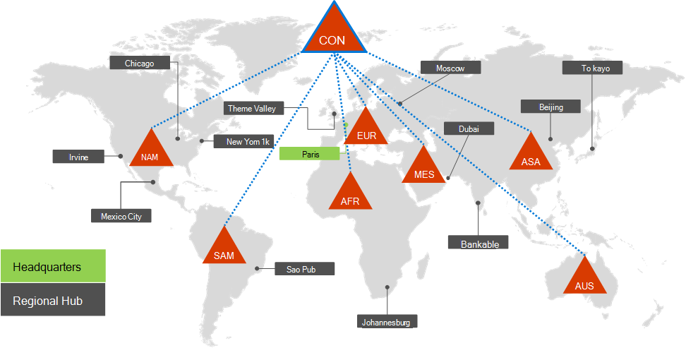
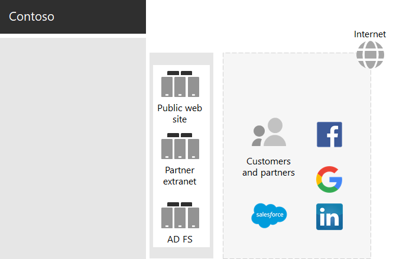
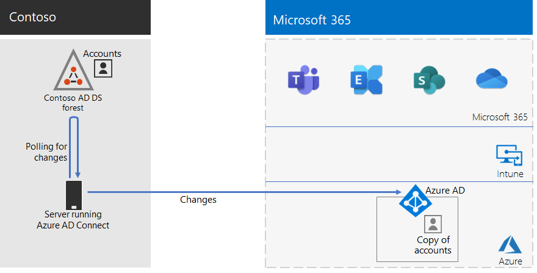

# ID för Contoso CorporationIdentity for the Contoso Corporation

Microsoft tillhandahåller IDaaS (identitet som tjänst) i molnet med Azure Active Directory (Azure AD).Microsoft provides an Identity as a Service (IDaaS) across its cloud offerings with Azure Active Directory (Azure AD). För att kunna använda Microsoft 365 för Enterprise, måste Contosos IDaaS-lösning utnyttja sin lokala identitets leverantör och ändå inkludera federerad identitet med sina befintliga betrodda tredjepartsleverantörer.To adopt Microsoft 365 for enterprise, Contoso's IDaaS solution had to leverage their on-premises identity provider and still include federated authentication with their existing trusted, third-party identity providers.

## Contosos Active Directory Domain Services-skogContoso's Active Directory Domain Services forest

Contoso använder en enda AD DS-skog (Active Directory Domain Services) för contoso.com med sju underdomäner, en för varje region i världen.Contoso uses a single Active Directory Domain Services (AD DS) forest for contoso.com with seven sub-domains, one for each region of the world. Huvudkontoret, regionala navkontor och satellitkontor innehåller domänkontrollanter för lokal autentisering och verifiering.The headquarters, regional hub offices, and satellite offices contain domain controllers for local authentication and authorization.

Här är Contoso-skogen med regionala domäner för de olika delar av världen som innehåller regionala nav.Here is the Contoso forest with regional domains for the different parts of the world that contain regional hubs.

 
Contoso ville använda konton och grupper i contoso.com-skogen för autentisering och auktorisering för sina Microsoft 365-arbetsbelastningar och -tjänster.Contoso wanted to use the accounts and groups in the contoso.com forest for authentication and authorization for its Microsoft 365 workloads and services.

## Contosos infrastruktur för federerad autentiseringContoso's federated authentication infrastructure

Med contoso kan:Contoso allows:

- Kunder använda Microsoft, Facebook eller Google Mail för att logga in på sina offentliga webbplatser.Customers to use their Microsoft, Facebook, or Google Mail accounts to sign in to their public web site.
- Leverantörer och partner använda sina LinkedIn-, Salesforce- eller Google Mail-konton för att logga in på partnerextranätet.Vendors and partners to use their LinkedIn, Salesforce, or Google Mail accounts to sign in to the partner extranet.

Här är Contosos DMZ som innehåller en offentlig webbplats, ett partnerextranät och en uppsättning AD FS-servrar (Active Directory Federation Services).Here is the Contoso DMZ containing a public web site, a partner extranet, and a set of Active Directory Federation Services (AD FS) servers. DMZ är ansluten till Internet som innehåller tjänster för kunder, partner och Internet.The DMZ is connected to the Internet that contains customers, partners, and Internet services.

 
AD FS-servrar i DMZ underlättar autentiseringen av kundens identitetsuppgifter via identitetsleverantörerna för åtkomst till den offentliga webbplatsen och partneruppgifter för åtkomst till partnerextranätet.AD FS servers in the DMZ facilitate the authentication of customer credentials by their identity providers for access to the public web site and partner credentials for access to the partner extranet.

Contoso bestämde sig för att behålla denna infrastruktur och dedikera den till kund- och partnerautentiseringar.Contoso decided to keep this infrastructure and dedicate it to customer and partner authentications. Contosos identitetsarkitekter undersöker konverteringen av den här infrastrukturen till Azure AD [B2B](https://docs.microsoft.com/azure/active-directory/b2b/hybrid-organizations)- och [B2C](https://docs.microsoft.com/azure/active-directory-b2c/solution-articles)-lösningar.Contoso identity architects are investigating the conversion of this infrastructure to Azure AD [B2B](https://docs.microsoft.com/azure/active-directory/b2b/hybrid-organizations) and [B2C](https://docs.microsoft.com/azure/active-directory-b2c/solution-articles) solutions.

## Hybrididentitet med synkronisering av lösenordshash för molnbaserad autentiseringHybrid identity with password hash synchronization for cloud-based authentication

Contoso ville använda sin lokala AD DS-skog för autentisering för Microsoft 365-molnresurser.Contoso wanted to leverage its on-premises AD DS forest for authentication to Microsoft 365 cloud resources. De bestämde sig för synkronisering av lösenordshash (PHS).It decided on password hash synchronization (PHS).

PHS synkroniserar den lokala AD DS-skogen med Azure AD-innehavaren av sitt Microsoft 365 för företags prenumeration, kopierar användare och grupp konton och en hash-version av användar konto lösen ord.PHS synchronizes the on-premises AD DS forest with the Azure AD tenant of their Microsoft 365 for enterprise subscription, copying user and group accounts and a hashed version of user account passwords. 

För att utföra en pågående katalogsynkronisering har Contoso distribuerat Azure AD Connect-verktyget på en server i sitt datacenter i Paris.To perform the ongoing directory synchronization, Contoso has deployed the Azure AD Connect tool on a server in its Paris datacenter. 

Här är den server som kör Azure AD Connect-omröstningen för Contoso AD DS-skogen när det gäller ändringar och sedan synkroniserar ändringarna med Azure AD-klienten.Here is the server running Azure AD Connect polling the Contoso AD DS forest for changes and then synchronizing those changes with the Azure AD tenant.

 
## Principer för villkorlig åtkomst för identitets- och enhetsåtkomstConditional Access policies for identity and device access

Contoso skapade en uppsättning [principer för villkorlig åtkomst](identity-access-policies.md) för Azure AD och Intune för tre skyddsnivåer:Contoso created a set of Azure AD and Intune [Conditional Access policies](identity-access-policies.md) for three protection levels:

- **Grundskydd** gäller för alla användarkonton**Baseline** protections apply to all user accounts
- **Känsliga** skydd gäller cheferna och ledningen**Sensitive** protections apply to senior leadership and executive staff
- **Strikt reglerat** skydd med gäller för vissa användare på ekonomi-, juridik- och forskningsavdelningarna som har tillgång till data som är mycket strikta**Highly Regulated** protections apply to specific users in the finance, legal, and research departments that have access to highly regulated data

Här är Contosos resulterande uppsättning principer för villkorsstyrd åtkomst av identitets- och enhetsprinciper.Here is Contoso's resulting set of identity and device Conditional Access policies.

 
## Nästa stegNext step

[Ta reda på mer](contoso-win10.md) om hur Contoso använder sin Microsoft Endpoint Configuration Manager-infrastruktur för att distribuera och hålla Windows 10 Enterprise uppdaterat i organisationen.[Learn](contoso-win10.md) how Contoso is leveraging its Microsoft Endpoint Configuration Manager infrastructure to deploy and keep current Windows 10 Enterprise across its organization.

## SnabbreferensSee also

[Identitets översikt för Microsoft 365Identity roadmap for Microsoft 365](identity-roadmap-microsoft-365.md)

[Översikt över Microsoft 365 för företagMicrosoft 365 for enterprise overview](microsoft-365-overview.md)

[TestlabbguiderTest lab guides](m365-enterprise-test-lab-guides.md)
